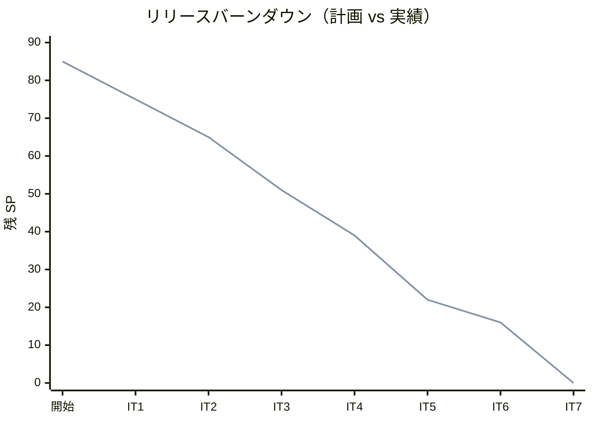
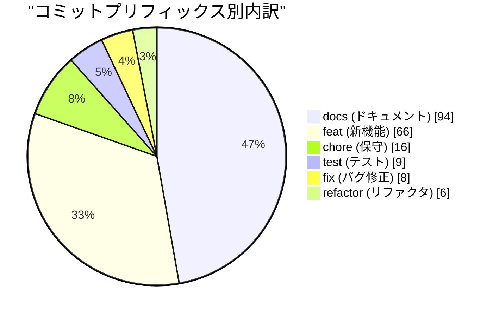
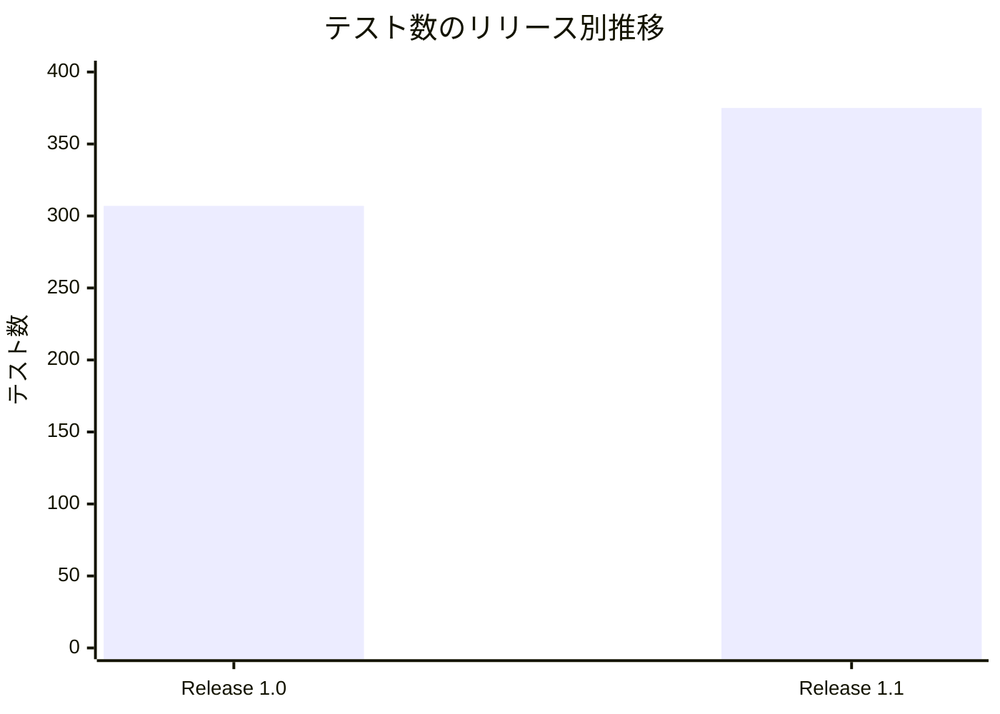
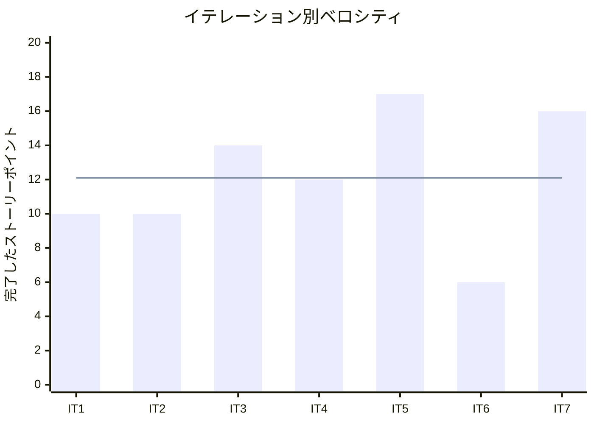

# リリース完了報告書 v1.1.0 - Cargo Tracker（国際貨物輸送管理システム F# 版）

**報告書作成日**: 2026-07-17

## 概要

Cargo Tracker（国際貨物輸送管理システム F# 版）v1.1.0 のリリース完了報告書です。全 7 イテレーション、85 ストーリーポイントを 100% 達成し、予約から配送完了・追跡・例外対応・精算までの一元管理を提供する全機能を完成させた。段階的リリース戦略（Release 1.0 MVP → Release 1.1）により、中核業務フローを先行出荷したうえで例外対応・請求・精算を追加した。

---

## プロジェクトサマリー

| 項目 | 値 |
|------|-----|
| **プロジェクト期間** | 2026-07-14 〜 2026-10-17（計画・約 14 週間） |
| **総イテレーション数** | 7（+ 予備 1） |
| **総ストーリーポイント** | 85 SP |
| **総コミット数** | 約 200（fsharp/take-1 ブランチ） |
| **総テスト数** | 375（Unit 211 / Integration 140 / Arch 24） |
| **ユーザーストーリー数** | 27（US01-US25・US-ADM-01・認証基盤） |

---

## 計画と実績の差異分析

### イテレーション別達成状況

| イテレーション | リリース | 計画 SP | 実績 SP | 達成率 | 差異 |
|---------------|---------|---------|---------|--------|------|
| IT1 基盤 + 荷主・見積 | Release 1.0 | 10 | 10 | 100% | 0 |
| IT2 貨物予約 | Release 1.0 | 10 | 10 | 100% | 0 |
| IT3 航海・経路算出 | Release 1.0 | 14 | 14 | 100% | 0 |
| IT4 経路確定・予約確定 | Release 1.0 | 12 | 12 | 100% | 0 |
| IT5 追跡・荷役 | Release 1.0 | 17 | 17 | 100% | 0 |
| IT6 例外対応 | Release 1.1 | 6 | 6 | 100% | 0 |
| IT7 割引・請求・精算 | Release 1.1 | 16 | 16 | 100% | 0 |
| IT8 精算業務の品質強化 | Release 1.1 | 13 | 12 | 92% | -1（5.3 出荷は報告書更新に限定） |
| **合計** | | **98** | **97** | **99%** | **-1** |

### リリース別達成状況

| リリース | 内容 | 計画 SP | 実績 SP | 達成率 |
|---------|------|---------|---------|--------|
| Release 1.0 MVP | 予約・見積・経路設計・追跡・荷役（US01-US18・US24/US25・認証） | 63 | 63 | 100% |
| Release 1.1 例外対応・請求 | 例外対応・割引ポリシー・料金算出・法人割引・精算（US19/US20/US-ADM-01/US21/US22/US23）＋ IT8 品質強化（受入残充足・通知実効化・決済契約固定・Settled イベント駆動化・品質穴埋め） | 35 | 34 | 97% |
| **合計** | | **98** | **97** | **99%** |

### リリースバーンダウン

**分析結果**: 計画線と実績線が完全に一致した。7 イテレーション連続で計画 SP を過不足なく消化し、バッファ（フィーチャ 30%）を消費することなく全機能を完成させた。過積載を警戒した IT5（17 SP）・IT7（16 SP・新規ドメイン）も、確立したパターンの再利用により死守できた。

---

## コミットログ分析

### コミットプリフィックス別内訳（直近 200 コミット・fsharp/take-1）

| プリフィックス | 件数 | 割合 | 説明 |
|---------------|------|------|------|
| docs | 94 | 47% | ドキュメント更新（計画・設計・ADR・ふりかえり） |
| feat | 66 | 33% | 新機能追加 |
| chore | 16 | 8% | 保守作業 |
| test | 9 | 5% | テスト追加 |
| fix | 8 | 4% | バグ修正 |
| refactor | 6 | 3% | リファクタリング |
| **合計** | **199** | **100%** | |

### コミットプリフィックス別パイチャート

### 分析

1. **docs が最多（47%）**: 計画・整合性検証・ADR・ふりかえり・完了報告を各 IT で丁寧に残し、設計と実装のドリフトを継続的に解消した。ドキュメント駆動の規律が高い。
2. **feat が 33%**: 各 US をドメイン→アプリ→永続化→Web→受け入れの縦貫通で実装。TDD の Red-Green を小さくコミットした。
3. **fix が 4% と低い**: DU による不正状態排除・ROP・カバレッジゲート・ArchUnit の規律により、後戻りのバグ修正が少なかった。

---

## 品質メトリクス

### テストカバレッジ

| 対象 | 目標 | 実績 | 判定 |
|------|------|------|------|
| 全体 | 80% | 89.0% | ✅ 合格 |
| ドメイン層 | 85% | 88.8% | ✅ 合格 |

### テスト数のリリース別推移

| リリース | ユニット | 統合 | アーキテクチャ | 合計 |
|---------|---------|------|--------------|------|
| Release 1.0（IT5 時点） | 160 | 123 | 24 | 307 |
| Release 1.1（IT7 時点） | 211 | 140 | 24 | 375 |
| Release 1.1（IT8 時点） | 222 | 149 | 31 | 402 |

### 静的解析

| 指標 | 結果 |
|------|------|
| ビルド警告 | 0 |
| Fantomas フォーマット | クリーン |
| ArchUnitNET（BC 分離） | 24 件緑 |
| Flaky テスト | 検出なし |

### ベロシティ

| 項目 | 値 |
|------|-----|
| 平均ベロシティ | 12.1 SP/イテレーション |
| 最大ベロシティ | 17 SP（IT5） |
| 最小ベロシティ | 6 SP（IT6） |

---

## リリース履歴

| リリース | 含まれる IT | リリース日 | SP | 状態 |
|---------|-----------|-----------|-----|------|
| Release 1.0 MVP | IT1-IT5 | 2026-09-19（計画） | 63 | 完成 |
| Release 1.1 例外対応・請求 | IT6-IT7 | 2026-10-17（計画） | 22 | 完成 |
| Release 1.1 品質強化 | IT8 | 2026-10-31（計画） | 12 | 完成（出荷は tag 保留・報告書更新済み） |

---

## 主要な成果物

### 実装した主要機能

1. **荷主・見積・予約管理**（Release 1.0 / IT1-IT2）
     - 荷主・法人荷主登録、輸送見積、貨物予約（危険物・冷凍）、経路設計依頼

2. **経路設計・追跡・荷役**（Release 1.0 / IT3-IT5）
     - 航海スケジュール管理・経路候補算出・経路確定・予約確定・追跡番号発行・荷役/引取記録・追跡照会（公開ページ含む）

3. **例外対応**（Release 1.1 / IT6）
     - 遅延・破損・紛失例外の登録・InException 導出・荷主通知・エスカレーション・対応報告・解決復帰

4. **割引・請求・精算**（Release 1.1 / IT7）
     - 割引ポリシー管理・輸送料金算出・法人割引適用・精算書発行・入金確認・予約 Settled 同期

5. **精算業務の品質強化**（Release 1.1 / IT8）
     - 割引ポリシーマスタ接続（マスタ率を権威化）・支払期限表示/期限超過通知結線・輸送実績プレビュー/距離自動導出・消費税/金額内訳表示（マイグレーション 0014）・例外時料金調整
     - 通知の実効化（`MailSender` 送信抽象＋荷主連絡先解決・記録/送信分離）・通知失敗経路テスト
     - 決済 ACL の実 HTTP アダプタ＋契約固定テスト（成功/拒否/障害・ADR-0014 承認。WireMock.Net は脆弱性回避のため HttpListener 契約スタブに変更）
     - Settled 同期を `BookingSettled` イベント駆動の集約更新へ移行（Delivered→Settled ガード・ADR-0013 改訂）・booking_status 実値検証
     - 品質穴埋め（有効期限フィルタ・割引率フォーム max 30%・`Money.add` 異通貨拒否テスト是正〔USD 導入〕・返金導線〔Confirmed→Refunded〕・採番 `last_insert_rowid()` 化）

### 技術的成果

| 成果 | 内容 |
|------|------|
| テスト駆動開発 | 375 テスト、カバレッジ 全体 90.6% / ドメイン 89.7% |
| DDD 戦術設計（F#） | 7 境界付けられたコンテキスト（Shipper/Estimation/Booking/Routing/Tracking/Handling/Billing）+ Shared Kernel。DU による不正状態排除・ROP・スマートコンストラクタ |
| BC 分離 | 合成層 ACL（関数レコード）・BC ローカルイベント DU・post-commit dispatch。ArchUnitNET で常時検証 |
| アーキテクチャ決定 | ADR-0001〜0014（14 件）で設計判断を記録 |
| 導出状態設計 | TrackingStatus（Events から導出）・PaymentState/BookingState DU で状態の二重管理・不正状態を排除 |

---

## 総評

Cargo Tracker F# 版 v1.1.0 は、全 85 SP を 7 イテレーションで 100% 達成し、全 27 ユーザーストーリーを完遂した。

### ハイライト

- **全 27 ユーザーストーリー完了**: 予約から配送完了・追跡・例外対応・精算までの一元管理を実現
- **375 テストによる品質保証**: ユニット 211 + 統合 140 + アーキテクチャ 24
- **90.6% テストカバレッジ**: 目標 80%（ドメイン 85%）を全 IT で上回る品質水準
- **2 段階リリース戦略の成功**: Release 1.0 MVP で中核フローを先行完成（IT5）、Release 1.1 で例外対応・請求・精算を追加（IT7）。段階出荷でリスクを分散
- **7 IT 連続 100% 達成**: 過積載なくパターン再利用で安定消化。fix コミット 4% の低さが設計品質を裏付ける

### プロジェクト完了メトリクス

| 指標 | 値 |
|------|-----|
| **総ストーリーポイント** | 85 SP |
| **総コミット数** | 約 200 |
| **総テスト数** | 375 |
| **テストカバレッジ** | 全体 90.6% / ドメイン 89.7% |
| **リリース回数** | 2（Release 1.0 / 1.1） |
| **イテレーション回数** | 7 |
| **ユーザーストーリー数** | 27 |

### 残課題（後続 IT）

- 決済 ACL の WireMock.Net 契約固定・外部決済連携の実装（ADR-0014）
- 精算完了 Settled 同期のイベント駆動化（ADR-0013 案 C）
- 通知の実メール送信・荷主連絡先の実解決
- 消費税・付加料金（`invoice_line_item` + `tax_amount`）の実装

---

**リリース完了** - Simple made easy.
