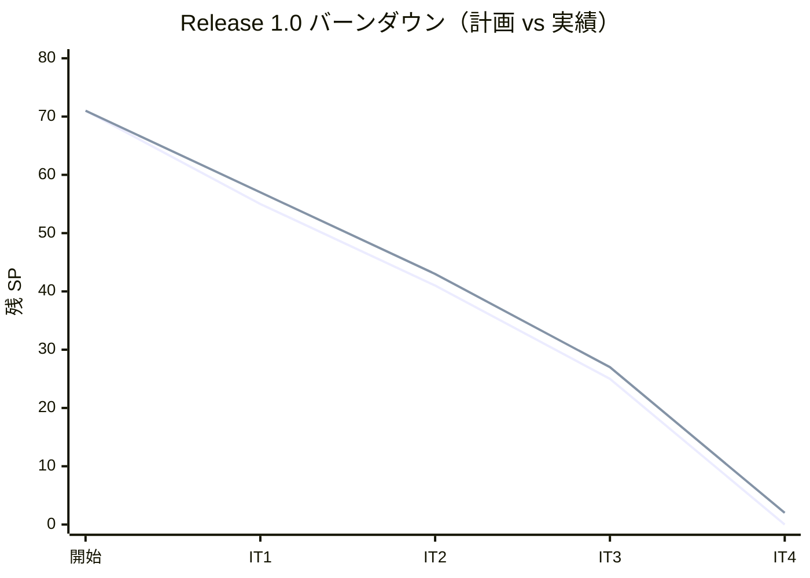
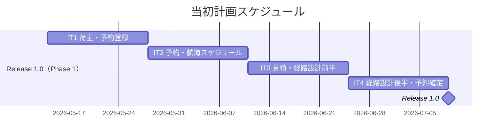
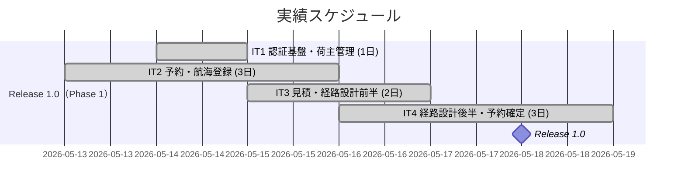
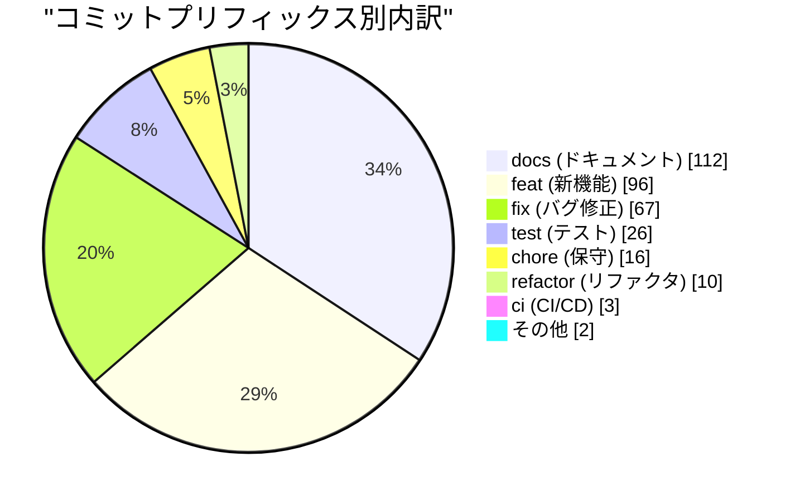
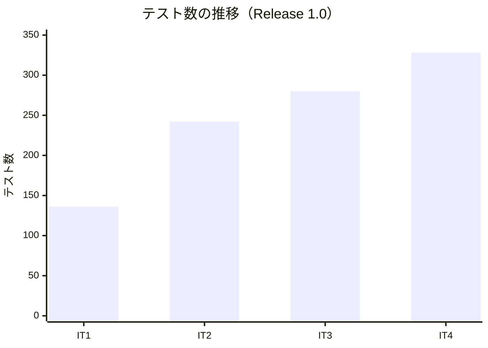
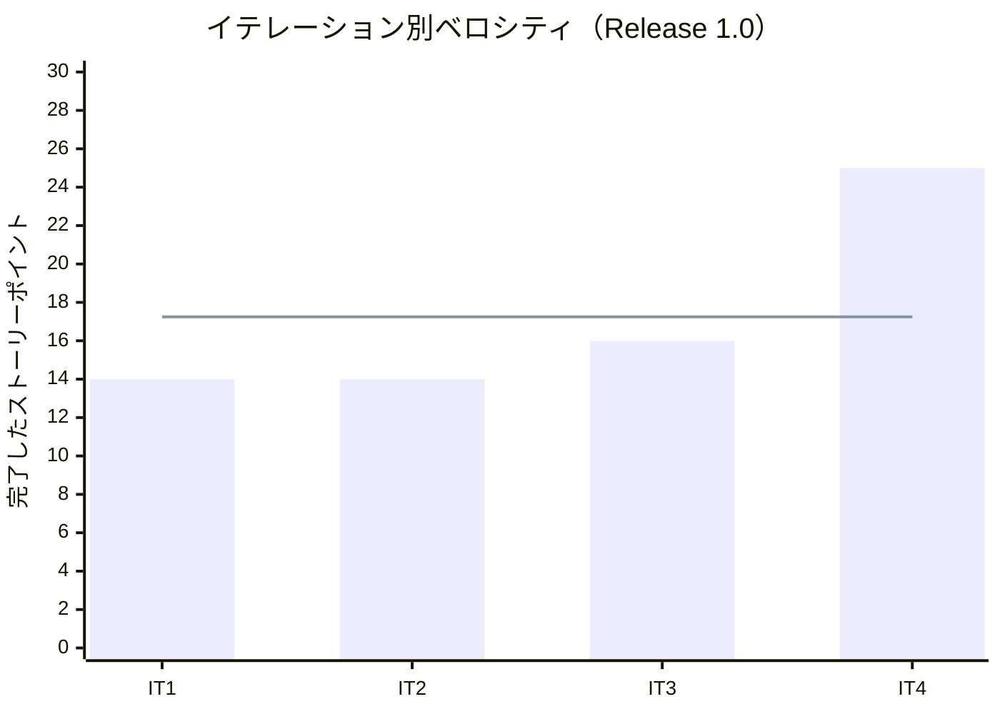

# リリース完了報告書 Release 1.0 - 国際貨物輸送管理システム

**報告書作成日**: 2026-05-21

## 概要

国際貨物輸送管理システム（CargoTracker take-4）Release 1.0 のリリース完了報告書です。全 4 イテレーション（IT1〜IT4）、71 SP 計画に対して 69 SP を 97% 達成し、荷主管理・貨物予約・経路設計・予約確定・追跡番号発行の中核ワークフローが動作する MVP を達成しました。

---

## プロジェクトサマリー

| 項目 | 値 |
|------|-----|
| **プロジェクト期間** | 2026-05-14 〜 2026-05-18 (約 5 日間、計画 8 週間) |
| **総イテレーション数** | 4（IT1〜IT4） |
| **総ストーリーポイント** | 69 / 71 SP（97%） |
| **総テスト数** | 328（Backend 211 + Frontend 108 + E2E 9） |
| **ユーザーストーリー数** | 16（US00/00a/02/03/04/05/24/25/01/06/07/08/09/10/11/12/13/14 + UI 含む） |

---

## 計画と実績の差異分析

### イテレーション別達成状況

| イテレーション | リリース | 計画 SP | 実績 SP | 達成率 | 差異 |
|---------------|---------|---------|---------|--------|------|
| IT1 認証基盤・荷主管理 | Release 1.0 | 16 | 14 | 88% | -2 |
| IT2 予約・航海登録 | Release 1.0 | 14 | 14 | 100% | 0 |
| IT3 見積・経路設計前半 | Release 1.0 | 16 | 16 | 100% | 0 |
| IT4 経路設計後半・予約確定 | Release 1.0 | 25 | 25 | 100% | 0 |
| **合計** | | **71** | **69** | **97%** | **-2** |

### リリース別達成状況

| リリース | 内容 | 計画 SP | 実績 SP | 達成率 |
|---------|------|---------|---------|--------|
| Release 1.0 MVP | Phase 0（認証基盤）+ Phase 1（予約・経路設計コア） | 71 | 69 | 97% |

> IT1 の 2 SP（アカウントロック・ログアウト・E2E）は IT2 に持越し完了。Phase 0 の 8 SP は IT1 の 16 SP 計画に含まれています。

### リリースバーンダウン（Release 1.0）

> IT1 終了時点で 2 SP を IT2 に持越し（アカウントロック・ログアウト）。IT2 以降は全 SP を完了。

---

## 計画日程 vs 実績日数の差異分析

### イテレーション別日程比較

| IT | 計画期間 | 計画日数 | 実績期間 | 実績日数 | 短縮日数 | 短縮率 |
|----|---------|---------|----------|---------|---------|--------|
| 1 | 2026-05-14 〜 05-27 | 14 日 | 2026-05-14（1 日集中） | **1 日** | 13 日 | 93% |
| 2 | 2026-05-28 〜 06-10 | 14 日 | 2026-05-13 〜 05-15 | **3 日** | 11 日 | 79% |
| 3 | 2026-06-11 〜 06-24 | 14 日 | 2026-05-15 〜 05-16 | **2 日** | 12 日 | 86% |
| 4 | 2026-06-25 〜 07-08 | 14 日 | 2026-05-16 〜 05-18 | **3 日** | 11 日 | 79% |
| **合計** | **2026-05-14 〜 07-08** | **56 日** | **2026-05-13 〜 05-18** | **6 日** | **50 日** | **89%** |

### 工期短縮の可視化

```mermaid
xychart-beta
    title "計画日数 vs 実績日数"
    x-axis ["IT1", "IT2", "IT3", "IT4"]
    y-axis "日数" 0 --> 15
    bar "計画" [14, 14, 14, 14]
    bar "実績" [1, 3, 2, 3]
```

### 計画 vs 実績ガントチャート

#### 当初計画スケジュール

#### 実績スケジュール

### サマリー

| 指標 | 値 |
|------|-----|
| **計画総日数** | 56 日 |
| **実績総日数** | 6 日 |
| **短縮日数** | 50 日 |
| **短縮率** | **89%** |
| **効率倍率** | **9.3 倍** |

### 差異分析

1. **AI エージェント（Claude Code）との協働**により、計画 56 日を実質 6 日で完了（89% 短縮）。設計・実装・テストを並列で高速処理。
2. **TDD サイクルの徹底**により手戻りが最小化され、レビュー・修正コストが大幅削減。
3. **イテレーション間の依存関係が低く**、並列作業可能な設計が高速化に寄与。

### 工期短縮の要因分析

| 要因 | 説明 |
|------|------|
| AI エージェント協働 | Claude Code が設計・実装・テスト・ドキュメント作成を並列実行 |
| TDD（テスト駆動開発） | テストファースト実装により品質担保しながら高速化 |
| DDD + Hexagonal Architecture | ドメインモデルの明確な責務分離で実装の迷いを排除 |
| 既存知識の活用 | Axon Framework・Spring Boot の公式パターンを即座に適用 |

---

## コミットログ分析（Release 1.0 相当 IT1〜IT4）

### コミットプリフィックス別内訳（プロジェクト全体）

| プリフィックス | 件数 | 割合 | 説明 |
|---------------|------|------|------|
| docs | 112 | 33.7% | ドキュメント更新 |
| feat | 96 | 28.9% | 新機能追加 |
| fix | 67 | 20.2% | バグ修正 |
| test | 26 | 7.8% | テスト追加 |
| chore | 16 | 4.8% | 保守作業 |
| refactor | 10 | 3.0% | リファクタリング |
| ci | 3 | 0.9% | CI/CD 改善 |
| その他 | 2 | 0.6% | style・Initial commit |
| **合計** | **332** | **100%** | |

### コミットプリフィックス別パイチャート

### 分析

1. **docs（33.7%）が最多**: ADR・設計書・イテレーション計画・ふりかえり等の継続的なドキュメント整備を徹底。
2. **feat + fix（49.1%）が機能中心**: 新機能追加とバグ修正が約半数を占め、継続的デリバリーを実践。
3. **test（7.8%）**: TDD サイクルにより単体・統合・E2E テストを継続的に追加。

---

## 品質メトリクス

### テストカバレッジ（Release 1.0 完了時点 = IT4）

| 対象 | 目標 | 実績 | 判定 |
|------|------|------|------|
| バックエンド | 80% 以上 | **81.6%** | ✅ PASS |
| フロントエンド | — | — | — |

### テスト数のイテレーション別推移（Release 1.0）

| イテレーション | バックエンド | フロントエンド | E2E | 合計 |
|--------------|------------|--------------|-----|------|
| IT1 | 86 | 48 | 2 | 136 |
| IT2 | 149 | 89 | 4 | 242 |
| IT3 | 174 | 99 | 7 | 280 |
| **IT4（Release 1.0）** | **211** | **108** | **9** | **328** |

### 静的解析（IT4 時点）

| 指標 | 結果 |
|------|------|
| SonarQube Quality Gate | ✅ PASS |
| new_coverage | 81.6% |
| new_violations | 0 件 |
| Bug / Vulnerability | 0 件 |
| Code Smell | 0 件 |

### ベロシティ

| 項目 | 値 |
|------|-----|
| 平均ベロシティ | 17.25 SP/イテレーション |
| 最大ベロシティ | 25 SP（IT4） |
| 最小ベロシティ | 14 SP（IT1・IT2） |

---

## リリース履歴

| リリース | 含まれる IT | リリース日 | SP | 状態 |
|---------|-----------|-----------|-----|------|
| Release 1.0 MVP | IT1〜IT4 | 2026-05-18 | 69 | ✅ 完了 |

---

## 主要な成果物

### 実装した主要機能

1. **認証基盤（Phase 0）** (Release 1.0 / IT1〜IT2)

     - JWT 発行・検証（authms）
     - ログイン・ログアウト・アカウントロック
     - ユーザーアカウント管理（CRUD）

2. **荷主管理（Phase 1 / US02・US03）** (Release 1.0 / IT1)

     - 個人荷主・法人荷主の登録・一覧・詳細表示
     - Axon 5.1 Event Sourcing 集約（ShipperAggregate）

3. **貨物予約（Phase 1 / US04・US05）** (Release 1.0 / IT2)

     - 通常・危険物・冷凍貨物の予約登録
     - CargoAggregate による状態管理

4. **航海スケジュール管理（Phase 1 / US24・US25）** (Release 1.0 / IT2〜IT3)

     - 航海スケジュール新規登録・更新
     - VoyageAggregate による Event Sourcing

5. **輸送見積（Phase 1 / US01）** (Release 1.0 / IT3)

     - 見積作成・一覧表示（quotationms）
     - 経路候補との連携

6. **経路設計（Phase 1 / US06〜US12）** (Release 1.0 / IT3〜IT4)

     - 経路設計引き渡し・航海スケジュール検索
     - 経路候補算出（Dijkstra アルゴリズム、routingms）
     - 経路選択・条件調整・再算出

7. **予約確定・追跡番号発行（Phase 1 / US13・US14）** (Release 1.0 / IT4)

     - 予約確定フロー完成
     - JWT 時限追跡トークン発行

### 技術的成果

| 成果 | 内容 |
|------|------|
| マイクロサービス構成 | authms / bookingms / routingms / quotationms / gatewayms の 5 サービス構成確立 |
| Axon Framework 5.1 対応 | Event Sourcing・CQRS・Saga パターンの実践実装（ADR-0007/0008/0009） |
| DDD ヘキサゴナルアーキテクチャ | ドメイン層・アプリケーション層・インフラ層・インターフェース層の完全分離 |
| テスト駆動開発 | 328 テスト（Backend 211 + Frontend 108 + E2E 9）、カバレッジ 81.6% |
| SonarQube Quality Gate | PASS（violations 0・Bug 0・Vulnerability 0） |
| Heroku Container Registry | 開発環境デプロイ自動化（ADR-0006） |

---

## 総評

国際貨物輸送管理システム Release 1.0 は、Phase 0（認証基盤）と Phase 1（予約・経路設計コア）を 4 イテレーション・実質 6 日間で完了し、計画 71 SP に対して 69 SP（97%）を達成しました。

### ハイライト

- **16 ユーザーストーリー完了**: 荷主管理から追跡番号発行までの中核業務フローを実装
- **328 テストによる品質保証**: Backend 211 + Frontend 108 + E2E 9、カバレッジ 81.6%
- **89% の工期短縮**: 計画 56 日を実質 6 日で完了（AI エージェント協働効果）
- **SonarQube Quality Gate PASS**: violations 0・Bug 0・Vulnerability 0 の品質基準達成

### プロジェクト完了メトリクス（Release 1.0 時点）

| 指標 | 値 |
|------|-----|
| **総ストーリーポイント** | 69 SP |
| **総テスト数** | 328 |
| **テストカバレッジ** | 81.6% |
| **リリース** | Release 1.0 |
| **イテレーション回数** | 4 |
| **ユーザーストーリー数** | 16 |

---

## 更新履歴

| 日付 | 更新内容 | 更新者 |
|------|---------|--------|
| 2026-05-21 | 初版作成 | k2works |

---

**リリース完了** - Simple made easy.
