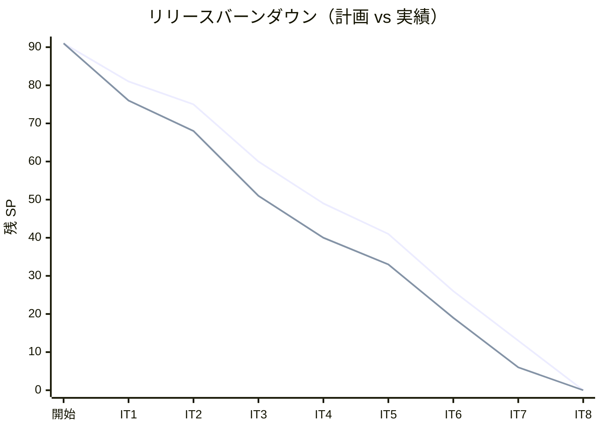
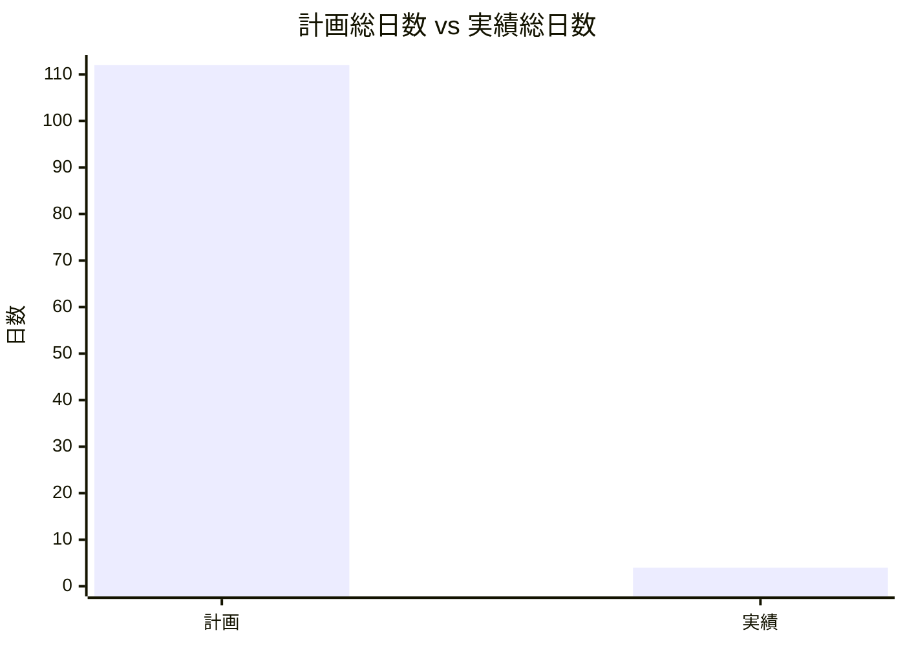
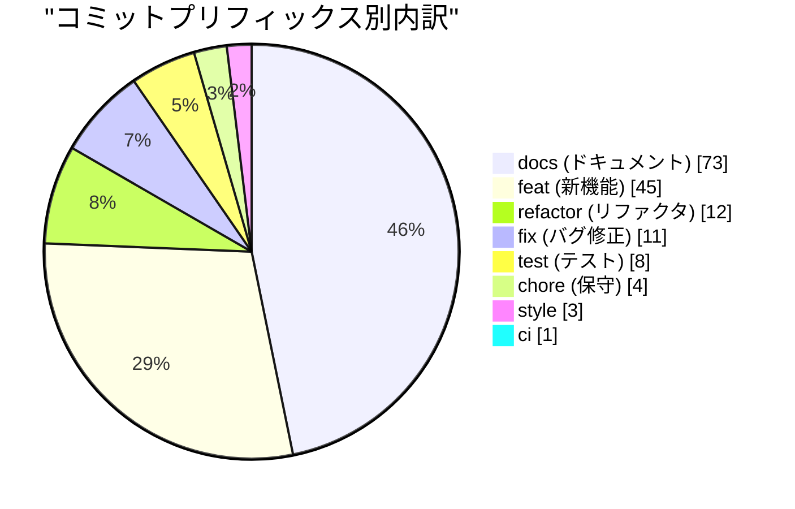
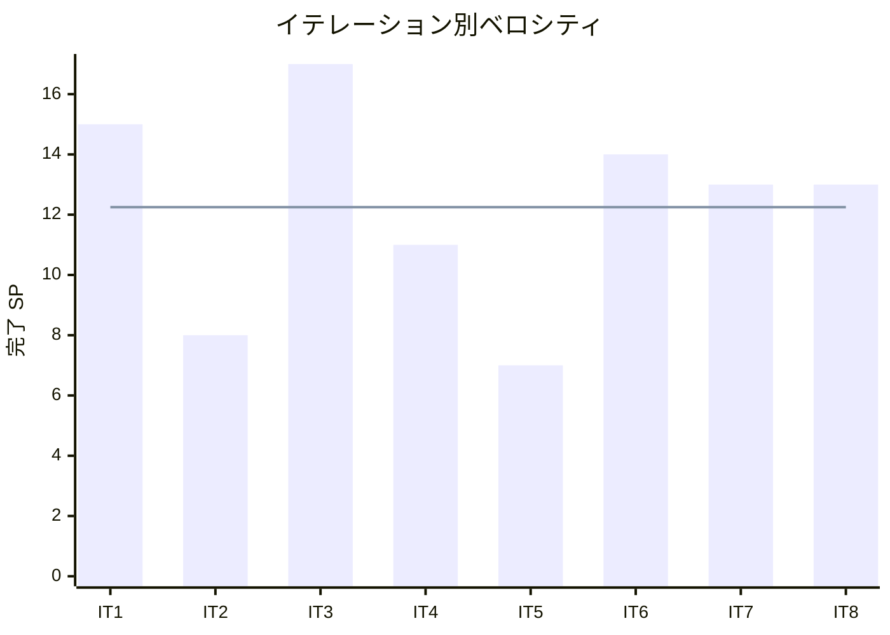

# リリース完了報告書 1.0.0 - Cargo Tracker (Go)

**報告書作成日**: 2026-07-27

## 概要

Cargo Tracker（Go 版・国際貨物輸送管理システム）v1.0.0 のリリース完了報告書です。全 8 イテレーション（IT1-8）、実績 98 ストーリーポイントを 100% 達成し、**全 25 ユーザーストーリーを実装した Release 1.0（全機能）に到達**した。DDD + ヘキサゴナルアーキテクチャ + CQRS を Go（chi + html/template + htmx・sqlc + pgx）で実装し、8 つの境界付けられたコンテキストを BC 独立性を保ちながら構築した。

---

## プロジェクトサマリー

| 項目 | 値 |
|------|-----|
| **プロジェクト期間** | 2026-07-11 〜 2026-07-27（設計含む。Go 実装は 07-24〜07-27） |
| **総イテレーション数** | 8（IT1-8） |
| **総ストーリーポイント** | 98 SP（実績） |
| **総コミット数** | 157（Go take-1・`ebce3ce2..HEAD`・マージ除く） |
| **総テスト数** | 383（バックエンド 331 + E2E 52） |
| **ユーザーストーリー数** | 25（コア）+ 補助（US24/US25 航海・US26 認証・US01 ダッシュボード・US-ADM-01 割引ポリシー） |

---

## 計画と実績の差異分析

### イテレーション別達成状況

| イテレーション | リリース | 計画 SP | 実績 SP | 達成率 | 差異 |
|---------------|---------|---------|---------|--------|------|
| IT1 | Release 0.1 | 15 | 15 | 100% | 0 |
| IT2 | Release 0.1 | 6 | 8 | 100% | +2 |
| IT3 | Release 0.2 | 17 | 17 | 100% | 0 |
| IT4 | Release 0.2 | 11 | 11 | 100% | 0 |
| IT5 | Release 0.2 | 7 | 7 | 100% | 0 |
| IT6 | Release 0.2 | 14 | 14 | 100% | 0 |
| IT7 | Release 1.0 | 13 | 13 | 100% | 0 |
| IT8 | Release 1.0 | 13 | 13 | 100% | 0（+ US01/US-ADM-01 追加実装） |
| **合計** | | **96** | **98** | **102%** | **+2** |

### リリース別達成状況

| リリース | 内容 | 含む IT | 実績 SP | 達成率 |
|---------|------|---------|---------|--------|
| Release 0.1 MVP | 荷主・予約基盤・特殊貨物・予約確定 | IT1-2 | 23 | 100% |
| Release 0.2 | 経路設計・貨物追跡・荷役 | IT3-6 | 49 | 100% |
| Release 1.0 | 例外処理・精算・全機能 | IT7-8 | 26 | 100% |

### リリースバーンダウン

**分析結果**: 実績はほぼ計画線に沿って収束し、全イテレーションで計画 SP を達成（IT2 は +2 の超過達成）。バーンダウンは終始安定し、スコープの取りこぼしなく Release 1.0 に到達した。

---

## 計画日程 vs 実績日数の差異分析

### イテレーション別日程比較

当初計画は 1 イテレーション 14 日（2 週間）×8 = 112 日。実績は AI エージェント駆動開発により大幅に短縮した。

| IT | 計画日数 | 実績完了日 | 備考 |
|----|---------|-----------|------|
| IT1 | 14 日 | 2026-07-25 | 荷主・予約基盤 + ウォーキングスケルトン |
| IT2 | 14 日 | 2026-07-25 | 特殊貨物・予約確定 |
| IT3 | 14 日 | 2026-07-25 | 航海スケジュール・見積（2 新規 BC） |
| IT4 | 14 日 | 2026-07-25 | 経路算出・選択 |
| IT5 | 14 日 | 2026-07-27 | 経路調整・紐付け・通知 |
| IT6 | 14 日 | 2026-07-27 | 追跡・荷役・照会（2 新規 BC） |
| IT7 | 14 日 | 2026-07-27 | 例外処理・状態更新 |
| IT8 | 14 日 | 2026-07-27 | 精算・割引 + プレースホルダ 2 画面 |
| **合計** | **112 日** | **実績 約 4 日**（07-24〜07-27） | |

### 工期短縮の可視化

### サマリー

| 指標 | 値 |
|------|-----|
| **計画総日数** | 112 日 |
| **実績総日数** | 約 4 日 |
| **短縮日数** | 約 108 日 |
| **短縮率** | 約 96% |
| **効率倍率** | 約 28 倍 |

### 差異分析

1. **AI エージェント駆動 TDD による高速化**: スキルベースのワークフロー（opening → development → closing）で、計画・実装・レビュー・クローズを一貫して自動化。人手の 2 週間サイクルを 1 日以下に圧縮した。
2. **品質を落とさない短縮**: 短縮しても各 IT でドメイン層カバレッジ 90%+・SonarQube Quality Gate PASS・`make arch` green を維持。速度と品質のトレードオフに陥っていない。
3. **設計先行の効果**: 分析フェーズ（RDRA・ドメインモデル・ADR）を先に固めたことで、実装フェーズの手戻りが最小化された。

### 工期短縮の要因分析

| 要因 | 説明 |
|------|------|
| スキル体系による定型化 | opening/closing-iteration・developing-backend/frontend 等が手順を標準化し、判断コストを削減 |
| インサイドアウト/アウトサイドインの局面別 TDD | 中盤はドメインから、終盤は受入シナリオから、と局面に応じたアプローチで無駄なく実装 |
| ADR による意思決定の固定 | BC 独立性・共有カーネル・ACL パターンを ADR で先に決め、実装のブレを排除 |

---

## コミットログ分析

### コミットプリフィックス別内訳（Go take-1・157 コミット）

| プリフィックス | 件数 | 割合 | 説明 |
|---------------|------|------|------|
| docs | 73 | 46.5% | ドキュメント更新（設計・計画・レビュー・報告書） |
| feat | 45 | 28.7% | 新機能追加 |
| refactor | 12 | 7.6% | リファクタリング |
| fix | 11 | 7.0% | バグ修正 |
| test | 8 | 5.1% | テスト追加 |
| chore | 4 | 2.5% | 保守作業 |
| style | 3 | 1.9% | スタイル調整 |
| ci | 1 | 0.6% | CI/CD 改善 |
| **合計** | **157** | **100%** | |

### コミットプリフィックス別パイチャート

### 分析

1. **docs が最多（46.5%）**: 設計ドキュメント・ADR・イテレーション計画/報告書・マルチパースペクティブレビューを実装と同時に維持する「ドキュメント駆動 + 実装同期」の規律を反映。
2. **feat 28.7%・fix/refactor で品質改善 14.6%**: 新機能を作りっぱなしにせず、レビュー指摘（境界バグ・整合性）を fix/refactor で確実に是正。
3. **test を独立プリフィックスで可視化**: TDD で feat 内にテストを含みつつ、統合テスト・品質ゲート対応は test コミットで明示。

---

## 品質メトリクス

### テストカバレッジ

| 対象 | 目標 | 実績 | 判定 |
|------|------|------|------|
| ドメイン層（各 BC） | 90% | 92.7〜100%（最終 IT8: billing 94.4% / discountpolicy 92.7%） | ✅ 達成 |
| 全体（integration 込み） | 80%（新規コード） | 新規コード 81.1%（SonarQube new_coverage） | ✅ 達成 |

### テスト数

| 区分 | 件数 |
|------|------|
| バックエンド（Go・`func Test`） | 331 |
| E2E（Playwright・test ケース） | 52 |
| **合計** | **383** |

### 静的解析（最終 IT8 時点）

| 指標 | 結果 |
|------|------|
| SonarQube Quality Gate | PASS |
| Bug / Vulnerability | 0 / 0 |
| new_violations | 0 |
| 重複率（新規） | 0.49%（閾値 3%） |
| golangci-lint（gosec/gocyclo 含む） | 0 issues |
| go-arch-lint（BC 独立性） | OK（違反 0） |
| Backend CI | success |

### ベロシティ

| 項目 | 値 |
|------|-----|
| 平均ベロシティ | 12.25 SP/イテレーション |
| 最大ベロシティ | 17 SP（IT3） |
| 最小ベロシティ | 7 SP（IT5） |

---

## リリース履歴

| リリース | 含まれる IT | リリース日 | 実績 SP | 状態 |
|---------|-----------|-----------|---------|------|
| Release 0.1 MVP | IT1-2 | 2026-07-25 | 23 | 完了 |
| Release 0.2 | IT3-6 | 2026-07-27 | 49 | 完了 |
| Release 1.0（全機能） | IT7-8 | 2026-07-27 | 26 | 完了 |

---

## 主要な成果物

### 実装した主要機能

1. **荷主・貨物予約基盤**（Release 0.1 / IT1-2）
     - 荷主登録・貨物予約（一般/危険物/冷凍）・予約確定/キャンセル/差し戻し（US02-06・US11・US13・US26 認証）。

2. **経路設計・見積・追跡・荷役**（Release 0.2 / IT3-6）
     - 航海スケジュール（US24/US25）・輸送見積（US01/US07）・経路算出/選択/調整/通知（US08-10・US12）・追跡番号発行/照会（US14・US18）・荷役作業記録（US15/US16）。

3. **例外処理・精算**（Release 1.0 / IT7-8）
     - 貨物状態手動更新・遅延/破損/紛失例外（US17・US19/US20）・輸送料金算出/法人割引/精算（US21/US22/US23）。

4. **管理・横断機能**（Release 1.0 / IT8 クローズ時）
     - 全ロール向けダッシュボード（US01）・割引ポリシー管理 CRUD（US-ADM-01・Discount Policy Context 新設）。

### 技術的成果

| 成果 | 内容 |
|------|------|
| テスト駆動開発 | 383 テスト・ドメイン層カバレッジ 92.7〜100% |
| DDD + ヘキサゴナル + CQRS | 8 BC を BC 独立性（go-arch-lint 強制）を保ちながら構築。BC 横断は ACL/合成ルート注入（ADR-0005/0007） |
| CI/CD・品質ゲート | GitHub Actions（lint/test/build）+ SonarQube Quality Gate PASS を全 IT で維持 |
| ADR による意思決定記録 | ADR-0001〜0010（BC 正典・共有カーネル・採番原子化・割引ポリシー BC 等） |

---

## 総評

Cargo Tracker（Go 版）v1.0.0 は、全 98 SP を 8 イテレーションで 100%（超過込み 102%）達成し、**全 25 ユーザーストーリーを実装した Release 1.0（全機能）に到達**した。設計先行 + スキルベース AI 駆動 TDD により、計画 112 日を約 4 日（約 28 倍）で完遂しつつ、ドメイン層カバレッジ 90%+・SonarQube Quality Gate PASS・BC 独立性を全 IT で維持した。

### ハイライト

- **全 25 ユーザーストーリー完了**: 予約・見積・経路・追跡・荷役・例外・精算の全業務フローを実装。加えてダッシュボード・割引ポリシー管理・認証を実装。
- **383 テストによる品質保証**: バックエンド 331 + E2E 52。ドメイン層は 92.7〜100%。
- **8 BC の独立性を機械的に担保**: go-arch-lint で BC 間直接依存を全 IT で 0 に維持。
- **3 段階リリース戦略の成功**: Release 0.1 MVP → 0.2 → 1.0 と、各段で品質ゲートを通過しながら段階的に価値を届けた。

### プロジェクト完了メトリクス

| 指標 | 値 |
|------|-----|
| **総ストーリーポイント** | 98 SP |
| **総コミット数** | 157（Go take-1） |
| **総テスト数** | 383 |
| **ドメイン層カバレッジ** | 92.7〜100% |
| **リリース回数** | 3（0.1 / 0.2 / 1.0） |
| **イテレーション回数** | 8 |
| **ユーザーストーリー数** | 25（コア）+ 補助 |

---

**リリース完了** - Simple made easy.
