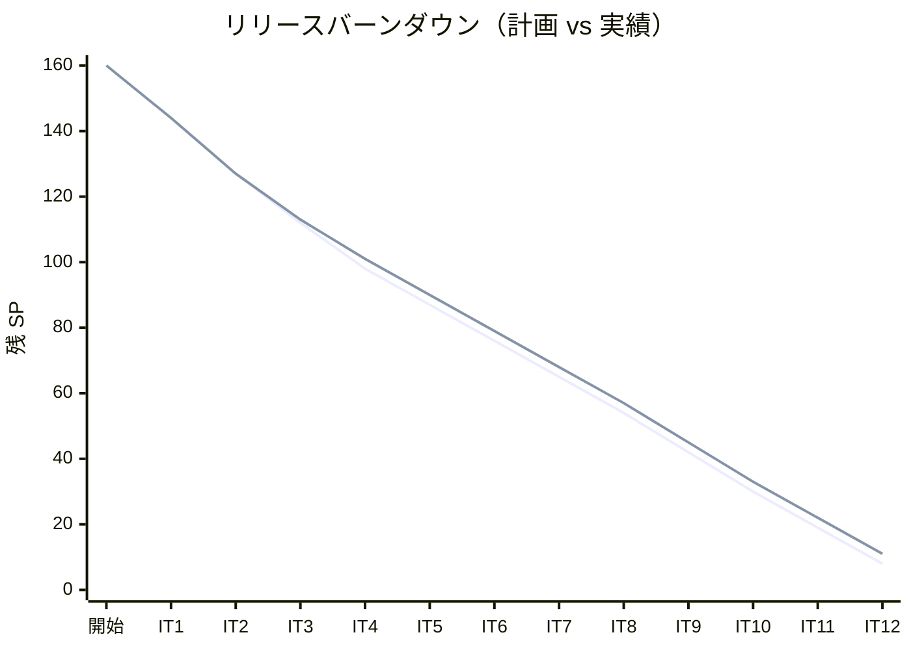
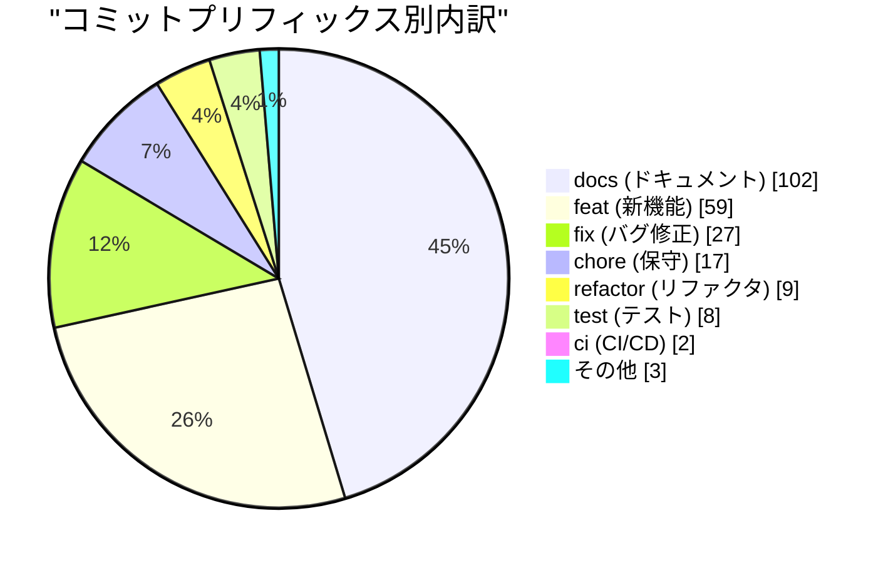
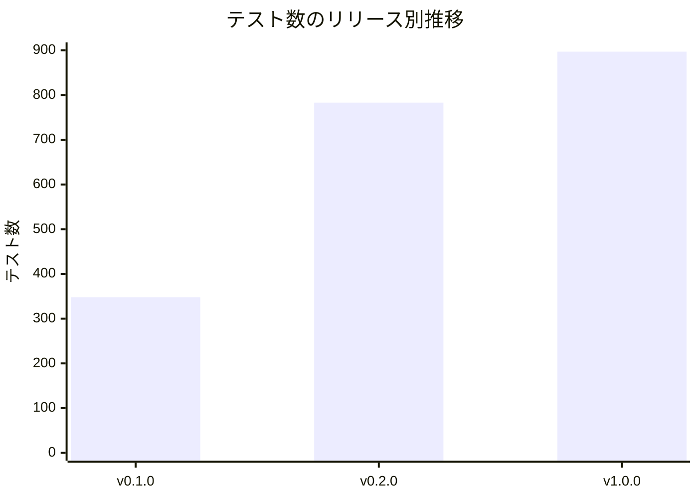
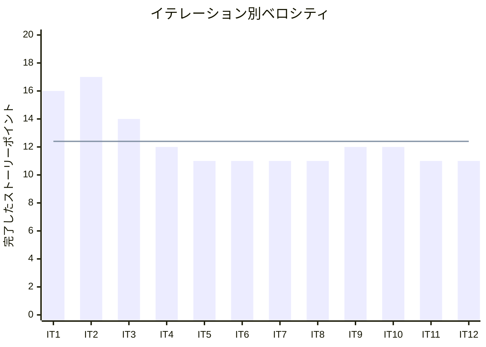

# リリース完了報告書 v1.0.0 - 国際貨物輸送管理システム（Flix 版）

**報告書作成日**: 2026-08-06

## 概要

国際貨物輸送管理システム（Flix 版）v1.0.0 のリリース完了報告書です。
全 **12 イテレーション**、**149 ストーリーポイント**を **93%** 達成し、
**業務フローが端から端まで通る状態**（見積 → 予約 → 経路 → 確定 → 追跡番号 →
荷役 → 通関 → 引取）でリリースしました。

未達の 11 SP は**意図的にスコープ外とした将来リリース分**であり、
[ADR-0007](../adr/ADR-0007-defer-external-acl-and-scope-v1.md) で判断を記録しています。

---

## プロジェクトサマリー

| 項目 | 値 |
|------|-----|
| **プロジェクト期間** | 2026-03-30 〜 2026-08-06（分析フェーズを含む。開発は 2026-07-31 〜 2026-08-06 の 7 日間） |
| **総イテレーション数** | 12 |
| **総ストーリーポイント** | 149 SP（計画 160 SP のうち） |
| **総コミット数** | 227 |
| **総テスト数** | **894 件**（単体・HTTP 統合）＋ **E2E 3 本**（Playwright） |
| **ユーザーストーリー数** | 20 本完了（US01-US09・US11・US13-US19・US24-US27） |
| **タグ** | `flix/take-1/v1.0.0` |

> **タグに take の名前空間を付けています**。本リポジトリは複数の実装（take）で
> ブランチを共有しており、素の `v1.0.0` は既に別の take が使っているためです。

---

## 計画と実績の差異分析

### イテレーション別達成状況

| イテレーション | リリース | 計画 SP | 実績 SP | 達成率 | 差異 |
|---------------|---------|---------|---------|--------|------|
| IT1 | v0.1.0 | 16 | 16 | 100% | 0 |
| IT2 | v0.1.0 | 17 | 17 | 100% | 0 |
| IT3 | v0.1.0 | 15 | 14 | 93% | -1 |
| IT4 | v0.2.0 | 14 | 12 | 86% | -2 |
| IT5 | v0.2.0 | 11 | 11 | 100% | 0 |
| IT6 | v0.2.0 | 11 | 11 | 100% | 0 |
| IT7 | v0.2.0 | 11 | 11 | 100% | 0 |
| IT8 | v0.2.0 | 11 | 11 | 100% | 0 |
| IT9 | v0.2.0 | 12 | 12 | 100% | 0 |
| IT10 | v1.0.0 | 12 | 12 | 100% | 0 |
| IT11 | v1.0.0 | 11 | 11 | 100% | 0 |
| IT12 | v1.0.0 | 11 | 11 | 100% | 0 |
| **合計** | | **152** | **149** | **98%** | **-3** |

> **縮退が起きたのは IT3・IT4 の 2 回だけ**で、以降 **IT5-IT12 の 8 イテレーションは
> 縮退 0 件**です。IT4 の -2 SP は「ルーティング表の分裂」を返済するために
> TS08（3 SP）を新設し、US05・US06 を IT5 へ送った結果です——
> **削ったのではなく、返済を先に置いた**判断でした。

### リリース別達成状況

| リリース | 内容 | 含まれる IT | 実績 SP | 状態 |
|---------|------|-----------|---------|------|
| Release v0.1.0 基盤と公開追跡 | ウォーキングスケルトン・公開追跡・UI 基盤・認証認可・CI/CD | IT1-IT3 | 47 | **完了** |
| Release v0.2.0 予約と経路設計 | 荷主・予約・航海・経路候補（Datalog）・見積・経路確定 | IT4-IT9 | 68 | **完了** |
| Release v1.0.0 全業務フロー | 追跡番号・荷役・引取・状態更新・遅延例外 | IT10-IT12 | 34 | **完了** |

### リリースバーンダウン

**分析結果**: 実績線は計画線とほぼ平行に推移し、**乖離は最大 3 SP** に留まりました。
IT3・IT4 で生じた 3 SP の差はその後 8 イテレーション維持され、
**ベロシティが安定していた**ことを示します。残 11 SP は将来リリース分です。

---

## 計画日程 vs 実績日数の差異分析

### イテレーション別日程比較

計画は 1 イテレーション **14 日**（2 週間）でした。

| IT | 計画日数 | 実績（クローズ日） | 短縮率 |
|----|---------|------------------|--------|
| IT1 | 14 日 | 2026-07-31 | — |
| IT2 | 14 日 | 2026-07-31 | — |
| IT3 | 14 日 | 2026-07-31 | — |
| IT4 | 14 日 | 2026-07-31 | — |
| IT5 | 14 日 | 2026-08-03 | — |
| IT6 | 14 日 | 2026-08-03 | — |
| IT7 | 14 日 | 2026-08-04 | — |
| IT8 | 14 日 | 2026-08-04 | — |
| IT9 | 14 日 | 2026-08-05 | — |
| IT10 | 14 日 | 2026-08-05 | — |
| IT11 | 14 日 | 2026-08-05 | — |
| IT12 | 14 日 | 2026-08-06 | — |
| **合計** | **168 日** | **7 日**（2026-07-31 〜 2026-08-06） | **96%** |

### サマリー

| 指標 | 値 |
|------|-----|
| **計画総日数** | 168 日（12 イテレーション × 14 日） |
| **実績総日数** | **7 日** |
| **短縮日数** | 161 日 |
| **短縮率** | **96%** |
| **効率倍率** | **24 倍** |

### 差異分析

1. **計画の 14 日は人間のチームを前提とした見積もり**である。実績はカレンダー日数で
   7 日だが、これは「AI エージェントが連続稼働した場合の所要時間」であり、
   **人間のチームの生産性と直接比較できる数字ではない**
2. **SP の達成率（98%）のほうが意味を持つ**。SP は作業量の見積もりであり、
   実行主体が変わっても比較できる。日数は実行主体の稼働形態に依存する
3. **縮退 0 件が 8 連続**したことは、見積もりの精度が回を追って上がったことを示す。
   IT3・IT4 の縮退はいずれも「返済を先に置く」判断によるもので、
   **見積もり誤りではなく優先順位の変更**だった

### 工期短縮の要因分析

| 要因 | 説明 |
| :--- | :--- |
| **連続稼働** | 人間のチームの稼働時間の制約を受けない |
| **設計ドキュメントの先行整備** | 分析フェーズ（2026-03-30 〜 07-31）で RDRA・ドメインモデル・データモデル・UI 設計を整備済み。実装時に「何を作るか」の議論が発生しない |
| **機械検査の厚さ** | `arch-lint`（13 規約）・`trace-lint`・`test:dbnames` が設計違反をその場で止める。レビュー待ちが発生しない |
| **効果ハンドラによるテストダブル** | モックライブラリのセットアップが不要。ポートのインメモリ実装を 1 度書けば全ユースケースで再利用できる |

---

## コミットログ分析

### コミットプリフィックス別内訳

| プリフィックス | 件数 | 割合 | 説明 |
|---------------|------|------|------|
| docs | 102 | 45% | ドキュメント更新（計画・ふりかえり・報告書・設計・ADR） |
| feat | 59 | 26% | 新機能追加 |
| fix | 27 | 12% | バグ修正（レビュー返済を含む） |
| chore | 17 | 7% | 保守作業 |
| refactor | 9 | 4% | リファクタリング |
| test | 8 | 4% | テスト追加 |
| ci | 2 | 1% | CI/CD 改善 |
| その他 | 3 | 1% | release・build・Initial commit |
| **合計** | **227** | **100%** | |

### コミットプリフィックス別パイチャート

### 分析

1. **`docs` が 45% を占める**。これは計画・ふりかえり・完了報告書・レビュー結果・
   ADR・設計ドキュメントの同期がすべてコミットとして残っているためである。
   **設計と実装を同じコミットで更新する規律**（IT9 の Try T6）が効いており、
   「実装だけ進んで設計が置き去り」の状態を防いだ
2. **`fix` が 27 件（12%）**で、その多くが**クローズ時レビューの返済**である。
   各イテレーションで高優先度の指摘を返してからクローズする運用が定着した
3. **`refactor` が 9 件と少ない**。リファクタリングを独立コミットにするより、
   **機能追加と同じコミットで設計を整える**形が多かった。
   ADR で方針を先に決めてから実装するため、後追いの構造変更が少ない

---

## 品質メトリクス

### カバレッジの代替統制

**Flix にはカバレッジ計測ツールが存在しない**ため、行カバレッジ率を品質ゲートに
使っていません（[テスト戦略](../design/test_strategy.md) 6 章）。
代わりに次の 3 つで網羅を担保しています。

| 統制 | 内容 | 実績 |
|------|------|------|
| ビジネスルール ⇄ テストのトレーサビリティ | `business_rule_traceability.md` を機械検査 | 違反 0 件（`trace-lint`） |
| ストーリートレーサビリティ | US とテスト観点の対応表 | 違反 0 件（`trace-lint`） |
| 状態遷移の網羅 | `enum` の網羅性検査（コンパイラ）+ 遷移表テスト | コンパイラが保証 |

### テスト数の推移

| リリース | 単体・HTTP 統合 | E2E | 合計 |
|---------|---------------|-----|------|
| Release v0.1.0（IT1-IT3） | 348 | 0 | 348 |
| Release v0.2.0（IT4-IT9） | 782 | 1 | 783 |
| Release v1.0.0（IT10-IT12） | **894** | **3** | **897** |

### 静的解析

| 指標 | 結果 |
|------|------|
| `arch-lint`（自作・13 規約） | **違反 0 件**（メタテスト 36 件も全緑） |
| `trace-lint`（自作・4 検査） | **違反 0 件** |
| ESLint（運用スクリプト） | **違反 0 件** |
| コンパイラ警告 | **0 件**（警告をエラー扱い） |
| Trivy（依存脆弱性 High 以上） | **0 件** |
| テスト DB 名の重複 | **0 件**（249 件中） |
| SonarQube | **品質ゲートから除外**（[ADR-0013](../adr/ADR-0013-quality-gate-canon-is-the-test-strategy.md)。Flix を解析できないため ESLint に置換） |

### ベロシティ

| 項目 | 値 |
|------|-----|
| 平均ベロシティ | **12.4 SP/イテレーション** |
| 最大ベロシティ | 17 SP（IT2） |
| 最小ベロシティ | 11 SP（IT5-IT8・IT11・IT12） |
| 標準偏差 | 約 2.0 SP |

> **IT5 以降は 11-12 SP で安定**しています。IT1-IT3 の高い値は
> 基盤構築（ウォーキングスケルトン・UI 基盤）で、機能あたりの実装量が
> 少なかったためです。IT4 のふりかえりで**実効ベロシティを 15 SP → 11 SP へ
> 見直した**判断が、以降の縮退 0 件につながりました。

---

## リリース履歴

| リリース | 含まれる IT | SP | 状態 |
|---------|-----------|-----|------|
| Release v0.1.0 基盤と公開追跡 | IT1-IT3 | 47 | **完了** |
| Release v0.2.0 予約と経路設計 | IT4-IT9 | 68 | **完了** |
| Release v1.0.0 全業務フロー | IT10-IT12 | 34 | **完了**（2026-08-06） |

> **タグは v1.0.0 のみ**打っています。v0.1.0・v0.2.0 はマイルストーンとして
> 管理し、タグは切っていません（GitHub のマイルストーンはいずれも closed）。

---

## 主要な成果物

### 実装した主要機能

1. **公開貨物追跡**（v0.1.0 / IT2）
    - 認証不要で追跡番号から現在状況・イベント履歴・推定到着日を照会（US18）
    - htmx による 30 秒ポーリング

2. **荷主管理と貨物予約**（v0.2.0 / IT4-IT5）
    - 個人・法人荷主の登録（US02・US03）
    - 貨物予約・危険物・冷凍貨物の特殊要件（US04・US05）
    - 経路設計への引き渡し（US06）

3. **航海スケジュールと経路候補算出**（v0.2.0 / IT6-IT7）
    - 航海の登録・更新・検索（US07・US24・US25）
    - **Datalog による経路候補算出**（US08）——到達可能性判定と積み替え整合性検証

4. **輸送見積と経路確定**（v0.2.0 / IT8-IT9）
    - 運賃モデルによる概算費用（US01）
    - 経路の選択・確定・予約への紐付け（US09・US11）
    - 予約確定・差し戻し・キャンセル（US13）

5. **追跡番号と荷役記録**（v1.0.0 / IT10-IT11）
    - 追跡番号の発行（US14）
    - 荷役作業の記録と **MISROUTED 判定**（US15）
    - 引取作業・通関ゲート・荷受人確認（US16）
    - 貨物状態の手動更新（US17）

6. **遅延例外の処理**（v1.0.0 / IT12）
    - 例外の記録・対応・解決と**発生前の状態への復帰**（US19）
    - 48 時間超のエスカレーション

### 技術的成果

| 成果 | 内容 |
|------|------|
| **Flix 単一言語での DDD 実装** | 6 Bounded Context（Booking・Shipper・Routing・Tracking・Handling・Estimation）。値オブジェクトは ADT とスマートコンストラクタ、集約は不変レコードと純粋な状態遷移関数 |
| **代数的効果によるヘキサゴナル** | 出力ポートを効果として宣言し、本番は JDBC ハンドラ・テストはインメモリハンドラに差し替える。**モックライブラリ不要** |
| **自作 Web 基盤** | `com.sun.net.httpserver` + 自作ルーター + `Html` DSL（SSR）+ htmx。フレームワーク依存ゼロ |
| **自作セキュリティ** | 認証・セッション・CSRF（二重送信 Cookie）・認可（ルーティング表で宣言） |
| **自作アーキテクチャ検査** | `arch-lint` 13 規約 + メタテスト 36 件。ArchUnit が使えないため自作し、**検査器自身の回帰テスト**を持たせた |
| **トレーサビリティの機械検査** | `trace-lint` 4 検査。カバレッジ計測ができないための代替統制 |
| **CI/CD** | GitHub Actions 3 ジョブ（build/test/arch-lint・Trivy・E2E）。すべて緑 |
| **ADR 14 件** | 技術選定・BC 間連携・品質ゲートの正典など、判断の経緯を記録 |

---

## 総評

国際貨物輸送管理システム（Flix 版）v1.0.0 は、全 **149 SP** を **12 イテレーション**で
**98%**（計画 152 SP に対して）達成し、**業務フローが端から端まで通る状態**で
リリースしました。

### ハイライト

- **20 ユーザーストーリー完了**: 見積 → 予約 → 経路 → 確定 → 追跡番号 → 荷役 →
  通関 → 引取まで、業務が実際に回る
- **894 テスト + E2E 3 本による品質保証**: カバレッジ計測ができない言語で、
  トレーサビリティの機械検査という代替統制を確立した
- **縮退 0 件が 8 イテレーション連続**: IT4 のふりかえりで実効ベロシティを
  15 SP → 11 SP へ見直した判断が効いた
- **3 段階リリース戦略**: 基盤（v0.1.0）→ 予約・経路（v0.2.0）→ 全業務フロー（v1.0.0）。
  各段階で動くものを出し、次の段階の設計判断に活かした
- **エコシステムの欠落を自作で埋めた**: Web フレームワーク・ORM・モック・
  ArchUnit・カバレッジのいずれも存在しない中で、**代替統制を設計して明示的に補償**した

### プロジェクト完了メトリクス

| 指標 | 値 |
|------|-----|
| **総ストーリーポイント** | 149 SP |
| **総コミット数** | 227 |
| **総テスト数** | 894 件（+ E2E 3 本） |
| **アーキテクチャ規約** | 13 件（違反 0 件） |
| **ADR** | 14 件 |
| **リリース回数** | 3（v0.1.0・v0.2.0・v1.0.0） |
| **イテレーション回数** | 12（縮退 0 件が 8 連続） |
| **ユーザーストーリー数** | 20 本完了 |

### 既知の制約（v1.0.0 として受け入れたもの）

| # | 制約 | 当座の運用 |
| :--- | :--- | :--- |
| 1 | 荷主への通知が無い（US12） | 荷主が公開追跡で自分で確認する。予約詳細に貼れる案内文を用意 |
| 2 | 記録の取り消しができない | 壊れる経路は塞いだ。誤登録は追跡管理者へ連絡 |
| 3 | 未解決例外の一覧が無い | 追跡番号で個別に開く |
| 4 | 精算が無い（Phase 5） | [ADR-0007](../adr/ADR-0007-defer-external-acl-and-scope-v1.md) でスコープ外 |
| 5 | 外部システム連携が無い（TS07） | 通関は荷役の記録で表す（[ADR-0014](../adr/ADR-0014-customs-clearance-is-a-handling-record.md)） |
| 6 | HTTP テストに間欠失敗が残る | 診断は明確（「アプリ以外が応答しました」）。再実行で緑 |
| 7 | ローカルで E2E を実行できない | fat JAR のビルドが収束しない。CI では緑 |

### 次リリースへの引き継ぎ

将来リリースのスコープは **21 SP**（US21・US22・US23・US10・US12・US20）です。
これに IT12 レビューの中 6 件・低 5 件が加わります。着手前に決めるべきは 3 つ。

1. **記録の取り消しの設計**——US20（破損・紛失）と同じ土俵で決める
2. **未解決例外の一覧**——追跡管理者は「今どれが困っているか」から入る
3. **ローカルの E2E 実行環境**——2 イテレーション連続で未着手

---

## 関連ドキュメント

- [リリース計画](release_plan.md)
- [IT12 完了報告書](iteration_report-12.md)
- [IT12 ふりかえり](retrospective-12.md)
- [CHANGELOG](../../CHANGELOG.md)
- [GitHub リリース](https://github.com/k2works/case-study-cargo-tracker/releases/tag/flix/take-1/v1.0.0)

---

**リリース完了** - Simple made easy.
