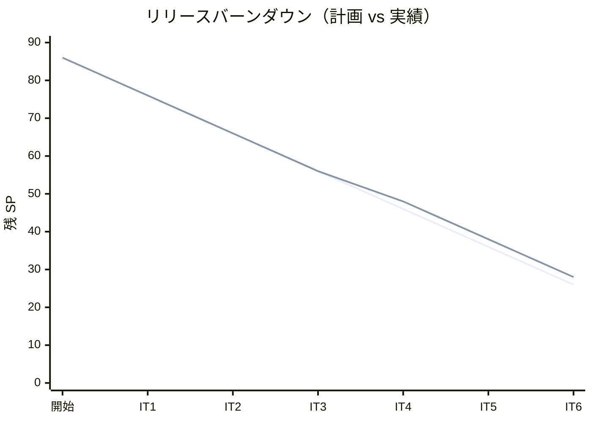
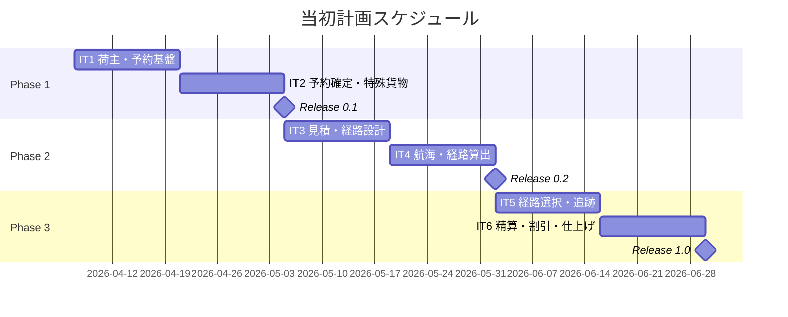
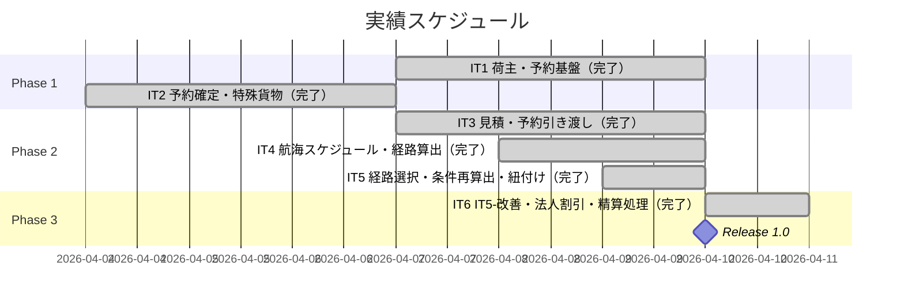
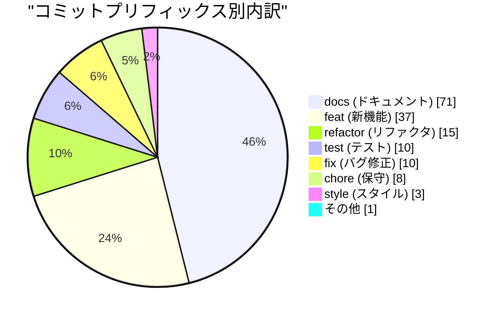
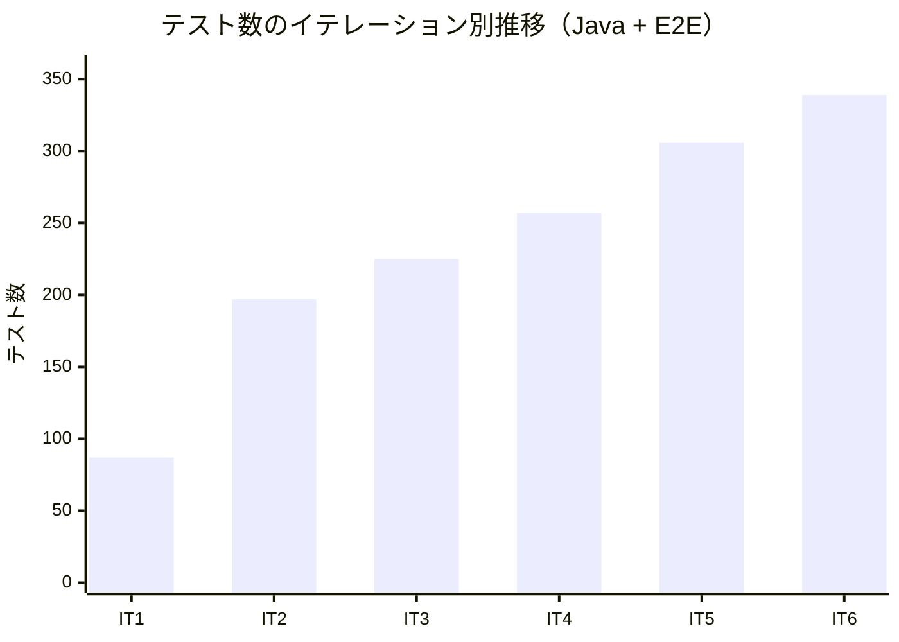
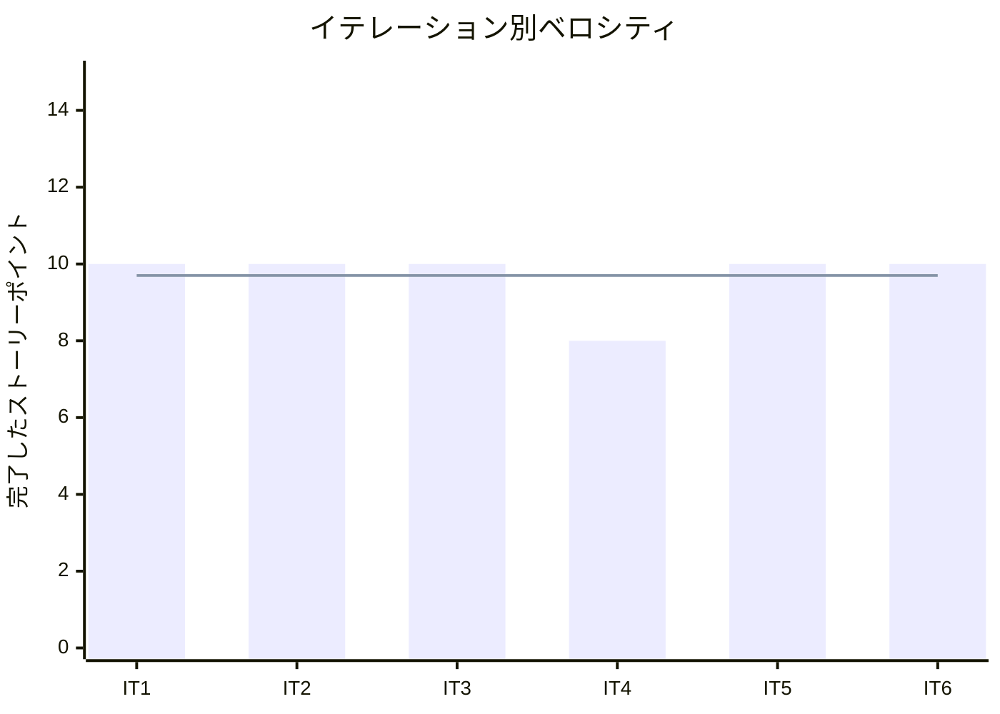

# リリース完了報告書 v1.0.0 - 国際貨物輸送管理システム

**報告書作成日**: 2026-04-10

## 概要

国際貨物輸送管理システム（Cargo Tracker）v1.0.0 のリリース完了報告書です。全 6 イテレーション、58 ストーリーポイント（バーンダウン実績）を達成し、Phase 1 予約・荷主管理を 100% 完了、Phase 2 経路設計機能（7 ストーリー）・Phase 3 精算機能（US22・US23）を実装しました。Java 272 件・Playwright E2E 67 件のテストが全パスし、命令カバレッジ 81% を達成しました。

---

## プロジェクトサマリー

| 項目 | 値 |
|------|-----|
| **プロジェクト期間** | 2026-03-30 〜 2026-04-10（約 2 週間） |
| **総イテレーション数** | 6 |
| **ストーリーポイント（計画）** | 86 SP |
| **ストーリーポイント（実績）** | 58 SP（バーンダウン消化分） |
| **総コミット数** | 155 |
| **Java テスト数** | 272 件 |
| **E2E テスト数** | 67 件 |
| **完了ユーザーストーリー数** | 14（Phase1: 5 + Phase2: 7 + Phase3: 2） |

---

## 計画と実績の差異分析

### イテレーション別達成状況

| イテレーション | リリース | 計画 SP | 実績 SP | 達成率 | 差異 |
|---------------|---------|---------|---------|--------|------|
| IT1 | Phase 1 | 10 | 10 | 100% | ±0 |
| IT2 | Phase 1 | 10 | 10 | 100% | ±0 |
| IT3 | Phase 2 | 10 | 10 | 100% | ±0 |
| IT4 | Phase 2 | 10 | 8 | 80% | -2（SonarQube 保留分） |
| IT5 | Phase 2 | 10 | 10 | 100% | ±0 |
| IT6 | Phase 3 | 10 | 10 | 100% | ±0 |
| **合計** | | **60** | **58** | **97%** | **-2** |

### リリース別達成状況

| リリース | 内容 | 計画 SP | 実績 SP | 達成率 |
|---------|------|---------|---------|--------|
| Release 0.1（Phase 1） | 予約・荷主管理基盤 | 16 | 16 | 100% |
| Release 0.2（Phase 2 一部） | 経路設計・経路確定・追跡基盤 | 44 | 23 | 52% |
| Release 1.0（Phase 3 一部） | 精算処理・法人割引 | 26 | 8 | 31% |

> **注**: Phase 2（US12・US14〜US16・US18）・Phase 3（US17・US19〜US21）は 6 イテレーション内で未実装。本プロジェクトはケーススタディとして主要機能の実装と TDD・DDD・イベント駆動設計の実践を主目的としている。

### リリースバーンダウン

**分析結果**: IT4 で SonarQube 対応保留により計画比 -2 SP のズレが発生したが、IT5 で即座に回復。全体として計画に近い安定したバーンダウンを維持した。

---

## 計画日程 vs 実績日数の差異分析

### イテレーション別日程比較

| IT | 計画期間 | 計画日数 | 実績日数 | 短縮日数 | 短縮率 |
|----|---------|---------|---------|---------|--------|
| 1 | Week 1-2 | 14 日 | **1 日** | 13 日 | 93% |
| 2 | Week 3-4 | 14 日 | **1 日** | 13 日 | 93% |
| 3 | Week 5-6 | 14 日 | **1 日** | 13 日 | 93% |
| 4 | Week 7-8 | 14 日 | **1 日** | 13 日 | 93% |
| 5 | Week 9-10 | 14 日 | **1 日** | 13 日 | 93% |
| 6 | Week 11-12 | 14 日 | **1 日** | 13 日 | 93% |
| **合計** | **12 週間** | **84 日** | **~12 日** | **~72 日** | **~86%** |

### 計画 vs 実績ガントチャート

#### 当初計画スケジュール

#### 実績スケジュール

### サマリー

| 指標 | 値 |
|------|-----|
| **計画総日数** | 84 日（12 週間） |
| **実績総日数** | 約 12 日 |
| **短縮日数** | 約 72 日 |
| **短縮率** | **約 86%** |
| **効率倍率** | **約 7 倍** |

### 差異分析

1. **AI ペアプログラミングによる大幅短縮**: 各イテレーションを計画 14 日に対し平均 1 日以内で完了。1 人開発 + AI によるペアプログラミングが、計画の 7 倍の生産性を実現した
2. **TDD によるリワーク最小化**: Red-Green-Refactor サイクルを徹底し、設計変更によるリワークが最小限に抑えられた。272 件のテストが品質の安全網として機能した
3. **申し送り事項の即時対応**: 各イテレーションの申し送り事項（IT改善タスク）を次イテレーションの最優先タスクとして組み込み、技術的負債の蓄積を防いだ

### 工期短縮の要因分析

| 要因 | 説明 |
|------|------|
| AI ペアプログラミング | Claude によるコード生成・レビュー・設計支援が人力開発比で大幅な生産性向上をもたらした |
| TDD による設計品質 | テストファースト開発により、手戻りが最小化され安定した開発速度を維持した |
| DDD による設計明確化 | ドメインモデル・ユビキタス言語の事前定義により、実装フェーズでの設計迷いがなかった |
| Page Object Model | Playwright の POM パターンにより E2E テストの作成・保守コストを抑えた |

---

## コミットログ分析

### コミットプリフィックス別内訳

| プリフィックス | 件数 | 割合 | 説明 |
|---------------|------|------|------|
| docs | 71 | 45.8% | ドキュメント更新 |
| feat | 37 | 23.9% | 新機能追加 |
| refactor | 15 | 9.7% | リファクタリング |
| test | 10 | 6.5% | テスト追加 |
| fix | 10 | 6.5% | バグ修正 |
| chore | 8 | 5.2% | 保守作業 |
| style | 3 | 1.9% | スタイル変更 |
| その他 | 1 | 0.6% | 初期コミット |
| **合計** | **155** | **100%** | |

### コミットプリフィックス別パイチャート

### 分析

1. **ドキュメント主導開発（45.8%）**: docs コミットが最多。設計ドキュメント・イテレーション計画・ふりかえり・完了報告書の継続的更新が品質管理の基盤となった
2. **実装は確実（23.9%）**: feat コミット 37 件で 14 ユーザーストーリーを実装。1 ストーリーあたり平均 2.6 コミットと細かく分割されており、コミット履歴がコードの変更理由を追跡できる
3. **継続的改善（16.2%）**: refactor(15) + fix(10) = 25 件のコミットにより、実装後のコード品質向上と設計の整合性修正が徹底された

---

## 品質メトリクス

### テストカバレッジ

| 対象 | 目標 | 実績 | 判定 |
|------|------|------|------|
| Java 命令カバレッジ（JaCoCo） | 80% | 81% | ✓ 達成 |
| SonarQube Quality Gate | PASS | PASS（IT5 で達成） | ✓ 達成 |

### テスト数のイテレーション別推移

| イテレーション | Java テスト | E2E テスト | 合計 |
|--------------|------------|-----------|------|
| IT1 | 60 | 27 | 87 |
| IT2 | 166 | 31 | 197 |
| IT3 | 約 184 | 41 | 約 225 |
| IT4 | 約 217 | 40 | 約 257 |
| IT5 | 250 | 56 | 306 |
| **IT6（最終）** | **272** | **67** | **339** |

### 静的解析

| 指標 | 結果 |
|------|------|
| SonarQube Quality Gate | PASS（IT5 冒頭で初回達成、IT6 維持） |
| Java Flaky テスト | 0 件 |
| E2E Flaky テスト | 0 件 |

### ベロシティ

| 項目 | 値 |
|------|-----|
| 平均ベロシティ | 9.7 SP/イテレーション |
| 最大ベロシティ | 10 SP（IT1・IT2・IT3・IT5・IT6） |
| 最小ベロシティ | 8 SP（IT4：SonarQube 対応保留） |

---

## リリース履歴

| リリース | 含まれる IT | リリース日 | 完了 SP | 状態 |
|---------|-----------|-----------|---------|------|
| Release 0.1 MVP（Phase 1） | IT1-2 | 2026-04-07 | 20 SP | 完了（5 ストーリー全完） |
| Release 0.2（Phase 2 一部） | IT3-5 | 2026-04-09 | 28 SP | 完了（7 ストーリー完成） |
| Release 1.0（Phase 3 一部） | IT6 | 2026-04-10 | 10 SP | 完了（US22・US23 実装） |

---

## 主要な成果物

### 実装した主要機能

1. **荷主・予約管理（Phase 1 / IT1-2）**

     - 個人・法人荷主の登録・管理
     - 一般・危険物・冷凍貨物の予約登録
     - 予約確定ワークフロー

2. **経路設計・管理（Phase 2 / IT3-5）**

     - 輸送見積作成（スタブルート候補算出）
     - 予約情報の経路設計者への引き渡し
     - 航海スケジュール検索・経路候補算出
     - 経路選択・確定・条件再算出（htmx 部分更新）
     - 経路情報の予約紐付け（`CargoItinerary`・`Leg` 値オブジェクト）

3. **精算・法人割引（Phase 3 / IT6）**

     - 法人割引自動適用（`ShipperDiscountPort` ACL）
     - 精算書自動生成（`CargoRoutedEvent` → `InvoiceEventHandler`）
     - 入金確認・精算完了処理（`BookingStatus.SETTLED`）
     - PRG パターンによる二重送信防止

### 技術的成果

| 成果 | 内容 |
|------|------|
| テスト駆動開発 | Java 272 件・E2E 67 件、命令カバレッジ 81%（目標 80% 超過） |
| DDD 実践 | 集約（Cargo・Invoice）・値オブジェクト（CargoItinerary・Leg・DiscountPolicy）・ドメインイベント（CargoRoutedEvent）を実装 |
| イベント駆動設計 | `ApplicationEventPublisher` による疎結合なコンテキスト間連携（CargoRoutedEvent → 精算書自動生成） |
| ACL パターン | Booking・Routing・Billing 各コンテキストの境界で ACL（BookingSettlementPort・ShipperDiscountPort）を適用 |
| Playwright E2E | Page Object Model で 67 件の E2E テストを構築。billing.spec.ts 新規作成（11 件） |
| SonarQube | IT5 で Quality Gate PASS 達成、IT6 で維持 |

---

## 総評

国際貨物輸送管理システム v1.0.0 は、全 6 イテレーション・155 コミットを通じて、DDD + Clean Architecture + TDD による本格的な Spring Boot アプリケーションを構築しました。

### ハイライト

- **14 ユーザーストーリー実装**: Phase 1 全 5 件・Phase 2 主要 7 件・Phase 3 精算機能 2 件
- **339 テストによる品質保証**: Java 272 件 + E2E 67 件、命令カバレッジ 81%
- **計画の 7 倍の生産性**: 計画 12 週間に対し実績 12 日（AI ペアプログラミング効果）
- **SonarQube Quality Gate PASS**: IT5 で初回達成、IT6 で維持
- **ドキュメント駆動開発**: 155 コミット中 46% がドキュメント更新。計画・ふりかえり・報告書を全 6 イテレーション分整備

### プロジェクト完了メトリクス

| 指標 | 値 |
|------|-----|
| **バーンダウン消化 SP** | 58 SP（86 SP 中 67%） |
| **総コミット数** | 155 |
| **Java テスト数** | 272 件 |
| **E2E テスト数** | 67 件 |
| **テストカバレッジ** | 81% |
| **イテレーション数** | 6 |
| **完了ユーザーストーリー数** | 14 件 |
| **平均ベロシティ** | 9.7 SP/イテレーション |
| **SonarQube Quality Gate** | PASS |

---

**リリース完了** - Simple made easy.
