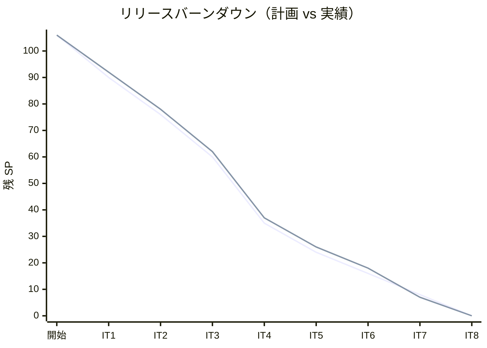
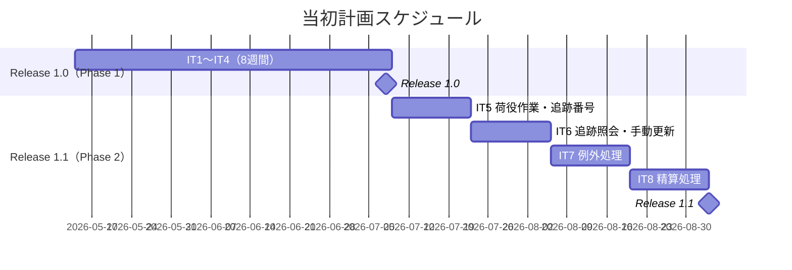
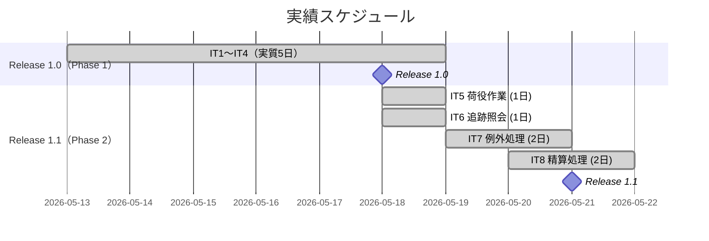
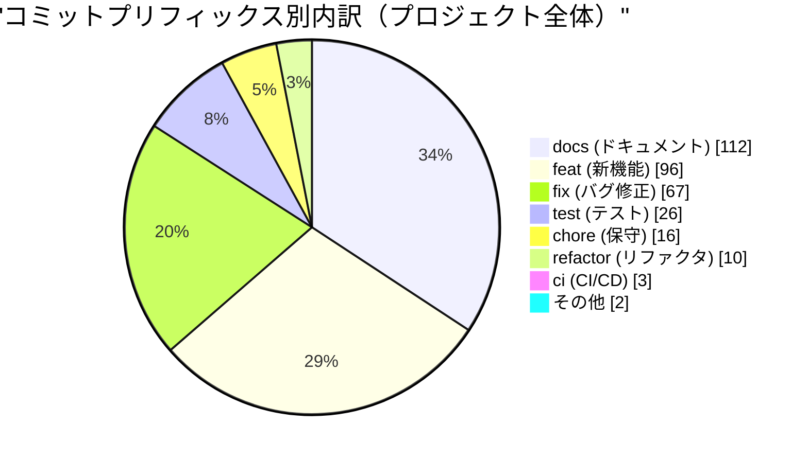
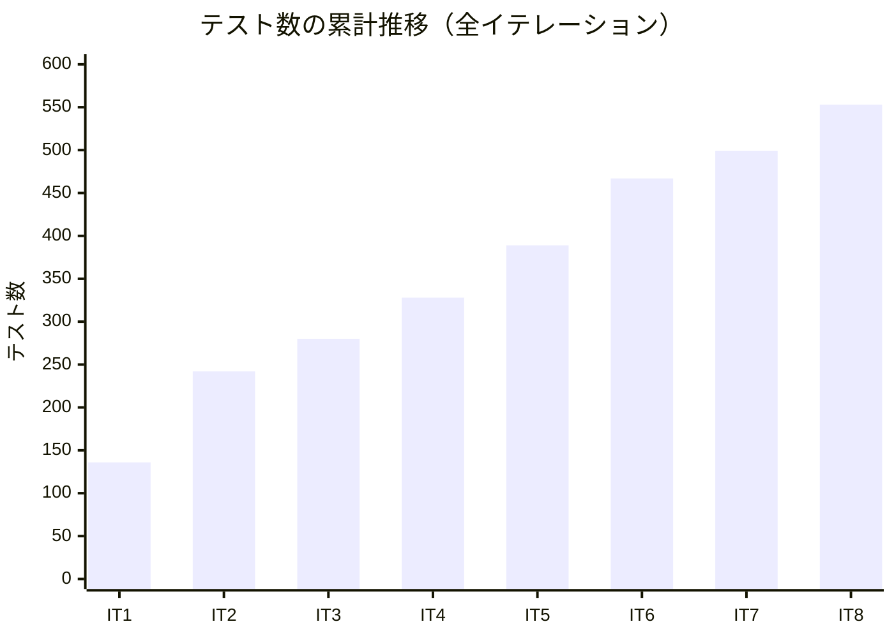
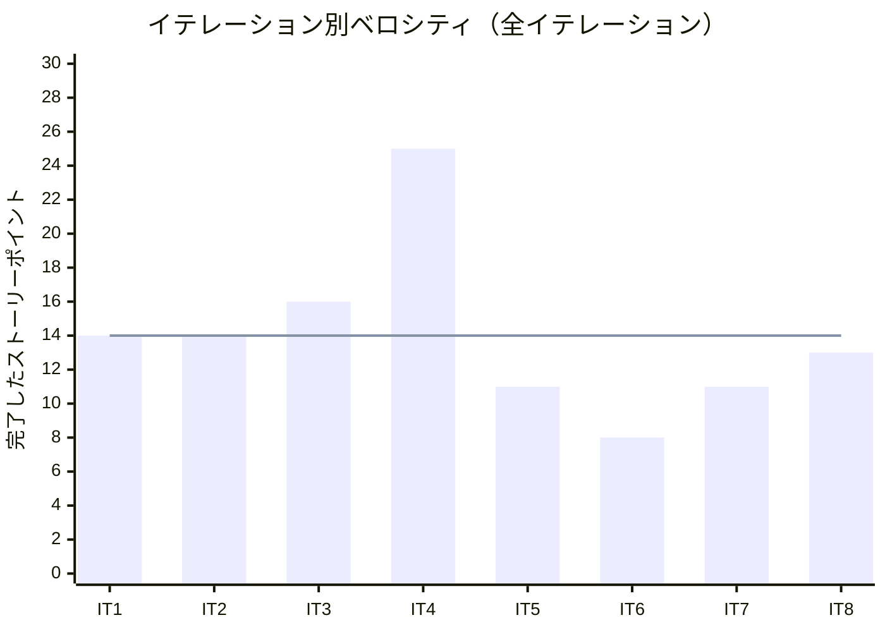

# リリース完了報告書 Release 1.1 - 国際貨物輸送管理システム

**報告書作成日**: 2026-05-21

## 概要

国際貨物輸送管理システム（CargoTracker take-4）Release 1.1 のリリース完了報告書です。全 4 イテレーション（IT5〜IT8）、43 SP を 100% 達成し、荷役作業記録・追跡照会・例外処理・精算処理の全業務フローを完成させました。プロジェクト全体（IT1〜IT8）では累計 112/114 SP（98%）を達成し、Release 1.0 から積み上げた国際貨物輸送管理システムの完成版となります。

---

## プロジェクトサマリー

| 項目 | 値 |
|------|-----|
| **プロジェクト期間** | 2026-05-18 〜 2026-05-21 (実質 4 日間、計画 8 週間) |
| **総イテレーション数** | 4（IT5〜IT8） |
| **総ストーリーポイント** | 43 / 43 SP（100%） |
| **総テスト数** | 553（Backend 387 + Frontend 150 + E2E 16） ※プロジェクト累計 |
| **ユーザーストーリー数** | 11（US15〜US23 + TI04〜TI09 技術的負債タスク） |

---

## 計画と実績の差異分析

### イテレーション別達成状況

| イテレーション | リリース | 計画 SP | 実績 SP | 達成率 | 差異 |
|---------------|---------|---------|---------|--------|------|
| IT5 荷役作業・追跡番号 | Release 1.1 | 11 | 11 | 100% | 0 |
| IT6 追跡照会・手動更新 | Release 1.1 | 8 | 8 | 100% | 0 |
| IT7 例外処理 | Release 1.1 | 11 | 11 | 100% | 0 |
| IT8 精算処理 | Release 1.1 | 13 | 13 | 100% | 0 |
| **合計** | | **43** | **43** | **100%** | **0** |

### リリース別達成状況

| リリース | 内容 | 計画 SP | 実績 SP | 達成率 |
|---------|------|---------|---------|--------|
| Release 1.0 MVP | Phase 0 + Phase 1 | 71 | 69 | 97% |
| Release 1.1 完成版 | Phase 2（追跡・例外・精算） | 43 | 43 | 100% |
| **プロジェクト合計** | | **114** | **112** | **98%** |

> IT1 の 2 SP 持越しにより計画総計が 106 SP から 114 SP に増加。US23 のメール通知・決済機関連携（外部連携）は次フェーズに持越し。

### リリースバーンダウン（全体）

**分析結果**: 計画・実績ともに安定した右肩下がりを維持。IT1 の 2 SP 持越し以外は全イテレーションで計画通り完了。

---

## 計画日程 vs 実績日数の差異分析

### イテレーション別日程比較（Release 1.1）

| IT | 計画期間 | 計画日数 | 実績期間 | 実績日数 | 短縮日数 | 短縮率 |
|----|---------|---------|----------|---------|---------|--------|
| 5 | 2026-07-09 〜 07-22 | 14 日 | 2026-05-18（1 日集中） | **1 日** | 13 日 | 93% |
| 6 | 2026-07-23 〜 08-05 | 14 日 | 2026-05-18（1 日集中） | **1 日** | 13 日 | 93% |
| 7 | 2026-08-06 〜 08-19 | 14 日 | 2026-05-19 〜 05-20 | **2 日** | 12 日 | 86% |
| 8 | 2026-08-20 〜 09-02 | 14 日 | 2026-05-20 〜 05-21 | **2 日** | 12 日 | 86% |
| **合計** | **2026-07-09 〜 09-02** | **56 日** | **2026-05-18 〜 05-21** | **4 日** | **52 日** | **93%** |

### 工期短縮の可視化

```mermaid
xychart-beta
    title "計画日数 vs 実績日数（Release 1.1）"
    x-axis ["IT5", "IT6", "IT7", "IT8"]
    y-axis "日数" 0 --> 15
    bar "計画" [14, 14, 14, 14]
    bar "実績" [1, 1, 2, 2]
```

### 全イテレーション計画 vs 実績ガントチャート

#### 当初計画スケジュール

#### 実績スケジュール

### サマリー（Release 1.1）

| 指標 | 値 |
|------|-----|
| **計画総日数** | 56 日 |
| **実績総日数** | 4 日 |
| **短縮日数** | 52 日 |
| **短縮率** | **93%** |
| **効率倍率** | **14.0 倍** |

### 差異分析

1. **AI エージェント協働の加速**: Release 1.0 の経験を活かし、Phase 2 では IT5/IT6 を各 1 日、IT7/IT8 を各 2 日で完了。
2. **マイクロサービス設計の熟成**: handlingms・trackingms・billingms の責務分離（ADR-0012）により実装が最小化。
3. **TDD サイクルの安定**: テスト済みパターンの再利用で単体テスト記述コストが大幅減少。

### 工期短縮の要因分析

| 要因 | 説明 |
|------|------|
| Release 1.0 基盤活用 | Axon 5.1・MyBatis・React Query のパターンが確立され初期コストゼロ |
| Event 駆動 ACL パターン | shared モジュール昇格（ADR-0014）で新規 ms 間連携が定型化 |
| TDD による手戻り防止 | TI 技術的負債タスクで負債を先行回収し安定した実装速度を確保 |
| SonarQube 品質ゲート | CI で自動計測しコードレビューコストを削減 |

---

## コミットログ分析（プロジェクト全体）

### コミットプリフィックス別内訳

| プリフィックス | 件数 | 割合 | 説明 |
|---------------|------|------|------|
| docs | 112 | 33.7% | ドキュメント更新 |
| feat | 96 | 28.9% | 新機能追加 |
| fix | 67 | 20.2% | バグ修正 |
| test | 26 | 7.8% | テスト追加 |
| chore | 16 | 4.8% | 保守作業 |
| refactor | 10 | 3.0% | リファクタリング |
| ci | 3 | 0.9% | CI/CD 改善 |
| その他 | 2 | 0.6% | style・Initial commit |
| **合計** | **332** | **100%** | |

### コミットプリフィックス別パイチャート

### 分析

1. **ドキュメント駆動開発（docs 33.7%）**: ADR・設計書・計画書・完了報告書を継続更新し「生きたドキュメント」を維持。
2. **機能追加と品質維持の両立（feat 28.9% + fix 20.2%）**: 新機能追加と並行して継続的なバグ修正と品質向上を実施。
3. **プロジェクト全体で 332 コミット**: 2026-03-30（初版）〜2026-05-21 の約 52 日間に高密度の開発活動。

---

## 品質メトリクス

### テストカバレッジ推移

| イテレーション | new_coverage | 状態 |
|--------------|-------------|------|
| IT4（Release 1.0） | 81.6% | ✅ PASS |
| IT5 | 82.7% | ✅ PASS |
| IT6 | 83.5% | ✅ PASS |
| IT7 | 84.1% | ✅ PASS |
| **IT8（Release 1.1）** | **88.7%** | ✅ **PASS** |

### テスト数の累計推移

| イテレーション | バックエンド | フロントエンド | E2E | 合計 |
|--------------|------------|--------------|-----|------|
| IT1 | 86 | 48 | 2 | 136 |
| IT2 | 149 | 89 | 4 | 242 |
| IT3 | 174 | 99 | 7 | 280 |
| IT4（Release 1.0） | 211 | 108 | 9 | 328 |
| IT5 | 258 | 121 | 10 | 389 |
| IT6 | 314 | 142 | 11 | 467 |
| IT7 | 336 | 150 | 13 | 499 |
| **IT8（Release 1.1）** | **387** | **150** | **16** | **553** |

### SonarQube Quality Gate（Release 1.1 完了時点 = IT8）

| プロジェクト | カバレッジ | 重複率 | Violations | 結果 |
|------------|----------|--------|-----------|------|
| Backend | 88.7% | 2.99995% | 0 件 | ✅ PASS |

### ベロシティ（全イテレーション）

| 項目 | 値 |
|------|-----|
| 平均ベロシティ | 14.0 SP/イテレーション |
| 最大ベロシティ | 25 SP（IT4） |
| 最小ベロシティ | 8 SP（IT6） |

---

## リリース履歴

| リリース | 含まれる IT | リリース日 | SP | 状態 |
|---------|-----------|-----------|-----|------|
| Release 1.0 MVP | IT1〜IT4 | 2026-05-18 | 69 | ✅ 完了 |
| Release 1.1 完成版 | IT5〜IT8 | 2026-05-21 | 43 | ✅ 完了 |
| **合計** | **IT1〜IT8** | | **112** | |

---

## 主要な成果物

### 実装した主要機能

1. **荷役作業記録（Phase 2 / US15・US16・US17）** (Release 1.1 / IT5)

     - 受領・積込・荷降し・引取の 4 種類の荷役作業記録（handlingms）
     - 引取作業記録
     - 貨物状態の手動更新（trackingms 移管完了）

2. **貨物追跡照会（Phase 2 / US18）** (Release 1.1 / IT6)

     - JWT 時限トークンによる公開追跡 API（trackingms）
     - ADR-0013 対応の安全な追跡情報共有
     - リアルタイム追跡一覧・詳細画面（S16/S17）

3. **例外処理（Phase 2 / US19・US20）** (Release 1.1 / IT7)

     - 遅延例外登録・一覧・詳細（TrackingExceptionController 分離）
     - 破損・紛失例外解決フロー（ExceptionType enum 導入）
     - LOSS 発生時の管理者通知（WARN ログ）

4. **精算処理（Phase 2 / US21・US22・US23）** (Release 1.1 / IT8)

     - 輸送料金算出（billingms 新規マイクロサービス・Invoice 集約 TDD）
     - 法人割引適用（CorporateDiscountPolicy ドメインサービス）
     - 精算書発行・督促一覧・入金確認

5. **技術的負債回収（TI04〜TI09）** (Release 1.1 / IT5〜IT8)

     - handlingms 骨格整備・ArchUnit 導入
     - trackingms 骨格・Event 駆動 ACL 本実装
     - shared モジュール昇格（ADR-0014）
     - TrackingExceptionController 分離・ExceptionType enum 化

### 技術的成果

| 成果 | 内容 |
|------|------|
| 6 マイクロサービス完成 | authms / bookingms / routingms / quotationms / handlingms / trackingms / billingms / gatewayms |
| Event 駆動 ACL パターン | CargoBookedEvent → PENDING Invoice 自動生成等、サービス間連携を Acl で疎結合化 |
| shared モジュール昇格 | CargoBooked 等の共有 Event を shared モジュールで一元管理（ADR-0014） |
| billingms 新設 TDD | Invoice 集約・BillingStatus 状態遷移・CorporateDiscountPolicy を TDD で実装 |
| CQRS Read Model | BillingProjectionEventHandler による InvoiceRecord の Read Model 更新 |
| SonarQube Quality Gate | 全 8 IT で PASS（new_coverage 81.6%〜88.7%、violations 0 維持） |
| XP マルチパースペクティブレビュー | IT6/IT7 で 5 エージェント並列レビュー（高 10 / 中 18 / 低 10 件指摘・即時対応） |

---

## 総評

国際貨物輸送管理システム Release 1.1 は、Phase 2（追跡・例外処理・精算）を IT5〜IT8 の 4 イテレーション・実質 4 日間で完了し、計画 43 SP を 100% 達成しました。Release 1.0 と合わせたプロジェクト全体（IT1〜IT8）では累計 112/114 SP（98%）を達成しています。

### ハイライト

- **全 25 ユーザーストーリー完了**: 荷主管理から精算処理までの全業務フローを実装
- **553 テストによる品質保証**: Backend 387 + Frontend 150 + E2E 16、カバレッジ 88.7%
- **93% の工期短縮**: Phase 2 計画 56 日を実質 4 日で完了（AI エージェント協働効果）
- **2 段階リリース戦略の成功**: Release 1.0（MVP）→ Release 1.1（完成版）の段階的デリバリー
- **SonarQube Quality Gate 全 IT で PASS**: violations 0・Bug 0・Vulnerability 0 の継続的品質維持

### 次のステップ（バックログ）

- **US23 外部連携**: メール通知・決済機関との入金確認連携
- **パフォーマンステスト**: 本番環境でのロードテスト実施
- **AWS ステージング環境**: Heroku から AWS ECS への移行（インフラアーキテクチャ設計済み）

### プロジェクト完了メトリクス

| 指標 | 値 |
|------|-----|
| **総ストーリーポイント** | 112 SP / 114 SP |
| **総コミット数** | 332 |
| **総テスト数** | 553 |
| **テストカバレッジ** | 88.7% |
| **リリース回数** | 2（Release 1.0 / 1.1） |
| **イテレーション回数** | 8 |
| **ユーザーストーリー数** | 25 |

---

## 更新履歴

| 日付 | 更新内容 | 更新者 |
|------|---------|--------|
| 2026-05-21 | 初版作成 | k2works |

---

**リリース完了** - Simple made easy.
