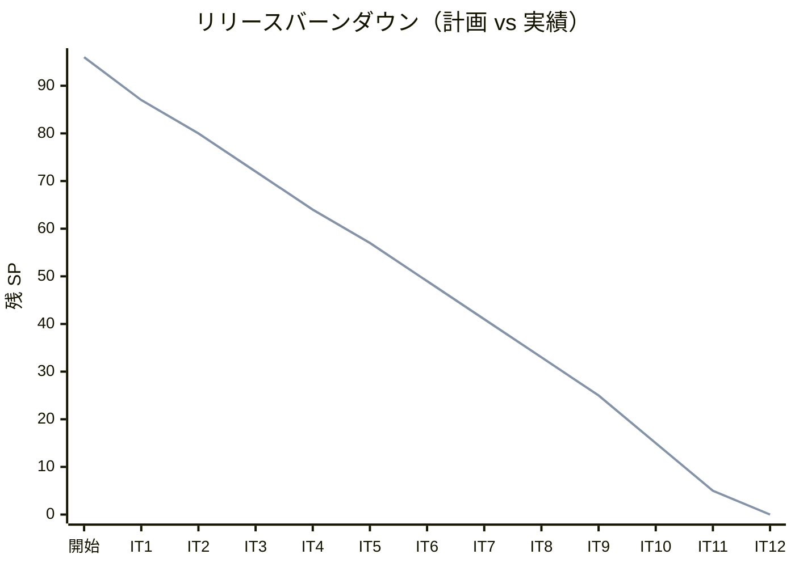
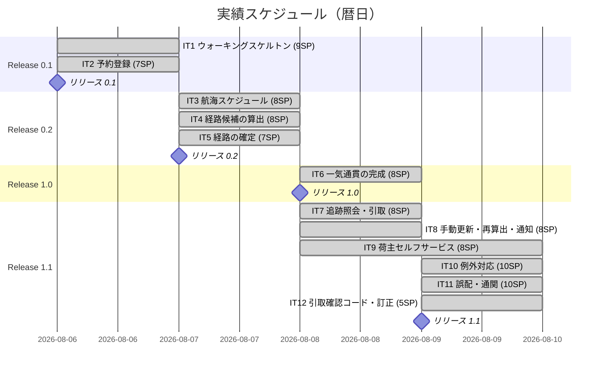
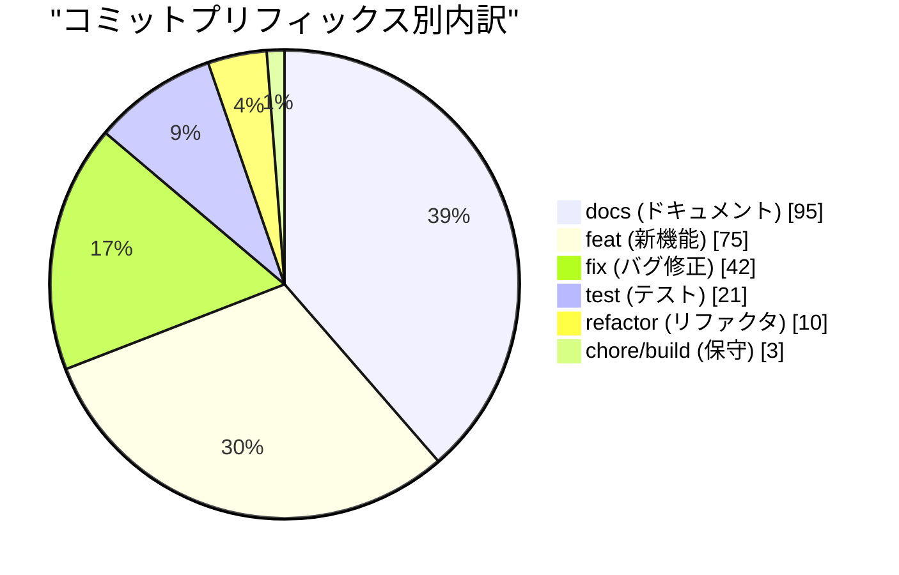
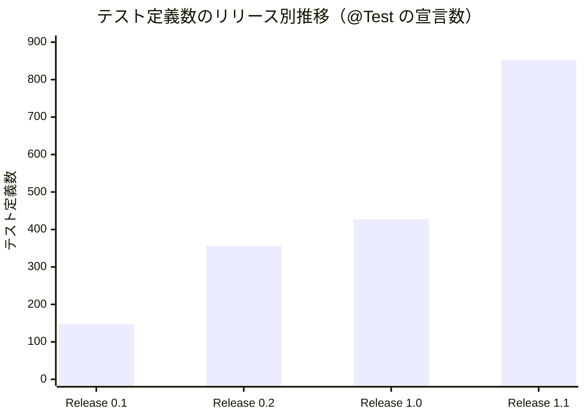
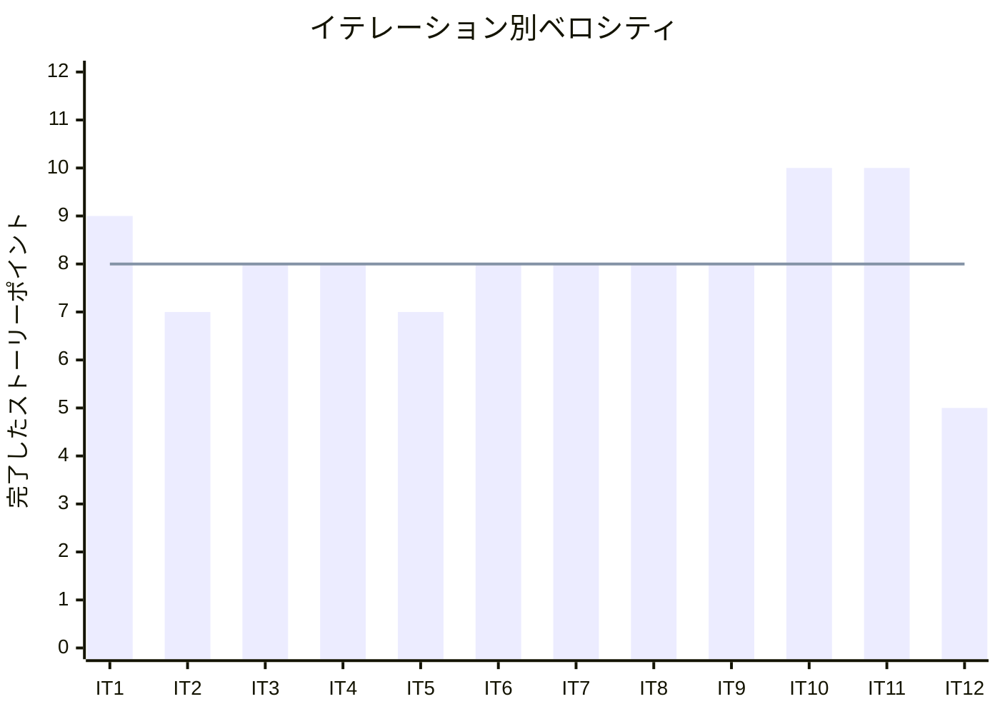

# リリース完了報告書 v1.1.0 - 国際貨物輸送管理システム（java/take-6）

**報告書作成日**: 2026-08-10

## 概要

国際貨物輸送管理システム（Cargo Tracker）v1.1.0 のリリース完了報告書です。全 12 イテレーション、96 ストーリーポイントを **100% 達成**し、Release 0.1（予約基盤）から Release 1.1（実運用の補完）までの計画対象 31 ストーリーをすべて完了しました。Java テスト 1,168 件・Playwright E2E 14 本が全パスし、行カバレッジ 92.6%・SonarQube Quality Gate PASS を達成しています。

> **前提の欠落を先に記録します。** 本報告書は `CHANGELOG.md` と git タグ（`java/take-6/v1.1.0`）が**存在しない状態**で作成しました。数値はすべて `release_plan.md`・イテレーション完了報告書・`git log`・テスト実行結果の**実測値**であり、CHANGELOG に依存する項目（Features / Bug Fixes の内訳）は**コミットプリフィックスの集計で代替**しています。バージョンの確定とタグ付けは `developing-release` で別途行う必要があります。

---

## プロジェクトサマリー

| 項目 | 値 |
|------|-----|
| **プロジェクト期間** | 2026-08-06 〜 2026-08-09（4 日間） |
| **総イテレーション数** | 12 |
| **総ストーリーポイント** | 96 SP（計画）/ 96 SP（実績） |
| **総コミット数** | 246（マージを除く） |
| **総テスト数** | 1,182（Java 1,168 + E2E 14） |
| **ユーザーストーリー数** | 31 |
| **開発者** | 1 名 |

---

## 計画と実績の差異分析

### イテレーション別達成状況

| イテレーション | リリース | 計画 SP | 実績 SP | 達成率 | 差異 |
|---------------|---------|---------|---------|--------|------|
| IT1 | 0.1 | 9 | 9 | 100% | ±0 |
| IT2 | 0.1 | 7 | 7 | 100% | ±0 |
| IT3 | 0.2 | 8 | 8 | 100% | ±0 |
| IT4 | 0.2 | 8 | 8 | 100% | ±0 |
| IT5 | 0.2 | 7 | 7 | 100% | ±0 |
| IT6 | 1.0 | 8 | 8 | 100% | ±0 |
| IT7 | 1.1 | 8 | 8 | 100% | ±0 |
| IT8 | 1.1 | 8 | 8 | 100% | ±0 |
| IT9 | 1.1 | 8 | 8 | 100% | ±0 |
| IT10 | 1.1 | 10 | 10 | 100% | ±0 |
| IT11 | 1.1 | 10 | 10 | 100% | ±0 |
| IT12 | 1.1 | 5 | 5 | 100% | ±0 |
| **合計** | | **96** | **96** | **100%** | **±0** |

> **12 イテレーション連続で計画 SP = 実績 SP です。** ただしこれは「見積もりが正確だった」ことを意味しません。**計画外の作業（レビュー指摘・SonarQube・実バグ）を各イテレーション内で吸収した結果**であり、8SP は「計画分 ＋ 想定外」を含んだ実効値です。詳細は「差異分析」を参照してください。

### リリース別達成状況

| リリース | 内容 | 含まれる IT | 計画 SP | 実績 SP | 達成率 |
|---------|------|------------|---------|---------|--------|
| Release 0.1 | 予約基盤（認証・荷主・予約） | IT1〜IT2 | 16 | 16 | 100% |
| Release 0.2 | 経路設計・予約確定 | IT3〜IT5 | 23 | 23 | 100% |
| Release 1.0 | 追跡（予約から追跡までの一気通貫） | IT6 | 8 | 8 | 100% |
| Release 1.1 | 実運用に必要な補完 | IT7〜IT12 | 49 | 49 | 100% |
| **合計** | | **IT1〜IT12** | **96** | **96** | **100%** |

> **Release 2.0（精算。US21 / US22 / US23・11SP）は本計画の対象外**です。US30（輸送中キャンセルの承認）はキャンセル料の算定が精算に依存するため、同じく Release 2.0 以降に置いています。

### リリースバーンダウン

**分析結果**: **計画線と実績線が完全に重なります。** 12 イテレーションすべてで計画 SP を消化しました。ただし線が重なることは「順調だった」ことを意味しません。**IT4 の開始準備でイテレーション数を 8 → 11 に、IT8 の開始準備で 11 → 12 に増やしています**。スコープを削らずに 8SP/IT に収めるため、**期間を伸ばす判断を 2 回行った結果**として線が重なっています。

---

## 計画日程 vs 実績日数の差異分析

### 計画にカレンダー日数を置いていない

**本プロジェクトの計画は「1 イテレーション = 1 サイクル」と定義しており、イテレーションあたりのカレンダー日数を定めていません。** そのため**工期短縮率は算出できません**。テンプレートの当該項目を空欄や推測値で埋めることはせず、実績のみを記録します。

### イテレーション別の実績日程

| IT | リリース | 実績期間 | 実績日数 | 実績 SP |
|----|---------|---------|---------|--------|
| IT1 | 0.1 | 2026-08-06 | 1 日 | 9 |
| IT2 | 0.1 | 2026-08-06 | 1 日（IT1 と同日） | 7 |
| IT3 | 0.2 | 2026-08-07 | 1 日 | 8 |
| IT4 | 0.2 | 2026-08-07 | 1 日（同日） | 8 |
| IT5 | 0.2 | 2026-08-07 | 1 日（同日） | 7 |
| IT6 | 1.0 | 2026-08-08 | 1 日 | 8 |
| IT7 | 1.1 | 2026-08-08 | 1 日（同日） | 8 |
| IT8 | 1.1 | 2026-08-08 | 1 日（同日） | 8 |
| IT9 | 1.1 | 2026-08-08 〜 2026-08-09 | 2 日 | 8 |
| IT10 | 1.1 | 2026-08-09 | 1 日 | 10 |
| IT11 | 1.1 | 2026-08-09 | 1 日（同日） | 10 |
| IT12 | 1.1 | 2026-08-09 | 1 日（同日） | 5 |
| **合計** | | **2026-08-06 〜 2026-08-09** | **4 日（暦日）** | **96** |

### 実績スケジュール

### 差異分析

1. **計画 SP を一度も落としていない一方、イテレーション数は 2 回増やしている。** IT4 で 8 → 11、IT8 で 11 → 12。**「スコープを削らずに 8SP に収めるには期間を伸ばすしかない」**という判断を明示的に行った結果である。SP の達成率 100% は、この再計画を含んだうえでの数字である。
2. **ベロシティの初期値 12SP は過大だった。** 他言語版の実績（`flix/take-1` 12.3SP など）から推定したが、IT1〜IT3 の実績はいずれも 8SP 前後で、IT4 の開始準備で 8SP へ再計算した。**推定値を 3 イテレーションで検証する規律が機能した。**
3. **IT10・IT11 の 10SP は「超過は承知の上の賭け」として計画に明記した。** 残り 4 ストーリーが 5SP ずつで 8SP に割れず、2 件ずつ 10SP を試した。**どちらも達成したが、上限を測れたわけではない**（IT9 は計画 74.5h に対しレビュー高 9 件と SonarQube 7 件が計画外で乗った）。

### 実績日数が短い要因

| 要因 | 説明 |
|------|------|
| 開発者 1 名・単一セッション | 待ち合わせ・引き継ぎのコストが発生しない |
| 環境構築の完了 | Gradle・Docker・品質ツール・CI・Heroku デプロイが IT1 開始前に整備済み |
| 返済枠の前倒し | 6 IT 連続で返済枠を序盤の独立コミットに割り当て、**負債を次イテレーションへ持ち越さなかった** |
| 検査の自動化 | ArchUnit 11 ルール ＋ SQL 所有検査・Checkstyle・SpotBugs・SonarQube が設計の逸脱を機械的に検出 |

> **暦日 4 日は「1 イテレーション = 1 日」を意味しません。** 本プロジェクトはケーススタディであり、実業務のイテレーション期間（通常 1〜2 週間）とは前提が異なります。**この日数を生産性の指標として他プロジェクトに適用することはできません。**

---

## コミットログ分析

### コミットプリフィックス別内訳

| プリフィックス | 件数 | 割合 | 説明 |
|---------------|------|------|------|
| docs | 95 | 38.6% | ドキュメント更新（設計・ADR・マニュアル・ふりかえり） |
| feat | 75 | 30.5% | 新機能追加 |
| fix | 42 | 17.1% | バグ修正・レビュー指摘対応 |
| test | 21 | 8.5% | テスト追加・破壊検証 |
| refactor | 10 | 4.1% | リファクタリング |
| chore | 2 | 0.8% | 保守作業 |
| build | 1 | 0.4% | ビルド設定 |
| **合計** | **246** | **100%** | |

### コミットプリフィックス別パイチャート

### 分析

1. **`docs` が最多（38.6%）である。** 設計ドキュメント・ADR・マニュアル・ふりかえりを**実装と同じイテレーション内で更新する**規律の結果である。「実装が終わってからまとめて書く」形にすると、この比率にはならない。
2. **`fix` が 17.1%（42 件）ある。** 相当数はクローズ時のレビュー指摘と品質ゲート由来である。**全緑の状態からレビューが欠陥を出すのが 4 イテレーション連続**しており、これが本プロジェクトの一貫した傾向である。**テストが緑であることは、正しいことの証明ではない。**
3. **`test` の 21 件は「テストを足した」だけではない。** 安全装置を数え上げて壊す破壊検証を、専用のコミットとして残している（IT8 / IT10 / IT11 / IT12）。**検査が働くことを検査した記録**である。

---

## 品質メトリクス

### テストカバレッジ

| 対象 | 目標 | 実績 | 判定 |
|------|------|------|------|
| バックエンド（行） | 80% | **92.6%** | 達成 |
| バックエンド（分岐） | 目標なし | 73.7% | 記録 |
| 新規コード（SonarQube） | 80% | **87.4%** | 達成 |

> **フロントエンドは対象外です。** 本プロジェクトはサーバーサイドレンダリング（Thymeleaf ＋ htmx）であり、独立したフロントエンドのテストスイートを持ちません。画面の振る舞いは MockMvc の統合テストと Playwright の E2E で検証しています。

### テスト構成

| 種別 | 件数 | 内容 |
|------|------|------|
| Java（単体・統合・ArchUnit） | 1,168 | 146 テストクラス |
| E2E（Playwright） | 14 | 9 spec ファイル |
| マニュアル用キャプチャ | 22 | 生成 spec（画像の再生成に使用） |
| **合計** | **1,182** | |

### テスト定義数のリリース別推移

**イテレーション完了報告書に記録されたテスト件数は、書式が揃っておらず全リリース分を取り出せませんでした**（IT1 96 件・IT3 466 件・IT4 530 件・IT5 581 件・IT12 1,165 件のみ記録）。**欠けた値を推測で埋めることはせず**、各リリース境界のコミットで `@Test` の定義数を数え直した実測値を示します。

| リリース | 境界コミット | `@Test` 定義数 |
|---------|------------|--------------|
| Release 0.1 | `5e30ffd52`（IT2 クローズ） | 148 |
| Release 0.2 | `98fcb57ae`（IT5 クローズ） | 356 |
| Release 1.0 | `7a58f8259`（IT6 クローズ） | 427 |
| Release 1.1 | `HEAD`（IT12 クローズ後） | **852** |

> **定義数（852）と実行数（1,168）が違うのは、パラメータ化テストが 1 つの宣言から複数のケースを生むためです。** 実行数のほうが多くなります。

### 静的解析

| 指標 | 結果 |
|------|------|
| Checkstyle | 0 件 |
| SpotBugs | 0 件（main / test の両方） |
| SonarQube Quality Gate | **PASS** |
| SonarQube Bug / Vulnerability | 0 / 0 |
| SonarQube Code Smell | 0 |
| 重複率 | 0.3%（閾値 3% 未満） |
| ArchUnit | 11 ルール ＋ **SQL テーブル所有検査**（ADR-015） |
| CI | success |

### ベロシティ

| 項目 | 値 |
|------|-----|
| 平均ベロシティ | **8.0 SP** / イテレーション |
| 最大ベロシティ | 10 SP（IT10・IT11） |
| 最小ベロシティ | 5 SP（IT12。残りが 5SP だったため） |
| 採用値 | 8 SP（IT4 の開始準備で 12 → 8 に再計算） |

> **平均 8.0SP は採用値 8SP と一致しました。** 12 イテレーションを通じて再調整は 1 度だけです（IT4）。IT9 終了時の平均 7.89SP との差は 0.11SP で、再調整は行いませんでした。

---

## リリース履歴

| リリース | 含まれる IT | リリース日 | SP | 状態 |
|---------|-----------|-----------|-----|------|
| Release 0.1 予約基盤 | IT1〜IT2 | 2026-08-06 | 16 | **完了** |
| Release 0.2 経路設計・予約確定 | IT3〜IT5 | 2026-08-07 | 23 | **完了** |
| Release 1.0 追跡 | IT6 | 2026-08-08 | 8 | **完了** |
| Release 1.1 実運用の補完 | IT7〜IT12 | 2026-08-09 | 49 | **完了** |
| Release 2.0 精算 | 未計画 | — | 11 | **未着手**（本計画の対象外） |

---

## 主要な成果物

### 実装した主要機能

1. **認証・アカウント管理**（Release 0.1 / IT1・IT5）

     - ログイン・ロール別の認可・アカウントロックと解除（US26 / US27 / US31 / US33）
     - **ロックの解除には理由を必須にした。** 画面で必須にするだけでは、再送や URL の直叩きで通る

2. **荷主・予約管理**（Release 0.1 / IT2・IT7・IT9）

     - 荷主の登録・訂正、法人契約（US02 / US32 / US03）
     - 貨物予約の登録、危険物・冷凍貨物の特別な取り扱い（US04 / US05）
     - **危険物クラスは国連分類の実在する値に限る。** 輸送書類にそのまま載り、存在しない値は申告が無いのと同じ結果になる

3. **経路設計**（Release 0.2 / IT3〜IT5・IT8）

     - 航海スケジュールの登録・検索・更新（US24 / US07 / US25）
     - 経路候補の算出・選択・確定・条件を変えた再算出（US08 / US09 / US11 / US10）
     - **運べない便は選べない。** 画面に出さないだけでなく、URL を直接叩いても確定できない

4. **追跡**（Release 1.0・1.1 / IT6〜IT8）

     - 追跡番号の発行、荷役作業の記録、追跡照会（US14 / US15 / US18）
     - 公開追跡（認証不要。**個人情報を型として持たない**）とレートリミット（ADR-011）
     - 貨物状態の手動更新（US17。**逆行を拒否する**）

5. **例外対応**（Release 1.1 / IT10・IT11）

     - 遅延・破損・紛失の例外、エスカレーション（US19 / US20）
     - 誤配の検知と現在地からの経路再設計（US28）
     - 通関申告の登録・状態管理、**通関前の引き渡しの拒否**（US29）

6. **引き渡しの証明**（Release 1.1 / IT12）

     - 引取確認コードの採番と照合（US35）。**追跡番号とは別の値**であり、それを知っているだけでは引き取れない
     - 引取記録の訂正・取り消し（US36）。**申請と承認を分け、申請した本人は承認できない**

7. **荷主セルフサービス**（Release 1.1 / IT9）

     - 荷主が自社の予約を照会する（US34）。**絞り込みは SQL で行い、紐付けが無ければ 0 件**（ADR-013）

### 技術的成果

| 成果 | 内容 |
|------|------|
| テスト駆動開発 | 1,182 テスト、行カバレッジ 92.6%。**受入基準ごとに「その道を実行したテスト」を名指し** |
| 破壊検証 | 安全装置を数え上げて壊す規律を IT8 以降で継続。IT12 は 21 件・空振り 0 件 |
| DDD / Bounded Context | 9 コンテキスト。**BC 間は ACL ポートかドメインイベントのみ**（ADR-005 / ADR-009 / ADR-012） |
| アーキテクチャ検査 | ArchUnit 11 ルール ＋ **SQL のテーブル所有検査**（ADR-015）。Java の依存グラフに映らない結合を検出 |
| 結果整合 | ドメインイベントの AFTER_COMMIT 購読。**取りこぼしを数えるメトリクス**を持つ |
| CI/CD | GitHub Actions（テスト・静的解析・ビルド）＋ Heroku Container Registry へのデプロイ |
| ADR | 15 件。**代償を必ず書く**（「受け入れる代償」節） |
| ドキュメント | 設計 11 件・マニュアル 11 章＋付録・運用手順書 3 件。**実装と同じイテレーションで更新** |

---

## 総評

Cargo Tracker v1.1.0 は、全 96SP を 12 イテレーションで **100% 達成**し、計画対象の 31 ユーザーストーリーをすべて完了しました。

### ハイライト

- **全 31 ユーザーストーリー完了**: 予約から経路設計・追跡・引き渡しの証明までが一本でつながり、例外（遅延・破損・紛失・誤配・通関）も業務として扱えます
- **1,182 テストによる品質保証**: Java 1,168（単体・統合・ArchUnit）＋ E2E 14
- **92.6% 行カバレッジ**: 目標 80% を上回り、SonarQube Quality Gate は PASS（Bug 0 / Vulnerability 0 / Code Smell 0）
- **4 段階リリース戦略の成功**: 0.1（基盤）→ 0.2（経路）→ 1.0（一気通貫）→ 1.1（実運用の補完）。**各リリース末に動作するソフトウェアをデプロイ**しました
- **12 イテレーション連続で計画 SP = 実績 SP**: ベロシティ 8SP は 1 度の再調整（IT4）だけで安定しました

### 正直に記録すること

**「達成率 100%」は「問題が無かった」ことを意味しません。**

| 事実 | 内容 |
| :--- | :--- |
| **イテレーション数を 2 回増やした** | IT4 で 8 → 11、IT8 で 11 → 12。スコープを削らない代わりに期間を伸ばした |
| **全緑の状態からレビューが欠陥を出すのが 4 IT 連続** | IT9・IT10・IT11・IT12。**テストが緑であることは、正しいことの証明ではない** |
| **自己レビューは並列レビューの代替にならない** | IT12 でレビューが応答せず自己レビューで代替したが、後に届いた本来のレビューが 11 件を指摘し、**全件が事実だった** |
| **破壊検証には構造的な死角がある** | 壊せるのは「作った守り」だけで、**作らなかった守り**は数え上げの対象にならない |
| **持ち越し 10 件がある** | IT12 のふりかえりに記録。うち 4 件は業務の穴（コードを忘れた荷受人の逃げ道・承認待ち中の可視性・1 人拠点の承認・引取以外の誤登録） |

### プロジェクト完了メトリクス

| 指標 | 値 |
|------|-----|
| **総ストーリーポイント** | 96 SP |
| **総コミット数** | 246 |
| **総テスト数** | 1,182 |
| **テストカバレッジ（行）** | 92.6% |
| **リリース回数** | 4（0.1 / 0.2 / 1.0 / 1.1） |
| **イテレーション回数** | 12 |
| **ユーザーストーリー数** | 31 |
| **ADR** | 15 件 |

### 次のリリースへの申し送り

**Release 2.0（精算。US21 / US22 / US23・11SP）は未計画です。** 着手する場合、最初の設計判断は次のとおりです。

- **精算済みの取り消しをどう扱うか。** US36 で「精算済みは訂正・取り消しできない」と定めたため、**返金を伴う経路**をどこに置くかが決まっていません
- `BookingSettlementPort` / `ShipperDiscountPort` / `TrackingStatusPort` は未実装（ACL ポート表に記載済み）
- ADR-015 の SQL 所有検査は Billing のマッパーにも効きます。**新しい BC を足すときは `OWNER` 表に行を足してください**

### 未完了の作業

| 項目 | 状態 |
| :--- | :--- |
| `CHANGELOG.md` | **未作成** |
| git タグ `java/take-6/v1.1.0` | **未作成** |
| バージョン確定（`developing-release`） | **未実施** |

---

## 関連ドキュメント

- [リリース計画](release_plan.md)
- [リリーススコープ定義](release_scope.md)
- [IT12 完了報告書](iteration_report-12.md) / [IT12 ふりかえり](retrospective-12.md)
- [開発ジャーナル 2026-08-09](../journal/20260809.md)
- [ADR 一覧](../adr/index.md)

---

**リリース完了** - Simple made easy.
