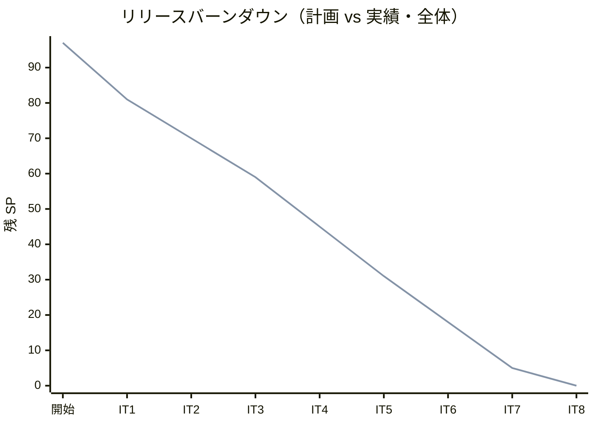
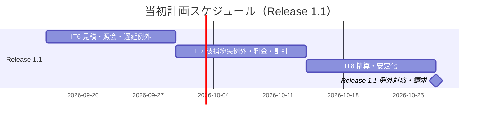
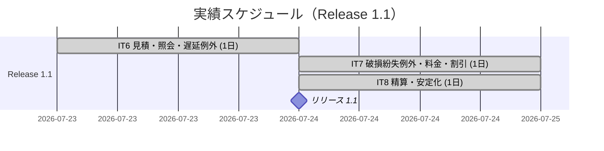
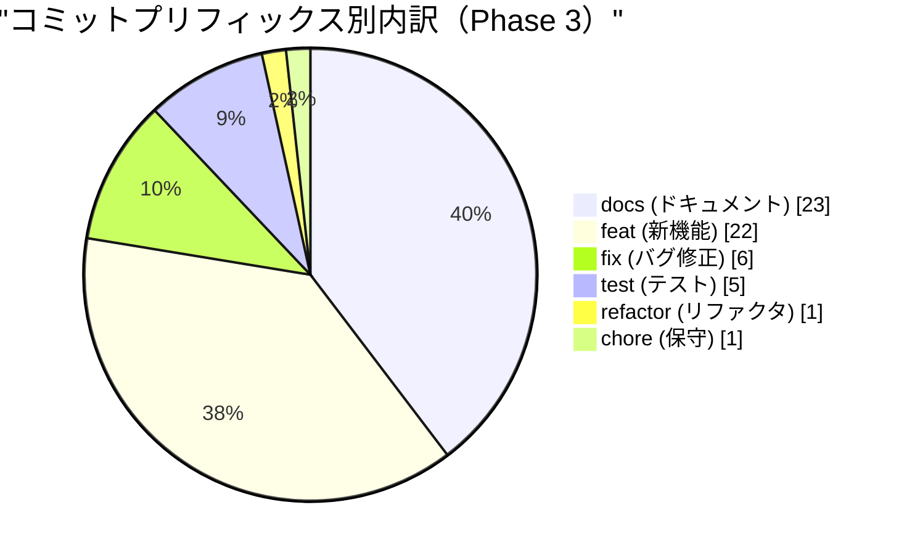
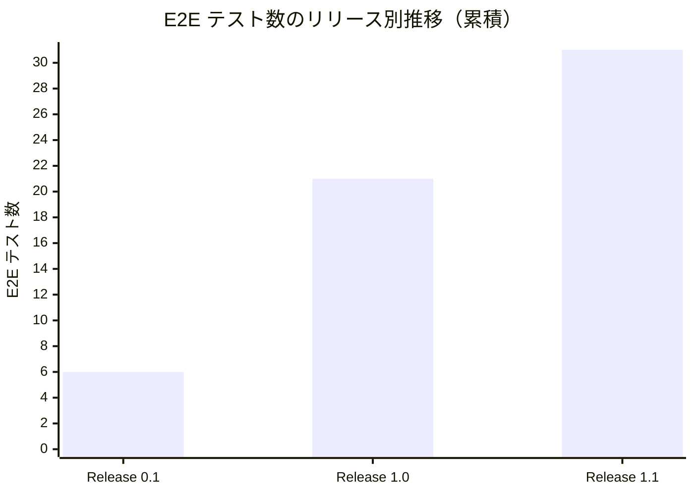
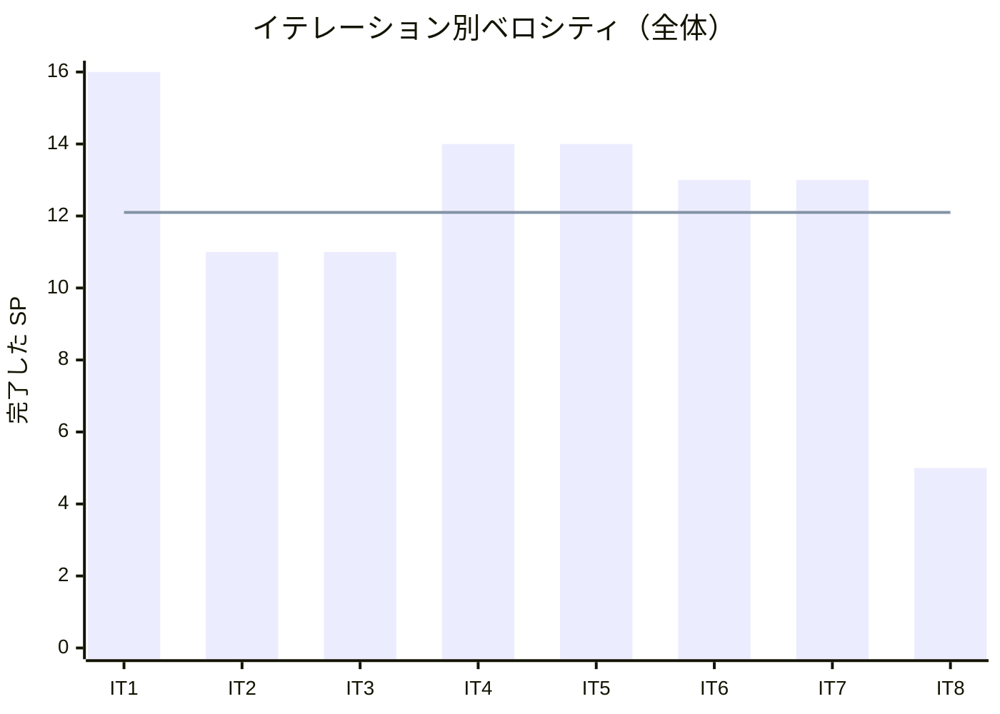

# リリース完了報告書 v1.1.0 - 国際貨物輸送管理システム（Rust 版）

**報告書作成日**: 2026-07-24

## 概要

国際貨物輸送管理システム（Rust 版）v1.1.0 のリリース完了報告書です。Release 1.1（例外対応・請求）は Phase 3（イテレーション 6-8）で 7 ユーザーストーリー・31 ストーリーポイントを 100% 達成し、Estimation Context の本格実装・Tracking 例外対応・Billing Context の完成（料金算出→法人割引→精算）により、DDD・ヘキサゴナル・CQRS アーキテクチャに基づく国際貨物輸送管理システムの全機能実装を完了しました（累計 97/97 SP・100%）。

---

## プロジェクトサマリー

| 項目 | 値 |
|------|-----|
| **リリース期間** | 2026-07-23 〜 2026-07-24（集中実装セッション・Phase 3） |
| **含むイテレーション** | IT6・IT7・IT8（3 イテレーション） |
| **ストーリーポイント（Release 1.1）** | 31 SP |
| **総コミット数（Phase 3）** | 58 |
| **総テスト数（システム全体）** | Rust 286 + E2E 31（うち Phase 3 E2E 8） |
| **ユーザーストーリー数（Release 1.1）** | 7（US01・US18・US19・US20・US21・US22・US23） |
| **累計進捗（プロジェクト全体）** | 97/97 SP（100%）・26 US・8 IT・3 リリース |

---

## 計画と実績の差異分析

### イテレーション別達成状況（Release 1.1）

| イテレーション | リリース | 計画 SP | 実績 SP | 達成率 | 差異 |
|---------------|---------|---------|---------|--------|------|
| IT6 見積・照会・遅延例外 | Release 1.1 | 13 | 13 | 100% | 0 |
| IT7 破損紛失例外・料金・割引 | Release 1.1 | 13 | 13 | 100% | 0 |
| IT8 精算・安定化 | Release 1.1 | 5 | 5 | 100% | 0 |
| **合計** | | **31** | **31** | **100%** | **0** |

### リリース別達成状況（プロジェクト全体）

| リリース | 内容 | 計画 SP | 実績 SP | 達成率 |
|---------|------|---------|---------|--------|
| Release 0.1 Internal Alpha | 予約基盤（Phase 1・IT1） | 16 | 16 | 100% |
| Release 1.0 MVP | コア輸送フロー（Phase 2・IT2-5） | 50 | 50 | 100% |
| Release 1.1 例外対応・請求 | 見積・例外・精算（Phase 3・IT6-8） | 31 | 31 | 100% |
| **合計** | | **97** | **97** | **100%** |

### リリースバーンダウン

**分析結果**: 8 イテレーション連続で計画ラインと実績が完全一致した。Release 1.1（Phase 3）は IT6=13・IT7=13・IT8=5 SP を計画どおり消化し、残 SP を 0 に到達させた。初期ベロシティ推定（10-12 SP/IT）から相対見積もりで置いた計画が、8 IT を通じて一度もブレなかったことは、ストーリー分割と見積もりの妥当性を示す。

---

## 計画日程 vs 実績日数の差異分析

### イテレーション別日程比較

| IT | 計画期間 | 計画日数 | 実績期間 | 実績日数 | 短縮日数 | 短縮率 |
|----|---------|---------|----------|---------|---------|--------|
| 6 | Week 11-12 | 14 日 | 2026-07-23 | **1 日** | 13 日 | 92.9% |
| 7 | Week 13-14 | 14 日 | 2026-07-24 | **1 日** | 13 日 | 92.9% |
| 8 | Week 15-16 | 14 日 | 2026-07-24 | **1 日** | 13 日 | 92.9% |
| **合計** | **Week 11-16** | **42 日** | **2026-07-23〜24** | **2 日** | **40 日** | **95.2%** |

> 実績日数は AI エージェント駆動の集中実装セッションによるもの。計画は人間チームの標準ペース（2 週間/IT）を前提としており、実績はカレンダー 2 日に凝縮された。

### 工期短縮の可視化

```mermaid
xychart-beta
    title "計画日数 vs 実績日数（Phase 3）"
    x-axis ["IT6", "IT7", "IT8"]
    y-axis "日数" 0 --> 14
    bar "計画" [14, 14, 14]
    bar "実績" [1, 1, 1]
```

### 計画 vs 実績ガントチャート

#### 当初計画スケジュール

#### 実績スケジュール

### サマリー

| 指標 | 値 |
|------|-----|
| **計画総日数** | 42 日 |
| **実績総日数** | 2 日 |
| **短縮日数** | 40 日 |
| **短縮率** | **95.2%** |
| **効率倍率** | **21 倍** |

### 差異分析

1. **アウトサイドインの効果**: Phase 3 は終盤（アウトサイドイン）局面で、中盤までに実装済みの各集約（Booking/Routing/Tracking/Handling/Shipper）を業務シナリオ起点で束ねる作業が中心だった。既存部品の再利用により実装量が抑えられた。
2. **BC 独立と ACL パターンの安定化**: IT3 以降で確立した ACL パターン（domain クレートは他 BC を直接参照せず app 層 ACL 経由）を Estimation・Billing でも踏襲し、新規 Bounded Context 追加時の設計判断コストが低減した。
3. **クローズ前レビューの負債抑制**: 各 IT で 5 視点マルチパースペクティブレビューを実施し高優先度指摘をクローズ前に返済したため、後続 IT への手戻りがなかった。

### 工期短縮の要因分析

| 要因 | 説明 |
|------|------|
| コンパイラによる境界強制 | cargo workspace のクレート分割で BC 独立・ヘキサゴナル境界を `cargo build` の成否として機械検証。ArchUnit 相当の事後検証が不要 |
| 型による不変条件表現 | newtype・網羅的 match・Result でドメインの不正状態を型レベル排除し、テストすべき状態空間を縮小 |
| TDD の一貫適用 | Red-Green-Refactor で金額計算・状態遷移をユニットに固定し、リグレッションを即検出 |

---

## コミットログ分析

### コミットプリフィックス別内訳（Phase 3・58 コミット）

| プリフィックス | 件数 | 割合 | 説明 |
|---------------|------|------|------|
| docs | 23 | 39.7% | ドキュメント更新（計画・レビュー・ふりかえり・報告書・設計反映） |
| feat | 22 | 37.9% | 新機能追加（見積・例外・料金・割引・精算） |
| fix | 6 | 10.3% | バグ修正（レビュー高優先度対応・E2E 期待値） |
| test | 5 | 8.6% | テスト追加（E2E・統合） |
| refactor | 1 | 1.7% | リファクタリング |
| chore | 1 | 1.7% | 保守作業（cargo audit/deny 設定） |
| **合計** | **58** | **100%** | |

### コミットプリフィックス別パイチャート

### 分析

1. **feat と docs がほぼ拮抗（37.9% と 39.7%）**: 実装と同量のドキュメント更新が行われ、計画・レビュー・ふりかえり・報告書・設計反映が各 IT で継続された。ドキュメント駆動の規律が保たれている。
2. **fix が 10.3%**: バグ修正の大半はクローズ前レビュー指摘への対応（charge_id 再算出・CheckOverdue 未配線など）で、リリース後の障害ではなくクローズ前の品質作り込みによるもの。
3. **feat の内訳は Billing Context に集中**: FreightCharge・Money・DiscountRate・Invoice・Payment と、Estimation の Estimate 集約が新規実装の中心。

---

## 品質メトリクス

### テストカバレッジ

| 対象 | 目標 | 実績 | 判定 |
|------|------|------|------|
| ドメイン層 | 85% | 85% 以上（CI coverage gate 通過） | ✅ |
| バックエンド全体 | 80% | CI ゲート通過 | ✅ |

### テスト数のリリース別推移（システム全体・累積）

| リリース | Rust（単体+統合） | E2E | 合計 |
|---------|------------------|-----|------|
| Release 0.1（IT1） | IT1 分 | 6 | — |
| Release 1.0（IT2-5） | 累積 | 21 | — |
| Release 1.1（IT6-8） | **286** | **31** | **317** |

### 静的解析

| 指標 | 結果 |
|------|------|
| clippy（`-D warnings`） | クリーン（`+stable` 1.97.1・CI 同一ツールチェーン） |
| rustfmt（`--check`） | 準拠 |
| cargo audit | 緑（推移的アドバイザリ 3 件を本番非露出の根拠付きで ignore） |
| cargo deny check advisories | 緑 |
| Flaky テスト率 | 0（testcontainers・wiremock で決定的） |

### ベロシティ

| 項目 | 値 |
|------|-----|
| 平均ベロシティ | 12.1 SP/イテレーション |
| 最大ベロシティ | 16 SP（IT1） |
| 最小ベロシティ | 5 SP（IT8・予備イテレーション） |

---

## リリース履歴

| リリース | 含まれる IT | リリース日 | SP | 状態 |
|---------|-----------|-----------|-----|------|
| Release 0.1 Internal Alpha | IT1 | Phase 1 完了 | 16 | 完了 |
| Release 1.0 MVP | IT2-5 | Phase 2 完了 | 50 | 完了 |
| Release 1.1 例外対応・請求 | IT6-8 | 2026-07-24 | 31 | **完了** |

---

## 主要な成果物

### 実装した主要機能

1. **輸送見積・追跡照会・遅延例外**（Release 1.1 / IT6）

     - Estimation Context をスケルトンから本格実装（`Estimate` 集約・ルート概算候補算出）。輸送見積作成（US01）
     - 認証不要の公開追跡ページで現在状態・位置・履歴・推定到着日を照会（US18）
     - Tracking 例外イベント導入・遅延例外処理と荷主通知・対応報告（US19）

2. **破損紛失例外・輸送料金算出・法人割引**（Release 1.1 / IT7）

     - ExceptionType を破損・紛失へ拡張し、紛失は管理職へ緊急エスカレーション（US20）
     - Billing Context 本格実装（`FreightCharge` 集約・`Money`・`DiscountRate`）。引取済予約の輸送料金算出（US21）
     - 法人割引の自動適用（Shipper ACL 経由で契約割引率取得・個人は無割引・US22）

3. **精算処理**（Release 1.1 / IT8）

     - Billing Context 完成（`Invoice` 集約・`Payment`・消費税10%）。精算書発行→荷主通知→決済機関連携で入金確認→精算済／予約 Settled→精算完了通知、期限超過→未払い通知（US23）
     - 決済機関連携 ACL（reqwest）と wiremock 契約テスト

### 技術的成果

| 成果 | 内容 |
|------|------|
| テスト駆動開発 | Rust 286 テスト（単体+統合）+ E2E 31・ドメイン層カバレッジ 85% |
| DDD + ヘキサゴナル + CQRS | 8 Bounded Context を独立クレートで実装。BC 独立を Cargo.toml でコンパイル時強制。Billing→Booking の精算連携も ACL 経由で BC 独立を維持 |
| ADR による意思決定記録 | Release 1.1 で ADR-0007〜0010 を起票（Estimation ACL・公開ルート認可・料金/精算書段階分割・Money の BC ローカル定義） |
| 外部連携の契約テスト | 決済機関を PaymentGatewayPort ACL に隔離し wiremock で契約検証（正常/失敗/未確認） |
| CI/CD | GitHub Actions で fmt+clippy・単体/統合テスト（testcontainers）・coverage gate（85%）を必須ゲート化 |

---

## 総評

国際貨物輸送管理システム（Rust 版）v1.1.0 は、Release 1.1（Phase 3）で 31 SP を 3 イテレーションで 100% 達成し、Estimation・Tracking 例外・Billing の全機能を実装して **Billing Context を完成**させた。これによりプロジェクト全体（累計 97/97 SP・100%・26 US・8 IT・3 リリース）の全機能実装が完了した。

### ハイライト

- **Release 1.1 の全 7 ユーザーストーリー完了**: 見積・公開追跡照会・遅延/破損/紛失例外・料金算出・法人割引・精算までの請求業務フローを実装
- **Rust 286 + E2E 31 テストによる品質保証**: 単体（ドメイン・アプリ）+ 統合（testcontainers 実 PostgreSQL）+ 契約（wiremock）+ E2E（Playwright）の多層テスト
- **ドメイン層 85% カバレッジ**: CI coverage gate を通過。型による不変条件表現で実行時分岐そのものを削減
- **3 段階リリース戦略の成功**: Internal Alpha（予約基盤）→ MVP（コア輸送）→ 例外対応・請求 の段階的リリースで、各段階で単独の価値を提供
- **8 IT 連続でベロシティが計画と完全一致**: 見積もりの妥当性とアウトサイドイン・ACL パターンの安定性

### プロジェクト完了メトリクス

| 指標 | 値 |
|------|-----|
| **総ストーリーポイント** | 97 SP |
| **総コミット数（Phase 3）** | 58 |
| **総テスト数** | Rust 286 + E2E 31 = 317 |
| **テストカバレッジ（ドメイン層）** | 85% |
| **リリース回数** | 3（Release 0.1 / 1.0 / 1.1） |
| **イテレーション回数** | 8 |
| **ユーザーストーリー数** | 26 |

### GA に向けた残作業（Release 1.2 バックログ）

- 実決済 ACL（ReqwestPaymentGateway）の本番結線・CheckOverdue の定期バッチ自動化（IT8 user-rep 指摘・現状は手動導線）
- per-handler DI の composition root 整理・rank 一元化・dashboard 拡充・通知 SMTP 実配信・reconstruct の InvoiceId 恒常化

---

**リリース完了** - Simple made easy.
