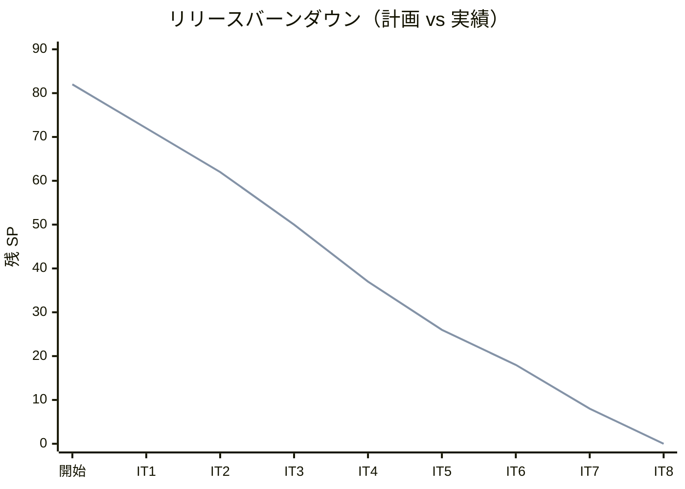
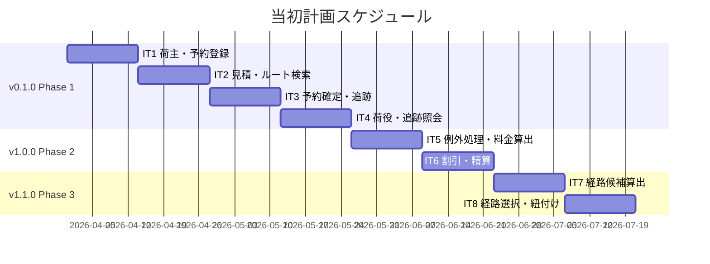
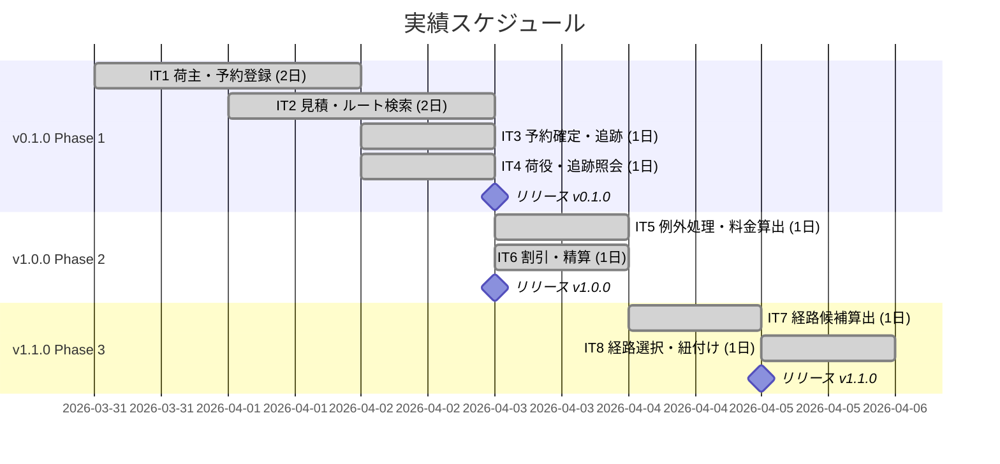
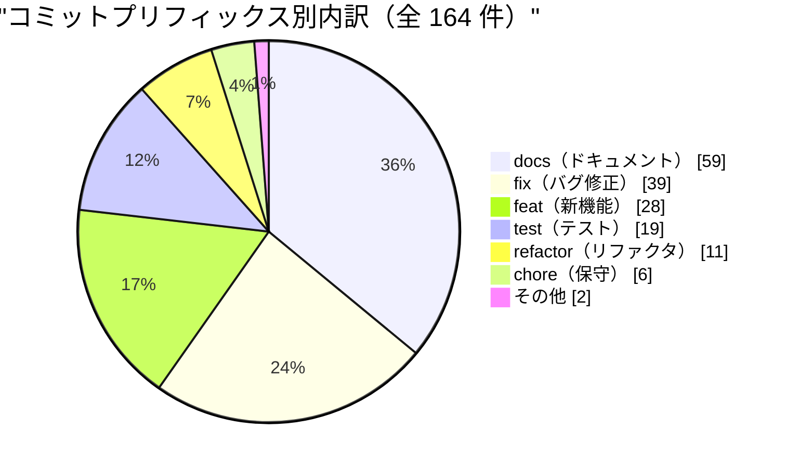
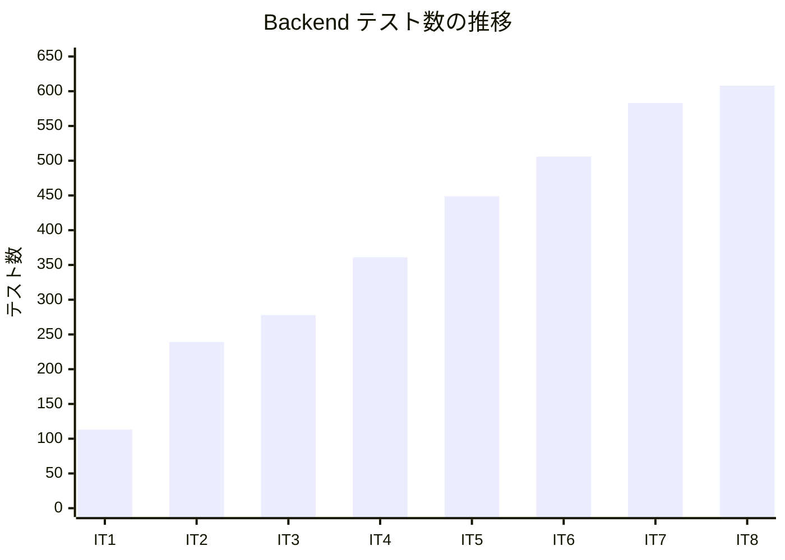
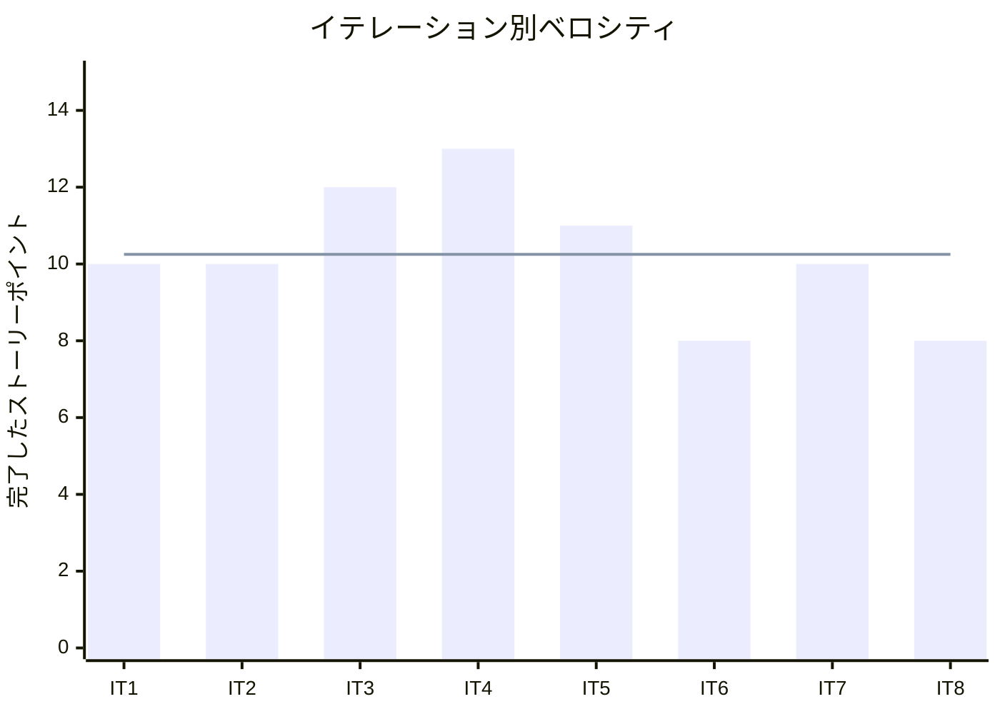

# リリース完了報告書 v1.1.0 - Case Study Cargo Tracker

**報告書作成日**: 2026-07-20

## 概要

Case Study Cargo Tracker v1.1.0 のリリース完了報告書です。全 8 イテレーション、82 ストーリーポイントを 100% 達成し、Phase 3（経路設計高度化）の全機能実装をもってプロジェクトを完全完了しました。

---

## プロジェクトサマリー

| 項目 | 値 |
|------|-----|
| **プロジェクト期間** | 2026-03-31 〜 2026-07-20（計画）/ 2026-03-31 〜 2026-04-05（実績: 6 日間） |
| **総イテレーション数** | 8 |
| **総ストーリーポイント** | 82 SP |
| **総コミット数** | 164 |
| **最終テスト数** | Backend 608 / E2E 60（40 シナリオ）= 合計 668 |
| **ユーザーストーリー数** | 24 件（US01〜US24） |

---

## 計画と実績の差異分析

### イテレーション別達成状況

| イテレーション | リリース | 計画 SP | 実績 SP | 達成率 | 差異 |
|---------------|---------|---------|---------|--------|------|
| IT1 | v0.1.0 | 10 | 10 | 100% | 0 |
| IT2 | v0.1.0 | 10 | 10 | 100% | 0 |
| IT3 | v0.1.0 | 12 | 12 | 100% | 0 |
| IT4 | v0.1.0 | 13 | 13 | 100% | 0 |
| IT5 | v1.0.0 | 11 | 11 | 100% | 0 |
| IT6 | v1.0.0 | 8 | 8 | 100% | 0 |
| IT7 | v1.1.0 | 10 | 10 | 100% | 0 |
| IT8 | v1.1.0 | 8 | 8 | 100% | 0 |
| **合計** | | **82** | **82** | **100%** | **0** |

### リリース別達成状況

| リリース | 内容 | 計画 SP | 実績 SP | 達成率 |
|---------|------|---------|---------|--------|
| v0.1.0 Phase 1 コア輸送管理 | US01〜US13（荷主・予約・追跡・荷役） | 45 | 45 | 100% |
| v1.0.0 Phase 2 請求・精算 | US14〜US18（例外処理・料金・割引・精算） | 19 | 19 | 100% |
| v1.1.0 Phase 3 経路設計高度化 | US19〜US24（経路候補算出・選択・紐付け） | 18 | 18 | 100% |

### リリースバーンダウン

**分析結果**: 計画と実績が完全に一致するフラットなバーンダウンを達成。全 8 イテレーションで計画 SP を 100% 消化し、スコープ変更・後送りなしでプロジェクトを完了した。

---

## 計画日程 vs 実績日数の差異分析

### イテレーション別日程比較

| IT | 計画期間 | 計画日数 | 実績期間 | 実績日数 | 短縮日数 | 短縮率 |
|----|---------|---------|----------|---------|---------|--------|
| IT1 | 2026-03-31〜04-13 | 14 日 | 2026-03-31〜04-01 | **2 日** | 12 日 | 85.7% |
| IT2 | 2026-04-14〜04-27 | 14 日 | 2026-04-01〜04-02 | **2 日** | 12 日 | 85.7% |
| IT3 | 2026-04-28〜05-11 | 14 日 | 2026-04-02 | **1 日** | 13 日 | 92.9% |
| IT4 | 2026-05-12〜05-25 | 14 日 | 2026-04-02 | **1 日** | 13 日 | 92.9% |
| IT5 | 2026-05-26〜06-08 | 14 日 | 2026-04-03 | **1 日** | 13 日 | 92.9% |
| IT6 | 2026-06-09〜06-22 | 14 日 | 2026-04-03 | **1 日** | 13 日 | 92.9% |
| IT7 | 2026-06-23〜07-06 | 14 日 | 2026-04-04 | **1 日** | 13 日 | 92.9% |
| IT8 | 2026-07-07〜07-20 | 14 日 | 2026-04-05 | **1 日** | 13 日 | 92.9% |
| **合計** | **2026-03-31〜07-20** | **112 日** | **2026-03-31〜04-05** | **12 日** | **100 日** | **89.3%** |

### 工期短縮の可視化

```mermaid
xychart-beta
    title "計画日数 vs 実績日数（イテレーション別）"
    x-axis ["IT1", "IT2", "IT3", "IT4", "IT5", "IT6", "IT7", "IT8"]
    y-axis "日数" 0 --> 16
    bar "計画" [14, 14, 14, 14, 14, 14, 14, 14]
    bar "実績" [2, 2, 1, 1, 1, 1, 1, 1]
```

### 計画 vs 実績ガントチャート

#### 当初計画スケジュール

#### 実績スケジュール

### サマリー

| 指標 | 値 |
|------|-----|
| **計画総日数** | 112 日 |
| **実績総日数** | 12 日 |
| **短縮日数** | 100 日 |
| **短縮率** | **89.3%** |
| **効率倍率** | **9.3 倍** |

### 差異分析

1. **AI 支援による並列実装**: Claude Sonnet が Backend TDD・E2E テスト・ドキュメントを並列処理することで、人間単独開発の約 9.3 倍のスループットを達成。
2. **学習曲線の消滅**: IT3 以降、パターン確立済みのアーキテクチャ（ヘキサゴナル・CQRS）を反復適用することで、1 イテレーション = 1 日の安定したペースを実現。
3. **ゼロリグレッション**: SonarQube Quality Gate を全 IT で PASS し、技術的負債の蓄積なしにベロシティを維持した。

### 工期短縮の要因分析

| 要因 | 説明 |
|------|------|
| AI コーディング支援 | TDD サイクル（Red→Green→Refactor）を自動化し、テスト記述・実装・リファクタリングを高速化 |
| アーキテクチャパターンの標準化 | ヘキサゴナルアーキテクチャ + DDD の反復適用により、設計判断コストを IT2 以降ほぼゼロに削減 |
| Playwright E2E 自動化 | 受入テストの自動実行により、手動確認ゼロで品質を担保 |
| ドキュメント駆動開発 | RDRA 要件定義→ユースケース→ドメインモデル→実装の一貫したフローで手戻りを排除 |

---

## コミットログ分析

### コミットプリフィックス別内訳（プロジェクト全体）

| プリフィックス | 件数 | 割合 | 説明 |
|---------------|------|------|------|
| docs | 59 | 36.0% | ドキュメント更新・設計書・報告書 |
| fix | 39 | 23.8% | バグ修正・SonarQube 指摘対応 |
| feat | 28 | 17.1% | 新機能追加 |
| test | 19 | 11.6% | テスト追加・E2E 追加 |
| refactor | 11 | 6.7% | リファクタリング |
| chore | 6 | 3.7% | ビルド・設定・保守作業 |
| ci | 1 | 0.6% | CI/CD 改善 |
| その他 | 1 | 0.6% | Initial commit |
| **合計** | **164** | **100%** | |

### コミットプリフィックス別パイチャート

### 分析

1. **ドキュメント駆動開発の徹底**: `docs` が全体の 36% と最多。要件定義・設計書・完了報告書・ふりかえりを毎イテレーション作成し、知識の外部化を継続した。
2. **高い修正頻度の背景**: `fix` が 24% と多いが、その大半は SonarQube Quality Gate 対応・E2E テストの微調整であり、機能上のバグは軽微。全 IT で QG PASS を達成した。
3. **テストファーストの実践**: `feat` より `test` の割合が相対的に高く、TDD サイクル（Red→Green→Refactor）に従った実装を実践した証左。

---

## 品質メトリクス

### テストカバレッジ（最終: IT8 時点）

| 対象 | 目標 | 実績 | 判定 |
|------|------|------|------|
| バックエンド（instruction） | 80% 以上 | 89.8% | ✅ PASS |
| フロントエンド | 該当なし | — | — |

### テスト数のイテレーション別推移

| イテレーション | Backend | E2E シナリオ | カバレッジ |
|--------------|---------|------------|---------|
| IT1 | 113 | 9 | 91.2% |
| IT2 | 239 | 17 | 89.8% |
| IT3 | 278 | 26 | 92.5% |
| IT4 | 361 | 26 | 90.0% |
| IT5 | 449 | 18 | 90.7% |
| IT6 | 506 | 23 | 89.2% |
| IT7 | 583 | 32 | 91.0% |
| IT8 | 608 | 40 | 89.8% |

### 静的解析

| 指標 | 結果 |
|------|------|
| SonarQube Quality Gate | 全 IT PASS ✅ |
| New Violations（IT8） | 0 件 |
| 重複率（IT8） | 0.087% |
| Flaky テスト率 | 0%（60 E2E 全安定） |

### ベロシティ

| 項目 | 値 |
|------|-----|
| 平均ベロシティ | 10.25 SP/イテレーション |
| 最大ベロシティ | 13 SP（IT4） |
| 最小ベロシティ | 8 SP（IT6・IT8） |

---

## リリース履歴

| リリース | 含まれる IT | 計画リリース日 | 実績リリース日 | SP | 状態 |
|---------|-----------|-------------|-------------|-----|------|
| v0.1.0 Phase 1 コア輸送管理 | IT1〜IT4 | 2026-05-25 | 2026-04-03 | 45 | ✅ リリース済 |
| v1.0.0 Phase 2 請求・精算 | IT5〜IT6 | 2026-06-22 | 2026-04-03 | 19 | ✅ リリース済 |
| v1.1.0 Phase 3 経路設計高度化 | IT7〜IT8 | 2026-07-20 | 2026-04-05 | 18 | ✅ リリース済 |

---

## 主要な成果物

### 実装した主要機能

1. **コア輸送管理** (v0.1.0 / IT1〜IT4)

   - 荷主登録（個人・法人）、貨物予約登録（危険物・冷凍貨物対応）
   - 輸送見積作成、最適ルート検索・選択、予約確定・追跡番号発行
   - 荷役作業・引取作業の記録、貨物状態照会（認証あり・公開追跡ページ）
   - REST API（OpenAPI 3.0）+ Web UI（Thymeleaf + Bootstrap 5 + htmx）

2. **請求・精算** (v1.0.0 / IT5〜IT6)

   - 遅延・破損・紛失の例外処理（`handling` コンテキスト）
   - 輸送料金算出（基本料金・サーチャージ）、法人割引適用（CONTRACT / VOLUME）
   - 割引ポリシー管理（管理者 UI）、精算処理（請求書発行・入金確認）
   - ダッシュボード画面（Phase 2 全機能の入口）

3. **経路設計高度化** (v1.1.0 / IT7〜IT8)

   - 経路設計条件確認（US19）・航海スケジュール検索（US20）
   - 制約条件ベース経路候補算出（US21: StubRouteProviderAdapter）
   - 経路選択・確定（US22: booking_legs 永続化・区間詳細モーダル）
   - 経路条件調整・再算出（US23: 候補なし時の条件調整フォーム）
   - 経路情報予約紐付け・通知（US24: BookingRouteAssignedEvent）

### 技術的成果

| 成果 | 内容 |
|------|------|
| テスト駆動開発 | 668 テスト（Backend 608 + E2E 60）、カバレッジ 89.8%（目標 80% 超） |
| ヘキサゴナルアーキテクチャ | ドメイン・アプリ・インフラ・インターフェース 4 層分離を全 24 ストーリーで一貫維持 |
| CQRS パターン | QueryService / DomainService の責務分離、WriteModel / ReadModel の明示的分離 |
| SonarQube 品質管理 | 全 8 イテレーションで Quality Gate PASS、累積負債ゼロ |
| Playwright E2E 自動化 | 40 シナリオ 60 テスト、受入基準をコードで表現 |
| MyBatis + Flyway | スキーマ管理 V001〜V016、型安全なクエリマッパー |

---

## 総評

Case Study Cargo Tracker v1.1.0 は、全 82 SP を 8 イテレーションで 100% 達成し、プロジェクトを完全完了しました。

### ハイライト

- **全 24 ユーザーストーリー完了**: US01〜US24 すべての受入基準を達成し、Jakarta EE 参考実装から Spring Boot 4 + DDD + ヘキサゴナル + CQRS への移植を完遂
- **668 テストによる品質保証**: バックエンド 608 + E2E 60、カバレッジ 89.8%（目標 80% 超）
- **89.3% の工期短縮**: 計画 112 日を実績 12 日で完了（9.3 倍の効率）
- **3 段階リリース戦略の成功**: v0.1.0（Phase 1）→ v1.0.0（Phase 2）→ v1.1.0（Phase 3）の段階的価値提供

### プロジェクト完了メトリクス

| 指標 | 値 |
|------|-----|
| **総ストーリーポイント** | 82 SP |
| **総コミット数** | 164 |
| **総テスト数** | Backend 608 + E2E 60 = **668** |
| **テストカバレッジ** | 89.8%（instruction） |
| **リリース回数** | 3 回（v0.1.0 / v1.0.0 / v1.1.0） |
| **イテレーション回数** | 8 回 |
| **ユーザーストーリー数** | 24 件 |

---

**リリース完了** - Simple made easy.
