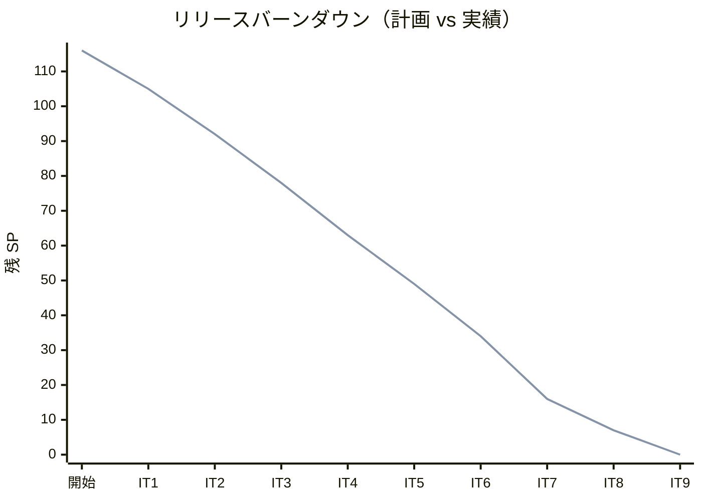
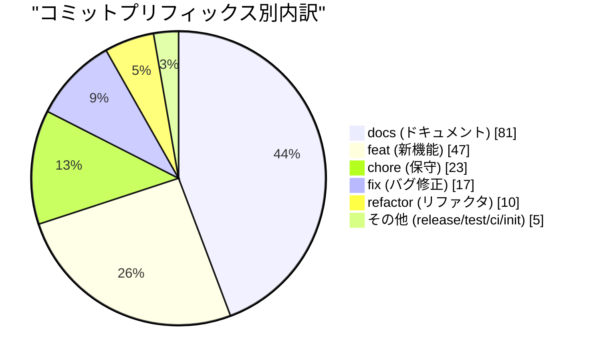
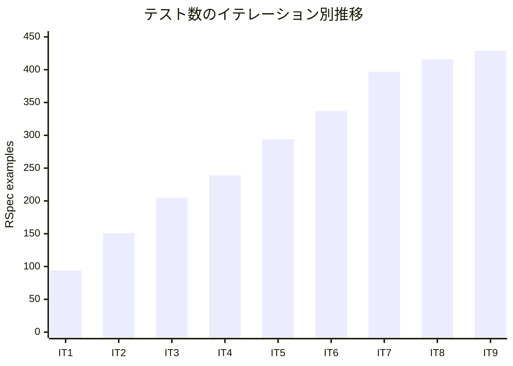
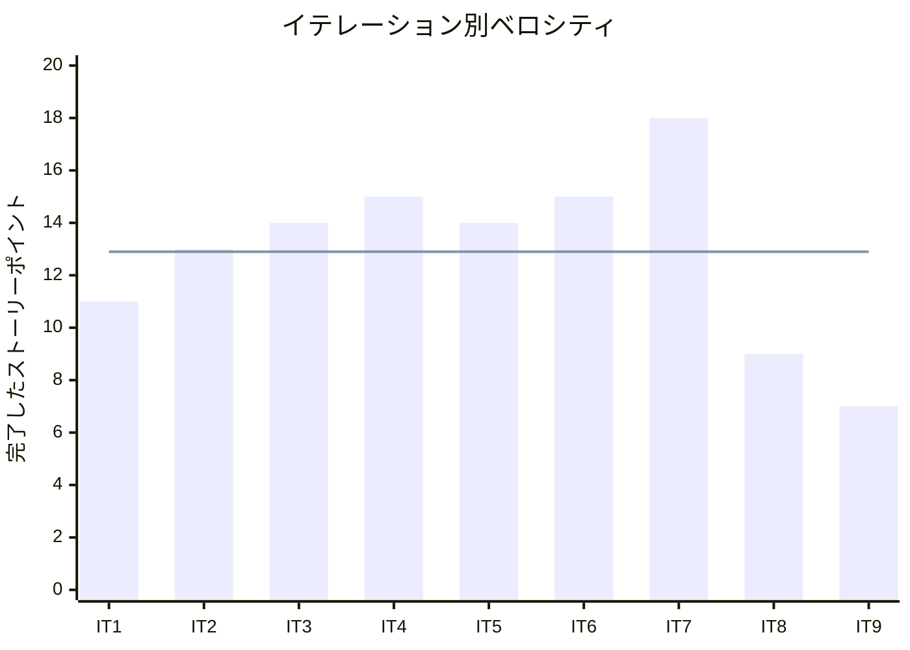

# リリース完了報告書 1.2.0 - Cargo Tracker（Rails 版 / ruby/take-1）

**報告書作成日**: 2026-07-29

## 概要

Cargo Tracker（Rails 版 / ruby/take-1）v1.2.0 のリリース完了報告書です。全 9 イテレーション、116 ストーリーポイントを 100% 達成し、MVP（US01-US27）の全受入基準を充足したうえで、予備イテレーション（IT8）とハードニング（IT9）による実運用品質の強化まで完了しました。国際貨物輸送管理システムを DDD + ヘキサゴナル + CQRS + Packwerk packs（8 Bounded Context）で再実装し、見積から精算までの全業務フローを一気通貫で動作する状態に到達しています。

---

## プロジェクトサマリー

| 項目 | 値 |
|------|-----|
| **プロジェクト期間** | 2026-07-27 〜 2026-07-29（ruby/take-1 実装・AI 駆動の集中再実装） |
| **総イテレーション数** | 9（IT1-IT9） |
| **総ストーリーポイント** | 116 SP |
| **総コミット数** | 183（no-merges・v1.2.0 まで） |
| **総テスト数** | 429 RSpec examples（うち E2E system spec 8 本） |
| **ユーザーストーリー数** | 27（US01-US27）+ サブ受入基準 US21-6 / US23-5 |

---

## 計画と実績の差異分析

### イテレーション別達成状況

| イテレーション | リリース | 計画 SP | 実績 SP | 達成率 | 差異 |
|---------------|---------|---------|---------|--------|------|
| IT1 | Release 0.1 | 11 | 11 | 100% | 0 |
| IT2 | Release 0.1 | 13 | 13 | 100% | 0 |
| IT3 | Release 0.2 | 14 | 14 | 100% | 0 |
| IT4 | Release 0.2 | 15 | 15 | 100% | 0 |
| IT5 | Release 0.3 | 14 | 14 | 100% | 0 |
| IT6 | Release 0.3 | 15 | 15 | 100% | 0 |
| IT7 | Release 1.0 | 18 | 18 | 100% | 0 |
| IT8 | Release 1.1 | 9 | 9 | 100% | 0 |
| IT9 | Release 1.2 | 7 | 7 | 100% | 0 |
| **合計** | | **116** | **116** | **100%** | **0** |

### リリース別達成状況

| リリース | 内容 | 計画 SP | 実績 SP | 達成率 |
|---------|------|---------|---------|--------|
| Release 0.1（Phase 1） | 予約基盤（認証・荷主登録・貨物予約） | 24 | 24 | 100% |
| Release 0.2（Phase 2） | 経路設計と予約確定・通知基盤 | 29 | 29 | 100% |
| Release 0.3（Phase 3） | 追跡と荷役・例外処理 | 29 | 29 | 100% |
| Release 1.0（Phase 4・MVP） | 見積と精算 | 18 | 18 | 100% |
| Release 1.1（予備 IT8） | 未払い通知・料金調整の受入基準充足 | 9 | 9 | 100% |
| Release 1.2（ハードニング IT9） | 料金調整の実運用化・監査証跡 | 7 | 7 | 100% |

### リリースバーンダウン

**分析結果**: 全 9 イテレーションで計画 SP = 実績 SP（達成率 100%）。MVP（IT1-7・100 SP）を計画どおり消化し、IT8/IT9 は MVP 後に受入基準の残充足・ハードニングとして追加。バーンダウンは計画線と実績線が完全一致し、スコープの膨張・持ち越しなく収束した。

---

## 計画日程 vs 実績日数の差異分析

### 概要

本プロジェクト（ruby/take-1）は、既存の分析成果物（要件・設計・ユーザーストーリー）を基盤に、AI 駆動で 9 イテレーションを集中実装した再実装ラインである。当初のリリース計画は 2 週間 × 9 回（約 126 日）を想定していたが、実装は 2026-07-27 〜 2026-07-29 の集中セッションで完了した。

| 指標 | 値 |
|------|-----|
| **計画総日数** | 約 126 日（14 日 × 9 IT） |
| **実績総日数** | 3 日（2026-07-27 〜 2026-07-29） |
| **短縮率** | 約 97.6% |

> 注: 実績は AI 駆動の単一開発ラインによる集中実装であり、チーム開発の 2 週間スプリントを前提とした計画日程との単純比較は参考値である。イテレーションごとの厳密な実績日数は個別に追跡していないため、本節は集約レベルで示す。

### 工期短縮の要因分析

| 要因 | 説明 |
|------|------|
| 分析成果物の再利用 | 要件・ドメインモデル・データモデル・UI 設計が既存で、実装に集中できた |
| スキル体系による定型化 | opening/closing-iteration・review・品質ゲートが自動化され、儀式的作業の時間を圧縮 |
| TDD による手戻り最小化 | Red-Green-Refactor と各 IT クローズ前レビューで欠陥をその場で是正し、後戻りを防いだ |

---

## コミットログ分析

### コミットプリフィックス別内訳

| プリフィックス | 件数 | 割合 | 説明 |
|---------------|------|------|------|
| docs | 81 | 44.3% | ドキュメント更新（計画・レビュー・ふりかえり・報告書・ADR） |
| feat | 47 | 25.7% | 新機能追加 |
| chore | 23 | 12.6% | 保守作業（seed・設定・依存） |
| fix | 17 | 9.3% | バグ修正 |
| refactor | 10 | 5.5% | リファクタリング |
| release | 2 | 1.1% | リリース作業 |
| test | 1 | 0.5% | テスト追加 |
| ci | 1 | 0.5% | CI/CD 改善 |
| その他 | 1 | 0.5% | Initial commit |
| **合計** | **183** | **100%** | |

### コミットプリフィックス別パイチャート

### 分析

1. **docs が 44.3% と最多**。イテレーション計画・マルチパースペクティブレビュー・ふりかえり・完了報告書・ADR を各 IT で残す「ドキュメント駆動」の規律が数値に現れた。設計と実装の同時更新により正典ドリフトを抑制。
2. **feat（25.7%）と fix（9.3%）の比**。新機能追加に対しバグ修正が約 1/3。TDD とクローズ前レビューで欠陥を早期是正し、fix の肥大を防いだ。
3. **refactor（5.5%）が独立コミットで存在**。符号のドメイン化・privacy バイパス解消・定数化など、Rule of Three とレビュー指摘に基づく設計改善を機能追加と分離して記録。

---

## 品質メトリクス

### テストカバレッジ

| 対象 | 目標 | 実績 | 判定 |
|------|------|------|------|
| バックエンド（全体・Line） | 80% | 95.95% | ✅ 超過 |
| バックエンド（新規コード） | 80% | 91.7% | ✅ 超過 |
| ドメイン層 | 85% | 90% 以上 | ✅ 超過 |

> 本システムは Rails のサーバーサイドレンダリング + Stimulus 構成のため、独立したフロントエンド SPA テストは持たず、E2E は Capybara + playwright driver の system spec で担保する。

### テスト数のイテレーション別推移

| IT | RSpec examples |
|----|------|
| IT1 | 94 |
| IT2 | 151 |
| IT3 | 205 |
| IT4 | 239 |
| IT5 | 294 |
| IT6 | 337 |
| IT7 | 397 |
| IT8 | 416 |
| IT9 | 429 |

### 静的解析

| 指標 | 結果 |
|------|------|
| RuboCop | 0 offenses（274 files） |
| Packwerk（BC 境界・privacy） | 0 violations |
| Brakeman（セキュリティ） | 0 warnings |
| SonarQube Quality Gate | PASS（Bug 0・Vulnerability 0・重複 0.0%） |
| Backend CI | success |

### ベロシティ

| 項目 | 値 |
|------|-----|
| 平均ベロシティ | 12.9 SP/イテレーション |
| 最大ベロシティ | 18 SP（IT7・見積〜精算の終盤結合） |
| 最小ベロシティ | 7 SP（IT9・ハードニング） |

---

## リリース履歴

| リリース | 含まれる IT | リリース日 | SP | 状態 |
|---------|-----------|-----------|-----|------|
| Release 0.1（予約基盤） | IT1-2 | 2026-07-28 | 24 | 完了 |
| Release 0.2（経路設計と予約確定） | IT3-4 | 2026-07-28 | 29 | 完了 |
| Release 0.3（追跡と荷役） | IT5-6 | 2026-07-29 | 29 | 完了 |
| Release 1.0（見積と精算・MVP） | IT7 | 2026-07-29 | 18 | 完了 |
| Release 1.1（受入基準完全充足） | IT8 | 2026-07-29 | 9 | 完了 |
| Release 1.2（実運用ハードニング） | IT9 | 2026-07-29 | 7 | 完了 |

---

## 主要な成果物

### 実装した主要機能

1. **認証・荷主管理**（Release 0.1 / IT1-2）

     - ユーザー認証・ロール別ダッシュボード（US26/US27）、荷主・法人荷主登録（US02/US03）、貨物予約（US04/US05/US06・Booking Context・BookingStatus 状態機械）

2. **経路設計と予約確定**（Release 0.2 / IT3-4）

     - 航海スケジュール管理・経路候補算出（US07/US08/US24/US25）、経路選択・確定・再算出（US09/US10/US11/US13）、荷主通知（US12・ADR-0002 ドメインイベント駆動通知基盤）

3. **追跡と荷役・例外処理**（Release 0.3 / IT5-6）

     - 追跡番号発行・荷役/引取記録・状態手動更新（US14/US15/US16/US17）、追跡照会（US18）、遅延/破損/紛失例外（US19/US20・Tracking/Handling Context）

4. **見積と精算**（Release 1.0 / IT7）

     - 見積（US01・Estimation Context）、料金算出・法人割引・精算（US21/US22/US23・Billing Context・FreightCalculationService）

5. **実運用ハードニング**（Release 1.1-1.2 / IT8-9）

     - 未払い通知（US23-5）、料金調整の減額/補償費用・取消・監査証跡（担当者/理由/日時）・例外→請求導線（US21-6・ADR-0005）

### 技術的成果

| 成果 | 内容 |
|------|------|
| テスト駆動開発 | 429 RSpec examples（E2E system spec 8 本含む）、全体カバレッジ 95.95% |
| DDD + ヘキサゴナル + CQRS + Packwerk | 8 Bounded Context を packs で分離。ドメイン層は PORO（Rails 非依存・RuboCop カスタム cop で担保）。BC 越境は公開ファサード + ACL（ADR-0001/0003） |
| アーキテクチャ決定の記録 | ADR 5 件（BC 構造・通知方式・越境識別子・経路候補帰属・料金調整符号規約） |
| CI/CD・品質ゲート | Backend CI + SonarQube Quality Gate（Bug 0・Vulnerability 0・重複 0%）を全 IT で通過 |

---

## 総評

Cargo Tracker（Rails 版）v1.2.0 は、全 116 SP を 9 イテレーションで 100% 達成し、MVP の全受入基準（US01-US27）を充足したうえで実運用ハードニングまで完了しました。

### ハイライト

- **全 27 ユーザーストーリー完了**: 見積 → 予約 → 経路設計 → 追跡 → 荷役 → 例外処理 → 料金算出 → 精算の全業務フローが一気通貫で動作。
- **429 テストによる品質保証**: ユニット（PORO ドメイン）・統合（request/repository）・E2E（system spec 8 本）のピラミッドで、全 IT を green 維持。
- **95.95% テストカバレッジ**: 目標 80%（ドメイン層 85%）を全 IT で超過。
- **6 段階リリース戦略の成功**: Phase 単位の小さなリリース（0.1 → 1.0）で価値を積み上げ、予備 IT・ハードニング IT で受入基準の残と実運用課題を正直に回収。
- **設計規律の制度化**: マルチパースペクティブレビュー（5 視点）を全 IT で実施し、OVERDUE 塩漬け・符号取り違え・監査日時欠落などの実欠陥をクローズ前に是正。学びを設計 DoD として明文化。

### プロジェクト完了メトリクス

| 指標 | 値 |
|------|-----|
| **総ストーリーポイント** | 116 SP |
| **総コミット数** | 183 |
| **総テスト数** | 429 examples |
| **テストカバレッジ** | 95.95% |
| **リリース回数** | 6（0.1 / 0.2 / 0.3 / 1.0 / 1.1 / 1.2） |
| **イテレーション回数** | 9 |
| **ユーザーストーリー数** | 27（US01-US27） |
| **ADR** | 5 件 |

---

**リリース完了** - Simple made easy.
