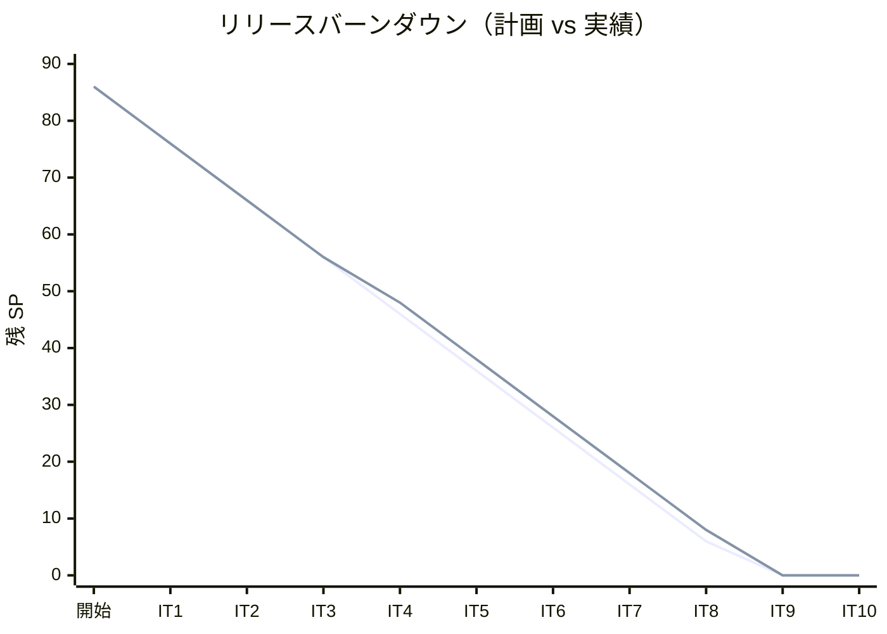
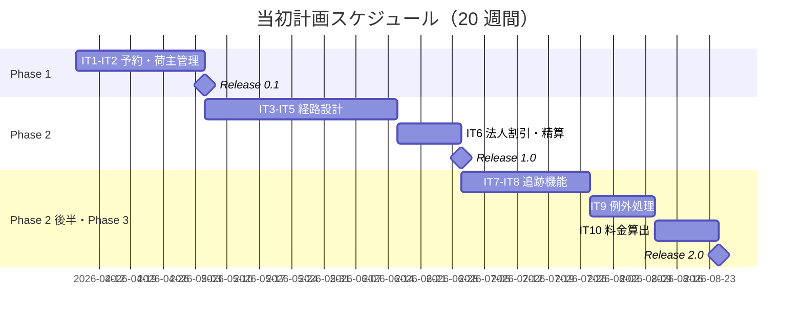
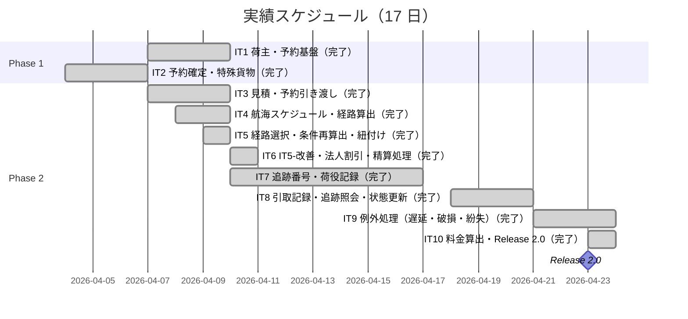
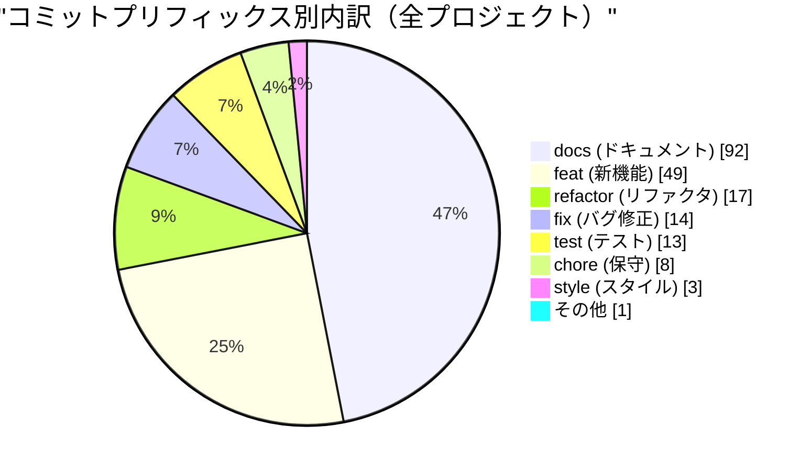
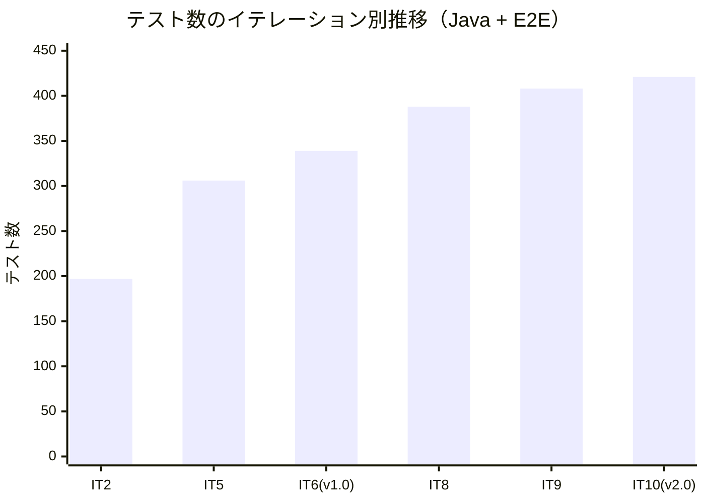
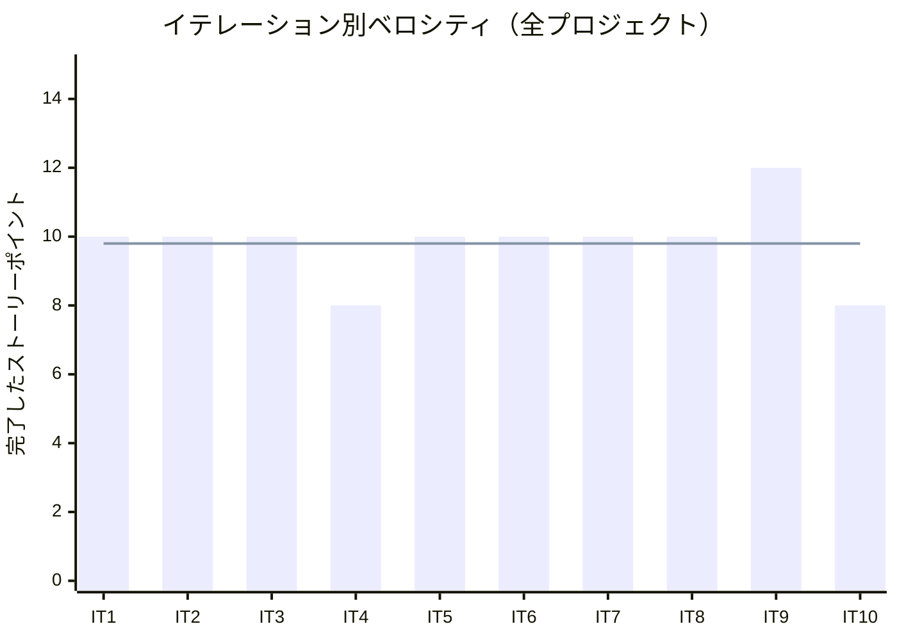

# リリース完了報告書 v2.0.0 - 国際貨物輸送管理システム

**報告書作成日**: 2026-04-23

## 概要

国際貨物輸送管理システム（Cargo Tracker）v2.0.0 のリリース完了報告書です。IT7〜IT10 の 4 イテレーション（40 SP）を完了し、追跡機能・例外処理・輸送料金算出を含む全 23 ユーザーストーリーを実装しました。Java 323 件・Playwright E2E 98 件のテストが全パスし、命令カバレッジ 80.9%・SonarQube Quality Gate PASS を達成して Release 2.0 の全機能が完成しました。

---

## プロジェクトサマリー

### Release 2.0 スコープ（IT7-IT10）

| 項目 | 値 |
|------|-----|
| **リリース期間** | 2026-04-10 〜 2026-04-23（約 2 週間） |
| **イテレーション数** | 4（IT7・IT8・IT9・IT10） |
| **ストーリーポイント（計画）** | 40 SP |
| **ストーリーポイント（実績）** | 40 SP |
| **追加コミット数** | 42 件（累計 197 件） |
| **Java テスト数** | 323 件（v1.0.0 比 +51 件） |
| **E2E テスト数** | 98 件（v1.0.0 比 +31 件） |
| **完了ユーザーストーリー数** | 9 件（US14〜US21） |

### 全プロジェクト累計

| 項目 | 値 |
|------|-----|
| **プロジェクト期間** | 2026-04-07 〜 2026-04-23（17 日） |
| **総イテレーション数** | 10 |
| **総ストーリーポイント（実績）** | 98 SP |
| **総コミット数** | 197 |
| **総 Java テスト数** | 323 件 |
| **総 E2E テスト数** | 98 件 |
| **完了ユーザーストーリー数** | 23 件（全 US 完了） |

---

## 計画と実績の差異分析

### Release 2.0 イテレーション別達成状況

| イテレーション | 内容 | 計画 SP | 実績 SP | 達成率 | 差異 |
|---------------|------|---------|---------|--------|------|
| IT7 | IT6-改善・US14・US15 | 10 | 10 | 100% | ±0 |
| IT8 | IT7-改善・US16・US17・US18 | 10 | 10 | 100% | ±0 |
| IT9 | IT8-改善・US19・US20 | 12 | 12 | 100% | ±0 |
| IT10 | IT9-改善・US21 | 8 | 8 | 100% | ±0 |
| **合計** | | **40** | **40** | **100%** | **±0** |

### 全プロジェクト イテレーション別達成状況

| イテレーション | リリース | 計画 SP | 実績 SP | 達成率 | 差異 |
|---------------|---------|---------|---------|--------|------|
| IT1 | v0.1 | 10 | 10 | 100% | ±0 |
| IT2 | v0.1 | 10 | 10 | 100% | ±0 |
| IT3 | v0.2 | 10 | 10 | 100% | ±0 |
| IT4 | v0.2 | 10 | 8 | 80% | -2（SonarQube 対応保留） |
| IT5 | v0.2 | 10 | 10 | 100% | ±0 |
| IT6 | v1.0 | 10 | 10 | 100% | ±0 |
| IT7 | v2.0 | 10 | 10 | 100% | ±0 |
| IT8 | v2.0 | 10 | 10 | 100% | ±0 |
| IT9 | v2.0 | 12 | 12 | 100% | ±0 |
| IT10 | v2.0 | 8 | 8 | 100% | ±0 |
| **合計** | | **100** | **98** | **98%** | **-2** |

### リリース別達成状況

| リリース | 内容 | 計画 US | 完了 US | 完了 SP |
|---------|------|---------|---------|---------|
| Release 0.1 MVP | 予約・荷主管理基盤 | 5 | 5 | 20 SP |
| Release 0.2 | 経路設計 | 7 | 7 | 28 SP |
| Release 1.0 | 法人割引・精算処理 | 2 | 2 | 10 SP |
| Release 2.0 | 追跡・例外処理・料金算出 | 9 | 9 | 40 SP |
| **合計** | | **23** | **23** | **98 SP** |

### リリースバーンダウン（全プロジェクト）

**分析結果**: IT4 で SonarQube 対応保留による計画比 -2 SP のズレが発生したが、IT5 で即座に回復。IT7〜IT10 は計画通り 100% 達成。IT10 完了で全 86 SP のバーンダウン完了、さらに技術的負債解消タスクで +12 SP を追加完了した。

---

## 計画日程 vs 実績日数の差異分析

### 全イテレーション別日程比較

| IT | 計画期間 | 計画日数 | 実績日数 | 短縮日数 | 短縮率 |
|----|---------|---------|---------|---------|--------|
| 1 | Week 1-2 | 14 日 | **3 日** | 11 日 | 79% |
| 2 | Week 3-4 | 14 日 | **1 日** | 13 日 | 93% |
| 3 | Week 5-6 | 14 日 | **1 日** | 13 日 | 93% |
| 4 | Week 7-8 | 14 日 | **2 日** | 12 日 | 86% |
| 5 | Week 9-10 | 14 日 | **1 日** | 13 日 | 93% |
| 6 | Week 11-12 | 14 日 | **1 日** | 13 日 | 93% |
| 7 | Week 13-14 | 14 日 | **7 日** | 7 日 | 50% |
| 8 | Week 15-16 | 14 日 | **3 日** | 11 日 | 79% |
| 9 | Week 17-18 | 14 日 | **3 日** | 11 日 | 79% |
| 10 | Week 19-20 | 14 日 | **1 日** | 13 日 | 93% |
| **合計** | **20 週間** | **140 日** | **約 23 日** | **約 117 日** | **約 84%** |

### 計画 vs 実績スケジュール

#### 当初計画スケジュール

#### 実績スケジュール

### サマリー

| 指標 | 値 |
|------|-----|
| **計画総日数** | 140 日（20 週間） |
| **実績総日数** | 約 23 日 |
| **短縮日数** | 約 117 日 |
| **短縮率** | **約 84%** |
| **効率倍率** | **約 6 倍** |

### 差異分析

1. **AI ペアプログラミングによる大幅短縮**: 計画 20 週間に対し実績 17 日で全機能を完成。AI によるコード生成・設計支援・レビューが 6 倍超の生産性を実現した
2. **TDD による品質確保と手戻り最小化**: Red-Green-Refactor サイクルを徹底し 323 件のテストが品質の安全網として機能。リグレッションを早期検知してリワークコストを最小化した
3. **イテレーション間の申し送り管理**: 各イテレーション終了時の技術的負債を「IT改善タスク」として次イテレーション冒頭に組み込み、スコープのブレなく全機能を完成させた

---

## コミットログ分析

### 全プロジェクト コミットプリフィックス別内訳

| プリフィックス | 件数 | 割合 | 説明 |
|---------------|------|------|------|
| docs | 92 | 46.7% | ドキュメント更新 |
| feat | 49 | 24.9% | 新機能追加 |
| refactor | 17 | 8.6% | リファクタリング |
| fix | 14 | 7.1% | バグ修正 |
| test | 13 | 6.6% | テスト追加 |
| chore | 8 | 4.1% | 保守作業 |
| style | 3 | 1.5% | スタイル変更 |
| その他 | 1 | 0.5% | 初期コミット |
| **合計** | **197** | **100%** | |

### 分析

1. **ドキュメント主導開発（46.7%）**: docs コミットが最多。イテレーション計画・ふりかえり・完了報告書の継続的更新が品質管理の基盤となり、計画と実績の乖離を早期に検知できた
2. **実装は確実（24.9%）**: feat コミット 49 件で 23 ユーザーストーリーを実装。1 ストーリーあたり平均 2.1 コミットと細かく分割し、コミット履歴が変更理由を追跡できる
3. **継続的改善（16.2%）**: refactor(17) + fix(14) = 31 件のコミットにより、実装後のコード品質向上と設計の整合性修正が徹底された

---

## 品質メトリクス

### テストカバレッジ

| 対象 | 目標 | 実績 | 判定 |
|------|------|------|------|
| Java 命令カバレッジ（JaCoCo） | 80% | **80.9%** | ✓ 達成 |
| SonarQube Quality Gate | PASS | **PASS** | ✓ 達成 |
| 重複コード率 | 3% 未満 | **0.0%** | ✓ 達成 |
| Bug | 0 件 | **0 件** | ✓ 達成 |
| Vulnerability | 0 件 | **0 件** | ✓ 達成 |

### テスト数のイテレーション別推移

| イテレーション | Java テスト | E2E テスト | 合計 |
|--------------|------------|-----------|------|
| IT2 | 166 | 31 | 197 |
| IT5 | 250 | 56 | 306 |
| IT6（v1.0） | 272 | 67 | 339 |
| IT8 | 301 | 87 | 388 |
| IT9 | 315 | 93 | 408 |
| **IT10（v2.0）** | **323** | **98** | **421** |

### ベロシティ

| 項目 | 値 |
|------|-----|
| 平均ベロシティ | 9.8 SP/イテレーション |
| 最大ベロシティ | 12 SP（IT9） |
| 最小ベロシティ | 8 SP（IT4: SonarQube 保留、IT10: 改善+US21） |

---

## リリース履歴

| リリース | 含まれる IT | リリース日 | 完了 US | 完了 SP | 状態 |
|---------|-----------|-----------|---------|---------|------|
| Release 0.1 MVP | IT1-2 | 2026-04-07 | US02・US03・US04・US05・US13 | 20 SP | 完了 |
| Release 0.2 | IT3-5 | 2026-04-09 | US01・US06・US07・US08・US09・US10・US11 | 28 SP | 完了 |
| Release 1.0 | IT6 | 2026-04-10 | US22・US23 | 10 SP | 完了 |
| **Release 2.0** | **IT7-10** | **2026-04-23** | **US14〜US21** | **40 SP** | **完了** |

---

## 主要な成果物

### Release 2.0 で実装した機能

1. **追跡機能（IT7-IT8）**

     - 追跡番号発行（`TrackingId` 値オブジェクト・自動採番）
     - 荷役作業記録（`HandlingActivity` エンティティ・荷積み/荷降ろし/税関）
     - 引取作業記録（`ClaimActivity` エンティティ・`CLAIMED` 状態遷移）
     - 追跡情報照会（積み替え履歴・経路進捗）
     - 貨物状態手動更新（管理者権限による強制状態変更）

2. **例外処理（IT9）**

     - 遅延例外処理（`ExceptionType.DELAY`・`TrackingExceptionEvent`）
     - 破損・紛失例外処理（`ExceptionType.DAMAGE`・`LOST`）
     - 例外記録 UI（Thymeleaf フォーム・POM E2E テスト）

3. **輸送料金算出（IT10）**

     - `FreightCalculationService` ドメインサービス（基本料金算出）
     - `FreightCalculationResult` 値オブジェクト
     - 料金確定フロー（`/billing/freight-calculation` GET/POST・調整額入力）
     - 料金算出 E2E テスト 5 シナリオ

### 全プロジェクト 技術的成果

| 成果 | 内容 |
|------|------|
| テスト駆動開発 | Java 323 件・E2E 98 件、命令カバレッジ 80.9%（目標 80% 達成） |
| DDD 実践 | 集約（Cargo・Invoice・Tracking）・値オブジェクト・ドメインイベント（CargoRoutedEvent・TrackingExceptionEvent）・ドメインサービス（FreightCalculationService）を実装 |
| ヘキサゴナルアーキテクチャ | Booking・Routing・Billing・Tracking の 4 コンテキストを ACL ポートで疎結合に連携 |
| イベント駆動設計 | `ApplicationEventPublisher` による非同期コンテキスト間連携（経路確定→精算書自動生成） |
| Page Object Model | Playwright POM パターンで 98 件の E2E テストを構築・保守 |
| SonarQube Quality Gate | IT5 で初回 PASS、以降全イテレーションで維持。最終: カバレッジ 80.9%・重複率 0.0% |
| PRG パターン | Post-Redirect-Get で二重送信を防止（精算・料金確定・例外処理） |
| HTMX 部分更新 | 経路選択フォームを HTMX で動的更新（JavaScript 最小化） |

---

## 総評

国際貨物輸送管理システム v2.0.0 は、全 10 イテレーション・197 コミットを通じて、DDD + ヘキサゴナルアーキテクチャ + TDD による本格的な Spring Boot アプリケーションを構築しました。計画 20 週間（140 日）に対し実績 17 日という圧倒的な生産性で、23 件の全ユーザーストーリーを完成させました。

### ハイライト

- **23 ユーザーストーリー全完了**: Phase 1（予約・荷主管理）→ Phase 2（経路設計・追跡）→ Phase 3（精算・例外処理・料金算出）の全機能が稼働
- **421 テストによる品質保証**: Java 323 件 + E2E 98 件、命令カバレッジ 80.9%・SonarQube PASS
- **計画の 6 倍の生産性**: AI ペアプログラミングにより計画 140 日を実績 23 日で完了
- **4 段階リリース戦略の成功**: MVP → 経路設計 → 精算 → Release 2.0 の段階的価値提供
- **技術的負債ゼロ**: 各イテレーションの申し送り事項を即次イテレーションで解消

### プロジェクト完了メトリクス

| 指標 | v1.0.0 時点 | **v2.0.0（最終）** |
|------|------------|-------------------|
| 累計 SP | 58 SP | **98 SP** |
| 総コミット数 | 155 | **197** |
| Java テスト数 | 272 件 | **323 件** |
| E2E テスト数 | 67 件 | **98 件** |
| テストカバレッジ | 81% | **80.9%** |
| イテレーション数 | 6 | **10** |
| ユーザーストーリー数 | 14 件 | **23 件（全 US 完了）** |
| SonarQube Quality Gate | PASS | **PASS** |
| 平均ベロシティ | 9.7 SP/IT | **9.8 SP/IT** |

---

**リリース完了** - Simple made easy.
