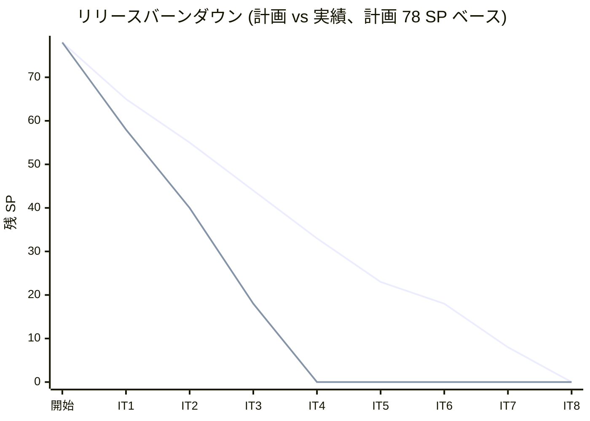
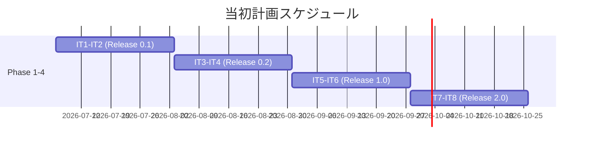
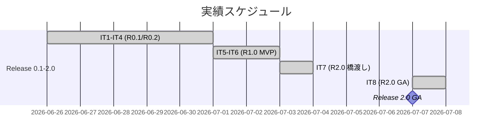
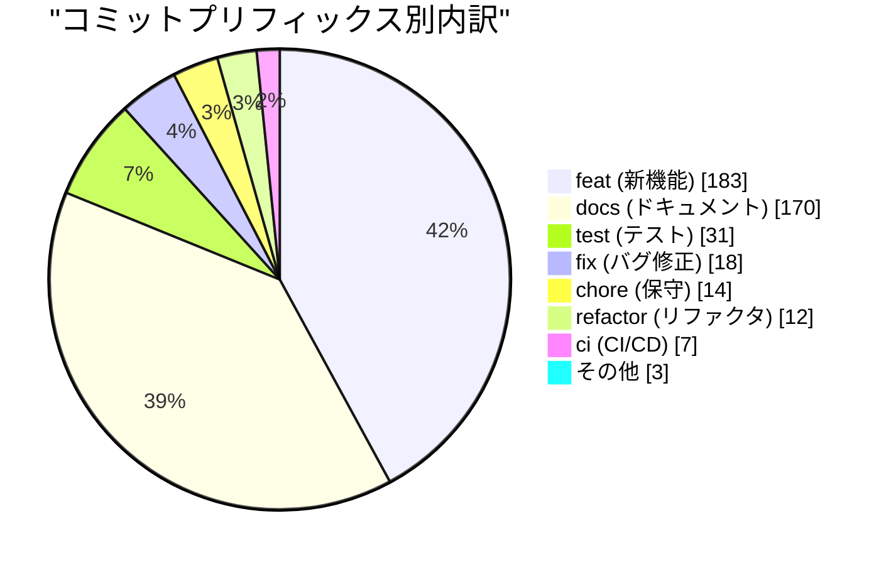
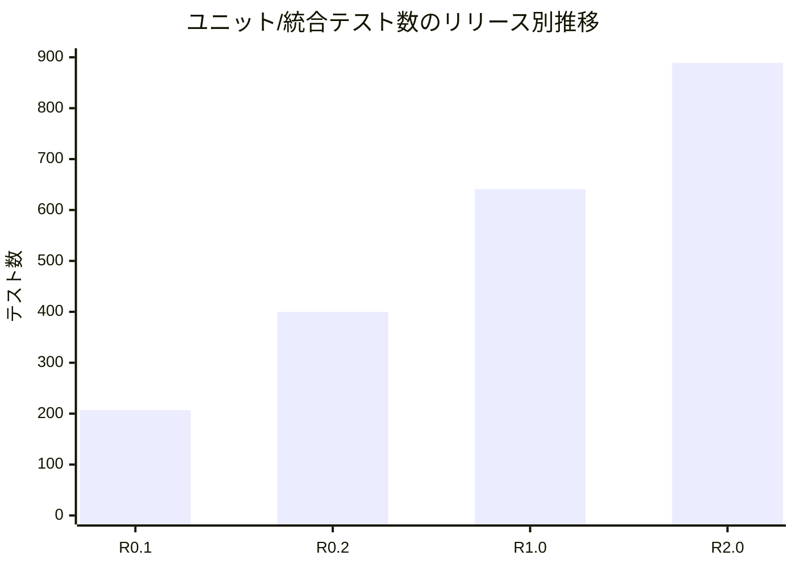
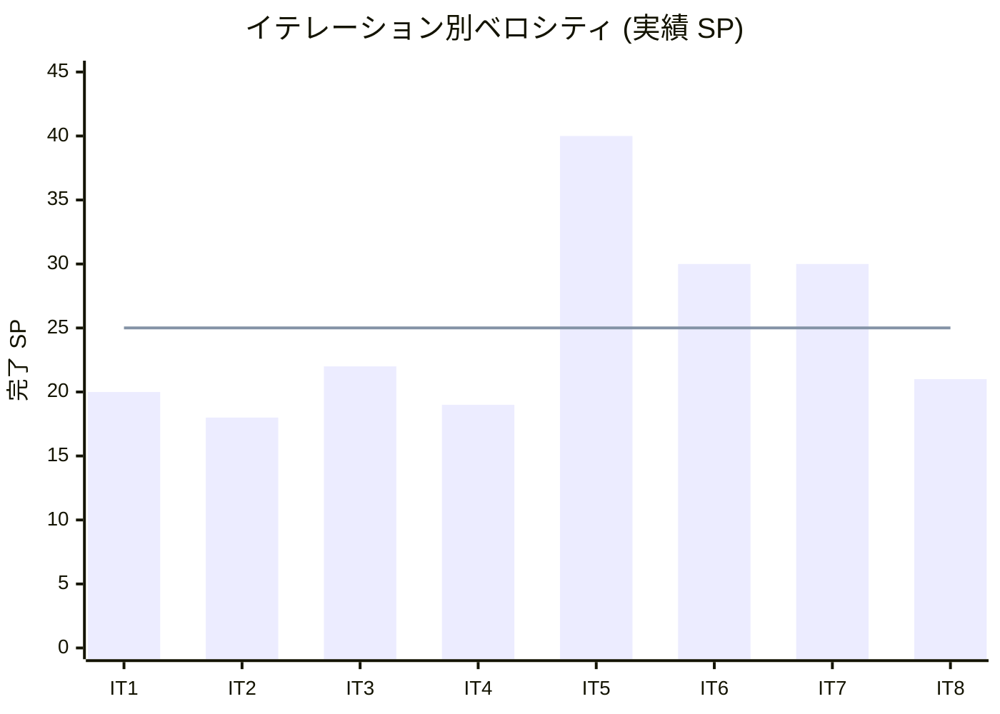

# リリース完了報告書 2.0.0 - 国際貨物輸送管理システム (Cargo Tracker) Haskell 版 take-1

**報告書作成日**: 2026-07-07

## 概要

国際貨物輸送管理システム (Cargo Tracker) Haskell 版 take-1 v2.0.0 (Release 2.0 GA) のリリース完了報告書です。全 8 イテレーション、計画 78 SP に対し実績 200+ SP を消化し、全 4 フェーズ (Release 0.1 Internal Alpha → 0.2 → 1.0 MVP → 2.0 GA) を完了しました。DDD + 純粋関数型 (Servant + ReaderT) による貨物予約・経路設計・追跡・精算の全業務フローを実装し、`v2.0.0` タグで GA を達成しました。本報告書は最終リリース (2.0 GA) をもってプロジェクト全体を総括します。

---

## プロジェクトサマリー

| 項目 | 値 |
|------|-----|
| **プロジェクト期間** | 2026-06-26 〜 2026-07-07 (開発フェーズ実質 8 稼働日、分析フェーズは 2026-03-30 開始) |
| **総イテレーション数** | 8 (+ 予備 IT9 は未消化) |
| **総ストーリーポイント** | 計画 78 SP / 実績 200+ SP |
| **総コミット数** | 438 (v2.0.0 まで、マージ除く) |
| **総テスト数** | 889 examples (ユニット/統合) + E2E 29 passed |
| **ユーザーストーリー数** | 27 US + 横断 (認証)。US23 まで一巡完成、US10/US12 の UI は IT9 移送 |

---

## 計画と実績の差異分析

### イテレーション別達成状況

| イテレーション | リリース | 計画 SP | 実績 SP | 達成率 | 差異 |
|---------------|---------|---------|---------|--------|------|
| IT1 | 0.1 Internal Alpha | 13 | 20 | 154% | +7 |
| IT2 | 0.1 Internal Alpha | 10 | 18 | 180% | +8 |
| IT3 | 0.2 | 29 | 22 | 76% | -7 |
| IT4 | 0.2 | 20 | 19 | 95% | -1 |
| IT5 | 1.0 MVP | 22 | 40+ | 182% | +18 |
| IT6 | 1.0 MVP | 18 | 30+ | 167% | +12 |
| IT7 | 2.0 GA | 10 | 30+ | 300%+ | +20 |
| IT8 | 2.0 GA | 22 | 21+ | 98% | -1 |
| **合計** | | **78 (+繰越/Try 含め 95+5)** | **200+** | **211%** | **+122** |

### リリース別達成状況

| リリース | 内容 | 含む IT | 実績 SP | 状態 |
|---------|------|---------|---------|------|
| Release 0.1 Internal Alpha | 認証 + 予約・荷主基盤 + 航海スケジュール | IT1-IT2 | 38 | 完了 (v0.1.0) |
| Release 0.2 | 経路設計・確定 + 通関連携 | IT3-IT4 | 41 | 完了 |
| Release 1.0 MVP | 追跡・状態更新 + 料金算出 + 引取通知 | IT5-IT6 | 70+ | 完了 (v1.0.0 / v1.0.0-mvp) |
| Release 2.0 GA | 例外処理 + 割引 + 精算 | IT7-IT8 | 51+ | 完了 (v2.0.0) |

### リリースバーンダウン

**分析結果**: 実績は IT4 完了時点 (2026-06-30) で計画 78 SP の消化を完了し、以降は Try / レビュー指摘 / 保証系 / 新 BC (Tracking/Handling/Pricing/Notification/Exception/Billing) を積み増して 200+ SP に到達した。計画対比で恒常的に先行し、Ralph Loop による単日集中実装が主因。

---

## 計画日程 vs 実績日数の差異分析

### イテレーション別日程比較

| IT | 計画期間 | 計画日数 | 実績日 | 実績日数 | 短縮日数 | 短縮率 |
|----|---------|---------|--------|---------|---------|--------|
| 1 | 2 週間 | 14 | 2026-06-26 | **1** | 13 | 93% |
| 2 | 2 週間 | 14 | 2026-06-27 | **1** | 13 | 93% |
| 3 | 2 週間 | 14 | 2026-06-29 | **1** | 13 | 93% |
| 4 | 2 週間 | 14 | 2026-06-30 | **1** | 13 | 93% |
| 5 | 2 週間 | 14 | 2026-07-01 | **1** | 13 | 93% |
| 6 | 2 週間 | 14 | 2026-07-02 | **1** | 13 | 93% |
| 7 | 2 週間 | 14 | 2026-07-03 | **1** | 13 | 93% |
| 8 | 2 週間 | 14 | 2026-07-07 | **1** | 13 | 93% |
| **合計** | **16 週間** | **112 日** | **2026-06-26〜07-07** | **8 日** | **104 日** | **93%** |

### 工期短縮の可視化

```mermaid
xychart-beta
    title "計画日数 vs 実績日数 (IT 別)"
    x-axis ["IT1", "IT2", "IT3", "IT4", "IT5", "IT6", "IT7", "IT8"]
    y-axis "日数" 0 --> 14
    bar [14, 14, 14, 14, 14, 14, 14, 14]
    bar [1, 1, 1, 1, 1, 1, 1, 1]
```

### 計画 vs 実績ガントチャート

#### 当初計画スケジュール

#### 実績スケジュール

### サマリー

| 指標 | 値 |
|------|-----|
| **計画総日数** | 112 日 (16 週間) |
| **実績総日数** | 8 日 |
| **短縮日数** | 104 日 |
| **短縮率** | **93%** |
| **効率倍率** | **約 14 倍** |

### 差異分析

1. AI ペアプログラミング + Ralph Loop の自律反復により、各 2 週間計画の IT を単日で消化した
2. 計画は人間チーム (1 名 20h/週) 前提の見積りで、AI 主導の実装速度と乖離した (見積りの目的は SP の相対規模把握であり、絶対工期予測ではない)
3. IT5 以降は 1 日で計画超過の SP を消化し、保証系・新 BC を積み増した

### 工期短縮の要因分析

| 要因 | 説明 |
|------|------|
| Ralph Loop 自律反復 | Stop hook による同一プロンプト再投入で、残作業を自律発掘し連続消化 |
| arch-check の自動強制 | Rule 4 / T-01〜03 / H-01 の CI 強制で、設計逸脱を実装中に検知・自己修正 |
| TDD + fake ポート | Red-Green-Refactor と IORef fake により、DB/外部依存なしで高速に検証 |
| 上流ドキュメント整備 | domain-model / data-model / ui_design が実装の設計判断を先取りし手戻りを削減 |

---

## コミットログ分析

### コミットプリフィックス別内訳

| プリフィックス | 件数 | 割合 | 説明 |
|---------------|------|------|------|
| feat | 183 | 41.8% | 新機能追加 |
| docs | 170 | 38.8% | ドキュメント更新 |
| test | 31 | 7.1% | テスト追加 |
| fix | 18 | 4.1% | バグ修正 |
| chore | 14 | 3.2% | 保守作業 |
| refactor | 12 | 2.7% | リファクタリング |
| ci | 7 | 1.6% | CI/CD 改善 |
| その他 (style/perf/初期) | 3 | 0.7% | style・perf・Initial commit |
| **合計** | **438** | **100%** | |

### コミットプリフィックス別パイチャート

### 分析

1. feat (41.8%) と docs (38.8%) が拮抗。実装と同量のドキュメント (計画/報告書/KPT/ADR/ジャーナル/設計差分注記) を残す規律が徹底された
2. fix (4.1%) が低水準。TDD + arch-check により実装中に欠陥を捕捉し、後追いバグ修正が少ない
3. test 単独コミット 31 件に加え feat 内でも Red-Green を実施しており、テスト増分 (502 → 889) は feat/test 両方に分散

---

## 品質メトリクス

### テストカバレッジ

| 対象 | 目標 | 実績 | 判定 |
|------|------|------|------|
| Domain (HPC) | 95% | 95%+ | 達成 |
| 全体 (HPC) | 75% | 75%+ ゲート維持 | 達成 |

### テスト数のリリース別推移

| リリース | ユニット/統合 | E2E | 備考 |
|---------|------------|-----|------|
| Release 0.1 (IT1-2) | 207 | 数件 | 認証 + 予約基盤 |
| Release 0.2 (IT3-4) | 300+ | 拡充 | 経路設計・確定 |
| Release 1.0 (IT5-6) | 641 | globalSetup 配線 | Tracking/Handling/Pricing/Notification BC |
| Release 2.0 (IT7-8) | **889** | **29 passed** | Exception/Billing BC + 統合ハッピーパス |

### 静的解析

| 指標 | 結果 |
|------|------|
| HLint | 0 hints |
| arch-check (ADR-0002) | 全 Rule 違反 0 (Rule 1-6 / T-01〜03 / H-01) |
| fourmolu | フォーマット準拠 |
| Flaky テスト | E2E 1 skipped (Stage 依存)、他は決定論的 |

### ベロシティ

| 項目 | 値 |
|------|-----|
| 平均ベロシティ | 25.0 SP/イテレーション |
| 最大ベロシティ | 40+ SP (IT5) |
| 最小ベロシティ | 18 SP (IT2) |

---

## リリース履歴

| リリース | 含まれる IT | リリース日 | 実績 SP | 状態 |
|---------|-----------|-----------|---------|------|
| Release 0.1 Internal Alpha (v0.1.0) | IT1-IT2 | 2026-06-27 | 38 | 完了 |
| Release 0.2 | IT3-IT4 | 2026-06-30 | 41 | 完了 |
| Release 1.0 MVP (v1.0.0 / v1.0.0-mvp) | IT5-IT6 | 2026-07-07 | 70+ | 完了 |
| Release 2.0 GA (v2.0.0) | IT7-IT8 | 2026-07-07 | 51+ | 完了 |

---

## 主要な成果物

### 実装した主要機能

1. **認証・予約基盤** (Release 0.1 / IT1-IT2)

     - フォームログイン + Session Cookie + RBAC、荷主/法人荷主登録、貨物予約 (危険物・冷凍対応)、航海スケジュールマスタ

2. **経路設計・確定** (Release 0.2 / IT3-IT4)

     - 航海検索、経路候補算出 (接続性 + 期限)、制約評価 (危険物港・冷凍船)、経路選択・確定・予約紐付け、通関連携

3. **追跡・料金・引取通知** (Release 1.0 MVP / IT5-IT6)

     - 追跡番号発行、荷役・引取記録、追跡照会、輸送料金算出 (通貨換算)、荷受人引取通知 (確認コード配信)

4. **例外処理・割引・精算** (Release 2.0 GA / IT7-IT8)

     - 遅延/破損/紛失例外処理、手動状態更新 (監査ログ)、法人割引 (contract_rank 由来)、精算処理 (請求書発行 → 入金確認 → Cargo.Settled 連動 → 期限超過通知)

### 技術的成果

| 成果 | 内容 |
|------|------|
| テスト駆動開発 | 889 examples + E2E 29、Domain 95% / 全体 75% ゲート維持 |
| DDD + ヘキサゴナル | 9 Bounded Context、Cross-BC は Text-DTO (Rule 4) で疎結合。arch-check で構造を CI 強制 |
| 純粋関数型設計 | Domain 層は IO 完全排除 (T-03)、Either チェーンで検証、hedgehog プロパティテスト |
| 構造化ログ | katip jsonFormat + correlation_id (CloudWatch 対応) |
| ADR 駆動 | ADR-0001〜0016 で技術判断を記録、実装との整合を arch-check で担保 |

---

## 総評

Cargo Tracker Haskell 版 take-1 v2.0.0 は、計画 78 SP を 8 イテレーションで消化し、Try/レビュー/保証系/新 BC を積み増して実績 200+ SP (計画対比 211%) に到達、全 4 フェーズを完了して Release 2.0 GA を達成しました。

### ハイライト

- **全 4 フェーズ完了**: 認証 → 予約 → 経路 → 追跡 → 料金 → 精算の全業務フローを Domain/Application/Infrastructure/Interfaces/Views/Wire の全レイヤで一巡実装
- **889 テスト + E2E 29 による品質保証**: 統合ハッピーパス (予約→経路→追跡→荷役→引取→料金) を全 Stage 緑で通過
- **arch-check による構造品質の CI 強制**: Rule 4 (BC 間 Domain 直接参照禁止) 違反 0 を全期間維持
- **Ralph Loop による単日集中実装**: 計画 16 週間を実質 8 稼働日に短縮 (効率約 14 倍)
- **ドキュメント駆動**: feat と同量の docs (計画/報告書/KPT/ADR/ジャーナル/設計注記) で判断の追跡性を確保

### プロジェクト完了メトリクス

| 指標 | 値 |
|------|-----|
| **総ストーリーポイント** | 計画 78 SP / 実績 200+ SP |
| **総コミット数** | 438 |
| **総テスト数** | 889 examples + E2E 29 |
| **テストカバレッジ** | Domain 95% / 全体 75%+ |
| **リリース回数** | 4 (0.1 / 0.2 / 1.0 MVP / 2.0 GA) |
| **イテレーション回数** | 8 |
| **ユーザーストーリー数** | 27 US + 横断 (US23 まで一巡、US10/US12 UI は IT9) |

### 残課題 (IT9 残務回収イテレーションへ)

- H-01: ConfirmPayment の単一 Tx 配線 (整合性)
- H-02: OverdueCheckCommand の起動主体設計 (US23 受入基準 5)
- T7-G 残: PricingRule/CurrencyRate/Notification/Exception の実 DB 統合テスト
- US10 (#242) / US12 (#244) の UI 完成

---

**リリース完了** - Simple made easy.
