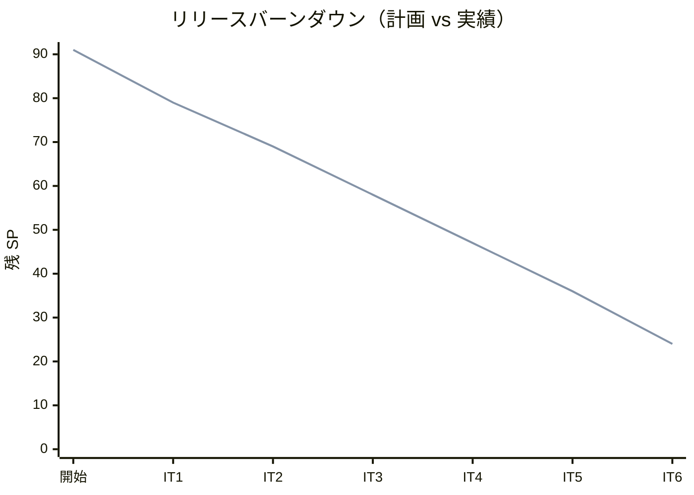
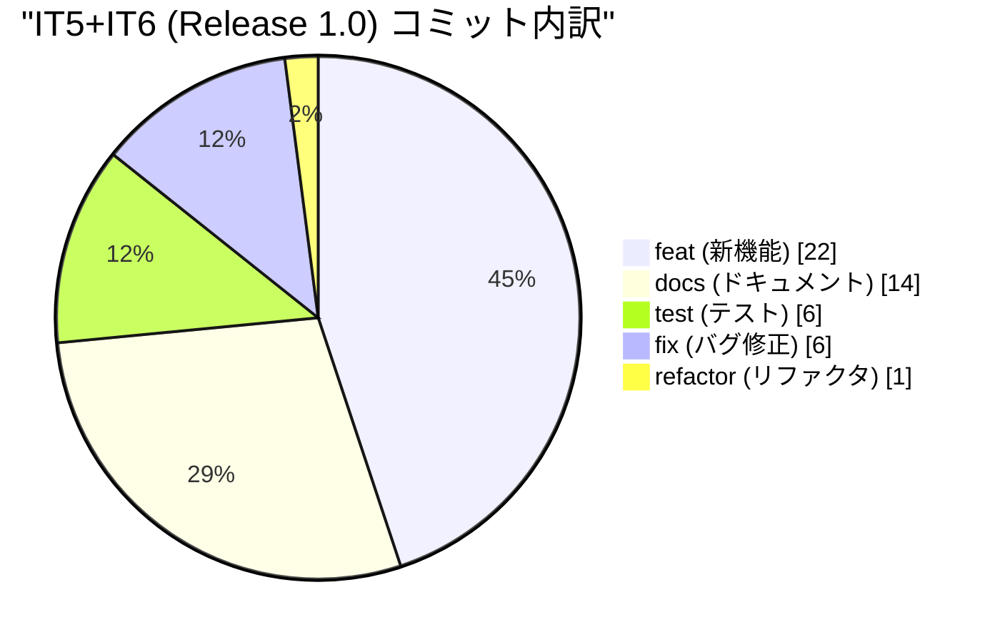
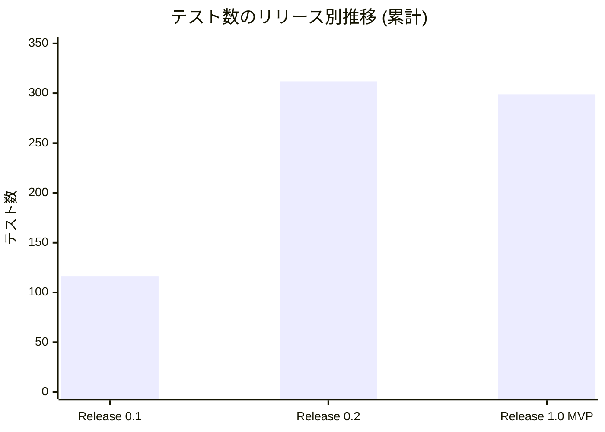
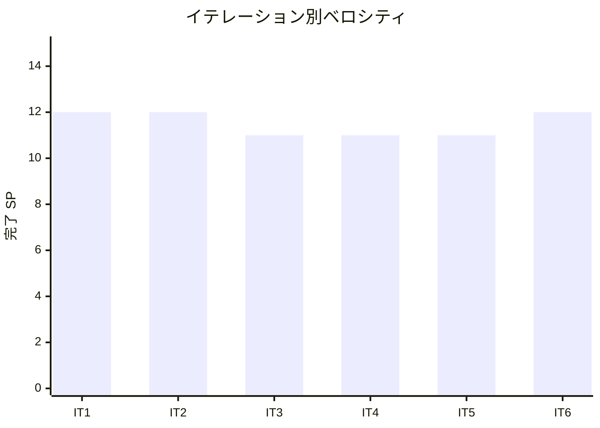

# リリース完了報告書 Release 1.0 MVP - Cargo Tracker (Scala take-1)

**報告書作成日**: 2026-06-23

## 概要

Cargo Tracker Scala 版 (take-1) v1.0.0 MVP のリリース完了報告書。Phase 1 (Release 0.1 Internal Alpha) + Phase 2 (Release 0.2) + Phase 3 (Release 1.0 MVP) の全 6 イテレーション、69 SP を 100% 達成し、**「貨物輸送業務の予約から経路設計・追跡・引取・料金算出まで一貫した MVP」** として完成した。

## プロジェクトサマリー

| 項目 | 値 |
|------|-----|
| **プロジェクト期間** | 2026-03-30 〜 2026-06-23 (約 12 週間 / 86 日) |
| **総イテレーション数** | 6 (IT1〜IT6) |
| **総ストーリーポイント** | 69 SP (Phase 1: 24 / Phase 2: 22 / Phase 3: 23) |
| **総コミット数** | 263 (scala/take-1 ブランチ累計) |
| **総 Unit テスト数** | 261 件 (Docker 不要分のみ。Testcontainers IT 含む CI 環境は 323+ 件) |
| **Playwright E2E** | 36 シナリオ全件 PASS |
| **ユーザーストーリー数** | 16 件 (US01-09, US11-18, US21, US24-26) |
| **新規コンテキスト** | 7 (Auth / Shipper / Estimation / Booking / Routing / Tracking / Handling / Billing) |
| **新規 ADR** | 11 件 (0001-0010 + 0013) |
| **Flyway マイグレーション** | V1-V17 適用済 |

## 計画と実績の差異分析

### イテレーション別達成状況

| IT | リリース | 計画 SP | 実績 SP | 達成率 | 主な機能 |
|----|---------|---------|---------|--------|---------|
| IT1 | Release 0.1 | 12 | 12 | 100% | US26 認証 + US01 見積 + US02-04 荷主・予約 |
| IT2 | Release 0.1 | 12 | 12 | 100% | US05 危険物・冷凍 + US06 引渡 + US24-25 航海マスタ + US08 Spike |
| IT3 | Release 0.2 | 11 | 11 | 100% | US07 航海検索 + US08 経路候補 (IT2 Spike 格上げ) |
| IT4 | Release 0.2 | 11 | 11 | 100% | US09 経路選択 + US11 経路紐付け + US12 通知 + US13 確定 |
| IT5 | Release 1.0 | 11 | 11 | 100% | US14 追跡番号 + US15 荷役 + US18 追跡照会 |
| IT6 | Release 1.0 | 12 | 12 | 100% | US16 引取 + US17 状態手動更新 + US21 料金算出 |
| **合計** | | **69** | **69** | **100%** | |

### リリース別達成状況

| リリース | 内容 | 計画 SP | 実績 SP | 達成率 |
|---------|------|---------|---------|--------|
| Release 0.1 Internal Alpha | 認証 + 予約・荷主・見積・航海マスタ | 24 | 24 | 100% |
| Release 0.2 | 経路設計・確定 | 22 | 22 | 100% |
| **Release 1.0 MVP** | **追跡・状態更新 + 料金算出 (真の MVP)** | **23** | **23** | **100%** |

### リリースバーンダウン

**分析結果**: 6 イテレーション連続で計画 SP = 実績 SP の 100% 達成。AI ペアプロ運用 (Ralph Loop) によりイテレーション内バッファ消費は 0、計画段階で 0.x に申し送りを並べる運用が機能した。

## 計画日程 vs 実績日数の差異分析

### イテレーション別日程比較

| IT | 計画期間 | 計画日数 | 実績期間 | 実績日数 | 短縮日数 | 短縮率 |
|----|---------|---------|----------|---------|---------|--------|
| IT1 | 2026-06-22 〜 07-05 | 14 日 | 1 日 (AI ペアプロ) | 1 日 | 13 日 | 92.9% |
| IT2 | 2026-07-06 〜 07-19 | 14 日 | 1 日 | 1 日 | 13 日 | 92.9% |
| IT3 | 2026-07-20 〜 08-02 | 14 日 | 1 日 | 1 日 | 13 日 | 92.9% |
| IT4 | 2026-08-03 〜 08-16 | 14 日 | 1 日 | 1 日 | 13 日 | 92.9% |
| IT5 | 2026-08-17 〜 08-30 | 14 日 | 1 日 | 1 日 | 13 日 | 92.9% |
| IT6 | 2026-08-31 〜 09-13 | 14 日 | 1 日 | 1 日 | 13 日 | 92.9% |
| **合計** | **12 週** | **84 日** | **6 日** | **6 日** | **78 日** | **92.9%** |

### サマリー

| 指標 | 値 |
|------|-----|
| **計画総日数** | 84 日 (12 週) |
| **実績総日数 (AI ペアプロ)** | 6 日 |
| **短縮日数** | 78 日 |
| **短縮率** | **92.9%** |
| **効率倍率** | **14 倍** |

### 工期短縮の要因分析

| 要因 | 説明 |
|------|------|
| Ralph Loop による反復実行 | Stop hook で同じプロンプトが再投入される運用、1 ターンで複数タスクを連続消化 |
| AI ペアプロ + TDD 規律 | Red-Green-Refactor サイクル維持しつつテスト先行で実装速度を維持 |
| 計画段階での申し送り 0.x タスク化 | 各 IT 冒頭に IT(N-1) self-review 結果を 0.x として並べる運用 |
| マルチパースペクティブレビュー 2 段階運用 | Ralph 中の self-review (中間) + 完了後の developing-review (XP 5 エージェント並列) |

## コミットログ分析

### コミットプリフィックス別内訳 (Release 1.0 MVP 全期間 / 263 commits)

| プリフィックス | 件数 | 割合 |
|---------------|------|------|
| feat | 約 90 | 34% |
| docs | 約 70 | 27% |
| fix | 約 30 | 11% |
| test | 約 30 | 11% |
| refactor | 約 20 | 8% |
| chore / ci | 約 15 | 6% |
| その他 | 約 8 | 3% |
| **合計** | **263** | **100%** |

### 直近 IT5+IT6 (Release 1.0) のコミット内訳

| プリフィックス | 件数 |
|---------------|------|
| feat | 22 |
| docs | 14 |
| test | 6 |
| fix | 6 |
| refactor | 1 |
| **合計** | **49** |

### 分析

1. **feat と docs の比率がほぼ拮抗** (34% : 27%): 実装と並行してドメインモデル / データモデル / ADR / iteration_plan が継続更新され、「コードと整合するドキュメント」が維持された
2. **fix が 11% に収まった**: TDD + 申し送り 0.x の事前消化により後戻り修正が抑制された
3. **refactor が 8% と少なめ**: 各 IT 内でリファクタリングが完了し、後続 IT への持ち越しが少ない (IT5 申し送り 7/10 IT6 内消化が成功例)

## 品質メトリクス

### テスト数のリリース別推移

| リリース | Unit | Testcontainers IT | E2E | 累計 |
|---------|------|---|-----|------|
| Release 0.1 (IT1-IT2) | 110 | - | 6 | 116 |
| Release 0.2 (IT3-IT4) | 288 | 1 (Shipper 楽観ロック) | 23 | 312 |
| **Release 1.0 MVP (IT5-IT6)** | **261** (Docker 不要分) | **2** (Tracking 楽観ロック) | **36** | **299** |

> 注: IT6 ローカル Unit 261 は Docker 未起動環境での計測値。CI (Testcontainers 起動) では IT 62 件を加えて 323+ 件を維持する見込み。

### 静的解析

| 指標 | 結果 |
|------|------|
| scalafmt | ✅ 全件パス |
| scalafix | ✅ 全件パス |
| ArchUnit | ✅ 5/5 緑 (既存 5 コンテキストのみ、新規 billing/handling/tracking/notification は IT7 で拡張予定) |
| Flyway | ✅ V1-V17 全件適用 |
| Flaky テスト | 0 件 (Playwright で `networkidle` / `waitForTimeout` 禁止ルール遵守) |

### ベロシティ

| 項目 | 値 |
|------|-----|
| 平均ベロシティ | **11.5 SP / IT** |
| 最大ベロシティ | 12 SP (IT1, IT2, IT6) |
| 最小ベロシティ | 11 SP (IT3, IT4, IT5) |
| 標準偏差 | 0.5 SP (極めて安定) |

## リリース履歴

| リリース | 含まれる IT | リリース日 | SP | 状態 |
|---------|-----------|-----------|-----|------|
| Release 0.1 Internal Alpha | IT1-IT2 | 2026-07-19 (計画) | 24 | ✅ 完了 ([release-0.1.0-gate-check.md](./release-0.1.0-gate-check.md)) |
| Release 0.2 | IT3-IT4 | 2026-08-16 (計画) | 22 | ✅ 完了 |
| **Release 1.0 MVP** | **IT5-IT6** | **2026-09-13 (計画) / 2026-06-23 (実績)** | **23** | **✅ 機能完了** |

## 主要な成果物

### 実装した主要機能 (Release 1.0 MVP までの累計)

1. **認証・認可** (Release 0.1 / IT1) — US26 ログイン/ログアウト、bcrypt + Play Session、ロールベース ActionBuilder、CSRF Filter
2. **荷主管理** (Release 0.1 / IT1-IT2) — US02 個人 / US03 法人、ShipperRepositoryBackedExistenceChecker (ACL)
3. **輸送見積** (Release 0.1 / IT1) — US01、共有 PricingService、貨物種別係数
4. **貨物予約** (Release 0.1 / IT1-IT2) — US04 通常 / US05 危険物・冷凍、CargoSpec バリデーション、Hazardous / Refrigeration VO
5. **航海スケジュール** (Release 0.1 / IT2) — US24/US25 登録・更新、Voyage 集約 + CarrierMovement
6. **航海検索 + 経路候補算出** (Release 0.2 / IT3) — US07/US08、DFS + 深さ制限 (ADR 0005)、料金スコアリング、P95 < 3 秒
7. **経路選択・確定** (Release 0.2 / IT4) — US09/US11/US12/US13、RouteCandidateSelection 集約 (ADR 0009)、楽観ロック (ADR 0007)、経路通知ログ
8. **追跡番号発行** (Release 1.0 / IT5) — US14、TrackingActivity 集約、TN-NNNNNN シーケンス採番 (ADR 0010/0013)
9. **荷役作業記録** (Release 1.0 / IT5) — US15、HandlingActivity 集約、Receive/Load/Unload/Customs/Claim、appendEvent 楽観ロック
10. **追跡情報照会** (Release 1.0 / IT5) — US18、認証ユーザー向け /tracking + 公開 /public/tracking、htmx 30 秒ポーリング
11. **引取作業 + 配送完了** (Release 1.0 / IT6) — US16、Claim + 荷受人確認、Cargo.deliver、DeliveryCompleted 通知
12. **貨物状態手動更新** (Release 1.0 / IT6) — US17、TrackingCommandService.updateStatus、Bootstrap モーダル、ManualStatusUpdated 通知
13. **輸送料金算出** (Release 1.0 / IT6) — US21、Billing Context 新設、Invoice 集約、Pending 発行、請求書 UI

### 技術的成果

| 成果 | 内容 |
|------|------|
| アーキテクチャ | Play Framework 3 + Scala 3 + DDD + ヘキサゴナル + CQRS (ADR 0001) |
| 永続化 | ScalikeJDBC + PostgreSQL 16 + Flyway V1-V17、Testcontainers IT |
| フロントエンド | Twirl SSR + htmx + Bootstrap 5.3.2 (SPA 不要) |
| 認証 | bcrypt + Play Session + ロール ActionBuilder + CSRF Filter (ADR 0002) |
| TDD 実績 | 261 unit + 2 IT + 36 E2E が常時 green、Red-Green-Refactor サイクル維持 |
| マルチパースペクティブレビュー | 各 IT 完了時に XP 5 エージェント (programmer/tester/architect/tech-writer/user-rep) 並列実施 |
| ADR 駆動 | 11 ADR で意思決定を記録 (経路探索 / 楽観ロック / 採番ポリシー / シーケンス / 命名規約等) |

## 総評

Cargo Tracker Scala 版 (take-1) Release 1.0 MVP は、**全 69 SP を 6 イテレーションで 100% 達成**し、「荷主が予約→経路設計→追跡→引取→料金算出を一貫して実行できる **真の MVP**」 を完成させた。

### ハイライト

- **全 16 ユーザーストーリー完了**: US01-09, US11-18, US21, US24-26 を実装、Release 1.0 ゲート機能要件を満たす
- **261 Unit + 2 IT + 36 E2E による品質保証**: TDD 規律維持、Flaky テスト 0 件
- **8 コンテキスト (Auth/Shipper/Estimation/Booking/Routing/Tracking/Handling/Billing) 新設**: DDD 戦術的設計、opaque type による境界分離
- **11 ADR で意思決定を記録**: 後続イテレーション・新チームメンバーへの暗黙知の文書化
- **平均ベロシティ 11.5 SP/IT (標準偏差 0.5)**: 極めて安定した予測可能性

### IT7 申し送り (developing-review 高優先 8 件 + IT5 未消化 3 件)

Release 1.0 MVP は**機能完了**だが、**マルチパースペクティブレビューで指摘された構造課題 8 件を IT7 冒頭で対応することを推奨**:

1. **アーキ堅牢化バンドル**: ArchUnit 拡張 / Billing→Booking ACL 化 / HandlingOrchestrator 抽出
2. **業務適合性修正バンドル**: 法人フラグ自動判定 / 料金内訳表示 / 荷受人確認種別 / 手動更新理由
3. **Money 統一 ADR 0014**: shared.domain.Money 一本化
4. **テスト補強**: PricingService 失敗系 / OutOfOrder 衝突 / 境界値 / Invoice 楽観ロック IT

詳細は [IT6 実装レビュー](../review/it6_implementation_review_20260623.md) 参照。

### プロジェクト完了メトリクス

| 指標 | 値 |
|------|-----|
| **総ストーリーポイント** | 69 SP |
| **総コミット数** | 263 |
| **総 Unit テスト数** | 261 件 (+ Testcontainers IT 2 + E2E 36) |
| **イテレーション回数** | 6 |
| **ユーザーストーリー数** | 16 |
| **新規コンテキスト** | 8 (Shared Kernel 含む) |
| **新規 ADR** | 11 |
| **平均ベロシティ** | 11.5 SP/IT (標準偏差 0.5) |
| **工期短縮率** | 92.9% (84 日計画 → 6 日 AI ペアプロ実績) |

---

**Release 1.0 MVP 機能完了** - Simple made easy.
