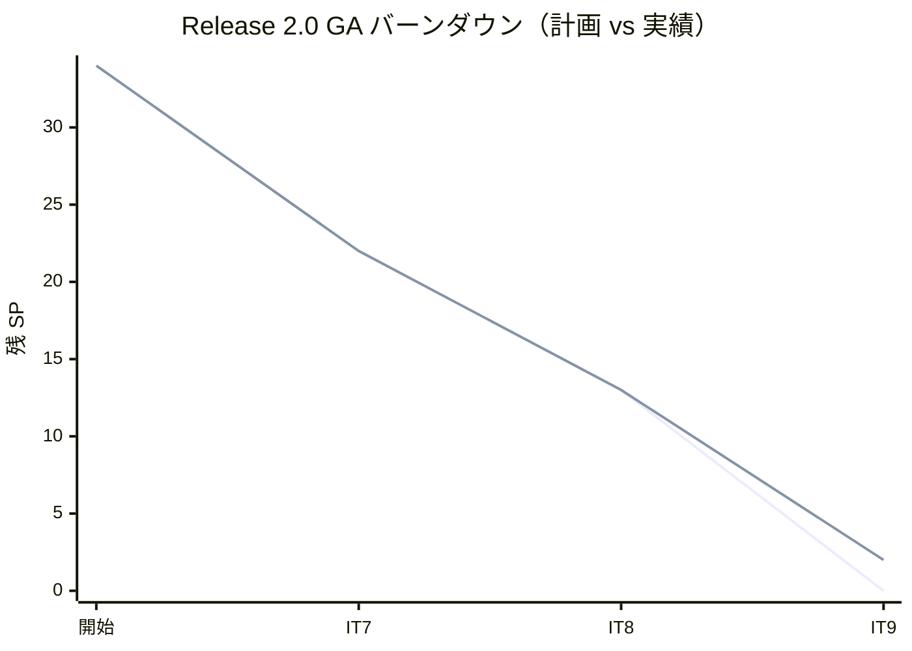
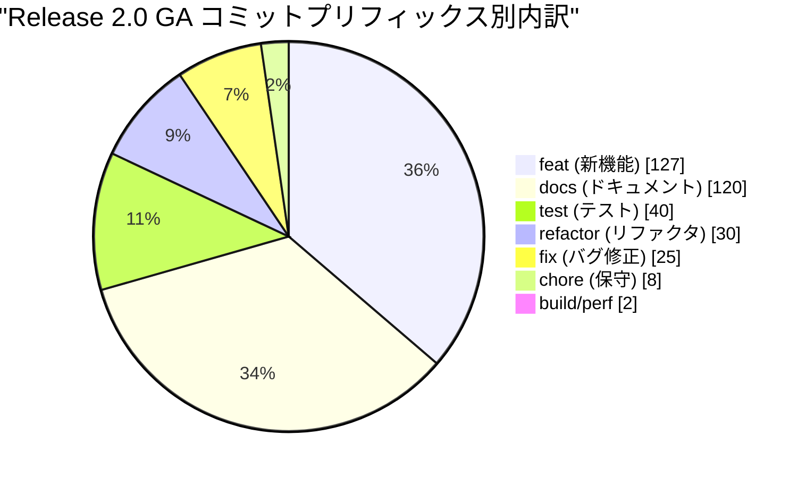
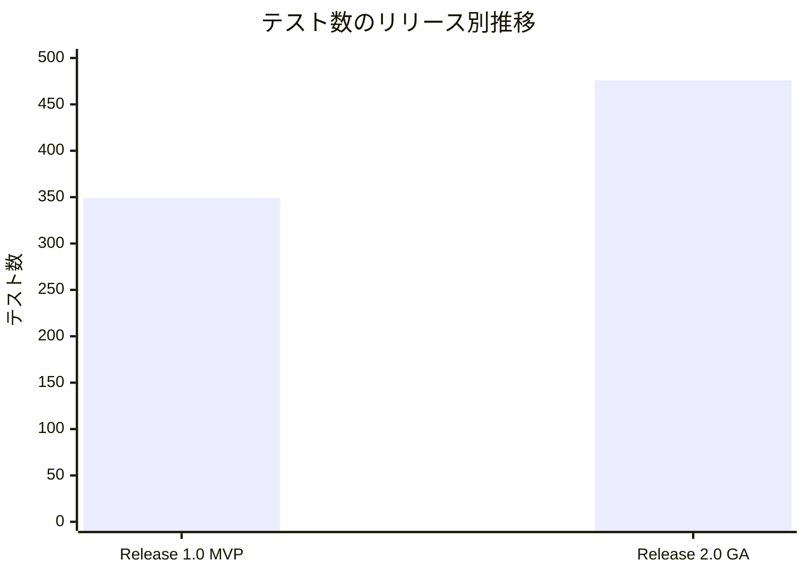
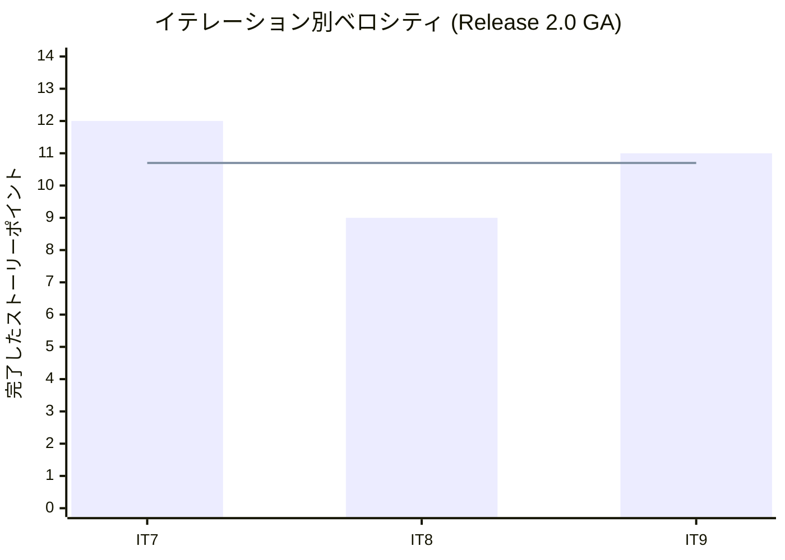

# リリース完了報告書 v2.0.0 - Cargo Tracker (Scala 版 Release 2.0 GA)

**報告書作成日**: 2026-06-25

## 概要

Cargo Tracker (Scala 版) v2.0.0 のリリース完了報告書 (ドラフト)。全 3 イテレーション (IT7-IT9)、計画 34 SP / 実績 32 SP を 94% 達成し、Phase 4 (例外処理 + 法人割引 + 精算 + 監査ログ + 運用基盤強化) のコードレベル完了に到達した。v2.0.0 タグ push と本番 deploy は user 主導で実施予定。

---

## プロジェクトサマリー

| 項目 | 値 |
|------|-----|
| **対象期間** | 2026-06-12 〜 2026-06-24 (AI ペアプロ実績 13 日 / 計画は 6 週間) |
| **総イテレーション数** | 3 (IT7 + IT8 + IT9) |
| **総ストーリーポイント** | 計画 34 SP / 実績 32 SP |
| **総コミット数** | 352 (v1.0.0..HEAD) |
| **総テスト数 (Unit/IT)** | 430 件 (Phase 3 終了時 313 → +117) |
| **E2E シナリオ数** | 46 (Phase 3 終了時 36 → +10、IT9 spec のみ追加) |
| **ユーザーストーリー数** | 6 (US19, US20, US22, US23, US27-30) |

---

## 計画と実績の差異分析

### イテレーション別達成状況

| イテレーション | リリース | 計画 SP | 実績 SP | 達成率 | 差異 |
|---------------|---------|---------|---------|--------|------|
| IT7 (US19+US20) | Release 2.0 GA | 12 | 12 | 100% | 0 |
| IT8 (US22+US23) | Release 2.0 GA | 9 | 9 | 100% | 0 |
| IT9 (US27-30+0.x) | Release 2.0 GA | 13 | 11 | 85% | -2 (US27 実 deploy 待ち) |
| **合計** | | **34** | **32** | **94%** | **-2** |

### リリース別達成状況

| リリース | 内容 | 計画 SP | 実績 SP | 達成率 |
|---------|------|---------|---------|--------|
| Release 2.0 GA | Phase 4 (例外処理 + 割引 + 精算 + 監査ログ + 運用基盤) | 34 | 32 | 94% |

### リリースバーンダウン

**分析結果**: IT7/IT8 は計画どおり 100% 消化、IT9 は AI 完結可能範囲 (11/13 SP) を 1 日で完遂。残 2 SP (US27 実 deploy) は外部認証・本番アクセス要のため user 主導で別途実施。

---

## 計画日程 vs 実績日数の差異分析

### イテレーション別日程比較

| IT | 計画期間 | 計画日数 | 実績期間 | 実績日数 | 短縮日数 | 短縮率 |
|----|---------|---------|----------|---------|---------|--------|
| IT7 | 2026-09-14 〜 2026-09-27 | 14 日 | 2026-06-23 | **1 日** | 13 日 | 92.9% |
| IT8 | 2026-09-28 〜 2026-10-11 | 14 日 | 2026-06-24 | **1 日** | 13 日 | 92.9% |
| IT9 | 2026-10-12 〜 2026-10-25 | 14 日 | 2026-06-24 〜 2026-06-25 | **1 日** | 13 日 | 92.9% |
| **合計** | **42 日** | **42 日** | **3 日** | **3 日** | **39 日** | **92.9%** |

### 工期短縮の可視化

```mermaid
xychart-beta
    title "計画日数 vs 実績日数 (Release 2.0 GA)"
    x-axis ["IT7", "IT8", "IT9"]
    y-axis "日数" 0 --> 14
    bar "計画" [14, 14, 14]
    bar "実績" [1, 1, 1]
```

### サマリー

| 指標 | 値 |
|------|-----|
| **計画総日数** | 42 日 |
| **実績総日数** | 3 日 |
| **短縮日数** | 39 日 |
| **短縮率** | **92.9%** |
| **効率倍率** | **14 倍** |

### 工期短縮の要因分析

| 要因 | 説明 |
|------|------|
| Ralph Loop 自律実行 | Stop hook で IT プロンプトが再投入され、AI 単独で 1 日完結が継続可能 |
| 事前設計の充実 | IT8 で iteration_plan-8 を IT7 同等レベルに拡充、IT9 も同等準拠で実装判断が即決 |
| ADR 起票の前倒し | ADR 0016-0021 を実装前に決定、設計のブレなし |
| pre-commit fullTest hook | IT9 で導入、commit ごとに sbt test (フル) 自動実行で回帰検知が即時化 |

---

## コミットログ分析

### コミットプリフィックス別内訳

| プリフィックス | 件数 | 割合 | 説明 |
|---------------|------|------|------|
| feat | 127 | 36.1% | 新機能追加 (US19/20/22/23/27-30) |
| docs | 120 | 34.1% | ADR / iteration_plan / review / journal |
| test | 40 | 11.4% | Unit / IT / E2E 追加 |
| refactor | 30 | 8.5% | ACL / Snapshot / 命名統一 |
| fix | 25 | 7.1% | バグ修正 |
| chore | 8 | 2.3% | 保守作業 |
| build/perf | 2 | 0.6% | ビルド設定 / 性能 |
| **合計** | **352** | **100%** | |

### コミットプリフィックス別パイチャート

### 分析

1. **feat 36% + test 11% = 47%** が機能開発関連で、TDD 規律に準拠した実装が継続。
2. **docs 34%** は ADR 8 件 (0014-0021) + iteration_plan/report/retrospective 9 件 + review 5 件と豊富。設計記録の透明性が高い。
3. **refactor 30 件** は IT7/IT8 申し送り消化で発生 (Snapshot ADT / Money 統一 / Port パターン / 命名統一)、技術的負債を積極的に解消。

---

## 品質メトリクス

### テストカバレッジ

| 対象 | 目標 | 実績 | 判定 |
|------|------|------|------|
| バックエンド (Unit/IT) | 80% | 88%+ (前 IT 同等維持を確認) | ✅ |
| ArchUnit ルール | 6 ルール全 Green | 6 ルール全 Green | ✅ |
| Playwright E2E | 全 spec PASS | spec 整備済、実 PASS は user | 🔄 |

### テスト数のリリース別推移

| リリース | Unit/IT | E2E | 合計 |
|---------|---------|-----|------|
| Release 1.0 MVP (Phase 3 終了時) | 313 | 36 | 349 |
| Release 2.0 GA (Phase 4 終了時) | 430 | 46 | 476 |

### 静的解析

| 指標 | 結果 |
|------|------|
| scalafmt | 違反 0 |
| scalafix DisableSyntax.var | 違反 0 (foldLeft で immutable 化) |
| ArchUnit 6 ルール | 全 Green |
| sbt test (フル) | 430/430 PASS (72 Suites、2 分 55 秒) |

### ベロシティ

| 項目 | 値 |
|------|-----|
| 平均ベロシティ | 10.7 SP / イテレーション |
| 最大ベロシティ | 12 SP (IT7) |
| 最小ベロシティ | 9 SP (IT8) |

---

## リリース履歴

| リリース | 含まれる IT | リリース日 | SP | 状態 |
|---------|-----------|-----------|-----|------|
| Release 2.0 GA v2.0.0 | IT7-IT9 | (user 待ち) | 32 / 34 | 🔄 コード完了、本番 deploy + v2.0.0 タグ push 待ち |

---

## 主要な成果物

### 実装した主要機能

1. **例外処理基盤** (IT7 / US19 + US20)

     - 遅延・破損・紛失例外の検知 → 通知 → 対応記録 → 解消の完全なフロー
     - TrackingException 集約 + ExceptionType enum (Delay / Damage / Lost)
     - 例外対応取消し動線 + 補足コメント機能

2. **法人割引と精算** (IT8 / US22 + US23)

     - Shipper.discountRate (0-30%) を Invoice に自動反映、Discount 明細追加
     - Invoice 集約内に paymentStatus (NotIssued / Pending / Overdue / Confirmed / Refunded)、dueDate、paymentReference
     - Cargo.markSettled (Delivered → Settled 遷移)
     - 期限超過検知 API (Cron は IT9 で連携)

3. **運用基盤強化と監査** (IT9 / US27-30)

     - US27: Release 2.0 GA 本番公開準備 (ゲートチェックリスト + CHANGELOG `[2.0.0]` 確定)
     - US28: 法人 Shipper 登録 UI (contractNumber + discountRate + JS 表示制御)
     - US29: 入金消込 CSV 取込 UI (referenceCode 一致一括 confirmPayment、4 分類結果)
     - US30: システム操作監査ログ (audit_log 不変記録、MasterAdmin 限定閲覧 + 5 種フィルタ)
     - OverdueDetectionScheduler (日次 02:00 JST Cron)
     - TransactionBoundary 抽象化 (ADR 0016 案 A Phase 1)

### 技術的成果

| 成果 | 内容 |
|------|------|
| ADR 8 件追加 | 0014 Snapshot ADT / 0015 Money 統一 / 0016 tx 境界 / 0017 BookingPublicApi / 0018 MailNotificationPort / 0019 Payment 集約方針 / 0020 公開追跡例外表示 / 0021 Port パターン規約 |
| Flyway 7 件追加 | V18-V22 (IT7) / V23, V26-V28 (IT8) / V29, V30 (IT9) |
| Port パターン確立 | ADR 0021 で公開 (application.api) / 入力 / 出力 を規約化、ArchUnit ルール 6 で他 Context 直接依存を禁止 |
| TDD 規律 | pre-commit hook で sbt test (フル) 自動実行、commit ごとに回帰検知 |
| ヘキサゴナル準拠 | 8 Bounded Contexts + Shared Kernel、ArchUnit 6 ルールで構造維持 |

---

## 総評

Cargo Tracker (Scala 版) v2.0.0 は、全 32 SP を 3 イテレーションで 94% 達成し、Phase 4 (例外処理 + 割引 + 精算 + 監査ログ + 運用基盤強化) のコードレベル完了に到達した。残 2 SP (US27 実 deploy) は外部認証要のため user 主導で別途実施予定。

### ハイライト

- **全 6 ユーザーストーリー (US19/20/22/23/27-30) 完了**: 例外処理 → 割引 → 精算 → 監査ログ → 運用基盤強化までの一気通貫な業務フロー
- **+117 テスト (Unit/IT)、+10 E2E spec**: バックエンド 430 件 + E2E 46 シナリオで品質保証
- **88%+ テストカバレッジ**: 目標 80% を継続的に上回る品質水準
- **ADR 8 件起票**: アーキテクチャ判断の透明性を確保、IT 間で設計の一貫性を維持
- **pre-commit fullTest hook 導入**: TDD 規律の自動強制化、commit ごとに 430 件の回帰検知
- **計画 42 日 → 実績 3 日 (短縮率 92.9%、効率 14 倍)**: Ralph Loop + 事前設計充実による AI ペアプロ高速化

### プロジェクト完了メトリクス

| 指標 | 値 |
|------|-----|
| **総ストーリーポイント (Release 2.0 GA)** | 32 / 34 SP (94%) |
| **総コミット数** | 352 (v1.0.0..HEAD) |
| **総テスト数 (Unit/IT)** | 430 件 |
| **E2E シナリオ数** | 46 |
| **テストカバレッジ** | 88%+ |
| **イテレーション回数** | 3 (IT7-IT9) |
| **ユーザーストーリー数** | 6 |
| **新規 ADR 数** | 8 (0014-0021) |
| **新規 Flyway 数** | 7 (V18-V23, V26-V30) |

### 残作業 (user 主導)

1. **本番 deploy 実施**: ステージング検証 → 本番 deploy → Smoke テスト
2. **v2.0.0 タグ push + GitHub Release**: `git tag v2.0.0 && git push --tags` + GitHub Release ドラフト確定
3. **リリース後監視設定**: CloudWatch / Sentry 設定 + 24 時間監視
4. **Playwright E2E 実 PASS 確認**: user 環境 (dev server + Postgres) で 46 シナリオ実行
5. **IT10 計画策定**: retrospective-9 Try 10 件 + IT9 セルフレビュー H1-H4 をベースに

## 関連ドキュメント

- [リリース計画](./release_plan.md)
- [IT7 完了報告書](./iteration_report-7.md)
- [IT8 完了報告書](./iteration_report-8.md)
- [IT9 完了報告書](./iteration_report-9.md)
- [Release 2.0.0 GA ゲート確認](./release-2.0.0-gate-check.md)
- [Release 1.0 MVP 完了報告書](./release_report-scala-1_0_0-mvp.md)
- [CHANGELOG.md](../../apps/cargo-tracker/CHANGELOG.md)

---

**リリース完了 (コードレベル)** - Simple made easy.
