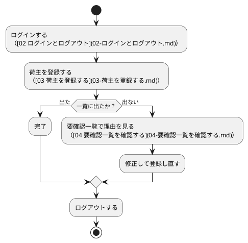

# 01 業務フロー

## 全体の流れ

現時点で使える範囲は、システムへの出入りと荷主の登録です。

```plantuml
@startuml
start
:ログインする\n（[02 ログインとログアウト](02-ログインとログアウト.md)）;
:荷主を登録する\n（[03 荷主を登録する](03-荷主を登録する.md)）;
if (一覧に出たか？) then (出た)
  :完了;
else (出ない)
  :要確認一覧で理由を見る\n（[04 要確認一覧を確認する](04-要確認一覧を確認する.md)）;
  :修正して登録し直す;
endif
:ログアウトする;
stop
@enduml
```

## 一日の始め方

1. ログインします
2. ダッシュボードの「今日の作業」から、その日に扱う画面へ進みます
3. **要確認一覧に件数が出ていたら先に片づけます。** 放置すると、登録したつもりのものが登録されていない状態が続きます
