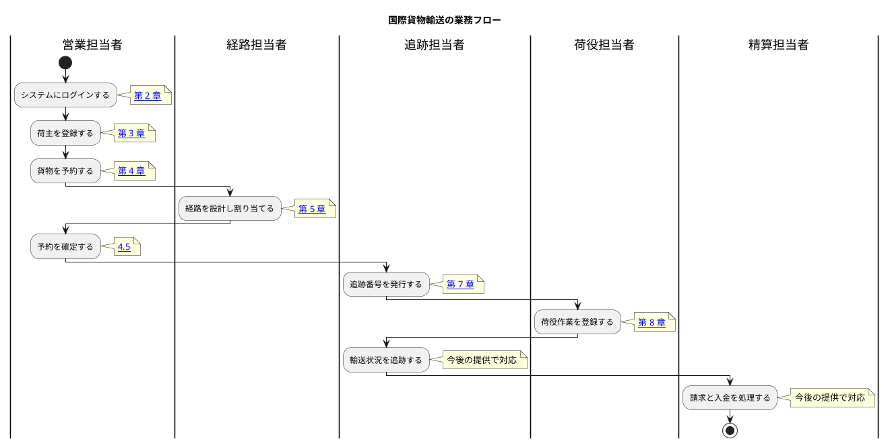

# 01. 業務フロー

国際貨物輸送の業務は、荷主の登録から始まり、貨物の予約・経路設計・輸送・追跡を経て、精算で終わります。本章は業務の流れと、各工程がどの章に対応するかを示します。

## 全体像

## 工程と章の対応

| # | 工程 | 担当 | 対応する章 | 状態 |
| :--- | :--- | :--- | :--- | :--- |
| WF-1 | システムにログインする | 全員 | [02. ログイン](02-ログイン.md) | 利用できます |
| WF-2 | 荷主を登録する | 営業担当者 | [03. 荷主管理](03-荷主管理.md) | 利用できます |
| WF-3 | 貨物を予約する | 営業担当者 | [04. 貨物予約](04-貨物予約.md) | 利用できます |
| WF-4 | 経路を設計し割り当てる | 経路担当者 | [05. 航路管理](05-航路管理.md) | 利用できます |
| WF-4.5 | 確定経路を荷主に通知する | 営業担当者 | [4.6](04-貨物予約.md#46-確定経路を荷主に通知する) | 利用できます |
| WF-4.6 | 予約を確定し追跡番号を発行する | 営業担当者 / 追跡担当者 | [4.5](04-貨物予約.md#45-予約を確定する) / [07. 追跡管理](07-追跡管理.md) | 利用できます |
| WF-5 | 荷役作業を登録する | 荷役担当者 | [08. 荷役管理](08-荷役管理.md) | 利用できます（受領・積込・荷降し・通関・引取） |
| WF-6 | 輸送状況を追跡する | 追跡担当者 / 荷主・荷受人 | [7.4](07-追跡管理.md#74-貨物の状態を手動で更新する) / [09. 貨物追跡](09-貨物追跡.md) | 利用できます（状態の手動更新・追跡番号での照会） |
| WF-7 | 請求と入金を処理する | 精算担当者 | — | 今後の提供で対応します |

## WF-4 と WF-4.5 のつながり

**経路が確定したことは営業に自動で伝わりません**（メールは送信していません）。
営業担当者はダッシュボードの「**荷主への通知待ち**」を見ます。経路が確定していて、
まだ通知していない予約が期限の近い順に並びます。

通知した記録は予約詳細の「通知履歴」に残ります。**「聞いていない」と言われたときに
確認できるようにするための記録**です（届いたことを保証するものではありません）。

## WF-3 と WF-4 のつながり

**予約は「引き渡し」で経路設計へ移ります**（[4.4](04-貨物予約.md#44-経路設計者に引き渡す)）。
引き渡しの通知メールは送信されません。**引き渡した予約が経路設計者の
「経路設計」画面に現れることが引き渡しです**（[5.1](05-航路管理.md#51-経路割り当て待ちの予約を確認する)）。
経路設計者は通知を待つのではなく、自分の作業画面を見ます。

## WF-2 と WF-3 のつながり

**貨物を予約するには、その荷主が登録されている必要があります。** 予約では荷主コードで荷主を指定します。荷主詳細の「この荷主で予約する」を使うと、荷主コードが入力された状態で予約の画面が開きます。**荷主コードを書き写して画面を往復する必要はありません。**

## WF-1 と WF-2 のつながり

**貨物を予約するには、荷主が登録されている必要があります。** 新しい取引先から依頼を受けたときは、予約の前に荷主登録を済ませてください。すでに取引のある相手であれば、荷主一覧で確認できます。

同じ取引先を二重に登録すると、請求先が分かれてしまい後の工程で混乱します。登録の前に一覧で探す習慣をつけてください。システムもメールアドレスの重複を検知して知らせます（[3.2 荷主を登録する](03-荷主管理.md#32-荷主を登録する)）。
