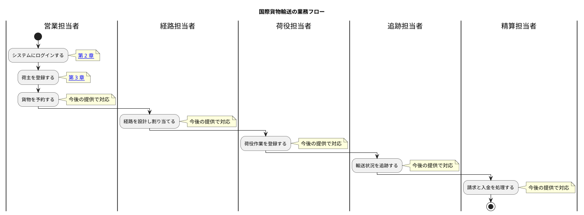

# 01. 業務フロー

国際貨物輸送の業務は、荷主の登録から始まり、貨物の予約・経路設計・輸送・追跡を経て、精算で終わります。本章は業務の流れと、各工程がどの章に対応するかを示します。

## 全体像

## 工程と章の対応

| # | 工程 | 担当 | 対応する章 | 状態 |
| :--- | :--- | :--- | :--- | :--- |
| WF-1 | システムにログインする | 全員 | [02. ログイン](02-ログイン.md) | 利用できます |
| WF-2 | 荷主を登録する | 営業担当者 | [03. 荷主管理](03-荷主管理.md) | 利用できます |
| WF-3 | 貨物を予約する | 営業担当者 | [04. 貨物予約](04-貨物予約.md) | 利用できます |
| WF-4 | 経路を設計し割り当てる | 経路担当者 | — | 今後の提供で対応します |
| WF-5 | 荷役作業を登録する | 荷役担当者 | — | 今後の提供で対応します |
| WF-6 | 輸送状況を追跡する | 追跡担当者 | — | 今後の提供で対応します |
| WF-7 | 請求と入金を処理する | 精算担当者 | — | 今後の提供で対応します |

## WF-2 と WF-3 のつながり

**貨物を予約するには、その荷主が登録されている必要があります。** 予約では荷主コードで荷主を指定します。荷主詳細の「この荷主で予約する」を使うと、荷主コードが入力された状態で予約の画面が開きます。**荷主コードを書き写して画面を往復する必要はありません。**

## WF-1 と WF-2 のつながり

**貨物を予約するには、荷主が登録されている必要があります。** 新しい取引先から依頼を受けたときは、予約の前に荷主登録を済ませてください。すでに取引のある相手であれば、荷主一覧で確認できます。

同じ取引先を二重に登録すると、請求先が分かれてしまい後の工程で混乱します。登録の前に一覧で探す習慣をつけてください。システムもメールアドレスの重複を検知して知らせます（[3.2 荷主を登録する](03-荷主管理.md#32-荷主を登録する)）。
