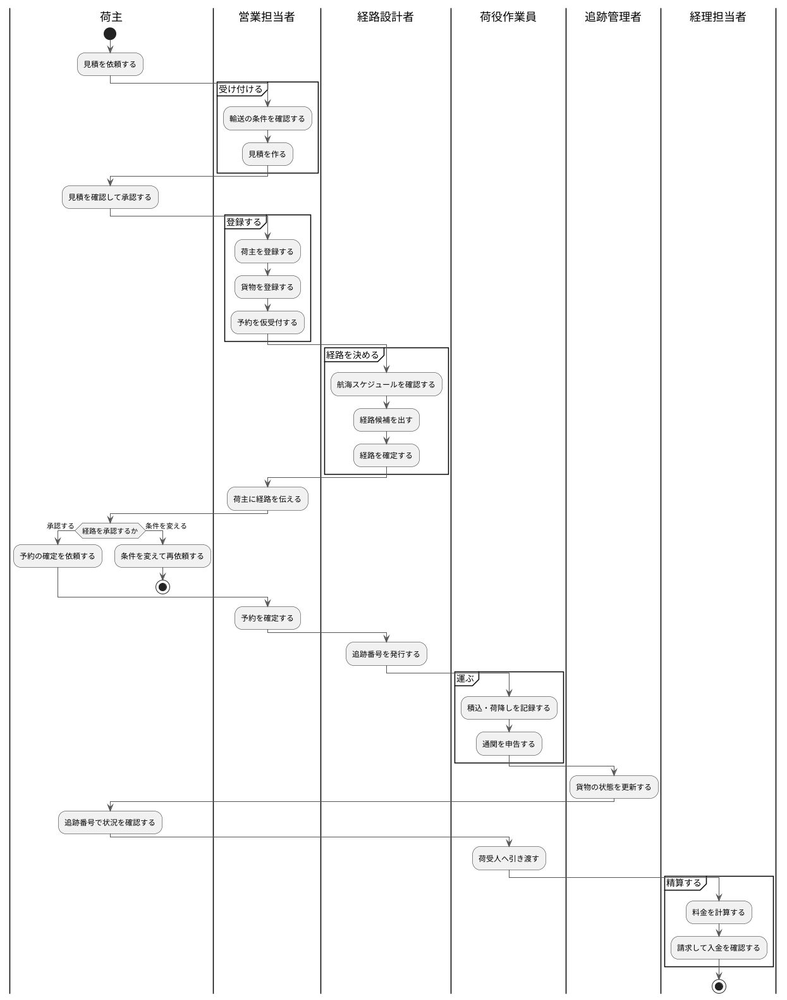

# 01 業務フロー

このシステムは、荷主から貨物を預かってお届けし、精算するまでの一連の仕事を支えます。本章は**その流れ全体**と、**どの工程でどの画面を使うか**を示します。

自分の担当の操作手順を知りたい場合は、下の表から該当する章へ進んでください。

## 全体の流れ {#overview}

## 工程と画面の対応 {#steps}

| # | 工程 | 担当 | 使う画面 | 状況 |
| :--- | :--- | :--- | :--- | :--- |
| 0 | システムを使い始める | 全担当 | [2.1 ログインする](02-ログイン.md#login) | 使えます |
| 1 | 見積を作る | 営業担当者 | 見積管理 | 準備中 |
| 2 | 荷主を登録する | 営業担当者 | [3.2 荷主を登録する](03-荷主管理.md#register-shipper) | 使えます |
| 3 | 貨物を登録して予約を仮受付する | 営業担当者 | [4.2 貨物予約を登録する](04-貨物予約.md#register-booking) | 使えます |
| 4 | 航海スケジュールを登録する | 経路設計者 | [5.2 航海スケジュールを登録する](05-航海スケジュール.md#register-voyage) | 使えます |
| 5 | **経路を決めて予約に紐付ける** | 経路設計者 | [6.1 経路の候補を見る](06-経路設計.md#candidates) | **今回から、候補を出すところまで使えます**（選んで確定するのは準備中） |
| 6 | 予約を確定する | 営業担当者 | 貨物予約 | 準備中 |
| 7 | 追跡番号を発行する | 経路設計者 | 経路設計 | 準備中 |
| 8 | 荷役作業を記録する | 荷役作業員 | 荷役管理 | 準備中 |
| 9 | 通関を申告・管理する | 荷役作業員・追跡管理者 | 通関管理 | 準備中 |
| 10 | 貨物の状態を更新する | 追跡管理者 | 貨物状態管理 | 準備中 |
| 11 | 貨物の状況を確認する | 荷主・荷受人 | 貨物追跡（ログイン不要でも確認できます） | 準備中 |
| 12 | 料金を計算して精算する | 経理担当者 | 精算管理 | 準備中 |
| — | 作業を終える | 全担当 | [2.2 ログアウトする](02-ログイン.md#logout) | 使えます |

> 「準備中」の画面はメニューに表示されますが、まだ開けません。順次使えるようになります。
> どの画面が今使えるかは、ログイン後のダッシュボードでも確認できます。

## 通常の流れから外れるとき {#exceptions}

| できごと | 担当 | 使う画面 | 状況 |
| :--- | :--- | :--- | :--- |
| 荷主が予約をキャンセルしたい | 営業担当者・追跡管理者 | 貨物予約・キャンセル承認 | 準備中 |
| 貨物が遅延・破損・紛失した | 追跡管理者 | 貨物状態管理 | 準備中 |
| 貨物が違う港に届いた（誤配） | 追跡管理者・経路設計者 | 貨物状態管理・経路設計 | 準備中 |
| 通関で留め置かれた | 荷役作業員・追跡管理者 | 通関管理 | 準備中 |
| ログインできなくなった | 全担当 | [2.3 ログインできないとき](02-ログイン.md#cannot-login) | 使えます |

> 輸送が始まった後のキャンセルは、貨物をどこで降ろすかの判断と料金の算定を伴うため、
> **追跡管理者の承認**が必要です。営業担当者の操作だけでは完了しません。

## 担当ごとの関わり方 {#by-role}

| 担当 | 主に関わる工程 |
| :--- | :--- |
| 営業担当者 | 1・2・3・6（見積から予約の確定まで。荷主との窓口） |
| 経路設計者 | 4・5・7（どの船でどう運ぶかを決める） |
| 荷役作業員 | 8・9（現場で貨物を扱い、記録する） |
| 追跡管理者 | 9・10（貨物の状態を管理し、例外に対応する） |
| 経理担当者 | 12（料金の計算と入金の確認） |
| 荷主 | 依頼・承認・状況確認 |
| 荷受人 | 11（追跡番号での状況確認のみ。ログインは不要です） |

---

**正典**: 本章の流れは `docs/requirements/business_usecase.md` と `docs/requirements/requirements_definition.md` の業務フローに対応します。業務の定義が変わった場合は、そちらを先に更新してください。
