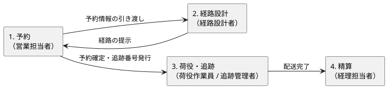
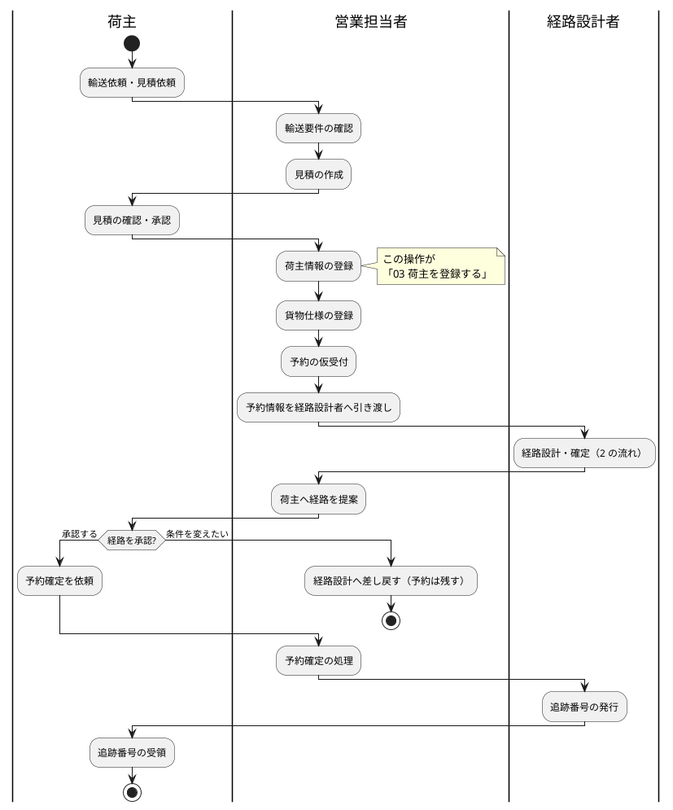
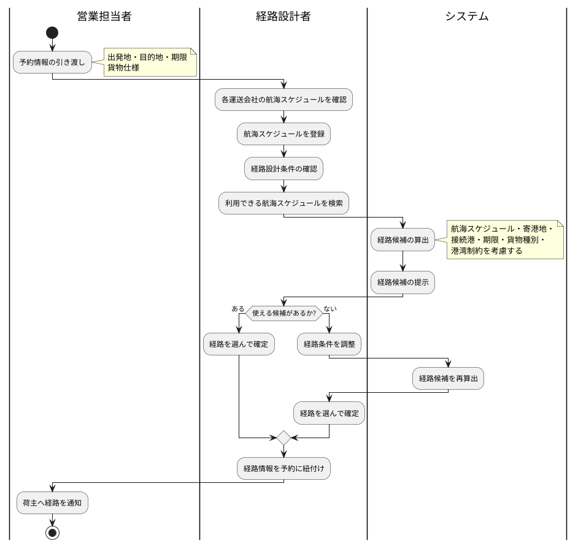
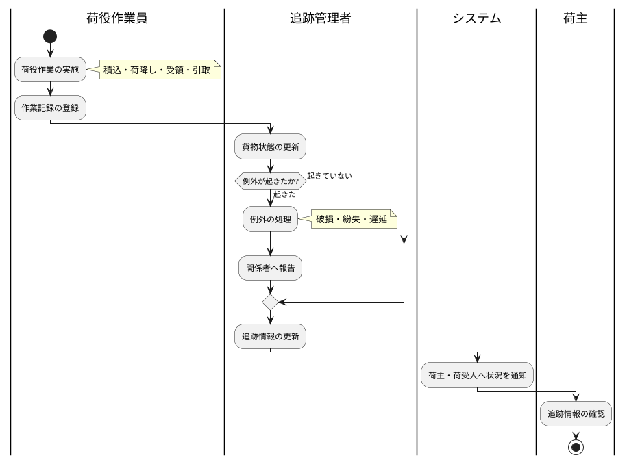
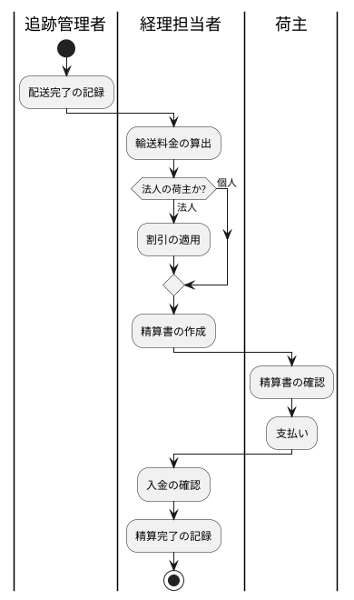

# 01 業務フロー

この章は、貨物 1 件が「依頼を受ける」から「代金を受け取る」までの流れを示します。自分の担当がどこに位置するか、前後で誰が何をしているかを確かめるために読んでください。

**流れの記述は要件定義（`docs/requirements/requirements_definition.md`）の業務フローに対応します。** 業務が変わったときは要件定義を先に直し、この章を合わせます。

## 全体の流れ

業務は 4 つに分かれ、この順につながります。

| 業務 | 主な担当 | 始まり | 終わり |
| :--- | :--- | :--- | :--- |
| 1. 予約 | 営業担当者 | 荷主からの輸送依頼・見積依頼 | 予約確定・追跡番号の受け渡し |
| 2. 経路設計 | 経路設計者 | 予約情報の引き渡し | 経路を予約に紐付ける |
| 3. 荷役・追跡 | 荷役作業員・追跡管理者 | 積込作業 | 配送完了の記録 |
| 4. 精算 | 経理担当者 | 配送完了 | 入金確認・精算完了 |

## いま使える範囲

**このシステムで操作できるのは、上の「1. 予約」の受付から「2. 経路設計」の荷主への通知までです。** 予約の確定より先の業務は順次追加されます。

| 業務 | 操作 | 対応する章 | 現時点 |
| :--- | :--- | :--- | :--- |
| 共通 | ログイン・ログアウト | [02 ログインとログアウト](02-ログインとログアウト.md) | **使えます** |
| 1. 予約 | 荷主の登録・一覧 | [03 荷主を登録する](03-荷主を登録する.md) | **使えます** |
| 共通 | 反映されなかったものの確認 | [04 要確認一覧を確認する](04-要確認一覧を確認する.md) | **使えます** |
| 1. 予約 | 貨物予約の登録・一覧・詳細（仮受付まで） | [05 貨物予約を登録する](05-貨物予約を登録する.md) | **使えます** |
| 共通 | 利用者の状態確認・ロック解除 | [06 利用者を管理する](06-利用者を管理する.md) | **使えます**（管理者のみ） |
| 2. 経路設計 | 航海スケジュールの登録・更新・キャンセル | [07 航海スケジュールを登録する](07-航海スケジュールを登録する.md) | **使えます**（経路設計者のみ） |
| 1. 予約 | 経路設計への引き渡し・作業一覧 | [08 経路設計に引き渡す](08-経路設計に引き渡す.md) | **使えます** |
| 2. 経路設計 | 経路候補の確認・条件の調整・経路の確定・営業への差し戻し | [09 経路を設計する](09-経路を設計する.md) | **使えます**（経路設計者のみ） |
| 1. 予約 | 確定経路の荷主への通知・経路設計への差し戻し | [10 荷主に経路を通知する](10-荷主に経路を通知する.md) | **使えます**（営業担当者のみ） |
| 1. 予約 | 見積の作成・予約の確定 | — | 未提供 |
| 3. 荷役・追跡 | 荷役作業の記録・貨物状態の更新・追跡照会 | — | 未提供 |
| 4. 精算 | 料金の算出・精算書の作成・入金の記録 | — | 未提供 |

未提供の業務は、これまでどおりの手順（電話・メール・既存の台帳）で進めてください。

## 1. 予約の流れ

荷主の輸送依頼を受けてから、追跡番号を渡すまでです。

**荷主の登録は予約の前提です。** 荷主が登録されていないと、その先の貨物仕様の登録に進めません。手順は [03 荷主を登録する](03-荷主を登録する.md) を参照してください。

**差し戻しても予約は残ります。** 条件を変えたい場合、予約を取り消して作り直す必要はありません。経路の検討だけをやり直します。

## 2. 経路設計の流れ

引き渡された予約に対して、実際に運べる経路を決めます。

**航海スケジュールの登録が先です。** 登録されていない航海は候補に出ません。経路が 1 つも出ないときは、まず条件ではなくスケジュールの登録漏れを疑ってください。

## 3. 荷役・追跡の流れ

貨物が実際に動くあいだの記録です。

**作業記録が追跡情報のもとになります。** 記録が遅れると、荷主から見える状況もその分だけ古いままになります。

## 4. 精算の流れ

配送が終わってから、代金を受け取るまでです。

**割引は荷主の種別で決まります。** 法人として登録されていない荷主には割引が適用されません。種別の登録は [03 荷主を登録する](03-荷主を登録する.md) を参照してください。

## 一日の始め方

1. ログインします（[02 ログインとログアウト](02-ログインとログアウト.md)）
2. ダッシュボードの「今日の作業」から、その日に扱う画面へ進みます
3. **要確認一覧に件数が出ていたら先に片づけます。** 放置すると、登録したつもりのものが登録されていない状態が続きます（[04 要確認一覧を確認する](04-要確認一覧を確認する.md)）

## 関連する章

- [00 はじめに](00-はじめに.md) — 担当ごとに使える画面
- [03 荷主を登録する](03-荷主を登録する.md) — 予約の入口にあたる操作
- [04 要確認一覧を確認する](04-要確認一覧を確認する.md) — 反映されなかったものへの対応
