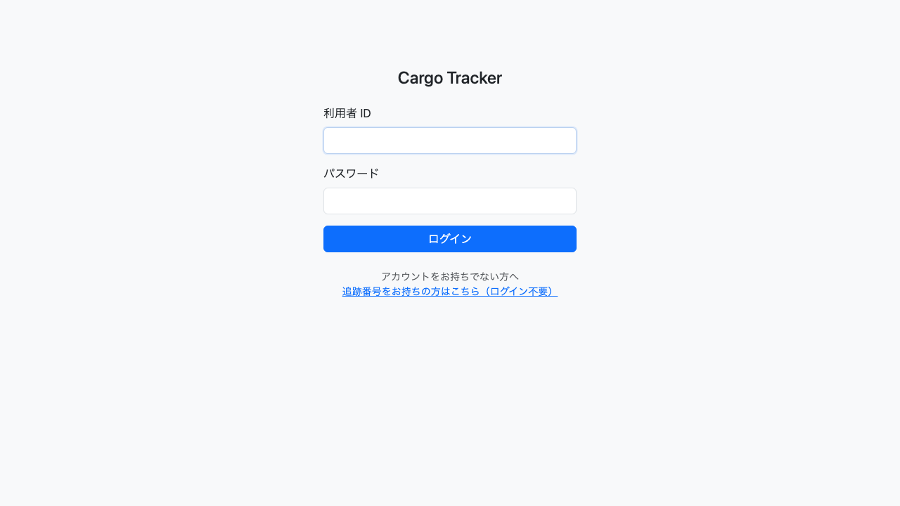
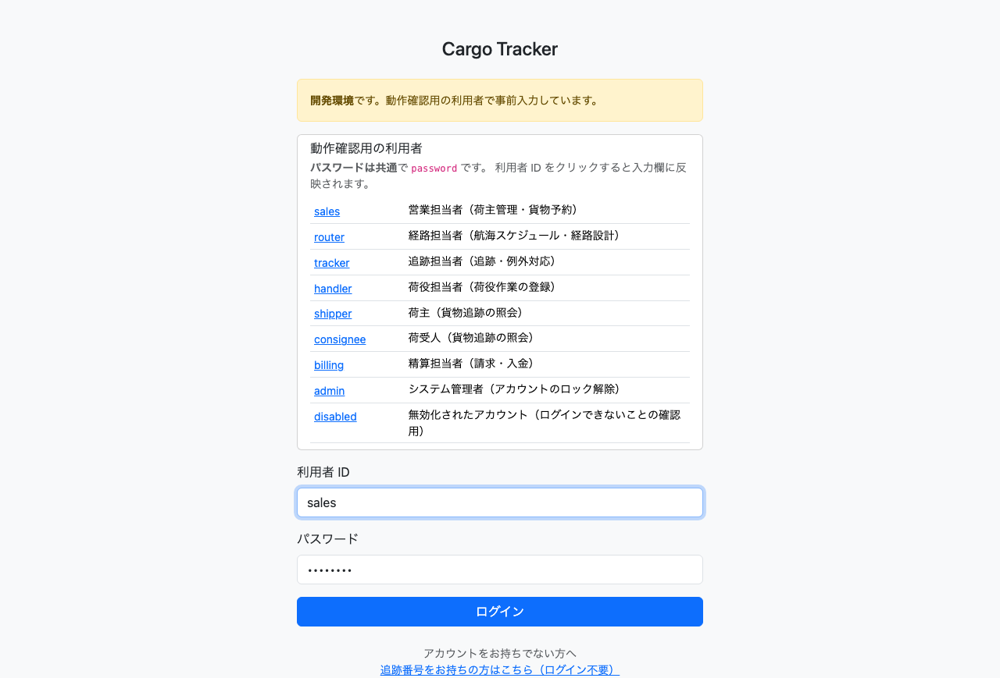
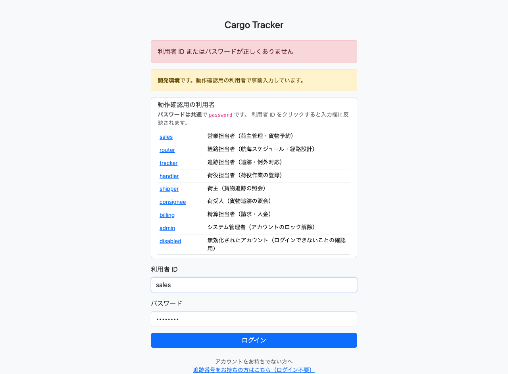
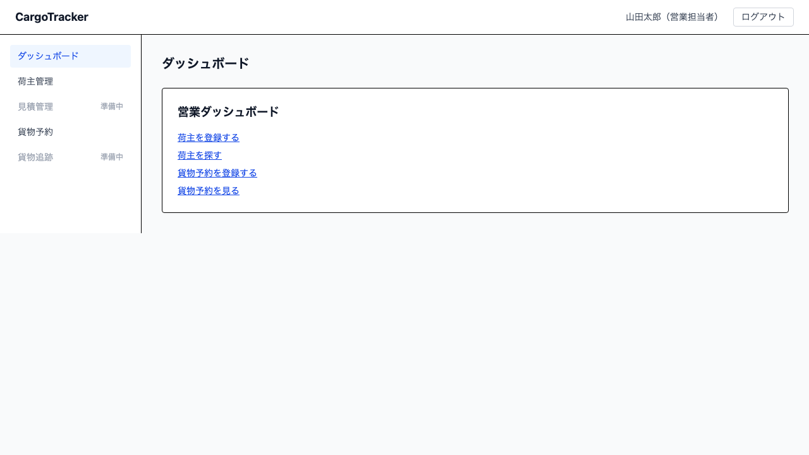

# 02. ログイン

システムを利用するための入口です。ログインすると、自分のロールに応じた画面だけが表示されます。

本章は [WF-1（システムにログインする）](01-業務フロー.md#工程と章の対応) の工程に対応します。

## 画面の開き方

ブラウザでシステムの URL を開きます。ログインしていない状態でどの画面を開いても、ログイン画面へ自動的に移動します。

| 画面 | 役割 | 節 |
| :--- | :--- | :--- |
| ログイン | 利用者 ID とパスワードで認証する | [2.1](#21-ログインする) |
| ダッシュボード | ログイン後の入口。ロール別の作業を開く | [2.2](#22-ダッシュボードから作業を始める) |
| ログアウト | 利用を終える | [2.3](#23-ログアウトする) |

パスワードの変更・利用者の追加は管理者が行います。本システムの画面からは操作できません。

## 2.1 ログインする

### この画面でできること

- 利用者 ID とパスワードを入力して、システムの利用を開始します。

### 画面の開き方

- ブラウザでシステムの URL を開きます（URL: `/login`）

### 画面の説明

| # | 項目 | 説明 |
| :--- | :--- | :--- |
| ① | 利用者 ID | 管理者から通知された ID を入力します |
| ② | パスワード | 入力した文字は伏せ字で表示されます |
| ③ | 「ログイン」 | 入力した内容で認証します |
| ④ | 「追跡番号をお持ちの方はこちら」 | **ログインせずに**貨物の状況を照会する画面へ移動します（[09. 貨物追跡](09-貨物追跡.md)） |

### 操作手順

1. 「利用者 ID」に自分の ID を入力します。
2. 「パスワード」を入力します。
3. 「ログイン」をクリックします。
4. ダッシュボードが表示されればログイン完了です。

### 注意・補足

- **開発環境では、動作確認用の利用者 ID とパスワードが最初から入力されています。** その場合は画面上部に「開発環境です。動作確認用の利用者で事前入力しています。」と表示されます。この表示が出ていない環境では、自分の ID とパスワードを入力してください。
- 開発環境では、画面上部に「動作確認用の利用者」の一覧が表示されます。ロールごとに ID が分かれており、利用者 ID をクリックすると入力欄に反映されます。**この一覧が出るのは開発環境だけです。**

  

  一覧の内容は開発者向けの情報のため、[開発環境セットアップ手順書](../operation/開発環境セットアップ手順書.md) を参照してください。
- 認証に失敗すると「利用者 ID またはパスワードが正しくありません」と表示されます。**このメッセージは、ID が存在しない場合・パスワードが違う場合・アカウントがロックされている場合のすべてで同じです。** 区別して表示すると、その ID が実在することを第三者に教えることになるためです。
- **パスワードを続けて 5 回間違えると、アカウントが 30 分間ロックされます。** ロック中は正しいパスワードを入力してもログインできません（[2.4](#24-アカウントがロックされたとき)）。
- 心当たりのないログイン失敗が続く場合は、管理者に連絡してください。

## 2.2 ダッシュボードから作業を始める

### この画面でできること

- ログイン後の入口です。**自分のロールで担当する作業への入口**がカードとして並びます。

### 画面の開き方

- ログインすると自動的に表示されます（URL: `/`）
- 他の画面からは、画面上部の「ダッシュボード」をクリックします

### 画面の説明

| # | 項目 | 説明 |
| :--- | :--- | :--- |
| ① | 「Cargo Tracker」 | クリックするとダッシュボードに戻ります |
| ② | メニュー | 自分のロールで利用できる画面が並びます |
| ③ | 「ログアウト」 | システムの利用を終えます |
| ④ | 利用者名 | ログインしている利用者 ID が表示されます |
| ⑤ | 作業カード | ロール別の作業入口。「開く」でその画面へ移動します |

### 操作手順

1. 担当する作業のカードを探します。
2. カードの「開く」をクリックします。

### 注意・補足

- **表示されるメニューとカードはロールによって変わります。** 営業担当者には「荷主管理」が表示され、他のロールには表示されません。あるはずの項目が見えないときは、自分のロールを確認してください（[00. はじめに](00-はじめに.md#利用者-id-とロール)）。
- 件数のサマリー表示は今後の提供で追加します。

## 2.3 ログアウトする

### この画面でできること

- システムの利用を終え、他の人が同じ端末を使っても業務画面を見られないようにします。

### 操作手順

1. 画面右上の「ログアウト」をクリックします。
2. ログイン画面に戻り、「ログアウトしました」と表示されます。

### 注意・補足

- **共有端末では、席を離れる前に必ずログアウトしてください。**
- ログアウト後にブラウザの「戻る」で業務画面を表示しようとしても、内容は表示されずログイン画面に戻ります。

## 2.4 アカウントがロックされたとき

### この画面でできること

- ロックされたアカウントの復旧方法を確認します。

### 注意・補足

| 状況 | 対処 |
| :--- | :--- |
| パスワードを 5 回続けて間違えた | **30 分待ってから、正しいパスワードでログインします。** 待つ間に何度試してもロックは延長されません |
| 30 分待ってもログインできない | パスワードそのものが違う可能性があります。[システム管理担当窓口](00-はじめに.md#システム管理担当窓口)に確認してください |
| 急いでいて 30 分待てない | **解除の手段は現在ありません。** 30 分お待ちください |

- ロックの解除を待つ間に何度試しても、ロック時間は延びません。正当な利用者が復帰できなくなることを避けるためです。
- **一度でもログインに成功すると、失敗の回数は 0 に戻ります。** 4 回間違えた後に成功すれば、次はまた 5 回まで猶予があります。
