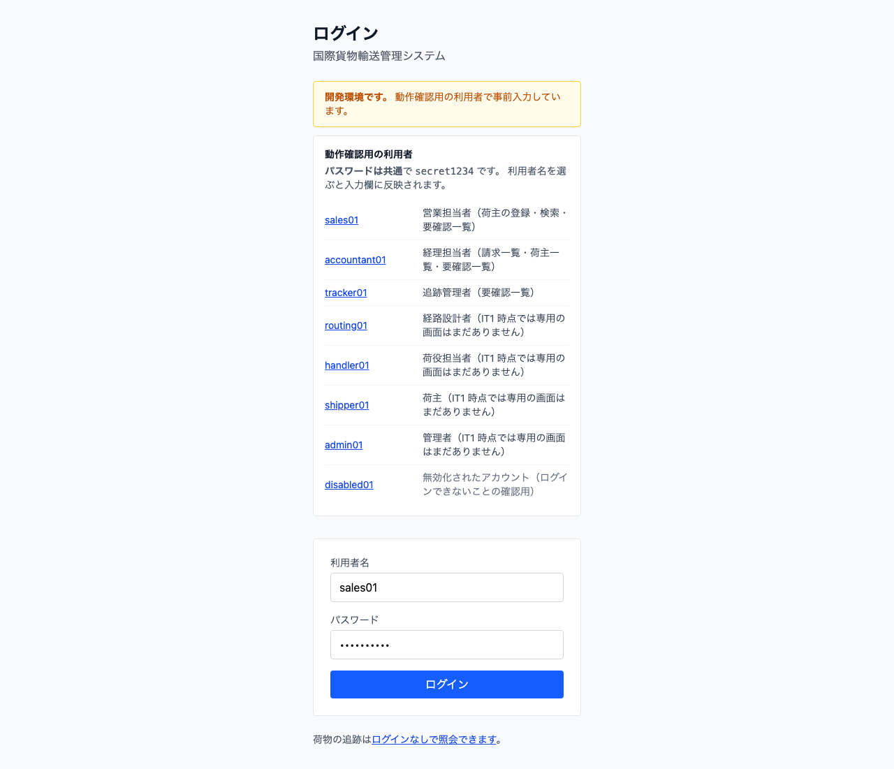
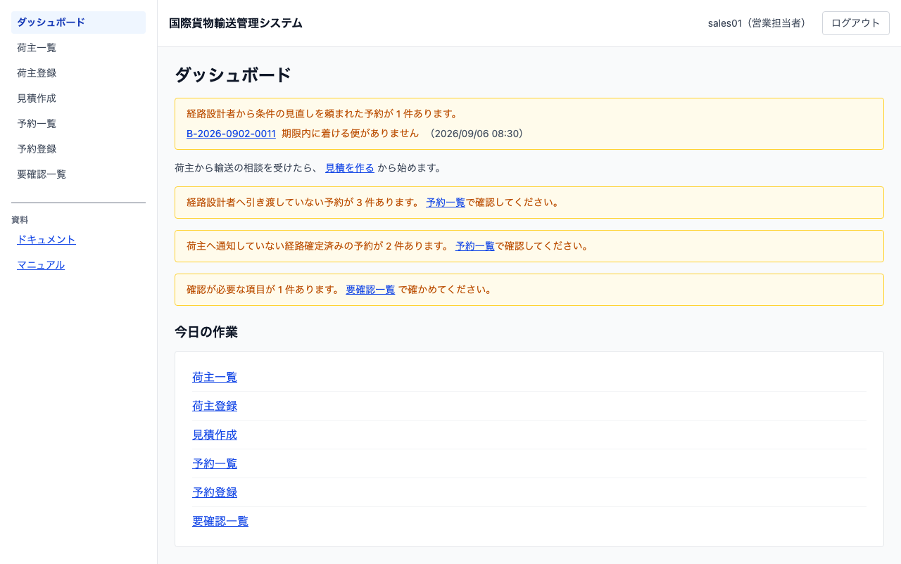

# 02 ログインとログアウト

## この章でできること

システムにログインし、作業が終わったらログアウトします。

## ログインする

1. ブラウザでシステムの URL を開きます。ログイン画面が出ます

   

2. 「利用者名」と「パスワード」を入力します
3. `[ログイン]` を押します
4. ダッシュボードが開きます。左側のメニューには、担当に応じた画面だけが出ます

   

## ログアウトする

1. 画面右上の `[ログアウト]` を押します
2. ログイン画面に戻ります

**ログアウトしたあとにブラウザの「戻る」を押しても、業務画面は開きません。** 共用の端末でも、次の人に前の画面が見えることはありません。

## うまくいかないとき

### 「利用者名またはパスワードが正しくありません」と出る

入力を確かめて、もう一度入力してください。**このメッセージは、利用者名が違うときもパスワードが違うときも同じように出ます。** どちらが違うかは画面では分かりません。

何度も失敗すると、一時的にログインできなくなります。**画面のメッセージは変わりません。** 入力が正しいはずなのに同じメッセージのまま入れない場合は、しばらく時間をおくか、急ぐときは管理者に連絡してください。

### 「通信に失敗しました」と出る

ネットワークかシステム側の問題です。しばらく待ってからやり直してください。繰り返す場合は管理者に連絡してください。

### メニューに使いたい画面が出ない

その画面は担当（ロール）に割り当てられていません。管理者に依頼してください。URL を直接入力しても開けません。

## 荷物の追跡だけしたい場合

**追跡番号の照会はログインなしで使えます。** ログイン画面の「ログインなしで照会できます」から進んでください。

なお、**照会そのものは次のイテレーションで使えるようになります。** 現在は入口の画面だけが用意されています。

## 関連する章

- [03 荷主を登録する](03-荷主を登録する.md)
