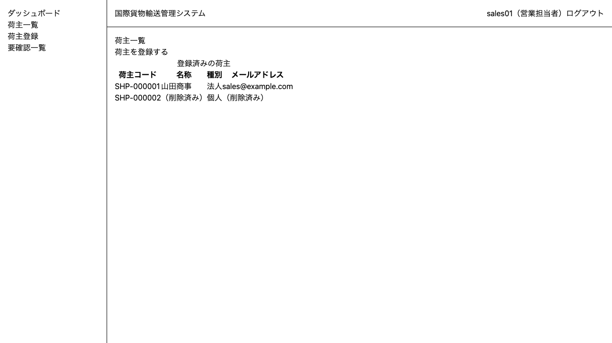
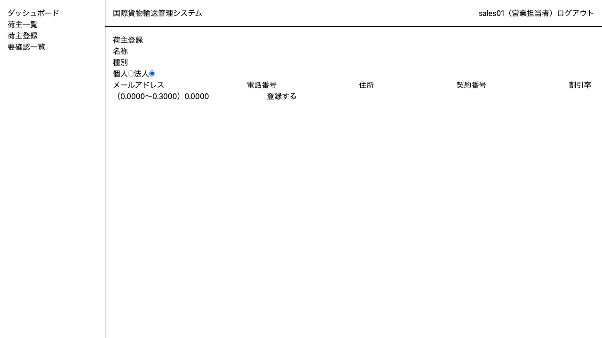

# 03 荷主を登録する

## この章でできること

荷主（貨物の依頼主）を登録し、登録済みの荷主を一覧で確認します。営業担当者の操作です。

## 荷主一覧を見る

1. 左のメニューから `[荷主一覧]` を選びます

   

一覧には荷主コード・名称・種別・メールアドレスが出ます。荷主コードは登録時にシステムが採番します。

## 荷主を登録する

1. 荷主一覧で `[荷主を登録する]` を押します

   

2. 「名称」を入力します
3. 「種別」で `個人` か `法人` を選びます。**法人を選ぶと「契約番号」と「割引率」が現れます**
4. 「メールアドレス」を入力します
5. 必要に応じて「電話番号」「住所」を入力します
6. `[登録する]` を押します
7. 荷主一覧に戻ります。**登録した荷主が出るまで数秒かかります**

## うまくいかないとき

### 「このメールアドレスは既に登録されています」と出る

同じメールアドレスの荷主が既にあります。次のどちらかを選んでください。

- **別の荷主だった場合** — メールアドレスを直して登録し直します
- **それでも登録する場合** — もう一度 `[登録する]` を押すと、そのまま登録します。ただし後から要確認一覧に「メールアドレスの重複」として出ることがあります（[04 要確認一覧を確認する](04-要確認一覧を確認する.md)）

### 「割引率は 0.0000〜0.3000 の範囲です」と出る

割引率は 0.0000 から 0.3000（0% から 30%）までです。範囲内の値を入力してください。

### 一覧に登録した荷主が出ない

数秒待って画面を開き直してください。それでも出ない場合は [04 要確認一覧を確認する](04-要確認一覧を確認する.md) を見てください。登録が受け付けられたのに反映されなかった理由が出ています。

### 名称やメールアドレスが「（削除済み）」になっている

その荷主は個人情報の削除を受けたため、氏名・メールアドレス・電話番号・住所が読めなくなっています。**取り消せません。** 荷主コードや種別は残ります。

## 関連する章

- [04 要確認一覧を確認する](04-要確認一覧を確認する.md)
