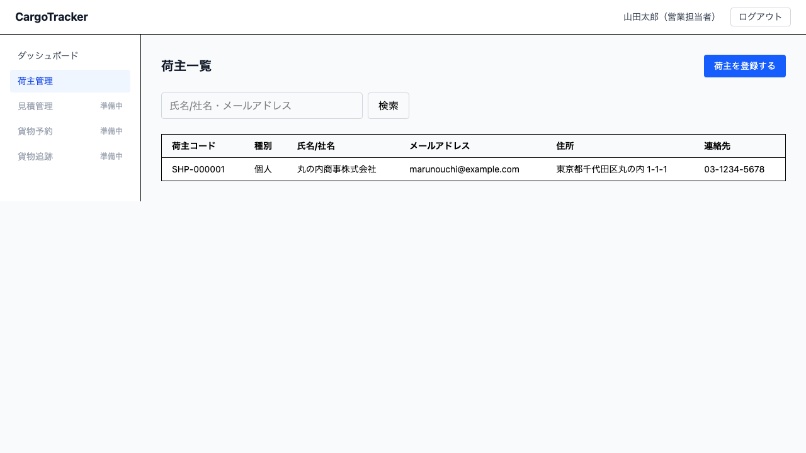
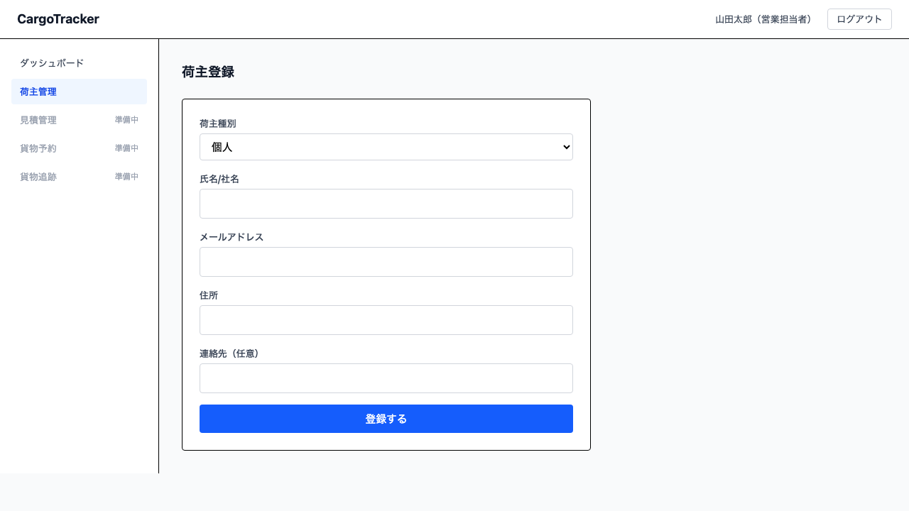
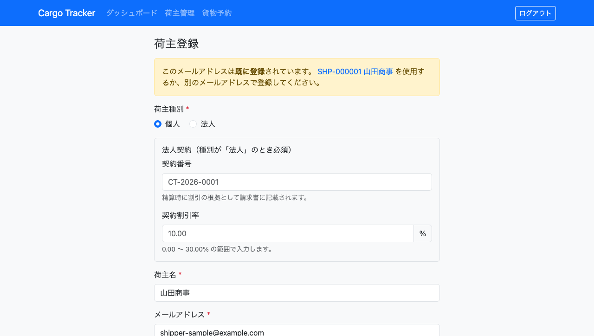

# 03 荷主管理

貨物を発送するお客様（荷主）の情報を登録・確認する画面です。**営業担当者**が使います。

一度登録すると、次回以降の予約で荷主情報を入力し直す必要がなくなります。

本章は [01 業務フロー](01-業務フロー.md#steps) の**工程 2（荷主を登録する）**に対応します。
見積を承認いただいた後、貨物の登録（工程 3）に進む前に行う作業です。貨物の登録は次のリリースで
対応するため、現在は荷主の登録までを行います。

## 画面の開き方

メニュー「荷主管理」（URL: `/booking/shippers`）、または営業ダッシュボードの「荷主を登録する」「荷主を探す」から開きます。

| 節 | 内容 |
| :--- | :--- |
| [3.1](#search-shipper) | 荷主を探す |
| [3.2](#register-shipper) | 荷主を登録する |
| [3.3](#duplicate-shipper) | 同じメールアドレスの荷主が既にあるとき |

---

## 3.1 荷主を探す {#search-shipper}

### この画面でできること

登録済みの荷主を一覧で確認し、氏名/社名やメールアドレスで絞り込みます。予約を受ける前に、その荷主が既に登録されているかを確認する場面で使います。

### 画面の開き方

メニュー「荷主管理」（URL: `/booking/shippers`）

### 画面の説明

| # | 項目 | 説明 |
|---|------|------|
| ① | 検索欄 | 氏名/社名またはメールアドレスの一部を入力します |
| ② | 「検索」 | 入力した内容で絞り込みます |
| ③ | 「荷主を登録する」 | 荷主登録の画面へ移動します |
| ④ | 一覧 | 荷主コード・種別・氏名/社名・メールアドレス・住所・連絡先が並びます |

### 操作手順

1. 検索欄に探したい荷主の氏名/社名またはメールアドレスの一部を入力します
2. 「検索」をクリックします
3. 条件に合う荷主が一覧に表示されます

### 注意・補足

- 一覧は**新しく登録した順**に並びます。登録した直後に一覧へ戻ると、その荷主が先頭に表示されます
- 一覧の上に件数が表示されます。絞り込み中は条件も併せて表示されるため、「絞り込めていないのに 0 件」といった読み違いを防げます
- 条件に合う荷主がない場合は「条件に合う荷主が見つかりません。別のキーワードで探すか、新しく登録してください。」と表示されます
- 検索欄を空にして「検索」をクリックすると、すべての荷主が表示されます
- 大文字と小文字は区別しません
- 探している荷主が見つからない場合は、まだ登録されていない可能性があります。「荷主を登録する」から登録してください

---

## 3.2 荷主を登録する {#register-shipper}

### この画面でできること

新しい荷主の情報を登録します。登録すると荷主コードが発行され、以降の予約でその荷主を選べるようになります。

### 画面の開き方

メニュー「荷主管理」→「荷主を登録する」（URL: `/booking/shippers/new`）

### 画面の説明

| # | 項目 | 説明 |
|---|------|------|
| ① | 「荷主種別」 | 「個人」または「法人」を選びます |
| ② | 「氏名/社名」 | 必須です |
| ③ | 「メールアドレス」 | 必須です。連絡と重複確認に使います |
| ④ | 「住所」 | 必須です |
| ⑤ | 「連絡先（任意）」 | 電話番号です。入力しなくても登録できます |
| ⑥ | 「登録する」 | 入力内容で登録します |

### 操作手順

1. 「荷主種別」で「個人」または「法人」を選びます
2. 「氏名/社名」「メールアドレス」「住所」を入力します
3. 必要に応じて「連絡先」を入力します
4. 「登録する」をクリックします
5. 荷主コード（`SHP-` から始まる番号）が表示されます

登録後の画面では、そのまま「続けて登録する」で次の荷主を入力するか、「荷主一覧へ戻る」で一覧に戻れます。

### 注意・補足

- 法人の契約番号と割引率の登録は、次のリリースで対応します。「法人」を選ぶと、その場に「契約番号と割引率の登録は次のリリースで対応します」と表示されます
- 登録に失敗した場合は「登録できませんでした。時間をおいて再度お試しください。」と表示されます。入力内容の誤りではなく、システム側の一時的な不調です
- 荷主コードはシステムが自動で発行します。手入力はできません
- 同じメールアドレスの荷主が既にある場合は、[3.3](#duplicate-shipper) の確認画面が表示されます

---

## 3.3 同じメールアドレスの荷主が既にあるとき {#duplicate-shipper}

### この画面でできること

入力したメールアドレスの荷主が既に登録されている場合、その荷主の情報を確認したうえで、**既存の荷主を使うか、別の荷主として新しく登録するか**を選びます。

同姓同名の別のお客様や、同じ連絡先を使う別部署のような場合があるため、システムは自動では判断しません。

### 画面の説明

| # | 項目 | 説明 |
|---|------|------|
| ① | 既存の荷主の情報 | 荷主コード・種別・氏名/社名・住所・連絡先が表示されます |
| ② | 「既存の荷主を使う」 | 新しく登録せず、荷主一覧に戻ります |
| ③ | 「それでも新規で登録する」 | 別の荷主として登録し、新しい荷主コードを発行します |

### 操作手順

1. 表示された既存の荷主の情報を確認します
2. 同じお客様であれば「既存の荷主を使う」をクリックします（そのメールアドレスで絞り込んだ一覧に移ります）
3. 別のお客様であれば「それでも新規で登録する」をクリックします

### 注意・補足

- 「それでも新規で登録する」を選ぶと、同じメールアドレスの荷主が 2 件並ぶことになります。後から見分けられるよう、氏名/社名に部署名などを添えることをおすすめします
- どちらか判断がつかない場合は、既存の荷主の住所・連絡先をお客様に確認してから選んでください
