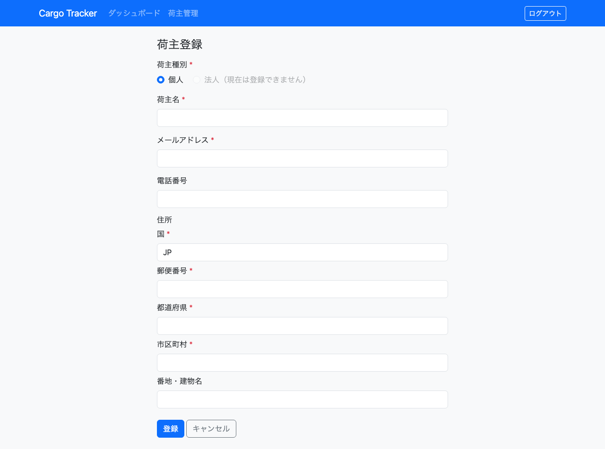
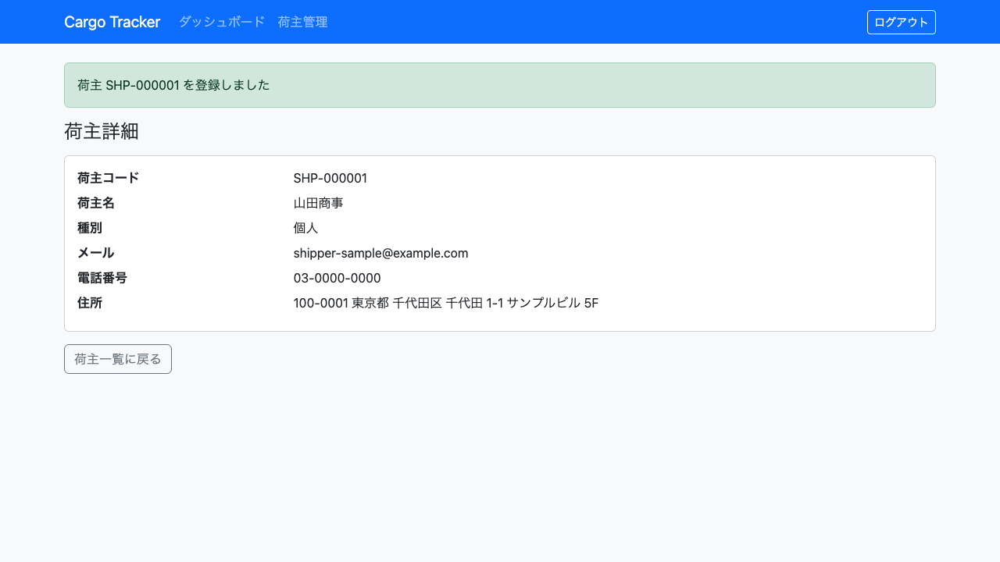

# 03. 荷主管理

貨物の依頼元である**荷主**を登録し、確認する画面です。営業担当者が利用します。

本章は [WF-2（荷主を登録する）](01-業務フロー.md#工程と章の対応) の工程に対応します。**貨物を予約するには、その荷主が登録されている必要があります。**

## 画面の開き方

- メニュー「荷主管理」（URL: `/shippers`）
- ダッシュボードの「荷主管理」カードの「開く」

| 画面 | 役割 | 節 |
| :--- | :--- | :--- |
| 荷主一覧 | 登録済みの荷主を確認する | [3.1](#31-荷主を探す) |
| 荷主登録 | 新しい荷主を登録する | [3.2](#32-荷主を登録する) |
| 荷主詳細 | 1 件の荷主の内容を確認する | [3.3](#33-荷主の内容を確認する) |

荷主の**契約**（契約番号・契約割引率）は法人荷主の項目であり、今後のイテレーションで対応します。本章で登録できるのは個人荷主です。

## 3.1 荷主を探す

### この画面でできること

- 登録済みの荷主を一覧で確認します。新しい依頼を受けたときに、**すでに登録されている取引先かどうかをここで確かめます**。

### 画面の開き方

- メニュー「荷主管理」（URL: `/shippers`）

### 画面の説明

| # | 項目 | 説明 |
| :--- | :--- | :--- |
| ① | 「+ 新規荷主登録」 | 新しい荷主を登録する画面へ移動します |
| ② | 荷主コード | システムが発行する荷主の番号です（例: SHP-000001） |
| ③ | 荷主名 | 登録した荷主の名称です |
| ④ | 種別 | 「個人」または「法人」です |
| ⑤ | メール | 連絡先のメールアドレスです |
| ⑥ | 「詳細」 | その荷主の詳細画面へ移動します |

### 操作手順

1. メニュー「荷主管理」をクリックします。
2. 一覧から目的の荷主を探します。
3. 内容を確認するときは、その行の「詳細」をクリックします。

### 注意・補足

- 荷主が 1 件も登録されていないときは「荷主が登録されていません。まず荷主を登録してください。」と表示されます。エラーではありません。
- **荷主コードは登録時にシステムが発行します。** 利用者が指定することはできません。

## 3.2 荷主を登録する

### この画面でできること

- 新しい荷主を登録します。登録すると荷主コードが発行され、貨物の予約で指定できるようになります。

### 画面の開き方

- 荷主一覧の「+ 新規荷主登録」（URL: `/shippers/new`）

### 画面の説明

| # | 項目 | 必須 | 説明 |
| :--- | :--- | :--- | :--- |
| ① | 荷主種別 | 必須 | 「個人」を選びます。「法人」は現在登録できません（今後のイテレーションで対応します） |
| ② | 荷主名 | 必須 | 荷主の名称を入力します |
| ③ | メールアドレス | 必須 | 連絡先のメールアドレスです。**すでに登録されているものは使えません** |
| ④ | 電話番号 | 任意 | 連絡先の電話番号です |
| ⑤ | 国 | 必須 | 国コードを 2 文字で入力します（例: JP） |
| ⑥ | 郵便番号 | 必須 | 郵便番号を入力します |
| ⑦ | 都道府県 | 必須 | 都道府県を入力します |
| ⑧ | 市区町村 | 必須 | 市区町村を入力します |
| ⑨ | 番地・建物名 | 任意 | 番地や建物名を入力します |
| ⑩ | 「登録」 | — | 入力した内容で登録します |

### 操作手順

1. 荷主一覧で「+ 新規荷主登録」をクリックします。
2. 「荷主種別」で「個人」を選びます。
3. 「荷主名」「メールアドレス」を入力します。
4. 住所の「国」「郵便番号」「都道府県」「市区町村」を入力します。
5. 「登録」をクリックします。
6. 荷主詳細画面が表示され、発行された荷主コードを確認できます。

### 注意・補足

- **必須項目が空のまま「登録」をクリックすると、その項目が赤枠で示されます。** 入力し直して再度「登録」をクリックしてください。入力済みの内容は消えません。
- **すでに同じメールアドレスで登録されている場合、登録は行われず、既存の荷主が画面上部に提示されます。**

  

  リンクをクリックすると既存の荷主の詳細を確認できます。同じ取引先であればその荷主をそのまま使い、別の取引先であれば別のメールアドレスで登録してください。**どちらを使うかは担当者が判断します。** システムが自動でどちらかに寄せることはありません。
- 「国」は 2 文字の国コードです。日本は `JP` です。

## 3.3 荷主の内容を確認する

### この画面でできること

- 1 件の荷主の登録内容を確認します。

### 画面の開き方

- 荷主一覧の「詳細」（URL: `/shippers/<荷主 ID>`）
- 荷主の登録を完了した直後にも表示されます

### 画面の説明

| # | 項目 | 説明 |
| :--- | :--- | :--- |
| ① | 荷主コード | システムが発行した荷主の番号です |
| ② | 荷主名 | 登録した名称です |
| ③ | 種別 | 「個人」または「法人」です |
| ④ | メール | 登録したメールアドレスです |
| ⑤ | 電話番号 | 未登録のときは「-」と表示されます |
| ⑥ | 住所 | 郵便番号・都道府県・市区町村・番地の順に表示されます |
| ⑦ | 「荷主一覧に戻る」 | 一覧へ戻ります |

### 操作手順

1. 荷主一覧で対象の行の「詳細」をクリックします。
2. 内容を確認します。
3. 「荷主一覧に戻る」で一覧へ戻ります。

### 注意・補足

- 登録内容の変更は今後のイテレーションで対応します。誤って登録した場合は管理者に連絡してください。
- 貨物の予約では**荷主コード**で荷主を指定します。予約の担当者に伝えるのはこの番号です。
