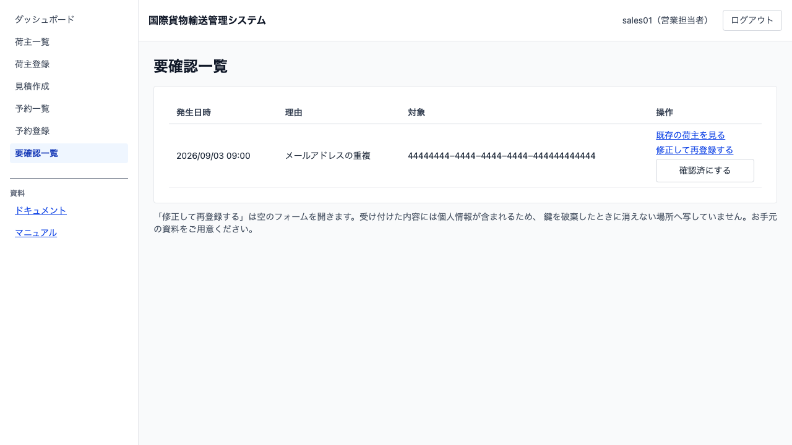

# 04 要確認一覧を確認する

## この章でできること

受け付けられたのに反映されなかったものを確認し、対応します。営業担当者・経理担当者・追跡管理者が使います。

## 要確認一覧を見る

1. 左のメニューから `[要確認一覧]` を選びます

   

一覧には発生日時・理由・対象・操作が出ます。**自分の担当宛のものが出ます。**

確認が必要なものが無いときは「確認が必要なものはありません」と出ます。

## 対応する

1. 「理由」を見て、何が起きたかを確かめます
2. 「操作」の `[修正して再登録する]` から、登録し直します

### 「メールアドレスの重複」

同じメールアドレスの荷主が既にあったため、登録は受け付けられましたが一覧には反映されていません。メールアドレスを直して登録し直してください。

> **`[修正して再登録する]` は空の登録画面を開きます。** 前に入力した氏名・住所・電話番号・契約番号は引き継がれません。**元の申込書やメールを手元に用意してから押してください。** 引き継ぐ改修は次のイテレーションで入ります。

## 放置するとどうなるか

**登録したつもりのものが登録されていない状態が続きます。** 一覧に出ないだけで、業務としては存在しないのと同じです。毎朝ここを見てから作業を始めてください。

## 関連する章

- [03 荷主を登録する](03-荷主を登録する.md)
