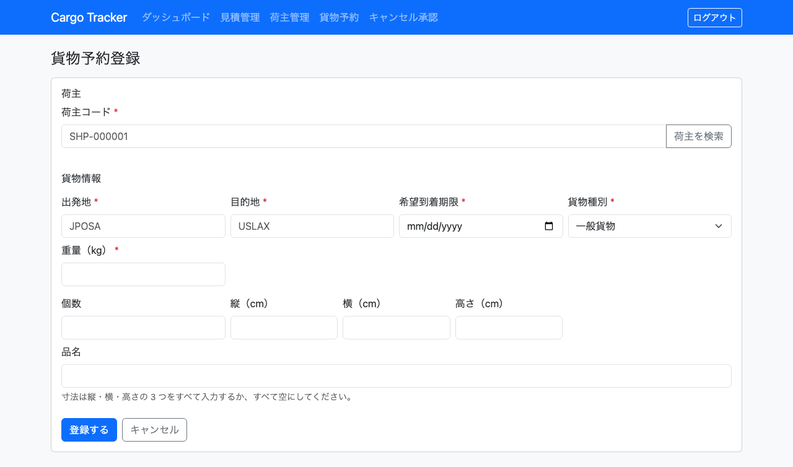
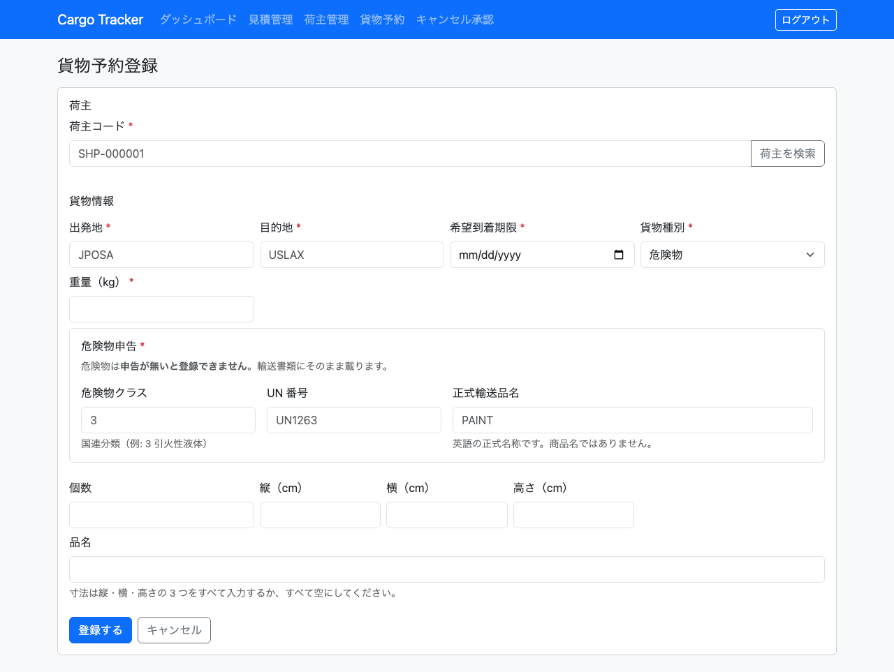
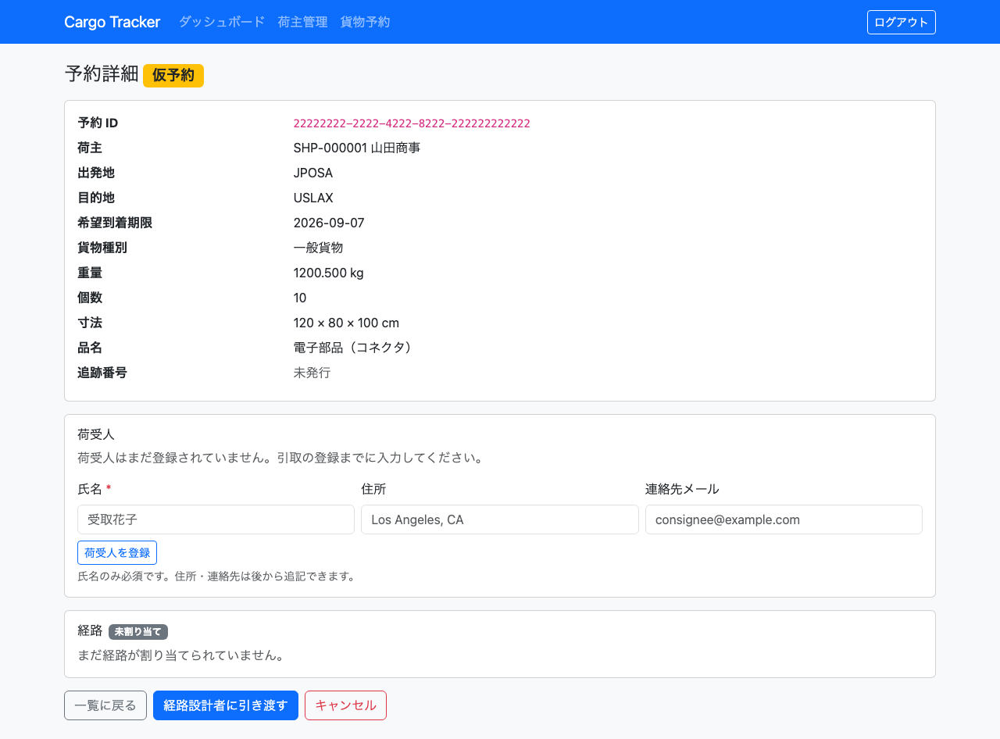
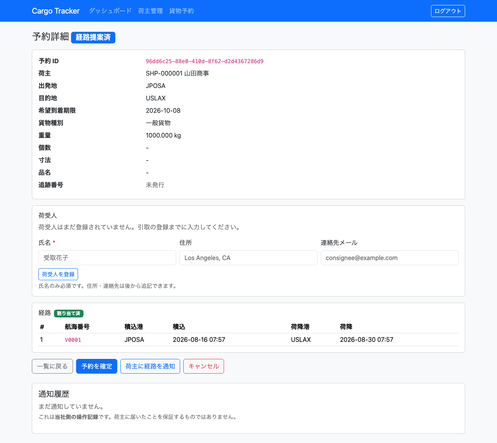
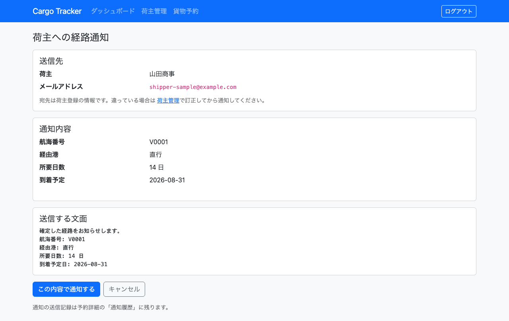
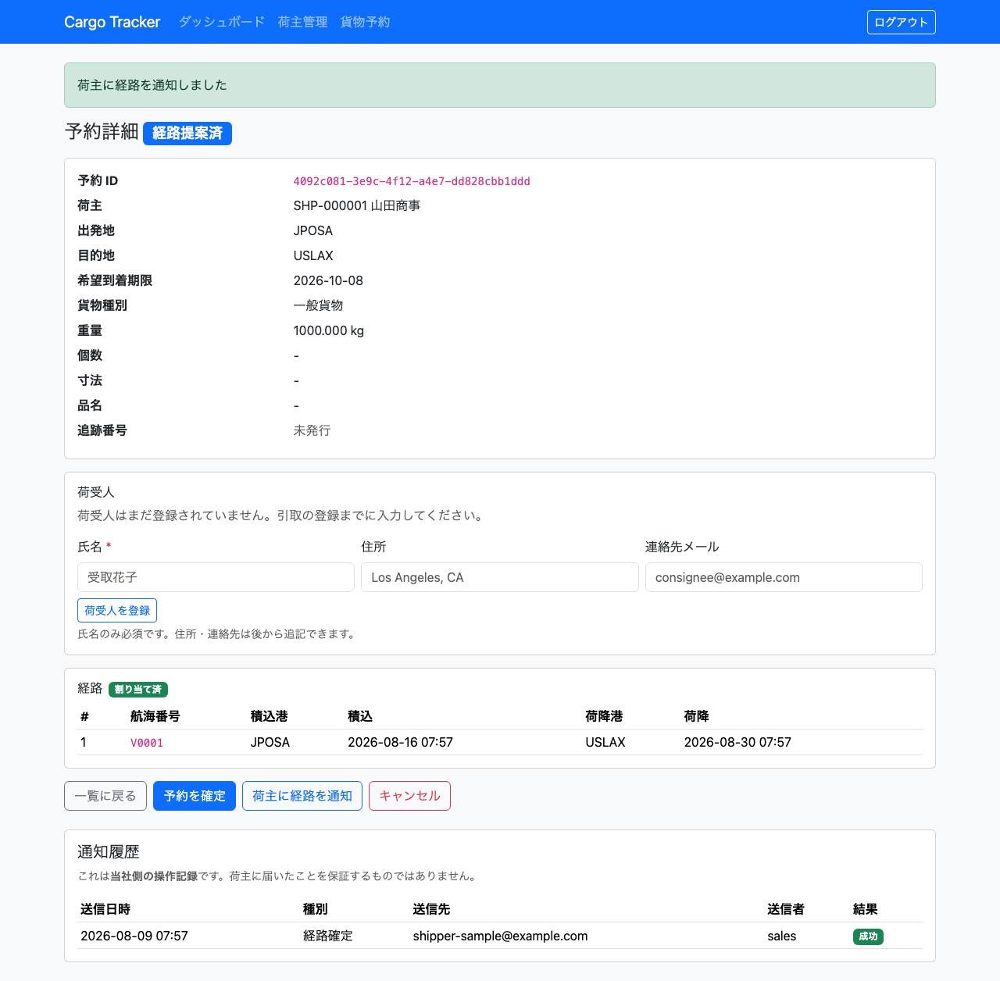

# 04. 貨物予約

荷主から依頼された貨物の**予約**を登録し、確認する画面です。営業担当者が利用します。

本章は [WF-3（貨物予約を登録する）](01-業務フロー.md#工程と章の対応) の工程に対応します。**予約を登録するには、その荷主が先に登録されている必要があります**（[03. 荷主管理](03-荷主管理.md)）。

経路の割り当て・追跡・請求は、この予約を起点に進みます。経路の割り当ては [05. 航路管理](05-航路管理.md)、追跡番号の発行は [07. 追跡管理](07-追跡管理.md) で扱います。請求は今後の提供で対応します。

## 画面の開き方

- メニュー「貨物予約」（URL: `/bookings`）
- ダッシュボードの「貨物予約」カードの「開く」

| 画面 | 役割 | 節 |
| :--- | :--- | :--- |
| 貨物予約一覧 | 登録済みの予約を確認する | [4.1](#41-予約を探す) |
| 貨物予約登録 | 新しい予約を登録する | [4.2](#42-予約を登録する) |
| 予約詳細 | 1 件の予約の内容を確認しキャンセルする | [4.3](#43-予約の内容を確認する) |
| 予約詳細（引き渡し） | 経路設計を依頼する | [4.4](#44-経路設計者に引き渡す) |
| 予約詳細（確定） | 荷主の承認を確認して予約を確定する | [4.5](#45-予約を確定する) |
| 荷主への経路通知 | 確定経路を荷主に通知し記録を残す | [4.6](#46-確定経路を荷主に通知する) |

## 4.1 予約を探す

### この画面でできること

- 登録済みの予約を一覧で確認します。**朝いちばんに「どの予約がまだ手つかずか」を確かめるのがこの画面です。**

### 画面の開き方

- メニュー「貨物予約」（URL: `/bookings`）

### 画面の説明

| # | 項目 | 説明 |
| :--- | :--- | :--- |
| ① | 「+ 新規予約登録」 | 新しい予約を登録する画面へ移動します |
| ② | 出発地 / 目的地 / ステータス | 絞り込みの条件です |
| ③ | 予約 ID | システムが発行する予約の番号です（先頭 8 文字を表示します） |
| ④ | 荷主 | 依頼元の荷主名です |
| ⑤ | 出発地 / 目的地 | 港コード（UN/LOCODE）です |
| ⑥ | 希望期限 | 荷主が希望する到着日です |
| ⑦ | 貨物種別 | 「一般貨物」「危険物」「冷凍・冷蔵」のいずれかです |
| ⑧ | ステータス | 予約の進み具合です。登録直後は「仮予約」です |
| ⑨ | 「詳細」 | その予約の詳細画面へ移動します |

### 操作手順

1. メニュー「貨物予約」をクリックします。
2. 絞り込むときは、出発地・目的地・ステータスを指定して「検索」をクリックします。
3. 内容を確認するときは、その行の「詳細」をクリックします。

### 注意・補足

- 条件に一致する予約が無いときは「条件に一致する予約がありません。」と表示されます。エラーではありません。
- **一覧は新しく登録した予約が先頭に並びます。**
- 出発地・目的地は港コードで指定します。都市名では絞り込めません。
- **4.1・4.2 の画面を利用できるのは営業担当者のみです。** 予約詳細（4.3）は経路担当者・追跡担当者も参照できます（[7.2](07-追跡管理.md#72-追跡番号を発行する)）。 荷主ご自身による照会は [10. 荷主セルフサービス](10-荷主セルフサービス.md) を参照してください。

## 4.2 予約を登録する

### この画面でできること

- 荷主から受けた依頼を予約として登録します。登録すると予約番号が発行され、ステータスが「仮予約」になります。この予約が経路設計の入力になります。

### 画面の開き方

- 貨物予約一覧の「+ 新規予約登録」（URL: `/bookings/new`）
- 荷主詳細の「この荷主で予約する」（荷主コードが入力された状態で開きます）

### 画面の説明

| # | 項目 | 説明 |
| :--- | :--- | :--- |
| ① | 荷主コード | 必須です。`SHP-` で始まる 10 文字です |
| ② | 「荷主を検索」 | 荷主一覧を別のタブで開きます。荷主コードを調べるときに使います |
| ③ | 出発地 | 必須です。港コード（英大文字 5 文字。例: `JPOSA`） |
| ④ | 目的地 | 必須です。港コード（例: `USLAX`） |
| ⑤ | 希望到着期限 | 必須です。荷主が希望する到着日です |
| ⑥ | 貨物種別 | 必須です。「一般貨物」「危険物」「冷凍・冷蔵」から選びます。**選ぶと、その種別に必要な入力欄がその場で現れます** |
| ⑦ | 重量（kg） | 必須です。小数第 3 位まで入力できます |
| ⑧ | 個数 | 任意です。1 以上の整数です |
| ⑨ | 縦 / 横 / 高さ（cm） | 任意です。入れるときは 3 つすべてを入れます |
| ⑩ | 品名 | 任意です。500 文字までです |
| ⑪ | 危険物クラス / UN 番号 / 正式輸送品名 | **貨物種別が「危険物」のときだけ現れます。3 つとも必須です** |
| ⑫ | 最低温度 / 最高温度 / 単位 | **貨物種別が「冷凍・冷蔵」のときだけ現れます。3 つとも必須です** |
| ⑬ | 「登録する」 | 予約を登録します |

貨物種別に「危険物」を選ぶと、次の入力欄が現れます。

### 操作手順

1. 貨物予約一覧の「+ 新規予約登録」をクリックします。
2. 荷主コードを入力します。分からないときは「荷主を検索」で荷主一覧を開いて調べます。
3. 出発地・目的地・希望到着期限・貨物種別・重量を入力します。
4. 貨物種別に「危険物」または「冷凍・冷蔵」を選んだ場合は、現れた入力欄を埋めます。
   - 危険物: 危険物クラス（例: `3`）・UN 番号（例: `UN1263`）・正式輸送品名（例: `PAINT`）
   - 冷凍・冷蔵: 最低温度・最高温度・単位（摂氏 / 華氏）
5. 分かっていれば個数・寸法・品名も入力します。
6. 「登録する」をクリックします。
7. 予約詳細に移り、「予約 〜 を登録しました（仮予約）」と表示されます。

### 注意・補足

- **荷主詳細から「この荷主で予約する」で開くと、荷主コードが入力済みになります。** 荷主コードを書き写す必要はありません。
- 存在しない荷主コードを入力すると「該当する荷主がありません」と表示されます。先に荷主を登録してください（[3.2](03-荷主管理.md#32-荷主を登録する)）。
- **出発地と目的地に同じ港は指定できません。** 同じ港への輸送は業務として成立しないためです。
- **希望到着期限に過去の日付は指定できません。** 当日は指定できます。
- 寸法は**縦・横・高さの 3 つすべて**を入力するか、**すべて空**にしてください。1 つだけ入力された状態は入力の途中とみなし、登録できません。
- 重量は 0 より大きい値です。小数第 4 位以下は入力できません。
- **危険物は申告が無いと登録できません。** 危険物クラス・UN 番号・正式輸送品名のどれか 1 つでも空だと差し戻されます。申告は輸送書類にそのまま載るため、法的要件を満たさないまま輸送を始めないための決まりです。
- **冷凍・冷蔵は温度管理条件が無いと登録できません。** また、**最低温度が最高温度を上回る指定は受け付けません**（打ち間違いを通すと、どの温度帯でも条件を満たさない貨物を預かることになります）。
- 貨物種別を変えると、前の種別の入力欄は消えます。**消えた欄の内容は保存されません**（一般貨物に危険物の申告は付きません）。
- 正式輸送品名は**英語の正式名称**です。商品名ではありません。
- 荷受人の入力は今後の提供で対応します。

## 4.3 予約の内容を確認する

### この画面でできること

- 1 件の予約の内容を確認します。仮予約の予約はここからキャンセルできます。

### 画面の開き方

- 貨物予約一覧の「詳細」（URL: `/bookings/<予約 ID>`）
- 予約の登録を完了した直後にも表示されます

### 画面の説明

| # | 項目 | 説明 |
| :--- | :--- | :--- |
| ① | ステータス | 予約の進み具合です |
| ② | 予約 ID | システムが発行した予約の番号です |
| ③ | 荷主 | 荷主コードと荷主名です |
| ④ | 出発地 / 目的地 | 港コードです |
| ⑤ | 希望到着期限 | 荷主が希望する到着日です |
| ⑥ | 貨物種別 / 重量 / 個数 / 寸法 / 品名 | 登録した貨物の内容です。未入力の項目は「-」と表示されます。**危険物なら危険物クラス・UN 番号・正式輸送品名、冷凍・冷蔵なら温度管理条件（例: `-25 ℃ 〜 -18 ℃`）が続けて表示されます** |
| ⑦ | 追跡番号 | 発行前は「未発行」と表示されます |
| ⑧ | 荷受人 | 貨物を受け取る方です。未登録のときは「荷受人はまだ登録されていません」と表示されます（[4.3.1](#431-荷受人を登録する)） |
| ⑨ | 「一覧に戻る」 | 貨物予約一覧へ戻ります |
| ⑩ | 「経路設計者に引き渡す」 | 経路設計を依頼します（引き渡せる状態のときだけ表示されます） |
| ⑪ | 「予約を確定」 | 予約を確定します（経路が割り当てられているときだけ表示されます。[4.5](#45-予約を確定する)） |
| ⑫ | 「キャンセル」 | 予約をキャンセルします（キャンセルできる状態のときだけ表示されます） |

### 操作手順

1. 貨物予約一覧で対象の行の「詳細」をクリックします。
2. 内容を確認します。
3. 経路設計を依頼するときは「経路設計者に引き渡す」をクリックします（[4.4](#44-経路設計者に引き渡す)）。
4. キャンセルするときは「キャンセル」をクリックします。確認のメッセージが出ます。

### 注意・補足

- **「キャンセル」は、キャンセルできる状態のときだけ表示されます。** 配達完了以降の予約は表示されません。引き渡し済みの貨物の取り消しは「返送」であり、別の業務です。
- キャンセルした予約は一覧に残り、ステータスが「キャンセル」になります。**記録として残すため、一覧から消えることはありません。**
- 輸送が始まったあとのキャンセルは追跡担当者の承認が必要です。この扱いは今後の提供で対応します。
- 予約の内容の訂正は今後の提供で対応します。誤って登録した場合はキャンセルしてから登録し直してください。

### 4.3.1 荷受人を登録する

貨物を受け取る方（荷受人）を予約に登録します。**引取のときに、現場で本人確認に使います。**

| 項目 | 必須 | 説明 |
| :--- | :--- | :--- |
| 氏名 | 必須 | 実際に受け取る方の氏名または社名です |
| 住所 | 任意 | 荷受人の住所です |
| 連絡先メール | 任意 | 荷受人の連絡先です |

1. 予約詳細の「荷受人」の欄に氏名を入力します。
2. 分かっていれば住所と連絡先メールも入力します。
3. 「荷受人を登録」（登録済みの場合は「荷受人を訂正」）をクリックします。
4. 「荷受人を登録しました」と表示されます。

**注意・補足**

- **氏名だけで登録できます。** 住所と連絡先は、引き渡しの当日までに分かれば十分です。すべてを必須にすると、氏名しか分かっていない段階で登録できず、結局どこにも記録されないためです。
- **予約の登録時には入力しません。** 国際輸送では荷受人が後から決まることがあるためです。**引取までに登録してください。**
- **何度でも訂正できます。** 荷受人は輸送の直前まで変わりうるためです。
- **引き渡し済みの予約は変更できません。** 「引き渡し済みのため、荷受人は変更できません」と表示され、入力欄そのものが表示されません。引き渡した後に書き換えられると、誰に渡したかの記録が後から作り変えられてしまうためです。

## 4.4 経路設計者に引き渡す

### この画面でできること

- 仮予約の内容を確認し、経路設計者に引き渡します。引き渡すとステータスが「経路提案済」になり、経路設計者の作業一覧に現れます。

### 画面の開き方

- 予約詳細の「経路設計者に引き渡す」（URL: `/bookings/<予約 ID>`）

### 画面の説明

### 操作手順

1. 貨物予約一覧で対象の行の「詳細」をクリックします。
2. 出発地・目的地・希望到着期限・貨物仕様に誤りがないか確認します。
3. 「経路設計者に引き渡す」をクリックします。
4. 「経路設計者に引き渡しました。経路割り当て待ち一覧に表示されます」と表示されます。

### 注意・補足

- **引き渡しのメールは送信されません。** 引き渡した予約は経路設計者の「経路設計」画面（[5.1](05-航路管理.md#51-経路割り当て待ちの予約を確認する)）に現れます。経路設計者はその画面を見て作業します。
- **一度引き渡した予約は、重ねて引き渡せません。** ボタンも表示されなくなります。二重に依頼が飛ばないようにするためです。
- 引き渡す前に内容を確認してください。**引き渡した後の内容の訂正は今後の提供で対応します。**
- 引き渡し済みの予約もキャンセルはできます。
- 誰がいつどの予約を引き渡したかは記録されます。

## 4.5 予約を確定する

### この画面でできること

- 経路が割り当てられた予約を確定します。確定するとステータスが「確認済」になり、追跡担当者の作業一覧に現れます。

### 画面の開き方

- 予約詳細の「予約を確定」（URL: `/bookings/<予約 ID>`）

### 画面の説明

### 操作手順

1. 貨物予約一覧で対象の行の「詳細」をクリックします。
2. **荷主が経路を承認したことを確認します**（電話・メールなど、システムの外での確認です）。
3. 割り当てられた経路（航海番号・港・日時）に誤りがないか確認します。
4. 「予約を確定」をクリックします。
5. 「予約を確定しました。追跡番号の発行を待ちます」と表示されます。

### 注意・補足

- **「予約を確定」は、経路が割り当てられているときだけ表示されます。** 経路の無い予約を確定すると、運ぶ道筋が決まっていないのに荷主の同意だけが記録されることになります。経路の割り当ては [5.5](05-航路管理.md#55-経路候補を算出して確定する) を参照してください。
- **満船の便は確定できません。** 「満船の便が含まれています（V0001）。経路を選び直してください」と表示された場合は、経路設計者に選び直しを依頼してください。経路候補を算出したあとに、別の貨物がその便を埋めることがあります。
- **確定の通知は送信されません。** 確定した予約は追跡担当者の「追跡管理」画面（[07. 追跡管理](07-追跡管理.md)）に現れます。追跡担当者はその画面を見て作業します。
- **確定した予約を「経路設計中」に戻すことは、現在できません。** 経路を選び直す必要がある場合は、確定の前に行ってください。この扱いは今後の提供で対応します。
- 確定した予約もキャンセルはできます。
- **確定する前に、確定した経路を荷主へ通知しておきます**（[4.6](#46-確定経路を荷主に通知する)）。とくに経路設計者が期限を延ばしている場合、その差分は荷主の承認が要ります。

---

## 4.6 確定経路を荷主に通知する

### この画面でできること

- 確定した経路の内容（航海番号・経由港・所要日数・到着予定日・追跡番号）を荷主へ通知し、**送った記録を残します**。

### 画面の開き方

- 予約詳細の「荷主に経路を通知」（URL: `/bookings/<予約 ID>/notifications/new`）

### 画面の説明

| # | 項目 | 説明 |
| :--- | :--- | :--- |
| ① | 送信先 | 荷主名と、荷主登録のメールアドレスです |
| ② | 通知内容 | 航海番号・経由港・所要日数・到着予定日・追跡番号です |
| ③ | 当初の希望期限 | 経路設計者が期限を延ばしている場合のみ表示されます。**荷主の承認が要ります** |
| ④ | 送信する文面 | 実際に送る文面そのものです |
| ⑤ | 「この内容で通知する」 | 送信して記録を残し、予約詳細に戻ります |
| ⑥ | 「キャンセル」 | 送らずに予約詳細へ戻ります |

### 操作手順

1. 貨物予約一覧で対象の行の「詳細」をクリックします。
2. 「荷主に経路を通知」をクリックします。
3. **送信先のメールアドレスが正しいか確認します。** 違っている場合は[荷主管理](03-荷主管理.md)で訂正してから通知します。
4. 通知内容を確認します。**期限の延長が表示されている場合は、その日数を荷主に伝えてください。**
5. 「この内容で通知する」をクリックします。
6. 予約詳細の「通知履歴」に、送信日時・種別・送信先・送信者・結果が記録されます。

### 注意・補足

- **「荷主に経路を通知」は、経路が割り当てられている予約にだけ表示されます。** 送るべき中身が無い通知を「送信済み」として残すと、履歴が信用できなくなるためです。
- **通知履歴は予約詳細に常時表示されます。** まだ送っていない予約には「まだ通知していません」と出ます。**空欄であること自体が「まだ送っていない」という情報です。**
- **「聞いていない」と言われたときは通知履歴を確認してください。** この機能の目的は、送ったことを後から確かめられるようにすることです。
- **失敗した通知にだけ「再送」が表示されます。** 成功した通知に再送を出すと、二重に送ったのか確認したのかが履歴から読めなくなるためです。
- **料金は通知に含まれません。** 経路候補の費用は概算であり（[5.5](05-航路管理.md#55-経路候補を算出して確定する)）、荷主に見せると請求額として読まれます。料金の通知は今後の提供です。
- **通知すべき予約はダッシュボードの「荷主への通知待ち」から探せます**（`/bookings/notification-queue`）。経路が確定していて、まだ通知していない予約が期限の近い順に並びます。
- **これは当社側の操作記録です。** 荷主に届いたことを保証するものではありません（メールは送信していません）。届いたかどうかは荷主からの返答で確かめてください。
- 通知は営業担当者のみが行えます。経路設計者は通知できません。
