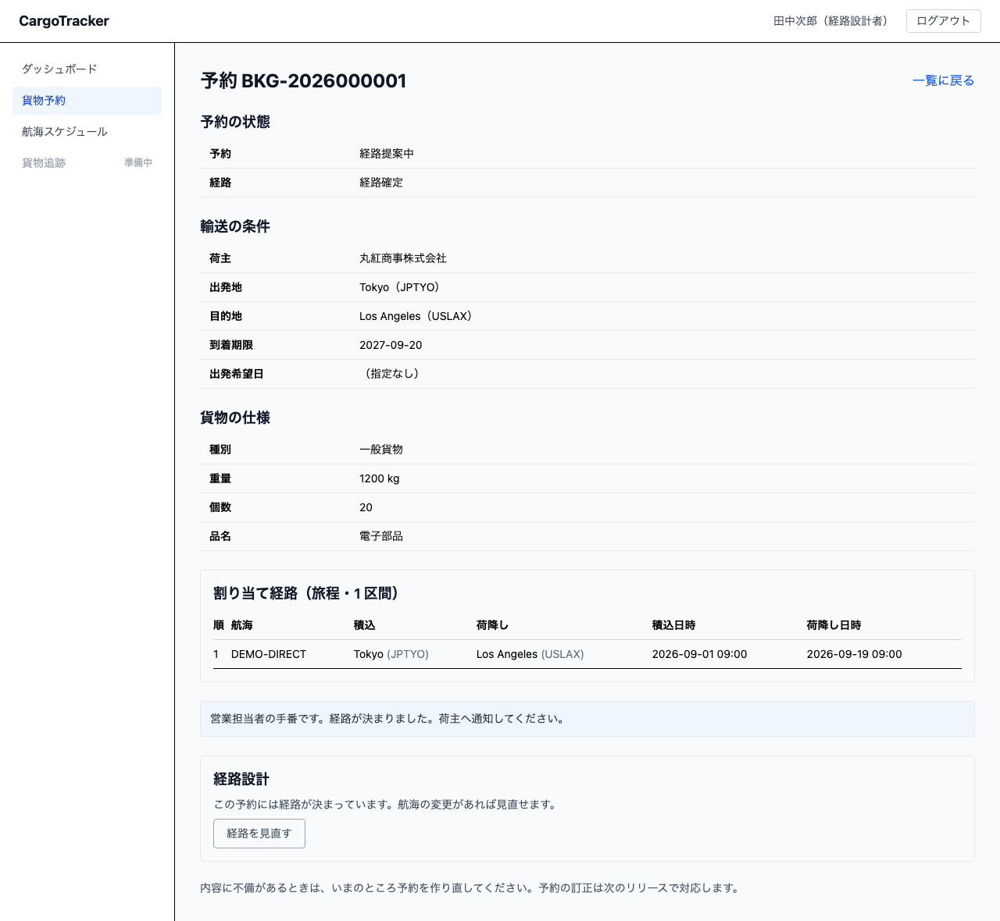
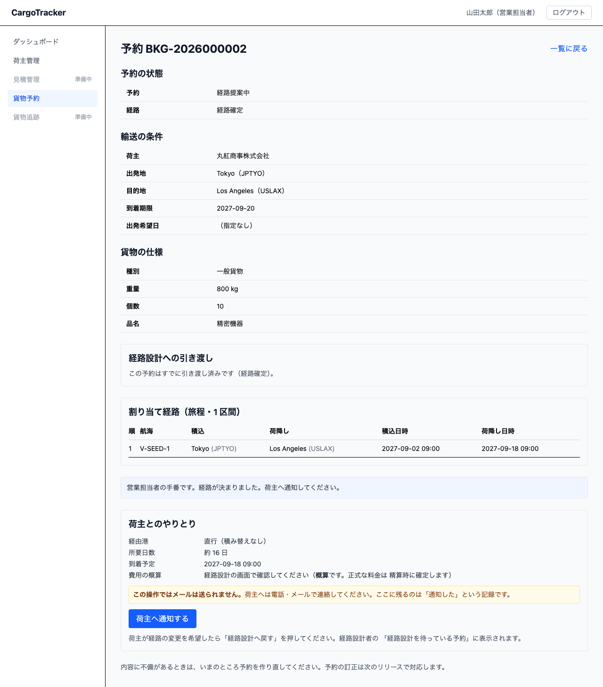
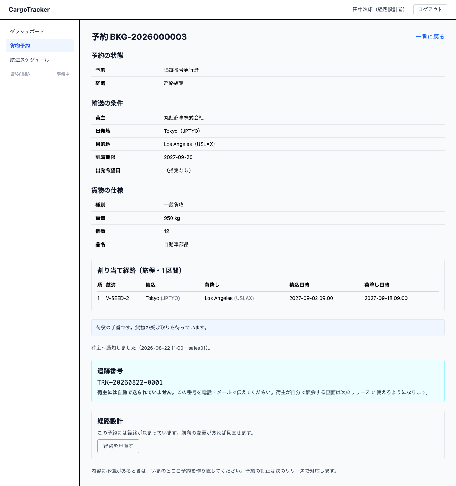

# 04 貨物予約

荷主からお預かりする貨物を登録し、予約を仮受付する画面です。**営業担当者**が使います。

本章は [01 業務フロー](01-業務フロー.md#steps) の**工程 3（貨物を登録して予約を仮受付する）**に
対応します。[03 荷主管理](03-荷主管理.md#register-shipper) で荷主を登録したあとに行う作業です。

登録が済むと**予約番号**が発行され、状態は「仮受付」になります。この予約は経路設計者が
経路を組む対象になります（工程 4・5。次のリリースで対応します）。

## 画面の開き方

メニュー「貨物予約」（URL: `/booking`）、または営業ダッシュボードの
「貨物予約を登録する」「貨物予約を見る」から開きます。

| 節 | 内容 |
| :--- | :--- |
| [4.1](#list-booking) | 貨物予約を確認する |
| [4.2](#register-booking) | 貨物予約を登録する |
| [4.3](#special-cargo) | 危険物・冷凍貨物を登録する |
| [4.4](#booking-detail) | 予約の内容を確かめて経路設計へ引き渡す |
| [4.5](#itinerary) | 割り当てられた経路（旅程）を見る |

> **仮受付の「確定」はまだできません。** 予約の確定は業務フローの工程 6 にあたり、
> 経路が決まってから行います。次のリリースで対応します。

> **予約の訂正はまだできません。** 内容に不備を見つけたときは、予約を作り直してください。
> 訂正は次のリリースで対応します。

---

## 4.1 貨物予約を確認する {#list-booking}

### この画面でできること

登録済みの貨物予約を新しい順に一覧します。貨物種別や予約番号・荷主名で絞り込めます。

### 画面の説明

| 項目 | 説明 |
| :--- | :--- |
| 貨物種別 | 「すべて」「一般貨物」「危険物」「冷凍・冷蔵貨物」から選びます |
| 予約番号または荷主の名前 | 一部だけの入力でも探せます。大文字・小文字は区別しません |
| 検索 | 入力した条件で絞り込みます |
| 新規登録 | [4.2 貨物予約を登録する](#register-booking) へ進みます |

一覧には次の項目が並びます。

| 列 | 説明 |
| :--- | :--- |
| 予約番号 | `BKG-` + 西暦 4 桁 + 連番 6 桁（例: `BKG-2026000042`）。荷主とのやり取りで使います |
| 荷主 | 予約した荷主の名前です。社名で検索したときに別会社が混ざっていないかを確かめられます |
| 状態 | 現在は「仮受付」のみです |
| 種別 | 危険物は赤、冷凍・冷蔵は青の色付きで表示します |
| 出発地・目的地 | 港の名前で表示します |
| 到着期限 | いつまでに届ける約束かを示します |
| 重量(kg) | 登録した重量です |

### 操作手順

1. メニュー「貨物予約」を選びます
1. 絞り込みたいときは、貨物種別を選ぶか、予約番号・荷主名を入力して「検索」を押します
1. 絞り込みを解除するには、貨物種別を「すべて」に戻し、入力欄を空にして「検索」を押します

> **件数が多いとき**: 一覧には新しい 100 件までを表示します。100 件を超えるときは
> 「新しい 100 件のみ表示しています」と出ますので、条件で絞り込んでください。
> 黙って切り捨てることはしません。

---

## 4.2 貨物予約を登録する {#register-booking}

### この画面でできること

荷主・輸送条件・貨物仕様を入力して、予約を仮受付します。

### 画面の説明

| 項目 | 必須 | 説明 |
| :--- | :--- | :--- |
| 荷主 | ○ | 登録済みの荷主から選びます。一覧に無いときは先に[荷主を登録](03-荷主管理.md#register-shipper)します |
| 貨物種別 | ○ | 「一般貨物」「危険物」「冷凍・冷蔵貨物」から選びます |
| 出発地 | ○ | 港の一覧から選びます。港名のあとのカッコは港のコード（UN/LOCODE）です |
| 目的地 | ○ | 出発地と同じ港を選ぶと、登録時に断られます |
| 希望出発日 | | 荷主のご希望がある場合に入力します |
| 到着期限 | ○ | いつまでに届ける約束かを入力します |
| 重量（kg） | ○ | 0 より大きい値を入力します |
| 個数 | | 入力する場合は 1 以上にします |
| 長さ・幅・高さ（cm） | | 入力する場合は 3 つとも入力します |
| 品名 | | 貨物の内容を書きます |
| 登録する | | 入力した内容で予約を登録します |
| キャンセル | | 入力を破棄して一覧へ戻ります |

### 操作手順

1. メニュー「貨物予約」→「新規登録」を押します
1. 荷主を選びます
1. 貨物種別を選びます（危険物・冷凍を選ぶと項目が増えます。[4.3](#special-cargo) を参照）
1. 出発地・目的地・到着期限を入力します
1. 重量を入力します。個数・寸法・品名は分かる範囲で入力します
1. 「登録する」を押します
1. 一覧に戻り、発行された予約番号が表示されます

### よくある入力の誤り

| 表示されるメッセージ | 直し方 |
| :--- | :--- |
| 荷主を選んでください | 荷主の欄が「選んでください」のままです |
| 出発地と目的地は同じにできません | どちらかを別の港に変えます |
| 到着期限に過去の日付は指定できません | 今日以降の日付を入力します。**目的地の暦**で判断します |
| 重量は 0 より大きい値で指定してください | 重量を入力し直します |
| 個数は 1 以上で指定してください | 個数を入力し直すか、空にします |
| 出発地と目的地を選んでください | どちらかが「選んでください」のままです |
| 到着期限を入力してください | 到着期限の欄が空です |
| 登録できませんでした。時間をおいて再度お試しください。 | 入力の誤りではありません。しばらく待ってからもう一度「登録する」を押してください |

> **メッセージは上の表の字面そのままで表示されます。** 入力した値は付きません。以前は
> 「割引率は 0〜30% の範囲で指定してください: 45」のように受け取った値が続いていましたが、
> 表から探せなくなるため、値を添えるのをやめました。

> **到着期限の「今日」について**: 日付は**目的地の暦**で判断します。たとえば日本が 8 月 20 日でも、
> ロサンゼルス行きの貨物なら現地の 8 月 19 日が期限として受け付けられます。逆に、
> ロンドン行きで日本が 8 月 20 日の朝なら現地はまだ 8 月 19 日で、8 月 19 日が受け付けられます。
> 時差で受け付けられないことがないようにするためです。

> **料金はまだ表示しません**: 予約金額の算出は精算機能（次のリリース）で対応します。
> 0 円と表示すると「無料の予約」と区別がつかなくなるため、あえて表示していません。

---

## 4.3 危険物・冷凍貨物を登録する {#special-cargo}

### この画面でできること

貨物種別に応じて、追加の情報を登録します。この情報は経路を組むときに、
対応できる船を選ぶために使われます。

### 危険物を選んだとき

次の 3 項目が現れます。**3 つそろって初めて法的要件を満たします**ので、すべて入力してください。

| 項目 | 必須 | 説明 |
| :--- | :--- | :--- |
| 危険物クラス | ○ | 国連分類（1〜9）から**選びます**。入力はできません（例: `3: 引火性液体`） |
| UN 番号 | ○ | `UN` に続けて 4 桁の数字（例: `UN1263`） |
| 正式品名 | ○ | 輸送書類に記載する正式な品名（例: `PAINT`） |

### 冷凍・冷蔵貨物を選んだとき

保管温度の条件が現れます。

| 項目 | 必須 | 説明 |
| :--- | :--- | :--- |
| 保管温度の下限（℃） | ○ | この温度を下回らないように運びます |
| 保管温度の上限（℃） | ○ | この温度を上回らないように運びます |

### 操作手順

1. 貨物種別で「危険物」または「冷凍・冷蔵貨物」を選びます
1. 現れた項目をすべて入力します
1. 残りの項目（荷主・輸送条件・貨物仕様）を入力します
1. 「登録する」を押します

### よくある入力の誤り

| 表示されるメッセージ | 直し方 |
| :--- | :--- |
| 危険物には危険物申告が必要です | 危険物クラスを選び、UN 番号・正式品名を入力します |
| UN 番号の形式が不正です（UN + 4 桁） | `UN1263` のように、`UN` + 数字 4 桁で入力します |
| 冷凍・冷蔵貨物には保管温度の条件が必要です | 下限と上限を入力します |
| 保管温度の下限が上限を超えています | 下限を上限以下にします |
| 危険物クラスは必須です | 3 項目のうち危険物クラスが「選んでください」のままです |
| 危険物クラスは一覧から選んでください | 一覧に無い分類です。一覧の 1〜9 から選び直します |
| 正式品名は必須です | 3 項目のうち正式品名だけが空です |
| 保管温度の下限と上限はどちらも必須です | 片方だけ入力しています。両方入力します |
| 危険物申告は危険物にだけ設定できます | 貨物種別を「危険物」に直すか、申告の内容を消します |
| 保管温度の条件は冷凍・冷蔵貨物にだけ設定できます | 貨物種別を「冷凍・冷蔵貨物」に直すか、温度の内容を消します |

> **「危険物には危険物申告が必要です」は 3 項目すべてが空のときに出ます。** 一部だけ入力した
> ときは、足りない項目ごとのメッセージ（「危険物クラスは必須です」など）が出ます。

> **種別を変えると、前に入力した追加情報は消えます。** 危険物として入力したあとに
> 「一般貨物」へ戻すと、危険物申告の内容は破棄されます。画面に出ていない情報が
> そのまま登録されることを防ぐためです。種別を選び直したときは、もう一度入力してください。

> **一般貨物に危険物申告や温度条件は付けられません。** 付け忘れと同じく、付けすぎも誤りです。
> 種別を正しく選んでから入力してください。

---

## 4.4 予約の内容を確かめて経路設計へ引き渡す {#booking-detail}

### この画面でできること

予約 1 件の内容をまとめて確認し、**経路設計者へ引き渡します**（業務フローの工程 4 へ渡す作業です）。

引き渡すと、経路設計者のダッシュボードに「経路設計を待っている予約が N 件あります」と表示され、
そこから対象の一覧へ進めるようになります。

### 画面の開き方

一覧画面（`/booking`）で、予約番号のリンクを押します。URL は `/booking/<予約番号>` です。

### 画面の説明

| 区分 | 項目 |
| :--- | :--- |
| 予約の状態 | 予約（仮受付・経路提案中）／経路（未依頼・経路設計を依頼済み・経路確定・条件協議中） |
| 輸送の条件 | 荷主・出発地・目的地・到着期限・出発希望日 |
| 貨物の仕様 | 種別・重量・個数・品名。危険物なら危険物クラス・UN 番号・正式品名、冷凍・冷蔵なら保管温度 |

### 操作手順

1. 一覧で予約番号を押して詳細を開きます
2. 出発地・目的地・到着期限・貨物の仕様に誤りがないか確かめます
3. 「経路設計への引き渡し」の [経路設計を依頼する] を押します
4. 「経路設計を依頼しました。」と表示されます

### よくある入力の誤り

| 表示されるメッセージ | 直し方 |
| :--- | :--- |
| この予約はすでに経路設計を依頼しています | 引き渡し済みです。二重に依頼する必要はありません |
| 予約を表示できませんでした。予約番号を確かめてください。 | URL の予約番号が誤っています。一覧から開き直します |
| 経路設計を依頼できませんでした。時間をおいて再度お試しください。 | 入力の誤りではありません。しばらく待ってからもう一度押してください |

> **引き渡せるのは営業担当者だけです。** 経路設計者にはこのボタンは出ません。誰が渡したかが
> 記録として意味を持たなくなるためです。

> **引き渡しても予約は「仮受付」のままです。** 予約の確定は業務フローの工程 6 にあたり、
> 経路が決まってから行う別の作業です。

> **通知メールは送られません。** 経路設計者は自分のダッシュボードで気づきます。急ぎのときは
> 口頭・電話でも伝えてください。

> **経路設計者にも予約の詳細は見えます。** ただし経路設計者の一覧に出るのは、
> **引き渡し済みの予約だけ**です。

---

## 4.5 割り当てられた経路（旅程）を見る {#itinerary}

### この画面でできること

経路設計者が経路を確定すると、予約詳細に **割り当て経路（旅程）** が表示されます。
荷主への説明や、荷役・追跡の問い合わせに答えるときに使います。

### 画面の説明

| 列 | 説明 |
| :--- | :--- |
| 順 | 運ぶ順番。1 から始まります |
| 航海 | その区間を運ぶ航海番号 |
| 積込 | 荷物を積む港。名前で示し、括弧内は港のコードです |
| 荷降し | 荷物を降ろす港 |
| 積込日時・荷降し日時 | 日本時間 |

> **積み替えがあると、区間が複数行になります。** 「東京 → 上海」「上海 → ロサンゼルス」
> のように、1 つの航海で運ぶ区間ごとに 1 行です。どの港で積み替えるかは、
> 荷役の担当者・追跡管理者からの問い合わせで必ず聞かれます。

> **経路が決まっていない予約には、この枠は出ません。** 空の表は出しません。

> **経路が決まると、予約の状態が「経路提案中」になります。** 予約が「確定」に
> なったわけではありません。荷主の合意を得たうえで確定するのは別の作業です。

### 経路の状態

| 状態 | 意味 | 次にすること |
| :--- | :--- | :--- |
| 未依頼 | まだ経路設計に引き渡していない | 予約詳細で [経路設計を依頼する] を押す |
| 経路設計を依頼済み | 経路設計者の作業待ち | 待つ |
| 経路確定 | 経路が予約に紐付いた（予約の状態は「経路提案中」になります） | 荷主へ経路を提示する |
| 条件協議中 | 条件では経路が組めず、経路設計者から戻された | 荷主と条件（到着期限など）を相談し、決まったら予約詳細の **[経路設計に再依頼する]** を押す |

> **「条件協議中」はダッシュボードにも件数が出ます。** 気づかないと予約が
> 止まったままになります。営業ダッシュボードの「条件の協議を求められている予約を見る」から
> 対象の一覧へ行けます。

> **一覧でも経路の状態で絞り込めます。** 「まだ経路設計を依頼していない予約」は、
> 予約が増えるほど一覧を眺めても気づけなくなります。

---

## この画面で出るメッセージ（予約詳細・IT5 で追加した分）

| メッセージ | いつ出るか | どうすればよいか |
| :--- | :--- | :--- |
| 割り当て経路（旅程・N 区間） | 経路が決まっている | 区間を確かめる（[4.5](#itinerary)） |
| この予約には経路が決まっています。航海の変更があれば見直せます。 | 経路設計者が開いたとき、経路が決まっている | 差し替えるなら [経路を見直す] を押す |
| この予約はまだ経路設計に引き渡されていません。 | 経路設計者が開いたとき、まだ引き渡されていない | 営業担当者の引き渡しを待つ |

---

## 4.6 荷主へ経路を通知し、予約を確定する {#notify-and-confirm}

### この画面でできること

経路が決まった予約を **荷主へ提示** し、合意を得て **確定** します（業務フローの工程 6）。
荷主が経路の変更を希望したときは、**経路設計へ戻します**。

### 画面の開き方

一覧画面（`/booking`）で予約番号のリンクを押し、予約詳細を開きます。

### いまが誰の手番かを画面が示します

予約詳細の上部に、いまの状態で誰が動くかが 1 行で出ます。

| 予約の状態 | 表示 | あなたがすること |
| :--- | :--- | :--- |
| 仮受付 | 営業担当者の手番です | 経路設計を依頼する（[4.4](#booking-detail)） |
| 経路提案中 | 営業担当者の手番です | 荷主へ通知する |
| 荷主へ通知済 | 荷主の手番です | 返事を待つ。確定するか、経路設計へ戻す |
| 確認済 | 経路設計者の手番です | 経路設計者が追跡番号を発行します（[4.7](#tracking-number)） |
| 追跡番号発行済 | 荷役の手番です | 貨物の受け取りを待ちます |

### 画面の説明

### 荷主へ通知する

> **⚠ この操作ではメールは送られません。**
> 荷主へは**電話・メールで連絡してください**。画面に残るのは「通知した」という記録だけです。
> 自動で送る仕組みは、後のリリースで用意します。

1. 予約詳細の「荷主とのやりとり」を開きます
2. **経由港・所要日数・到着予定** を確かめます（そのまま荷主へ伝える内容です）
3. [荷主へ通知する] を押します
4. 「荷主へ通知しました（日時・担当者）」と表示されます
5. **実際に荷主へ連絡します**

> **費用は概算です。** 経路設計の画面に出る金額は目安であり、請求金額ではありません。
> 正式な料金は精算時に確定します。荷主へ伝えるときも「概算」と添えてください。

### もう一度通知する

返事が無いとき・連絡先を間違えたとき・内容を補足したいときは、[もう一度通知する] を押せます。
記録は**最新の 1 件だけ**残ります（何回送ったかは残りません）。

### 予約を確定する

1. 荷主から合意を得ます
2. [予約を確定する] を押します
3. 予約の状態が「確認済」になり、**経路設計者の「追跡番号の発行を待っている予約」に表示されます**

> **通知していない予約は確定できません。** 確定は「荷主の合意を得た」という記録です。
> 提示していない条件で合意は成り立ちません。通知していないあいだは、確定のボタンが出ません。

### 経路設計へ戻す

荷主が経路の変更を希望したときに使います。

1. [経路設計へ戻す] を押します
2. 経路の状態が「経路設計を依頼済み」に戻ります
3. **経路設計者の「経路設計を待っている予約」に表示されます**

> **旅程は消えません。** どこが合わなかったかを、いまの経路を見ながら経路設計者と
> 相談できます。

> **確定したあとは戻せません。** 確定すると追跡番号の発行と荷役が動き始めます。
> 変更が必要なときは、担当者に相談してください。

---

## 4.7 追跡番号を確認して荷主へ伝える {#tracking-number}

### この画面でできること

経路設計者が発行した **追跡番号** を確認します。発行するのは経路設計者です（[6.3](06-経路設計.md#issue-tracking)）。

### 画面の説明

確定後に追跡番号が発行されると、予約詳細に「追跡番号」の枠が出ます。

> **⚠ 荷主には自動で送られていません。**
> この番号を**電話・メールで伝えてください**。荷主が自分で照会する画面は、後のリリースで
> 使えるようになります。それまでは、荷主からの問い合わせに営業担当者が答えます。

---

## この画面で出るメッセージ（予約詳細・IT6 で追加した分）

| メッセージ | いつ出るか | どうすればよいか |
| :--- | :--- | :--- |
| 営業担当者の手番です。経路が決まりました。荷主へ通知してください。 | 経路が決まった | [荷主へ通知する] を押す |
| 荷主の手番です。返事を待っています。 | 荷主へ通知した | 返事を待つ |
| 経路設計者の手番です。追跡番号の発行を待っています。 | 予約を確定した | 経路設計者の発行を待つ |
| この操作ではメールは送られません。 | 通知の操作のそば | 実際に荷主へ連絡する |
| 荷主へ通知しました（日時・担当者） | 通知したあと | 記録として残ります |
| 荷主には自動で送られていません。 | 追跡番号が発行された | 番号を荷主へ伝える |
| 経路が決まった予約だけを荷主へ通知できます | 経路が決まる前に通知しようとした | 経路設計者の作業を待つ |
| 荷主へ通知した予約だけを確定できます | 通知する前に確定しようとした | 先に [荷主へ通知する] を押す |
| 荷主へ通知した予約だけを経路設計へ戻せます | 戻せない状態で戻そうとした | 確定後は戻せません。担当者に相談する |
| 確定した予約にだけ追跡番号を発行できます | 確定前に発行しようとした | 先に営業担当者が確定します |
| この予約はすでに追跡番号を発行しています | 二重に発行しようとした | 番号は変わりません。表示されている番号を使う |
