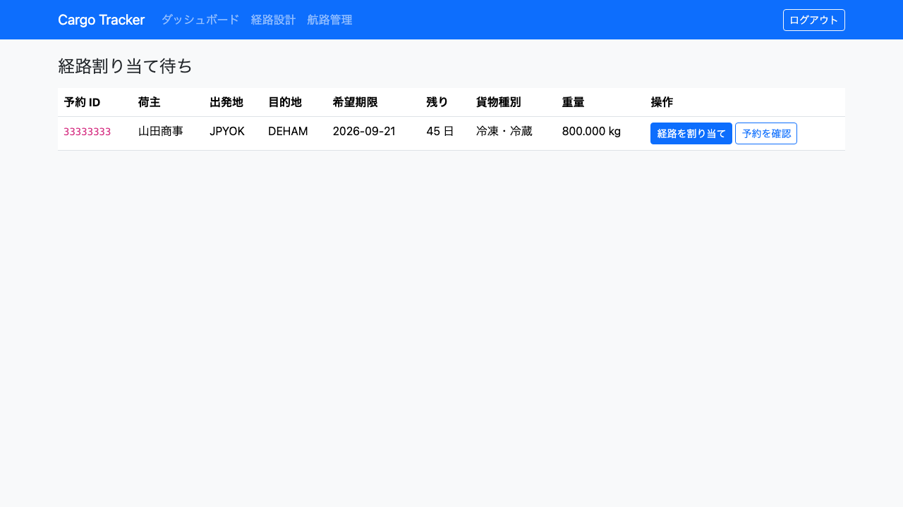
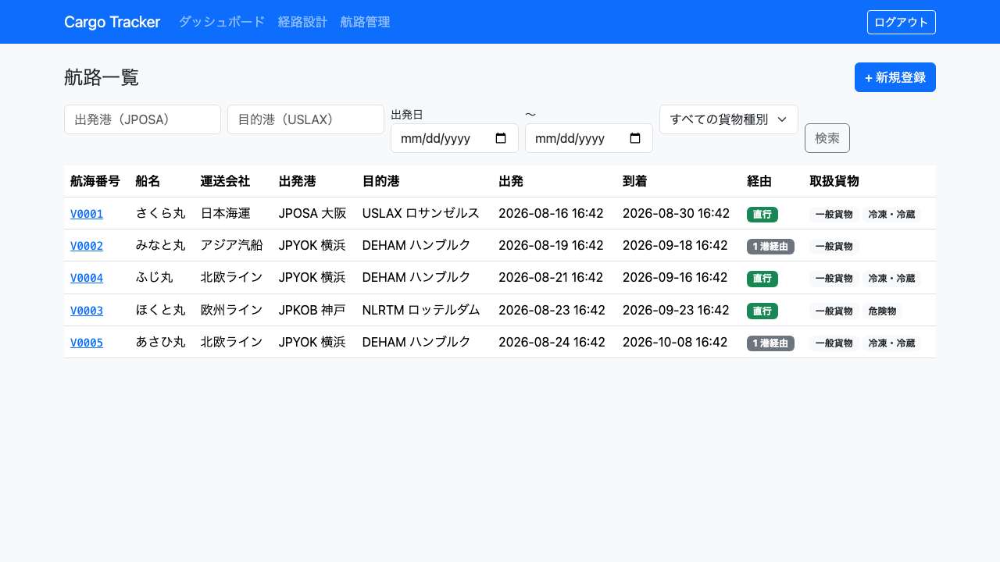
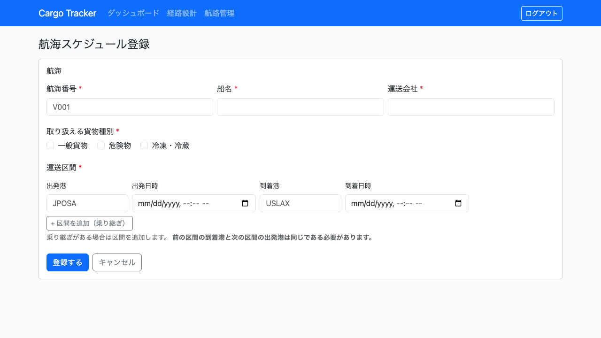
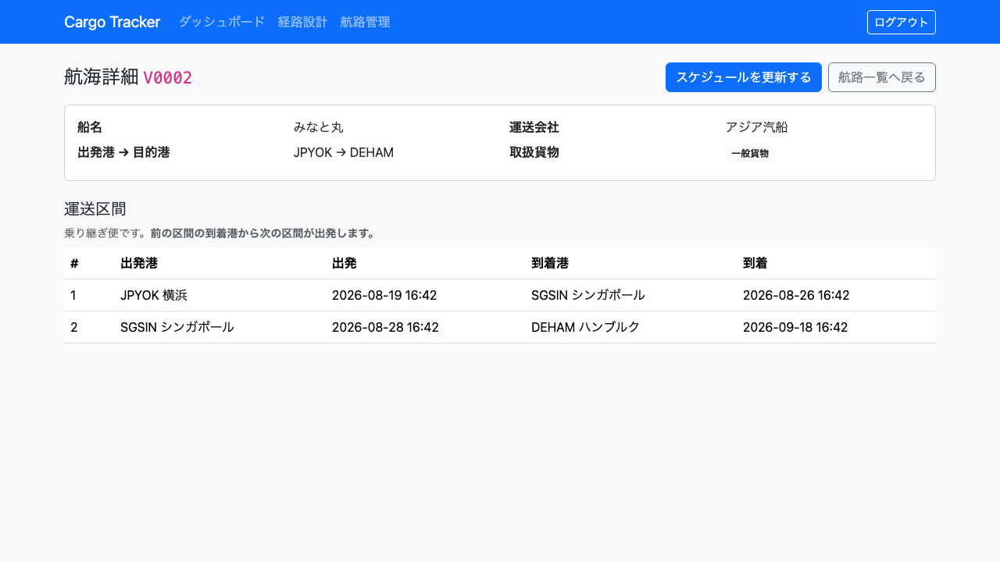
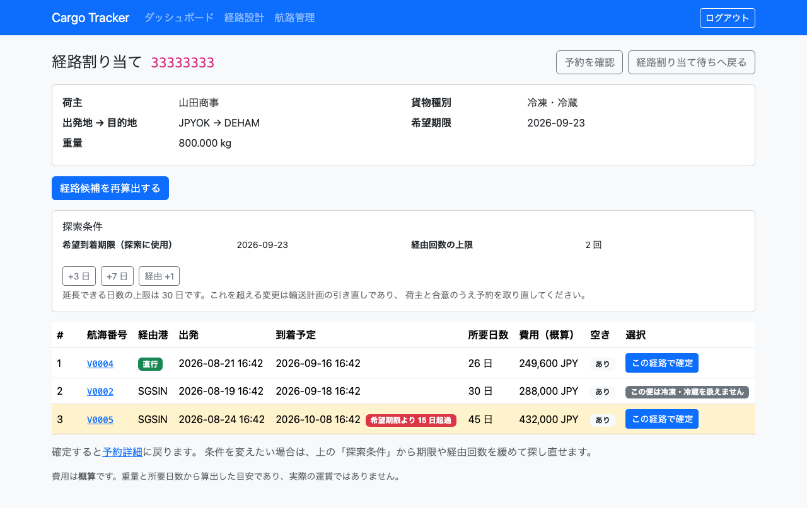
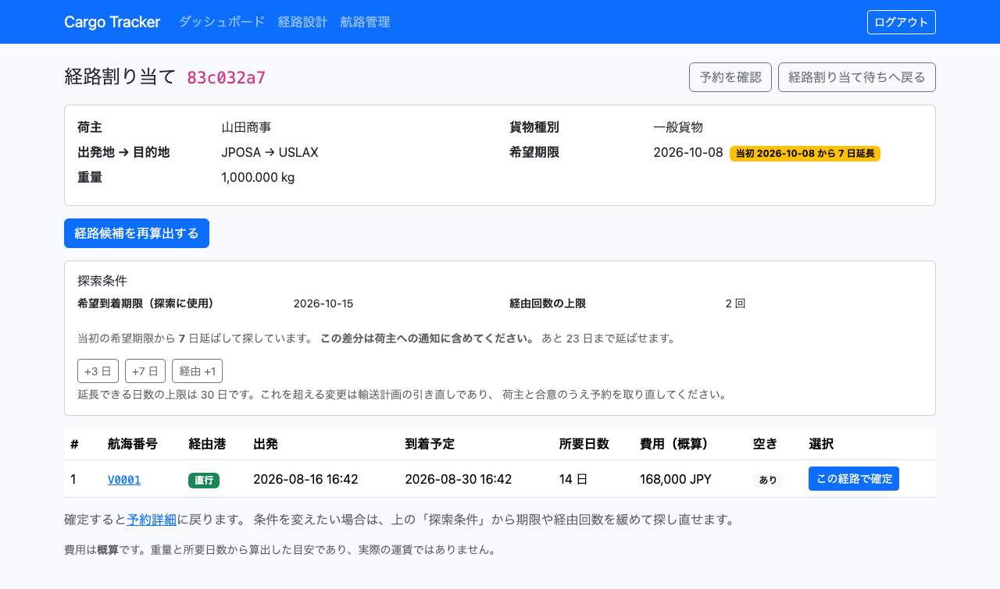
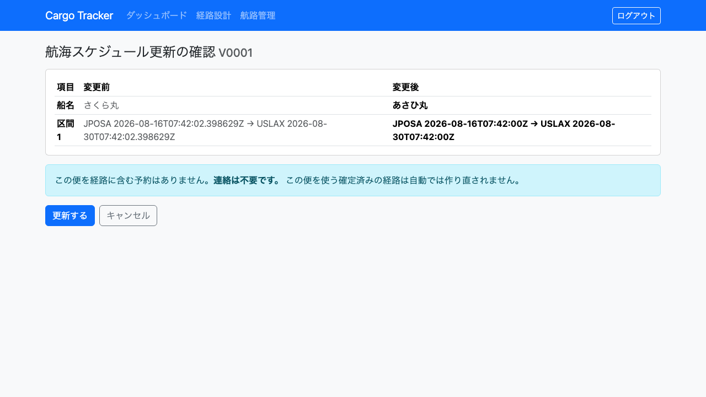

# 05. 航路管理

船会社が運航する**航海スケジュール**を登録し、経路設計に使う便を探す画面です。経路設計者が利用します。

本章は [WF-4（経路を設計し割り当てる）](01-業務フロー.md#工程と章の対応) の工程に対応します。**航海スケジュールが登録されていないと、経路の候補を出せません。**

**経路候補の算出から、経路の確定・予約への紐付けまで行えます。**
希望期限や経由回数を変えて探し直すこともできます（[5.6](#56-条件を緩めて経路を探し直す)）。

## 画面の開き方

- メニュー「経路設計」（URL: `/routing/queue`）／「航路管理」（URL: `/voyages`）
- ダッシュボードの「経路設計」「航路管理」カードの「開く」

| 画面 | 役割 | 節 |
| :--- | :--- | :--- |
| 経路割り当て待ち | 引き渡された予約を確認する | [5.1](#51-経路割り当て待ちの予約を確認する) |
| 航路一覧 | 登録済みの航海を探す | [5.2](#52-航海を探す) |
| 航海スケジュール登録 | 新しい航海を登録する | [5.3](#53-航海スケジュールを登録する) |
| 航海詳細 | 寄港地ごとの発着時刻を確認する | [5.4](#54-航海の全区間を確認する) |
| 経路割り当て | 経路候補を算出して確定する | [5.5](#55-経路候補を算出して確定する) |
| 経路割り当て（探索条件） | 条件を緩めて経路を探し直す | [5.6](#56-条件を緩めて経路を探し直す) |

## 5.1 経路割り当て待ちの予約を確認する

### この画面でできること

- 営業担当者から引き渡された予約を確認します。**朝いちばんに開いて「今日どれから手をつけるか」を決めるのがこの画面です。**

### 画面の開き方

- メニュー「経路設計」（URL: `/routing/queue`）

### 画面の説明

| # | 項目 | 説明 |
| :--- | :--- | :--- |
| ① | 予約 ID | 予約の番号です（先頭 8 文字を表示します） |
| ② | 荷主 | 依頼元の荷主名です |
| ③ | 出発地 / 目的地 | 港コード（UN/LOCODE）です |
| ④ | 希望期限 | 荷主が希望する到着日です |
| ⑤ | 残り | 希望期限までの日数です。**3 日以内は赤、7 日以内は橙**で表示します |
| ⑥ | 貨物種別 | 「一般貨物」「危険物」「冷凍・冷蔵」のいずれかです |
| ⑦ | 重量 | 貨物の重量です |
| ⑧ | 「経路を割り当て」 | その予約の経路候補を算出する画面を開きます（[5.5](#55-経路候補を算出して確定する)） |
| ⑨ | 「予約を確認」 | その予約の詳細画面を開きます |

### 操作手順

1. メニュー「経路設計」をクリックします。
2. 上から順に確認します。**赤や橙の「残り」が付いているものから手をつけます。**
3. 内容（寸法・個数・品名）を確かめるときは「予約を確認」をクリックします。
4. 「経路を割り当て」をクリックし、経路候補を算出します（[5.5](#55-経路候補を算出して確定する)）。

### 注意・補足

- **一覧は希望期限が近いものから順に並びます。** 予約 ID 順ではありません。上にあるものほど急ぎです。
- **「残り」の色は急ぎ具合を示します。** 3 日以内は赤、7 日以内は橙です。期限を過ぎたものは「期限超過」と赤で表示します。
- 「予約を確認」で開く予約詳細では**内容の確認のみ**行えます。予約の登録・キャンセル・引き渡しは営業担当者の操作です。
- 待ちの予約が無いときは「経路割り当て待ちの予約はありません。」と表示されます。エラーではありません。
- **この一覧に現れることが、営業担当者からの「引き渡し」です。** 引き渡しのメールは届きません。この画面を確認してください。
- 貨物種別が「危険物」「冷凍・冷蔵」の予約は、**対応できる便が限られます。** 航路の検索で貨物種別を指定して絞り込んでください。
- **経路候補の算出はこの一覧から始めます。** 「経路を割り当て」で算出画面へ進みます。
- 候補から 1 つを選んで経路を確定する操作は [5.5](#55-経路候補を算出して確定する) で扱います。

## 5.2 航海を探す

### この画面でできること

- 登録済みの航海スケジュールを、出発港・目的港・出発日・貨物種別で検索します。予約に合う便があるかを確かめるために使います。

### 画面の開き方

- メニュー「航路管理」（URL: `/voyages`）

### 画面の説明

| # | 項目 | 説明 |
| :--- | :--- | :--- |
| ① | 「+ 新規登録」 | 航海スケジュールを登録する画面へ移動します |
| ② | 出発港 / 目的港 | 港コードで絞り込みます |
| ③ | 出発日 | 出発日の範囲で絞り込みます |
| ④ | 貨物種別 | その貨物を運べる便だけに絞り込みます |
| ⑤ | 航海番号 | 船会社が付けた航海の番号です。クリックすると[航海詳細](#54-航海の全区間を確認する)を開きます |
| ⑥ | 船名 / 運送会社 | 便を特定するための情報です |
| ⑦ | 出発港 / 目的港 | 港コードと港の名称です |
| ⑧ | 出発 / 到着 | 出発日時と到着日時です |
| ⑨ | 経由 | 「直行」または「N 港経由」と表示されます |
| ⑩ | 取扱貨物 | その便が運べる貨物種別です |

### 操作手順

1. メニュー「航路管理」をクリックします。
2. 予約の出発地・目的地・希望期限に合わせて条件を入力します。
3. 「検索」をクリックします。
4. 候補の便を確認します。

### 注意・補足

- **港は港コード（UN/LOCODE）で指定します。** 「大阪」ではなく `JPOSA` です。コードが分からない場合は [用語集](用語集.md) を参照してください。
- 貨物種別を指定すると、**その貨物を運べる便だけ**が表示されます。危険物の予約に対して危険物を扱えない便を提案しないための絞り込みです。
- **「直行」の便は乗り継ぎがありません。** 経由が多いほど遅延の影響を受けやすくなります。
- 出発日の範囲は、**指定した日に出発する便も含みます**（上限に指定した日を含みます）。
- 条件に一致する便が無いときは「条件に一致する航海がありません。」と表示され、新規登録へのリンクが出ます。船会社から新しいスケジュールを受け取っている場合は登録してください。
- 1 ページに 20 件表示します。件数が多いときは条件を絞ってください。

## 5.3 航海スケジュールを登録する

### この画面でできること

- 船会社が公開した航海スケジュールを登録します。登録した便は、以後の検索の対象になります。

### 画面の開き方

- 航路一覧の「+ 新規登録」（URL: `/voyages/new`）

### 画面の説明

| # | 項目 | 説明 |
| :--- | :--- | :--- |
| ① | 航海番号 | 必須です。英数字とハイフンで 20 文字までです |
| ② | 船名 | 必須です |
| ③ | 運送会社 | 必須です |
| ④ | 取り扱える貨物種別 | 必須です。1 つ以上選びます |
| ④' | 積載可能重量（kg） | 必須です。**この値を基に空き容量を判定します** |
| ⑤ | 出発港 / 出発日時 | 必須です。区間ごとに入力します |
| ⑥ | 到着港 / 到着日時 | 必須です |
| ⑦ | 「+ 区間を追加（乗り継ぎ）」 | 寄港地がある便で、次の区間の入力欄を増やします |
| ⑧ | 「登録する」 | 航海スケジュールを登録します |

### 操作手順

1. 航路一覧の「+ 新規登録」をクリックします。
2. 航海番号・船名・運送会社を入力します。
3. その便が運べる貨物種別と、積載可能重量を入力します。
4. 出発港・出発日時・到着港・到着日時を入力します。
5. 寄港地がある場合は「+ 区間を追加（乗り継ぎ）」で区間を増やし、次の区間を入力します。
6. 「登録する」をクリックします。

### 直行便と乗り継ぎ便

**直行便**（大阪 → ロサンゼルス）は区間が 1 つです。

**乗り継ぎ便**（横浜 → シンガポール → ハンブルク）は区間が 2 つになります。

| 区間 | 出発港 | 到着港 |
| :--- | :--- | :--- |
| 1 | 横浜（JPYOK） | シンガポール（SGSIN） |
| 2 | シンガポール（SGSIN） | ハンブルク（DEHAM） |

**前の区間の到着港と、次の区間の出発港は同じ港にします。** 違う港を入力すると「運送区間がつながっていません」と表示され、登録できません。貨物が途中で行き先を失うためです。

### 注意・補足

- **同じ航海番号は登録できません。** 「この航海番号は既に登録されています」と表示されます。既存の便の内容が変わった場合は [5.7](#57-航海スケジュールを更新する) で更新します。
- **到着日時は出発日時より後**にしてください。逆にすると「到着時刻は出発時刻より後です」と表示されます。
- **次の区間は、前の区間に到着した後に出発**する必要があります。着く前に次の船が出ることはないためです。乗り継ぎ時間が 0 の場合（到着と同時刻の出発）は登録できます。
- **港は港マスタに登録されているものだけ**を指定できます。登録されていない港を入力すると「港マスタに登録されていない港があります」と、その港コードが表示されます。取り扱う港が増えた場合は [システム管理担当窓口](00-はじめに.md#システム管理担当窓口) にご連絡ください。
- 取り扱える貨物種別を 1 つも選ばないと登録できません。何も運べない便は登録する意味がないためです。
- **積載可能重量は必須です。** 空き容量の判定に使うため、値が無いと「積めるかどうか」を確かめられません。

## 5.4 航海の全区間を確認する

### この画面でできること

- 航海の**すべての運送区間**（寄港地ごとの発着港と発着日時）を確認します。乗り継ぎ便で「どの港に何時に着いて、何時に出るか」を確かめるための画面です。

### 画面の開き方

- 航路一覧（[5.2](#52-航海を探す)）の航海番号をクリック（URL: `/voyages/{航海番号}`）
- 経路割り当て（[5.5](#55-経路候補を算出して確定する)）の候補の航海番号をクリック

### 画面の説明

| # | 項目 | 説明 |
| :--- | :--- | :--- |
| ① | 航海番号 | 船会社が付けた航海の番号です |
| ② | 船名 / 運送会社 | 便を特定するための情報です |
| ③ | 出発港 → 目的港 | 航海全体の端点です |
| ④ | 取扱貨物 | その便が運べる貨物種別です |
| ⑤ | 運送区間の表 | 区間ごとの出発港・出発日時・到着港・到着日時です |
| ⑥ | 「航路一覧へ戻る」 | 検索結果に戻ります |

### 操作手順

1. 航路一覧で目的の便を探します。
2. 航海番号をクリックします。
3. 運送区間の表で、寄港地ごとの発着時刻を確認します。

### 注意・補足

- **区間は出発順に並びます。** 上から順に読むと、その便がたどる航路になります。
- **直行便では区間が 1 行だけ**です。「直行便です。乗り継ぎはありません。」と表示されます。
- 乗り継ぎ便では、**前の区間の到着港と次の区間の出発港が同じ**になります。違っていれば登録できないため、この画面で食い違うことはありません。
- 一覧に出る「出発 / 到着」は**航海全体の端点**です。途中の港の時刻はこの画面でのみ確認できます。

## 5.5 経路候補を算出して確定する

### この画面でできること

- 引き渡された予約に対して、**期限内に到達できる経路の候補**を自動で算出し、推奨順に確認します。

### 画面の開き方

- 経路割り当て待ち（[5.1](#51-経路割り当て待ちの予約を確認する)）の「経路を割り当て」（URL: `/bookings/{予約 ID}/route`）

### 画面の説明

| # | 項目 | 説明 |
| :--- | :--- | :--- |
| ① | 荷主 / 貨物種別 / 出発地 → 目的地 / 希望期限 / 重量 | 予約の内容です。**探索の条件**になります |
| ② | 「経路候補を算出する」 | 候補を算出します。算出済みなら「経路候補を再算出する」と表示されます |
| ②-1 | 探索条件 | **いま探索に使っている**希望到着期限と経由回数の上限です。延ばした場合は当初の期限からの日数も表示されます |
| ②-2 | 「+3 日」「+7 日」「経由 +1」 | 条件を緩めてその場で探し直します（[5.6](#56-条件を緩めて経路を探し直す)） |
| ③ | # | 推奨順です。**上にあるものほど推奨されます** |
| ④ | 航海番号 | クリックすると[航海詳細](#54-航海の全区間を確認する)を開きます |
| ⑤ | 経由港 | 「直行」または経由する港です |
| ⑥ | 出発 / 到着予定 | その便に乗ってから降りるまでの日時です |
| ⑦ | 所要日数 | 出発から到着までの日数です |
| ⑧ | 費用（概算） | **概算**です。実際の運賃ではありません |
| ⑨ | 空き | その便に積む余裕があるかです |
| ⑩ | 選択 | 「この経路で確定」または選べない理由が表示されます |

### 操作手順

1. 経路割り当て待ちで「経路を割り当て」をクリックします。
2. 「経路候補を算出する」をクリックします。
3. 上から順に候補を確認します。
4. 便の詳しい内容を確かめるときは航海番号をクリックします。
5. 決めた候補の「この経路で確定」をクリックします。確認のうえ実行すると、予約詳細に戻ります。

### 推奨順の決まり方

上から順に、次の基準で並びます。

| 順位 | 基準 | 理由 |
| :--- | :--- | :--- |
| 1 | 希望期限を満たす候補が先 | 期限に間に合うことが最優先です |
| 2 | 直行便が先 | 乗り継ぎは遅延の影響を受けやすく、日数だけでは比べられません |
| 3 | 所要日数の短い順 | 早く着くほうが望ましいためです |
| 4 | 費用の安い順 | **費用は概算**のため、最後の基準にしています |

### 注意・補足

- **費用は概算です。** 重量と所要日数から算出した目安であり、実際の運賃ではありません。**荷主に金額を伝えるときは、概算であることを必ず添えてください。**
- **選べない候補も一覧から消しません。** 「なぜあの便が出てこないのか」を確認できなくなるためです。選べない便には理由（「この便は危険物を扱えません」など）が表示されます。
- **期限を過ぎる候補には「期限超過」が付き、行が黄色**になります。消さずに残すのは、期限を延ばせば使えることが見えていて初めて判断できるためです。
- **候補が 1 件も出ないことは珍しくありません。** 「条件に合う航路が見つかりませんでした」と表示されたときは、条件を緩めて探し直すか（[5.6](#56-条件を緩めて経路を探し直す)）、[航路管理](#52-航海を探す)で新しい航海スケジュールを登録してから、もう一度算出してください。
- **便はあるが間に合わない場合**は「希望期限までに到着できる経路がありません」と表示されます。候補ゼロとは別の状態です。荷主と期限の調整が必要です。
- 「再算出」は候補を**丸ごと入れ替えます**。前回の候補は残りません。**確定済みの選択も解除されます**（消えた便を指したままにしないためです）。
- **空きが無い便・貨物を扱えない便は確定できません。** 一覧には残りますが「この経路で確定」は表示されません。
- **確定しても予約の状態は「経路提案済」のまま**です。変わるのは経路の状態（未割り当て → 割り当て済）だけです。予約の確定は営業担当者が行います（[4.5](04-貨物予約.md#45-予約を確定する)）。
- 確定した経路は[予約詳細](04-貨物予約.md)で確認できます。区間ごとの積込港・荷降港と日時が並びます。
- **経路候補は 1 つの航海の中で完結します。** 別々の便を乗り継ぐ経路は提案されません。
- **誤配の貨物を開くと、画面上部に「誤配のため現在地 XXXXX から再設計しています」と出ます。** このとき探索の出発地は**予約の出発地ではなく貨物の現在地**です（すでに動いた分をなかったことにした経路を出さないためです）。目的地と希望期限は元の予約から引き継ぎます。当初の出発地は「出発地 → 目的地」の欄に併記されます。
- **候補が当初の希望期限を超える場合は「希望期限より N 日超過」と出ます。** 何日遅れるかで、荷主への説明も代替を探すかの判断も変わります。**比べているのは予約の期限であり、条件を緩めて探した期限ではありません。** 確定すると、この差分は荷主への通知本文にも入ります。

---

## 5.6 条件を緩めて経路を探し直す

### この画面でできること

- 候補が出ない・期限に間に合わないときに、**希望期限や経由回数の上限を緩めて**もう一度探します。

### 画面の開き方

- 経路割り当て（[5.5](#55-経路候補を算出して確定する)）の「探索条件」

### 画面の説明

| # | 項目 | 説明 |
| :--- | :--- | :--- |
| ① | 希望到着期限（探索に使用） | **いま探索に使っている**期限です。延ばした場合は延長後の日付です |
| ② | 経由回数の上限 | いま探索に使っている経由回数の上限です |
| ③ | 当初からの延長 | 「当初の希望期限から N 日延ばして探しています」と、あと何日延ばせるかが出ます |
| ④ | 「+3 日」「+7 日」 | 希望到着期限を延ばして探し直します |
| ⑤ | 「経由 +1」 | 経由できる回数の上限を 1 増やして探し直します |

### 操作手順

1. 経路割り当てを開き、「探索条件」で現在の期限と経由回数の上限を確認します。
2. 緩め方を選んでクリックします。押すとその場で探し直します。

    | ボタン | 内容 |
    | :--- | :--- |
    | 「+3 日」 | 希望到着期限を 3 日延ばします |
    | 「+7 日」 | 希望到着期限を 7 日延ばします |
    | 「経由 +1」 | 経由できる回数の上限を 1 回増やします |

3. 新しい候補が並びます。決めた候補の「この経路で確定」をクリックします。

### 注意・補足

- **候補ゼロは異常ではありません。** 期限が厳しい、対応できる港が限られる、といった理由で 1 件も出ないことは日常的に起きます。
- **延ばした日数は記録され、画面に表示されます。** 「当初の希望期限から 7 日延ばして探しています」のように出ます。
- **延ばした場合は荷主への通知に必ず含めてください**（[4.6](04-貨物予約.md#46-確定経路を荷主に通知する)）。荷主が知る必要があるのは「いつ着くか」だけではなく、**当初の約束から何日ずれたか**です。
- **当初の希望期限から合計 30 日までしか延ばせません。** これを超える変更は輸送計画の引き直しであり、荷主と合意のうえ予約を取り直してください。上限を超えて押した場合は、条件を変えずにその旨が表示されます。
- **緩めた条件は積み上がります。** 「+3 日」を 2 回押すと 6 日延びます。**当初の期限は変わりません。**
- 経由回数の上限は 5 回までです。それでも見つからない場合は、条件ではなく航路の側の問題です。

## 5.7 航海スケジュールを更新する

### この画面でできること

- 運送会社が運航変更を発表したとき、登録済みの航海スケジュールを最新の内容に直します。
- **確定する前に、何がどう変わるのかを差分で確認できます。**

### 画面の開き方

- 航海詳細の「スケジュールを更新する」（URL: `/voyages/{航海番号}/edit`）

### 画面の説明

編集フォームは登録フォーム（[5.3](#53-航海スケジュールを登録する)）と同じです。**航海番号だけは変更できません。**

「変更内容を確認する」を押すと確認画面に移ります。

| # | 項目 | 説明 |
| :--- | :--- | :--- |
| ① | 差分の表 | **変わった項目だけ**が「項目 / 変更前 / 変更後」で並びます |
| ② | 影響する予約 | **この便を経路に含む予約の一覧**（荷主・目的地・状態・追跡番号）。荷主名から予約詳細を開けます。1 件も無ければ「連絡は不要です」と表示されます |
| ③ | 「更新する」 | 変更を確定します |
| ④ | 「キャンセル」 | **何も変えずに**航海詳細へ戻ります |

### 操作手順

1. 航路一覧から対象の便を開き、「スケジュールを更新する」をクリックします。
2. 変わった項目（船名・運送会社・積載可能重量・取扱貨物種別・区間の発着）を直します。
3. 「変更内容を確認する」をクリックします。
4. 差分を確認します。意図した変更だけが並んでいることを確かめてください。
5. 「更新する」をクリックします。航海詳細に戻り、「航海 〜 のスケジュールを更新しました」と表示されます。

### 注意・補足

- **航海番号は変更できません。** 番号は便そのものを表します。番号を変えたい場合は、別の便として登録してください。
- **「キャンセル」を押すと何も変わりません。** 確認画面を開いた時点では、まだ何も保存されていません。
- **すでに出港した区間は変更できません。** 変更できるのはこれから出発する区間です。すでに出た船の出発時刻を後から書き換えると、荷役の記録と食い違います（[Q11-3](付録B-トラブルシューティング.md#q11-3-出港済みの区間は変更できませんと表示される)）。
- **登録のときと同じ決まりが更新でも効きます。** 区間がつながっていない、前の区間の到着より前に出発する、といった内容は登録できません。
- **確定済みの経路は自動では作り直されません。** スケジュールが変わった便を使う予約があっても、経路がひとりでに変わることはありません。影響がある予約は経路割り当て（[5.5](#55-経路候補を算出して確定する)）から確認し、必要なら経路を選び直してください。
- **他の担当者が先に更新していた場合は保存されません。** 「この航海は他の利用者が更新しました」と表示されます。最新の内容を開き直してから、もう一度直してください。**後から押した更新が、先の更新を黙って消すことはありません。**
- 変更点が 1 つも無い場合は、確認画面に「変更点がありません」と表示されます。
