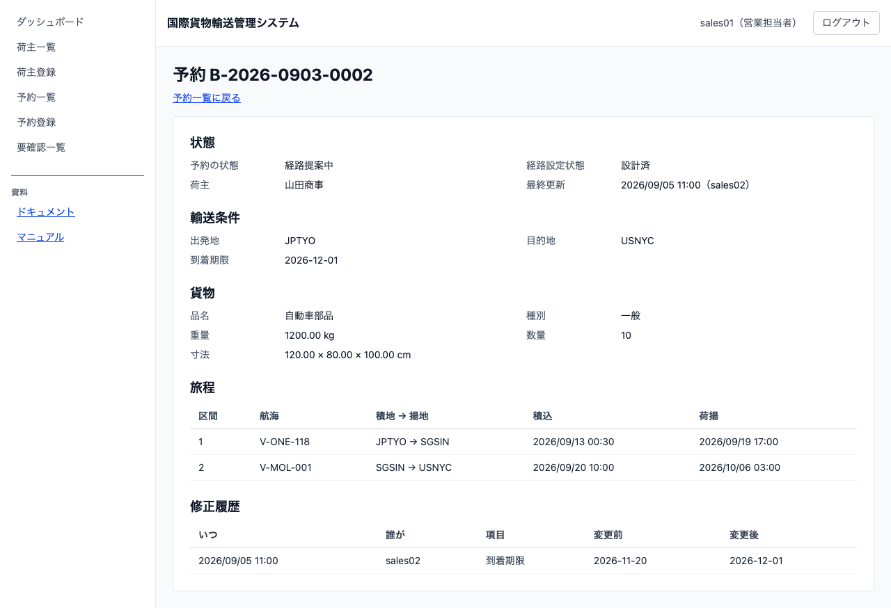
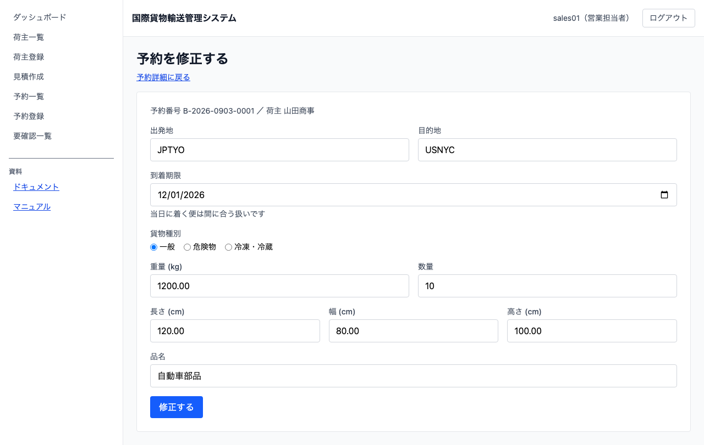

# 05 貨物予約を登録する

## この章でできること

荷主から受けた輸送の依頼を、貨物予約として登録します。入力を間違えたときは、経路設計へ引き渡す前なら直せます。営業担当者の操作です。登録した予約は経路設計の担当へ引き継がれます。

## 予約の一覧を見る

1. 左のメニューから `[予約一覧]` を選びます

   

一覧には予約番号・荷主・出発地と目的地・到着期限・貨物・状態が出ます。到着期限が近い順に並びます。

**終わった予約は既定では出ません。** 精算済とキャンセルは一覧から外れます。今日やることだけが残るようにするためです。過去の分を見るときは `[終了したものも表示]` にチェックを入れてください。

## 予約を登録する

1. 予約一覧で `[予約を登録する]` を押します

   

2. 「荷主」を一覧から選びます。「名称（荷主コード）」で並んでいます。目的の荷主が無い場合は先に登録してください（[03 荷主を登録する](03-荷主を登録する.md)）
3. 「出発地」「目的地」を UN/LOCODE（英大文字 5 文字。例 `JPTYO`）で入力します
4. 「到着期限」を選びます。**その日に着く便は間に合う扱いです**
5. 「貨物種別」を選びます
    - `危険物` を選ぶと「IMO クラス」「UN 番号」が現れます。どちらも必須です
    - `冷凍・冷蔵` を選ぶと「温度条件」が現れます。下限と上限の両方が必須です
6. 「重量 (kg)」「数量」「長さ (cm)」「幅 (cm)」「高さ (cm)」「品名」を入力します
7. `[登録する]` を押します
8. 予約一覧に戻ります。「登録を受け付けました。反映までしばらくお待ちください」と出ます。**一覧は自動で取り直すので、そのままお待ちください**

登録した予約は「仮受付」の状態で始まります。

## 予約の内容を確認する

1. 予約一覧で予約番号を押します

   

状態・輸送条件・貨物の内容が出ます。通知の履歴は、それを扱えるようになったときに増えます。

仮受付の予約には `[経路設計を依頼する]` が出ます。押すと経路設計者へ引き渡せます（[08 経路設計に引き渡す](08-経路設計に引き渡す.md)）。

上のキャプチャは登録した直後の状態です。経路が決まって一度修正した予約は、次のように見えます。

**経路が決まった予約には「旅程」の表が出ます。** 区間・航海・積地 → 揚地・積込・荷揚が、**積む順**に並びます。経路を決めるのは経路設計者です（[09 経路を設計する](09-経路を設計する.md)）。経路が決まっていない予約には、この表そのものが出ません。

**一度でも直した予約には「最終更新」と「修正履歴」が出ます。** 修正履歴には、いつ・誰が・どの項目を・何から何に変えたかが、新しい修正から順に並びます。**変わった項目だけ**が出ます。一度も直していない予約には出ません。

**引き渡したあとの予約に `[経路設計を依頼する]` は出ません。** 一度引き渡した予約をもう一度引き渡すことはできません。経路を組み直したいときは、経路設計者に条件の見直しを相談してください。

## 危険物と冷凍・冷蔵の予約

貨物種別に応じて、追加の情報が必須になります。**入れないと登録できません。** 法令上の要件と取扱い条件を、予約の時点で確定させるためです。

| 種別 | 必須になる項目 | 入れ方 |
| :--- | :--- | :--- |
| 危険物 | IMO クラス・UN 番号 | 「貨物種別」で `危険物` を選ぶと欄が現れます。IMO クラスは 1〜9、UN 番号は `UN` に続く 4 桁（例 `UN1263`） |
| 冷凍・冷蔵 | 温度条件（下限・上限） | 「貨物種別」で `冷凍・冷蔵` を選ぶと欄が現れます。**下限と上限の両方**が要ります（例 `-20` 〜 `-5`） |

登録した内容は予約詳細に出ます。危険物申告は「IMO 3 / UN1263」、温度条件は「-20 〜 -5 ℃」の形です。

**この情報は経路設計にも使われます。** 危険物や冷凍・冷蔵の貨物は、その種別に対応する航海だけが候補になります（[07 航海スケジュールを登録・更新する](07-航海スケジュールを登録する.md)）。対応する航海が無いときは、運送会社の航海スケジュールが登録されているかを経路設計者に確認してください。

## 予約を修正する

入力の誤り（港の取り違え・重量の桁・品名）を直します。**直せるのは「仮受付」の予約だけです。** 経路設計へ引き渡したあとは、経路設計者が条件を調整します。

1. 予約一覧で予約番号を押して詳細を開きます
2. `[修正する]` を押します

   

3. 登録済みの内容が入った状態で開きます。直したいところだけ書き換えます
    - 入力欄と決まりは登録と同じです
    - **荷主は変えられません。** 荷主を間違えたなら、それは別の予約です。この予約を取り消して、正しい荷主で登録し直してください
4. `[修正する]` を押します
5. 予約詳細に戻ります。反映まで数秒かかることがあります

**到着期限が過ぎた予約も直せます。** 期限を過ぎたからといって品名の誤りをそのままにはできないためです。ただし**期限そのものを過去の日付に付け替えることはできません**。

**`[修正する]` が出ないとき**は、その予約がもう仮受付ではありません。状態を確かめてください。

**直した内容は「修正履歴」で確かめられます。** 予約詳細の下に、変えた項目が `変更前 → 変更後` の形で残ります。誤って直したときは、何を戻せばよいかをここで読めます。

## うまくいかないとき

以下のメッセージは、後ろに入力した値が付きます（例: `出発地と目的地が同じです: JPTYO`）。

### 「出発地と目的地が同じです」と出る

同じ港どうしの輸送は登録できません。どちらかを直してください。

### 「危険物には危険物申告が必要です」と出る

貨物種別で `危険物` を選んだときは、IMO クラスと UN 番号の両方が要ります。

### 「冷凍・冷蔵貨物には温度管理条件が必要です」と出る

貨物種別で `冷凍・冷蔵` を選んだときは、温度条件の下限と上限の両方が要ります。

### 「状態 ○○ の予約は修正できません」と出る

経路設計へ引き渡したあとの予約です。経路の条件を変えたいときは経路設計者にご相談ください（[08 経路設計に引き渡す](08-経路設計に引き渡す.md)）。

### 「UN/LOCODE は英大文字 5 文字です」と出る

出発地・目的地は `JPTYO`（東京）のように **5 文字**で入力します。小文字で入れても大文字として送られるので、文字数を確かめてください。

### 一覧に登録した予約が出ない

一覧は自動で取り直します。数秒待っても出ない場合は [04 要確認一覧を確認する](04-要確認一覧を確認する.md) を見てください。

## 経路設計の担当が引き継ぐまで

登録した予約は「仮受付」のまま、経路設計の担当が引き取るのを待ちます。

**経路設計の担当には通知は届きません。** 引き渡したあと、その方のダッシュボードに「経路設計を待っている予約が N 件あります」と出て、そこから経路設計作業一覧へ行けます。あなたのダッシュボードには「経路設計者へ引き渡していない予約が N 件あります」と出るので、引き渡し忘れはここで気づけます。急ぎの場合は、これまでどおり口頭や電話で伝えてください。

## うまくいかないとき（続き）

### 到着期限が選べない日がある

過去の日付は選べません。**当日は選べます**（その日に着く便は間に合う扱いです）。

### 荷主のプルダウンに目的の荷主が出ない

- **まだ登録していない場合** — 先に [03 荷主を登録する](03-荷主を登録する.md) で登録してください
- **登録した直後の場合** — 反映まで数秒かかります
- **「N 件のうち 200 件を表示しています」と出ている場合** — 一覧が上限で切れています。絞り込みは次のイテレーションで入ります。それまでは管理者にご相談ください

## 関連する章

- [03 荷主を登録する](03-荷主を登録する.md)
- [04 要確認一覧を確認する](04-要確認一覧を確認する.md)
