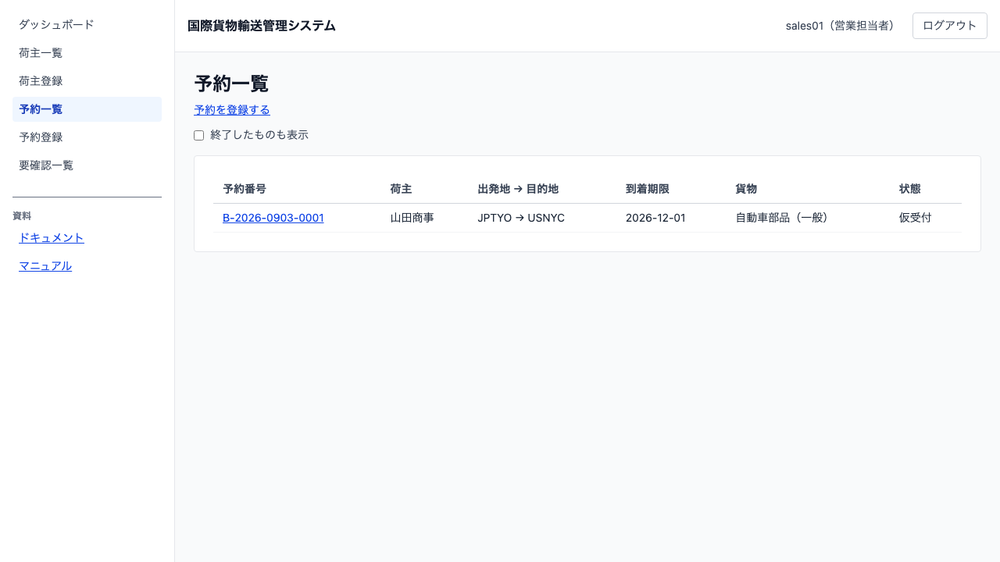
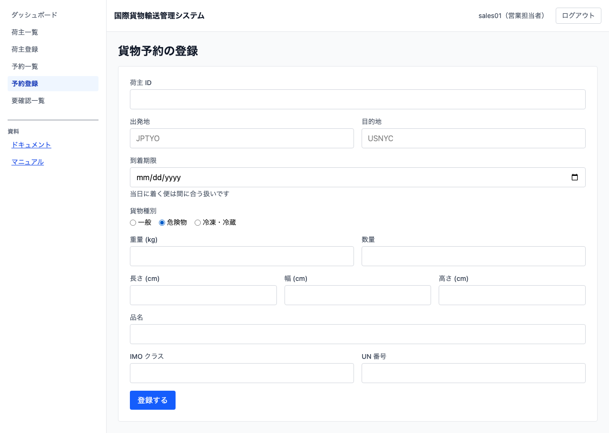
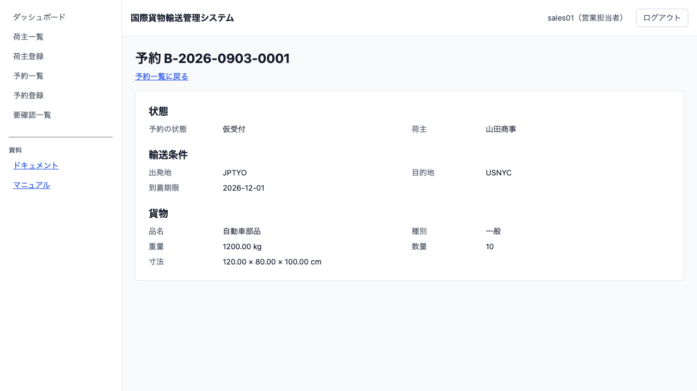

# 05 貨物予約を登録する

## この章でできること

荷主から受けた輸送の依頼を、貨物予約として登録します。営業担当者の操作です。登録した予約は経路設計の担当へ引き継がれます。

## 予約の一覧を見る

1. 左のメニューから `[予約一覧]` を選びます

   

一覧には予約番号・荷主・出発地と目的地・到着期限・貨物・状態が出ます。到着期限が近い順に並びます。

**終わった予約は既定では出ません。** 精算済とキャンセルは一覧から外れます。今日やることだけが残るようにするためです。過去の分を見るときは `[終了したものも表示]` にチェックを入れてください。

## 予約を登録する

1. 予約一覧で `[予約を登録する]` を押します

   

2. 「荷主 ID」を入力します。荷主一覧（[03 荷主を登録する](03-荷主を登録する.md)）で確認できます
3. 「出発地」「目的地」を UN/LOCODE（英大文字 5 文字。例 `JPTYO`）で入力します
4. 「到着期限」を選びます。**その日に着く便は間に合う扱いです**
5. 「貨物種別」を選びます
    - `危険物` を選ぶと「IMO クラス」「UN 番号」が現れます。どちらも必須です
    - `冷凍・冷蔵` を選ぶと「温度条件」が現れます。下限と上限の両方が必須です
6. 「重量」「数量」「長さ」「幅」「高さ」「品名」を入力します
7. `[登録する]` を押します
8. 予約一覧に戻ります。**登録した予約が出るまで数秒かかります**

登録した予約は「仮受付」の状態で始まります。

## 予約の内容を確認する

1. 予約一覧で予約番号を押します

   

状態・輸送条件・貨物の内容が出ます。経路と通知の履歴は、それらを扱えるようになったときに増えます。

## うまくいかないとき

### 「出発地と目的地が同じです」と出る

同じ港どうしの輸送は登録できません。どちらかを直してください。

### 「危険物には危険物申告が必要です」と出る

貨物種別で `危険物` を選んだときは、IMO クラスと UN 番号の両方が要ります。

### 「冷凍・冷蔵貨物には温度管理条件が必要です」と出る

貨物種別で `冷凍・冷蔵` を選んだときは、温度条件の下限と上限の両方が要ります。

### 「UN/LOCODE は英大文字 5 文字です」と出る

出発地・目的地は `JPTYO`（東京）のような英大文字 5 文字で入力します。小文字は使えません。

### 一覧に登録した予約が出ない

数秒待って画面を開き直してください。それでも出ない場合は [04 要確認一覧を確認する](04-要確認一覧を確認する.md) を見てください。

## 関連する章

- [03 荷主を登録する](03-荷主を登録する.md)
- [04 要確認一覧を確認する](04-要確認一覧を確認する.md)
