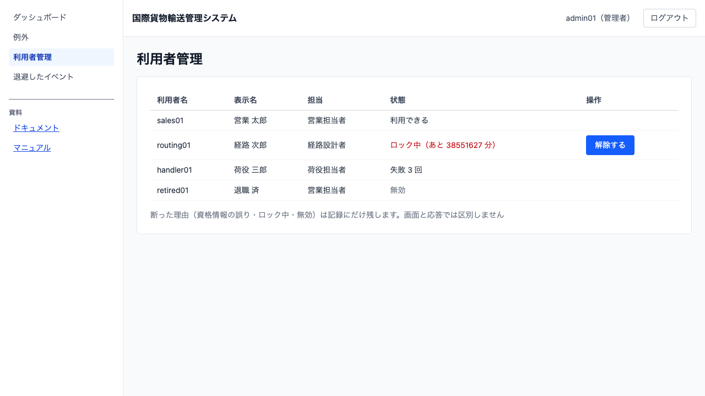
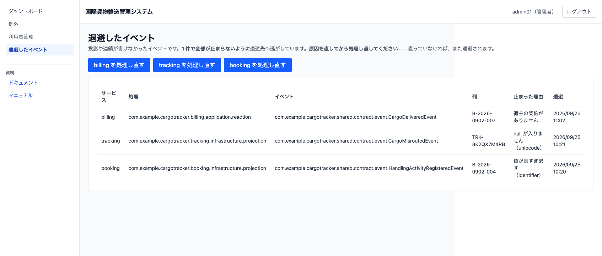

# 06 利用者を管理する

## この章でできること

利用者の状態を確認し、ログインできなくなったアカウントのロックを解除します。あわせて、**処理が止まっているイベント**（退避したイベント）を確認し、直したあとに処理し直せます。システム管理者の操作です。

## 利用者の一覧を見る

1. 左のメニューから `[利用者管理]` を選びます

   

一覧には利用者名・表示名・担当・状態・操作が出ます。状態は次のとおりです。

| 状態 | 意味 |
| :--- | :--- |
| 利用できる | 通常の状態 |
| 失敗 *n* 回 | パスワードを続けて間違えている。5 回でロックされる |
| ロック中（あと *n* 分） | ロックされている。時間が経つか、解除すると入れる |
| 無効 | アカウントが無効化されている。ロック解除では戻らない |

**「失敗 *n* 回」が出ている利用者には、ロックされる前に声をかけられます。**

## ロックを解除する

1. ロック中の行にある `[解除する]` を押します
2. その利用者はすぐにログインできるようになります

失敗回数も 0 に戻ります。

**解除ボタンはロック中の行にだけ出ます。** ロックされていない利用者には出ません。

## よくある問い合わせ

### 「ログインできない」と言われた

利用者管理でその利用者の状態を確認してください。

- **ロック中** — `[解除する]` を押すか、表示されている時間だけ待ってもらいます
- **無効** — アカウントが無効化されています。解除ではなく、利用を再開してよいかの判断が要ります
- **利用できる** — パスワードの間違いです。ロックされる前なので、落ち着いて入力し直してもらいます

### なぜ利用者には「ロックされました」と出ないのか

ログイン画面は、失敗した全員に同じ文を返します。「ロック中です」「そのアカウントは無効です」と出し分けると、**利用者名が実在することを外部に教えてしまう**ためです。

代わりにログイン画面では、失敗したときに「続けて 5 回失敗すると 15 分ロックされる」ことと「心当たりがなければ管理者へ問い合わせる」ことを、全員に同じ文で伝えています。

### この画面にも理由が出ないのはなぜか

管理者の端末を覗いた第三者に「その利用者名は実在する」と伝わらないようにするためです。ロック・解除・無効化アカウントへの試行は記録に残っており、必要なときに調べられます。

## 退避したイベントを確認する

**一覧が更新されない、状態が変わらない**——そういうときは、イベントの処理が止まっているかもしれません。

1. 左のメニューから `[退避したイベント]` を選びます
2. 止まっているものが、新しい順に出ます

   

| 列 | 読み方 |
| :--- | :--- |
| サービス | どのサービスで止まったか |
| 処理 | どの処理（投影・連鎖）で止まったか |
| イベント | 何を処理しようとして止まったか |
| 列 | どの予約・どの貨物の分か。**その列の後続も止まっています** |
| 止まった理由 | 次に何をすべきかは、たいていここに書いてあります |
| 退避 | いつ止まったか |

**1 件で全部が止まらないようにしてあります。** 処理できなかったイベントは退避先へ逃がし、無関係の予約は先へ進みます。ただし**同じ列の後続は順番を守るために一緒に止まります**——「列」を見れば、どこまでが影響を受けているか分かります。

### 処理し直す

原因（多くはデータの不備や設定です）を直してから、`[<サービス名> を処理し直す]` を押します。

**直っていなければ、また退避されます。** それが正しい姿です——原因を直さずに処理し直しても通らないことが、ここで分かります。

**消す操作はありません。** 直したあとに退避を消すのは、起きたことを黙って捨てることになるためです。

### 中身が出ないのはなぜか

退避されたイベントには**個人情報が載っていることがあります**。荷主の削除依頼で鍵を破棄しても、この画面に平文が残ってしまう形にはしません。一覧に出しているのは「どの処理が・どの種類のイベントで・どの列が・なぜ止まったか」だけです。中身が要る調査は、開発・運用の担当者が端末から行います。

## 関連する章

- [02 ログインとログアウト](02-ログインとログアウト.md)
