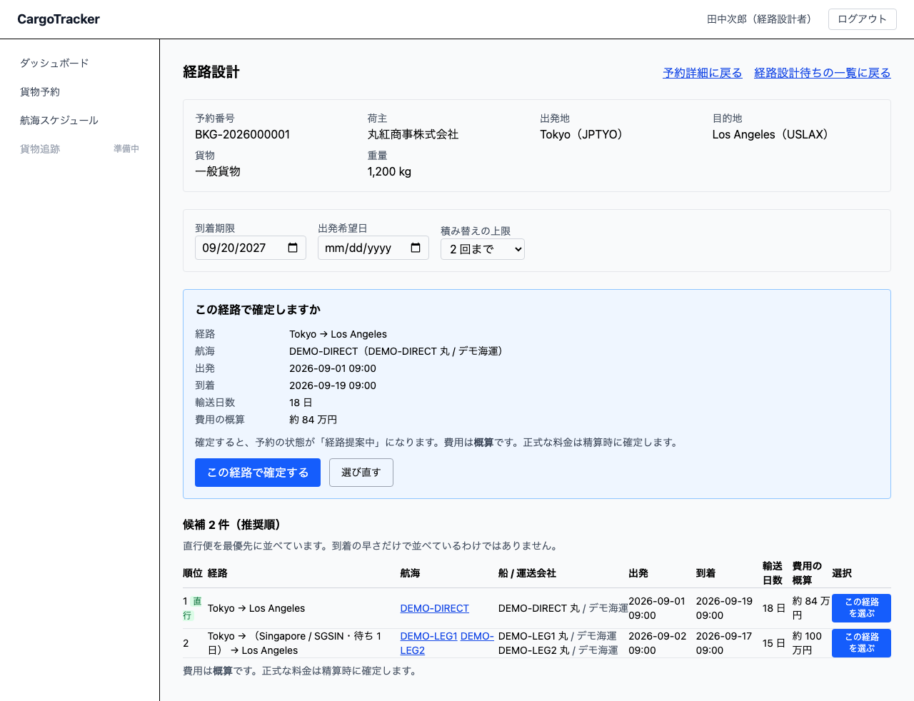

# 06 経路設計

引き渡された予約に対して、**期限内に着く経路の候補**を出して見比べ、1 件を選んで予約に紐付ける画面です。**経路設計者**が使います。

本章は [01 業務フロー](01-業務フロー.md#steps) の**工程 5（経路を決めて予約に紐付ける）**に
あたります。候補を出して見比べ、選んで確定するところまでが本章の範囲です。

## 画面の開き方

メニューにはありません。**予約の詳細から開きます。**

1. ダッシュボードの「経路設計を待っている予約を見る」を押す
2. 一覧から予約番号を押す
3. 予約詳細の [経路を割り当て] を押す

> **メニューに置いていないのは、予約を選ばないと開けない画面だからです。** どの予約の経路を
> 組むかが決まっていないと、出発地も目的地も期限も分かりません。

> **画面の右上の [予約詳細に戻る] で、元の予約へ戻れます。**
> 続けて次の予約を処理するときは [経路設計待ちの一覧に戻る] を使ってください。

| 節 | 内容 |
| :--- | :--- |
| [6.1](#candidates) | 経路の候補を見る |
| [6.2](#choose) | 経路を選んで確定する |
| [6.3](#no-candidates) | 候補が見つからないとき |
| [6.4](#consultation) | 見つからないときに営業へ相談する |

---

## 6.1 経路の候補を見る {#candidates}

### この画面でできること

予約の出発地・目的地・到着期限・貨物種別を引き継いだ状態で開き、**期限内に着く経路**を
推奨順に並べます。

### 上部に出る予約の内容

| 項目 | 説明 |
| :--- | :--- |
| 予約番号 | 経路を組む対象の予約 |
| 荷主 | 依頼元 |
| 出発地・目的地 | 港の名前と UN/LOCODE |
| 貨物 | 一般貨物 / 危険物 / 冷凍・冷蔵 |
| 重量 | 貨物の重量 |

> **予約から引き継いだ内容は打ち直す必要がありません。** 転記する過程で条件が変わるのを
> 避けるためです。

### 条件

| 項目 | 説明 |
| :--- | :--- |
| 到着期限 | 予約の期限が入っています。変えるとその場で算出し直します |
| 出発希望日 | 予約の希望出発日が入っています。**この日より前に出る便は候補に出ません**（荷主の倉庫に荷物が入る日より前の便を押さえても、積むものがありません） |
| 積み替えの上限 | 既定は「2 回まで」。**直行便のみ / 1 回まで / 2 回まで / 3 回まで** から選べます（3 回が上限です） |

> **到着期限と出発希望日を予約から動かしている間は、経路を確定できません。** これらは
> 荷主との約束であり、変えるには荷主の合意が要ります。画面に理由が出て、[この経路を選ぶ] は
> 出ません。合意が取れたら営業に予約の条件を直してもらうか、[6.4](#consultation) で営業へ
> 戻してください。

> **到着期限は日付で指定します。** 「9 月 30 日まで」は「9 月 30 日中に着けばよい」という
> 意味です。9 月 30 日の夜に着く便も候補に出ます。

### 候補の一覧の見かた

| 列 | 説明 |
| :--- | :--- |
| 順位 | おすすめの順。**直行便には「直行」が付きます** |
| 経路 | 港の名前で示します。積み替える港は括弧で挟み、**その港での待ち時間**も併記します |
| 航海 | 使う航海番号。押すと[航海の詳細](05-航海スケジュール.md#voyage-detail)が開きます |
| 船 / 運送会社 | どの船が、どの会社で運ぶか。積み替えがあれば区間ごとに出ます |
| 出発・到着 | 日本時間 |
| 輸送日数 | 出発から到着までの日数。**積み替えの待ち時間も含みます** |
| 費用の概算 | 目安の金額 |
| 選択 | [この経路を選ぶ]。押しても**まだ確定しません**（[6.2](#choose)） |

> **並び順はシステムが決めます。**
>
> 1. **直行便がいちばん上**です。遅く着く場合でも上に出ます。積み替えが無いということは、
>    乗り継ぎに失敗することも、荷役で荷物を傷めることも無いという意味だからです
> 2. 次に**早く着く順**
> 3. 到着が同じなら**積み替えの少ない順**

> **費用は概算です。正式な料金は精算時に確定します。** いまは経路どうしを見比べるための
> 目安として出しています。見積の金額としては使えません。

> **積み替えには最低 6 時間かかるものとして計算しています。** 降ろして・受け渡して・積むまでに
> かかる時間です。これより短い乗り継ぎは、机の上では成立しても現場で実行できないため、
> 候補に出しません。

> **危険物・冷凍を運ぶときは、経由港がその貨物を扱えるかをご自身で確認してください。**
> システムは「その船が運べるか」までは見ますが、**「その港が扱えるか」は見ていません**。
> 候補に出た経路でも、経由港が危険物を扱えないことがあります。

> **積み替えの待ち時間は一律 6 時間として計算しています。** 危険物は積み替えのたびに
> 書類と検査が入るため、実際にはこれより長くかかります。

> **積み替え港での待ち時間も見てください。** 所要日数の合計だけでは、どこでどれだけ
> 止まるのかが分かりません。「上海で 1 日 14 時間待つ」は、荷主に説明するときに必要な情報です。

---

## 6.2 経路を選んで確定する {#choose}

### この画面でできること

候補の中から 1 件を選び、予約に紐付けます。紐付けると、予約の状態が**「経路提案中」**に
なり、営業担当者が荷主に経路を提示できるようになります。

### 画面の説明

### 操作手順

1. 候補の一覧で、選びたい行の **[この経路を選ぶ]** を押します
2. 確認の枠が開きます。**この時点ではまだ予約は変わっていません**
3. 内容（経路・航海・出発・到着・輸送日数・費用の概算）を確かめます
4. **[この経路で確定する]** を押します
5. 予約詳細の画面に移り、**割り当て経路（旅程）**が表示されます

> **押した瞬間には確定しません。** 経路の確定は予約の状態を動かし、荷主への提示に
> つながります。取り消す手段がないため、確認を 1 つ挟んでいます。
> 選び直したいときは **[選び直す]** を押してください。条件はそのまま残ります。

> **確定できたことは、予約詳細に旅程が出ていることで分かります。** 「確定しました」という
> 表示ではなく、実際に紐付いた区間が見えることで確かめてください。

> **確定しても、予約は「確定」にはなりません。** 経路が決まっただけで契約が成立したことに
> しないためです。予約の確定は荷主の合意を経た別の作業です。

> **航海が変わっていたときは確定できません。** 候補を出してから確定するまでの間に、
> その航海が変更・欠航されることがあります。その場合は理由が表示され、一覧に戻ります。
> **入力を直すのではなく、もう一度経路を探してください。**

> **経路が決まったあとも、この画面は開けます。** 航海の遅延・欠航があったときは、
> 予約詳細の **[経路を見直す]** から入り直して、別の経路に差し替えられます。

---

## 6.3 候補が見つからないとき {#no-candidates}

### この画面でできること

期限内に着く経路が 1 つも無いときは、**いま何で絞ったか**を示します。

### 表示される内容

「**いま使った条件**」として、次の 3 つを並べます。

| 項目 | 説明 |
| :--- | :--- |
| 到着期限 | 指定した期限 |
| 貨物種別 | 危険物・冷凍は「（運べる船が限られます）」と添えます |
| 積み替え | 許した積み替えの回数 |

> **貨物種別が効いていることがあります。** 危険物と冷凍・冷蔵を運べる船は限られます。
> 期限だけを延ばしても見つからないときは、この行を確かめてください。

### 条件を緩める

| 操作 | 何が変わるか |
| :--- | :--- |
| [到着期限を 1 週間延ばす] | 期限を 7 日後ろにして算出し直します |
| [積み替えを 3 回まで許す] | 乗り継ぎの回数を増やして算出し直します |
| [航海スケジュールを見る] | [05 航海スケジュール](05-航海スケジュール.md) を開きます |

> **それでも見つからないときは、その区間の便が登録されていない可能性があります。**
> 航海スケジュールを開いて、出発地から目的地への便があるかを確かめてください。
> 無ければ、[航海スケジュールを登録](05-航海スケジュール.md#register-voyage)します。

> **期限を延ばすときは荷主への確認が要ります。** 画面上は延ばせますが、到着期限は荷主との
> 約束です。延ばした条件で経路を決める前に、営業担当者を通して確認してください。
> 期限を変えると、画面に**予約の期限といま探している期限の両方**が出ます。
> [予約の期限に戻す] でいつでも戻せます。

> **調整した条件は画面を開き直しても残ります。** 航海の詳細を確かめて戻ってきても、
> 入れ直す必要はありません。航海の詳細からは **[経路設計に戻る]** で戻れます。

---

## 6.4 見つからないときに営業へ相談する {#consultation}

### この画面でできること

条件を緩めても経路が組めないときは、**条件そのものを見直す**必要があります。到着期限や
出発地・目的地は荷主との約束であり、変えられるのは営業担当者だけです。この画面から
営業へ差し戻せます。

### 操作手順

1. 候補が見つからない状態で、**[条件協議を依頼する]** を押します
2. 予約の経路の状態が **「条件協議中」** になります
3. 営業担当者のダッシュボードに件数が出て、そこから対象の予約へ行けます
4. 荷主と条件が決まったら、経路設計者がこの画面でもう一度経路を探します

> **メールなどの通知は送られません。** 営業担当者は自分のダッシュボードでこの件数に
> 気づきます。急ぎのときは、口頭でも伝えてください。

> **一度差し戻すと、ボタンは出なくなります。** 二重に送っても営業側の見えかたは
> 変わらないためです。画面には「この予約は営業へ戻しています」と出ます。

> **差し戻した理由は記録されません。** 何が厳しかったか（期限か、便が無いか）は、
> 営業担当者に別途伝えてください。

---

## この画面で出るメッセージ

| メッセージ | いつ出るか | どうすればよいか |
| :--- | :--- | :--- |
| 読み込んでいます… | 予約を読み込んでいる間 | 待つ |
| 経路を探しています… | 候補を算出している間 | 待つ |
| 到着期限を入力してください。 | 到着期限を空にした | 期限を入れる（空のままでは探しません） |
| 予約を読み込めませんでした。 | 予約番号が誤っている / 通信に失敗した | 一覧から入り直す |
| 経路候補を算出できませんでした。時間をおいて開き直してください。 | 通信に失敗した | 時間をおいて開き直す |
| 期限内に到着できる経路が見つかりませんでした | 条件に合う経路が無い | [6.3](#no-candidates) の操作で条件を緩める |
| この経路で確定しますか | [この経路を選ぶ] を押した | 内容を確かめて [この経路で確定する]、やめるなら [選び直す] |
| 確定すると、予約の状態が「経路提案中」になります。 | 確認の枠を開いた | そのまま進めてよければ確定する |
| 選んだ経路はもう使えません。航海スケジュールが変わっている可能性があります。経路をもう一度探してください | 候補を出してから確定するまでに航海が変わった | 条件を確かめて、もう一度経路を探す |
| 経路を確定できませんでした。時間をおいて再度お試しください。 | 通信に失敗した | 時間をおいて開き直す |
| この予約は営業へ戻しています。条件が決まったら、もう一度この画面で経路を探します。 | すでに条件協議を依頼した | 営業担当者の連絡を待つ |
| 条件そのものを見直す必要がありそうなら、営業へ戻して荷主と協議してもらいます。 | 候補が見つからない | [条件協議を依頼する] を押す（[6.4](#consultation)） |
| 候補 N 件（推奨順） | 候補が見つかった | 見比べて 1 件を選ぶ |
| 直行便を最優先に並べています。到着の早さだけで並べているわけではありません。 | 候補が見つかった | 並び順の意味を確かめる（画面は並べ替えません） |
| この条件で進めるには荷主の合意が要ります。 | 到着期限を予約と違う日にした | 営業を通して荷主に確認する。[予約の期限に戻す] で戻せます |
| いまは予約の条件と違う条件で探しています。…ここからは確定できません。 | 期限または出発希望日を予約から動かした | 予約の条件に戻すか、[条件協議を依頼する] で営業へ戻す |
| いま経路を確認できません。しばらくしてからもう一度お試しください | 経路設計のシステムが応答しない | 時間をおいて確定し直す（**航海スケジュールの問題ではありません**） |
| （上海 / CNSHA・待ち 1 日 14 時間） | 積み替えのある候補の「経路」列 | 待ち時間も含めて荷主に説明する |
| 出発地が見つかりません / 目的地が見つかりません | 登録されていない港が指定された | 一覧から入り直す（通常は起きません） |
| 到着期限は「2026-09-30」の形式で指定してください | 期限の形が壊れている | 日付を選び直す（通常は起きません） |
| この予約の到着期限は … です。いま … で探しています。 | 期限を予約と違う日にした | 荷主の合意を得るか、[予約の期限に戻す] を押す |

> **サーバが理由を返したときは、その理由をそのまま表示します。** 「経路が無い」と
> 「港の指定が誤り」は別のことなので、同じ文言にはしません。

---

## 関連する章

- [01 業務フロー](01-業務フロー.md#steps) — 工程 5 の位置づけ
- [04 貨物予約](04-貨物予約.md) — 経路を組む対象の予約と、引き渡しの操作
- [05 航海スケジュール](05-航海スケジュール.md) — 候補の材料になる航海の登録・詳細
