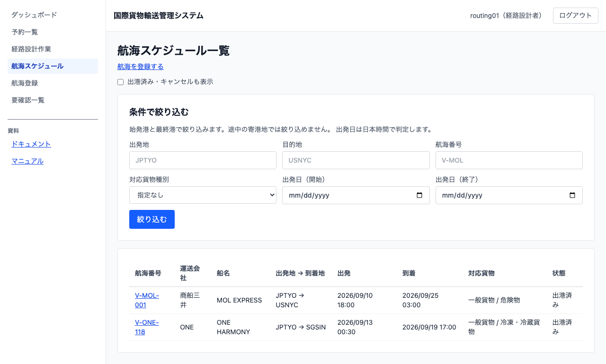
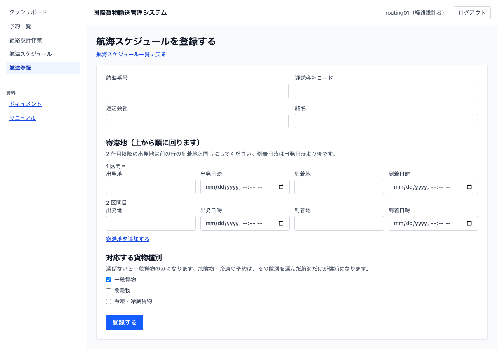
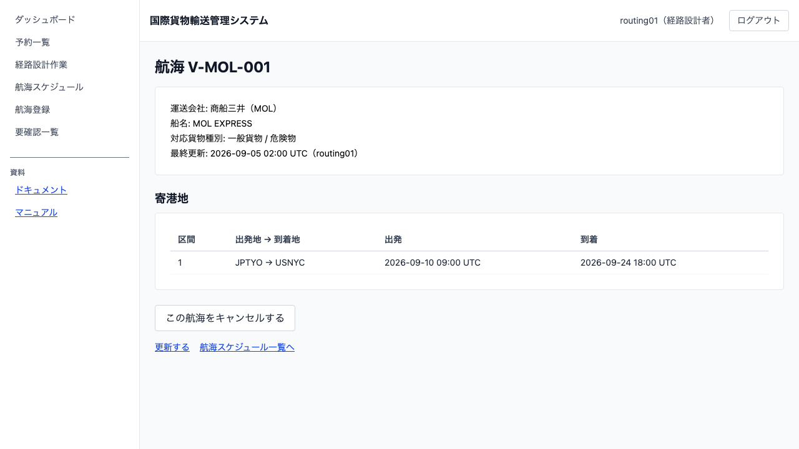
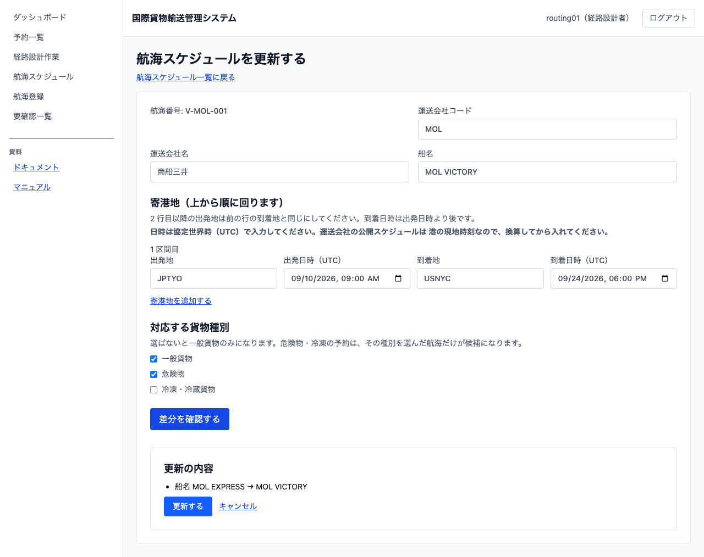

# 07 航海スケジュールを登録・更新する

## この章でできること

運送会社が公開している航海スケジュールをシステムに登録し、条件で探し、運航変更があったときに更新します。経路設計者の操作です。登録した航海は、経路を設計するときの候補になります。

## 航海の一覧を見る

1. 左のメニューから `[航海スケジュール]` を選びます

   

一覧には航海番号・運送会社・船名・出発地と到着地・出発と到着の日時・対応貨物・状態が出ます。出発日が近い順に並びます。

**出港済みとキャンセルは既定では出ません。** これから使える航海だけが残るようにするためです。過去の分を見るときは `[出港済み・キャンセルも表示]` にチェックを入れてください。

日時は港の現地時刻ではなく協定世界時（UTC）で出ます。出発港と到着港で時間帯が違うため、どちらの時刻かが分かる形にしています。

航海番号を押すと、その航海の詳細（寄港地の並びと最終更新）が開きます。

## 航海を探す

登録した航海が増えると、一覧を上から読むのは現実的でなくなります。一覧の上にある「条件で絞り込む」を使ってください。

1. 「出発地」「目的地」を UN/LOCODE（英大文字 5 文字。例 `JPTYO`）で入れます
    - **始発港と最終港だけで絞り込みます。** 途中の寄港地では絞り込めません。途中の港で探して 0 件が出ても、「その港へ行く便が無い」という意味ではありません
2. 「対応貨物種別」を選びます。危険物や冷凍・冷蔵の予約に使える航海だけが残ります
3. 「出発日（開始・UTC）」「出発日（終了・UTC）」で期間を絞ります。**判定は協定世界時（UTC）です**
4. `[絞り込む]` を押します

条件はいくつでも組み合わせられます。空欄の条件は「指定なし」です。条件を入れているのに何も出ないときは「条件に合う航海はありません」と出ます（条件を入れていないときの「航海はありません」とは別の案内です）。

`[条件を消して探し直す]` を押すと条件が消え、一覧が元に戻ります。

**出港済み・キャンセルの扱いは条件と別です。** 絞り込んでも、既定では出港済みとキャンセルは出ません。過去の便を条件で探すときは `[出港済み・キャンセルも表示]` にもチェックを入れてください。

経路設計作業一覧の `[対応する航海を探す]` から来たときは、その予約の出発地・目的地・貨物種別と、到着期限を「出発日（終了）」に入れた状態で開きます（[08 経路設計に引き渡す](08-経路設計に引き渡す.md)）。そのまま `[絞り込む]` を押せば、その貨物を運べる航海だけが出ます。

## 航海を登録する

1. 航海スケジュール一覧で `[航海を登録する]` を押します

   

2. 「航海番号」を入力します（20 文字以内）。運送会社が公開している番号をそのまま使います
3. 「運送会社コード」「運送会社名」「船名」を入力します。**船名は航海ごとに入れます。** 同じ船が別の航海に就くためです
4. 寄港地を上から順に入力します。1 区間目の「出発地」「出発日時（UTC）」「到着地」「到着日時（UTC）」を埋めます
    - **日時は協定世界時（UTC）で入れます。** 運送会社の公開スケジュールは港の現地時刻なので、換算してから入れてください。換算せずに入れると、時差の分ずれた航海が登録され、そのまま経路候補の所要日数になります（エラーは出ません）
    - 港は UN/LOCODE（英大文字 5 文字。例 `JPTYO`）で入力します
    - **到着日時は出発日時より後**にします
5. 寄港地が複数ある場合は `[寄港地を追加する]` を押して行を増やします
    - **2 区間目以降の「出発地」は、前の区間の「到着地」と同じ**にします。港が繋がっていないと登録できません
    - 時刻も前の区間より後にします
6. 「対応する貨物種別」にチェックを入れます
    - 既定では `一般貨物` が選ばれています
    - **危険物や冷凍・冷蔵の貨物を運べる航海は、必ずここで選んでください。** 選び忘れると、その種別の予約の候補に出ません
7. `[登録する]` を押します
8. 航海スケジュール一覧に戻ります。「登録を受け付けました。反映までしばらくお待ちください」と出ます。**一覧は自動で取り直すので、そのままお待ちください**

## 航海の内容を確認する

1. 航海スケジュール一覧で航海番号を押します

   

運送会社・船名・対応貨物種別と、寄港する順に並んだ区間が出ます。

**一度でも更新した航海には「最終更新」が出ます**（日時と更新した利用者）。出ていない航海は、登録してから直していないという意味です。

## 航海の内容を更新する

運送会社の運航変更（船の変更・日時の繰り上げ／繰り下げ・寄港地の入れ替え）を反映します。**航海番号は変えられません。** 番号が違うならそれは別の航海です。

1. 航海詳細で `[更新する]` を押します
2. 登録済みの内容が入った状態で開きます。直したいところだけ書き換えます
    - 入力の決まりは登録と同じです（港の連結・到着は出発より後・日時は UTC）
3. `[差分を確認する]` を押します

   

4. 「更新の内容」に、変わる項目が `変更前 → 変更後` の形で出ます。**ここで内容を確かめてください**
    - 何も変えずに押すと「変更はありません」と出ます。そのまま `[閉じる]` を押してください
    - **確認したあとに入力を直すと、確認の表示は消えます。** 確かめた内容と送る内容が食い違わないようにするためです。直したらもう一度 `[差分を確認する]` を押してください
5. `[更新する]` を押します。ここで初めて変更が送られます
    - `[キャンセル]` を押すと何も送らずに戻ります
6. 航海詳細に戻ります。反映まで数秒かかることがあります

**キャンセル済みの航海は更新できません。** その航海には `[更新する]` が出ません。

## 航海をキャンセルする

運航中止や抜港で、その航海がもう走らなくなったときに記録します。

1. 航海詳細（S34）で `[この航海をキャンセルする]` を押します
2. キャンセル理由を入力します（例: `運航中止`）
3. `[キャンセルを確定する]` を押します
    - `[やめる]` を押すと何も送らずに戻ります

**理由は必ず入力してください。** 空のままでは送れません。あとから「なぜ止めたのか」を読むための記録です。

**キャンセルすると、その航海は次のようになります。**

- 経路候補に出なくなります（走らない船で経路を組ませないため）
- スケジュールを更新できなくなります
- 航海スケジュール一覧の既定から外れます（`[出港済み・キャンセルも表示]` で確認できます）

**行は消えません。** その航海で経路を組んだ貨物があるため、消すと何が起きたのかを追えなくなります。航海詳細を開くと「キャンセル済み」と理由・日時・実行者が出ます。**元のスケジュール（寄港地）もそのまま残ります。** 何を止めたのかが読めるようにするためです。

**戻す操作はありません。** 運航が復活したときは、新しい航海として登録してください。

## うまくいかないとき

以下のメッセージは、後ろに入力した値が付きます（例: `寄港地が繋がっていません: JPTYO に着いたあと SGSIN から出ることはできません`）。

### 「UN/LOCODE は英大文字 5 文字です」と出る

港のコードは英大文字 5 文字です。`jptyo` のように小文字で入れると受け付けません。`JPTYO` のように直してください。

### 「航海番号は 20 文字以内です」と出る

航海番号は 20 文字までです。短くしてください。

### 「寄港地を 1 件以上入力してください」と出る

区間が 1 つも入っていません。出発地・到着地・日時を入れた区間を、少なくとも 1 つ作ってください。

### 「航海 ○○ は既に登録されています（登録済みの航海を開くか、番号を直してください）」と出る

同じ航海番号が既にあります。登録済みの航海を一覧で確認するか、番号を直してください。

### 「寄港地が繋がっていません」と出る

前の区間の到着地と、次の区間の出発地が違います。船は着いた港からしか出られません。どちらかを直してください。

### 「到着日時は出発日時より後である必要があります」と出る

その区間の到着日時が、出発日時と同じか前になっています。日時を直してください。

### 「寄港地の時刻が前後しています」と出る

前の区間に着く前に、次の区間が出発する形になっています。日時を直してください。

### 「出発地と到着地が同じです」と出る

同じ港どうしの区間は登録できません。

### 「航海 ○○ は登録されていません」と出る

更新しようとした航海が見つかりません。航海番号を確かめてください。まだ投影に反映されていない直後の可能性もあります。

### 「航海 ○○ はキャンセル済みです」と出る

キャンセル済みの航海は直せません。運航が復活したときは、新しい航海として登録してください。

### 「航海 ○○ は既にキャンセル済みです」と出る

その航海はもう止めてあります。別の画面から二重に操作した可能性があります。航海詳細を開き直して、キャンセルの理由と日時を確かめてください。

### 更新したのに詳細が変わらない

反映まで数秒かかります。画面は自動で取り直します。それでも変わらないときは、要確認一覧を見てください。

### 登録したのに一覧に出ない

出発日時が過去になっていませんか。既定では出港済みを外すため、過去の便は一覧に出ません。`[出港済み・キャンセルも表示]` にチェックを入れると確認できます。

それでも出ない場合は、要確認一覧に「航海番号の重複」として残っている可能性があります。

## 関連する章

- [08 経路設計に引き渡す](08-経路設計に引き渡す.md)
- [05 貨物予約を登録する](05-貨物予約を登録する.md)
- [04 要確認一覧を確認する](04-要確認一覧を確認する.md)
