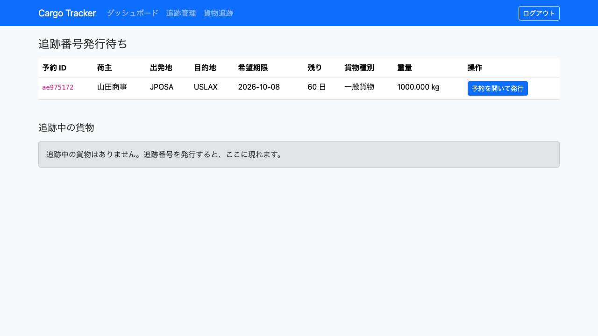
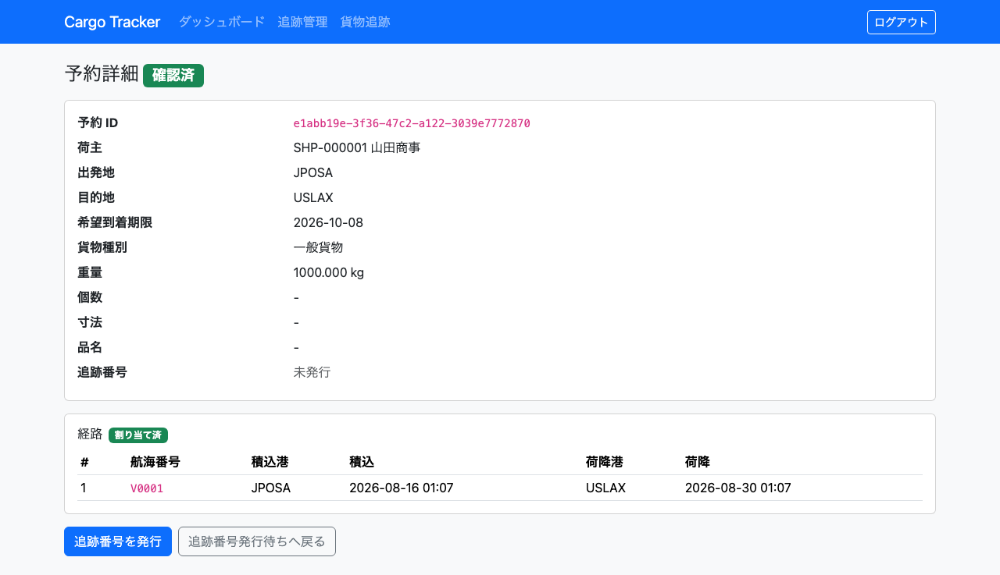
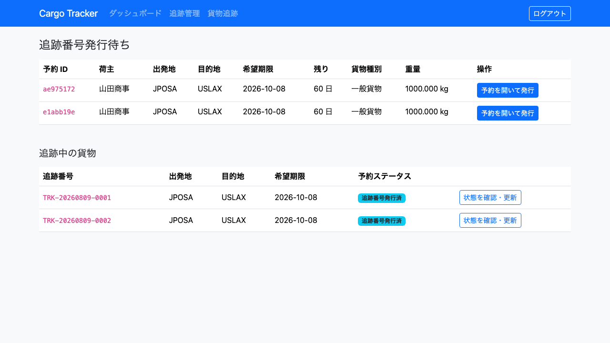
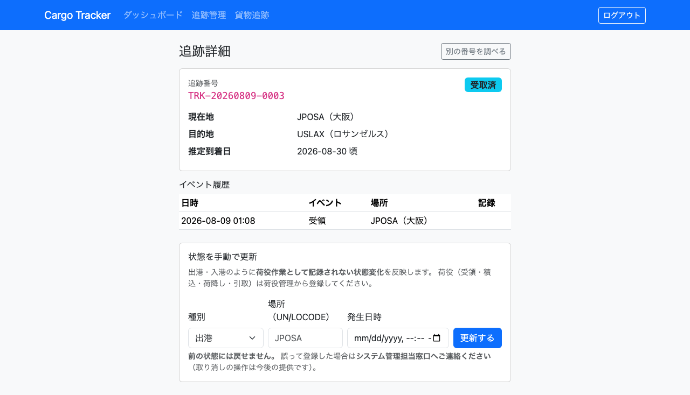

# 07. 追跡管理

確定した予約に**追跡番号を発行する**画面です。追跡担当者が利用します。

追跡番号は、荷主が輸送状況を問い合わせるときの唯一の手がかりです。**発行しないかぎり、荷役作業員は貨物を特定できず、作業を記録できません。** 確定した予約は速やかに発行してください。

## 画面の開き方

- メニュー「追跡管理」（URL: `/tracking/queue`）
- ダッシュボードの「追跡管理」カードの「開く」

| 画面 | 役割 | 節 |
| :--- | :--- | :--- |
| 追跡番号発行待ち | 発行すべき予約を確認する | [7.1](#71-発行待ちの予約を確認する) |
| 予約詳細 | 追跡番号を発行する | [7.2](#72-追跡番号を発行する) |
| 追跡中の貨物 | 輸送中の貨物を確認する | [7.3](#73-追跡中の貨物を確認する) |
| 追跡詳細 | 貨物の状態を手動で更新する | [7.4](#74-貨物の状態を手動で更新する) |

## 7.1 発行待ちの予約を確認する

### この画面でできること

- 確定済みで追跡番号が未発行の予約を、希望到着期限が近い順に確認します。

### 画面の開き方

- メニュー「追跡管理」（URL: `/tracking/queue`）

### 画面の説明

| # | 項目 | 説明 |
| :--- | :--- | :--- |
| ① | 予約 ID | 予約の番号（先頭 8 文字）です |
| ② | 荷主 | 荷主名です |
| ③ | 出発地 | 港コードです |
| ④ | 目的地 | 港コードです |
| ⑤ | 希望期限 | 荷主が希望する到着日です |
| ⑥ | 残り | 期限までの日数です。**近いものほど上に並びます** |
| ⑦ | 貨物種別 | 一般貨物・危険物・冷凍/冷蔵のいずれかです |
| ⑧ | 重量 | 貨物の重量です |
| ⑨ | 「予約を開いて発行」 | 予約詳細を開きます |

### 操作手順

1. メニュー「追跡管理」をクリックします。
2. 上から順に、期限の近い予約を確認します。
3. 「予約を開いて発行」をクリックします（[7.2](#72-追跡番号を発行する)）。

### 注意・補足

- **並び順は希望到着期限の近い順です。** 朝いちばんに見るのは「どれが一番切羽詰まっているか」だからです。
- **発行の依頼はメールで届きません。** 営業担当者が予約を確定すると、この一覧に現れます。この一覧が依頼の受け口です。
- 発行が済んだ予約はこの一覧から消えます。**終わった仕事が残らないようにするため**です。
- 一覧が空のときは「追跡番号発行待ちの予約はありません」と表示されます。営業担当者が予約を確定するのを待ってください。
- 1 ページに収まらない場合は、一覧の下部のページ送りを使います。

## 7.2 追跡番号を発行する

### この画面でできること

- 確定した予約に追跡番号を発行します。発行するとステータスが「追跡番号発行済」になります。

### 画面の開き方

- 追跡番号発行待ちの「予約を開いて発行」（URL: `/bookings/<予約 ID>`）

### 画面の説明

| # | 項目 | 説明 |
| :--- | :--- | :--- |
| ① | ステータス | 「確認済」であれば発行できます |
| ② | 追跡番号 | 発行前は「未発行」と表示されます |
| ③ | 経路 | 割り当てられた航海番号・積込港・積込日時・荷降港・荷降日時です |
| ④ | 「追跡番号を発行」 | 追跡番号を発行します |
| ⑤ | 「追跡番号発行待ちへ戻る」 | 一覧に戻ります |

### 操作手順

1. 追跡番号発行待ちで「予約を開いて発行」をクリックします。
2. 予約の内容と経路を確認します。
3. 「追跡番号を発行」をクリックします。
4. 「追跡番号 TRK-20260901-0001 を発行しました」と表示されます。
5. **表示された追跡番号を荷主に連絡します**（電話・メールなど、システムの外での連絡です）。

### 注意・補足

- 追跡番号は `TRK-<発行日>-<連番>` の形式です（例: `TRK-20260901-0001`）。**同じ番号が 2 つ発行されることはありません。**
- **荷主へのメールは送信されません。** 発行した番号は予約詳細に表示されます。この画面を見て荷主に連絡してください。
- **発行できるのは「確認済」の予約だけです。** それ以外の状態ではボタンが表示されません。URL を直接開いて送っても、「確定していない予約には追跡番号を発行できません。先に営業担当者が予約を確定してください」または「この予約にはすでに追跡番号 TRK-… が発行されています」と表示されます。
- **一度発行した番号は変わりません。** 発行後に予約詳細を開き直すと、追跡番号の欄に表示されます。荷主から問い合わせがあったときはここで確認できます。
- 発行した予約は、荷役作業員が荷役を記録できる状態になります（[08. 荷役管理](08-荷役管理.md)）。
- 発行した貨物は「追跡中の貨物」に現れます（[7.3](#73-追跡中の貨物を確認する)）。

---

## 7.3 追跡中の貨物を確認する

### この画面でできること

- 追跡番号を発行済みで、まだ引き渡していない貨物の一覧を確認します。**状態を手で更新する作業の入口です。**

### 画面の開き方

- メニュー「追跡管理」（URL: `/tracking/queue`）の下段

### 画面の説明

| # | 項目 | 説明 |
| :--- | :--- | :--- |
| ① | 追跡番号 | 発行済みの追跡番号です |
| ② | 出発地 / 目的地 | 予約の出発地と目的地です |
| ③ | 希望期限 | 荷主が希望する到着期限です。**期限の近い順に並びます** |
| ④ | 状態 | 予約の状態（追跡番号発行済 / 輸送中）です |
| ⑤ | 「状態を確認・更新」 | 追跡詳細を開きます（[7.4](#74-貨物の状態を手動で更新する)） |

### 操作手順

1. メニュー「追跡管理」を開きます。
2. 下段の「追跡中の貨物」で対象を探します。
3. 「状態を確認・更新」をクリックします。

### 注意・補足

- **期限の近い順に並びます。** 朝に見るのは「どれが一番切羽詰まっているか」だからです。
- 一覧が空のときは「追跡中の貨物はありません。追跡番号を発行すると、ここに現れます。」と表示されます。**空であることは正常です。**
- **「予約ステータス」列は予約の状態です。** 手で入れた出港（搭載中）などの輸送状態はこの列には出ません。輸送状態は「状態を確認・更新」で開く追跡詳細で確認してください。
- 引き渡しが済んだ貨物（配送完了）はこの一覧から消えます。

---

## 7.4 貨物の状態を手動で更新する

### この画面でできること

- **出港・入港のように、荷役作業として記録されない状態変化**を追跡情報に反映します。

### 画面の開き方

- 追跡中の貨物（[7.3](#73-追跡中の貨物を確認する)）の「状態を確認・更新」（URL: `/tracking/<追跡番号>`）

### 画面の説明

| # | 項目 | 説明 |
| :--- | :--- | :--- |
| ① | 現在のステータス / 現在地 / 推定到着日 | いまの貨物の状況です。**30 秒ごとに自動で更新されます** |
| ② | イベント履歴 | 荷役と手動更新の記録です。手で入れたものには「手動」と記録者が付きます |
| ③ | 種別 | 出港 / 入港 / 引取待ち から選びます |
| ④ | 場所（UN/LOCODE） | 発生した港のコードです（例: `JPOSA`） |
| ⑤ | 発生日時 | その出来事が起きた日時です |
| ⑥ | 「更新する」 | 状態を更新します |

### 操作手順

1. 追跡中の貨物で「状態を確認・更新」をクリックします。
2. 現在の状態を確認します。
3. 種別を選びます。

    | 種別 | 反映される状態 | 使う場面 |
    | :--- | :--- | :--- |
    | 出港 | 搭載中 | 船が出港したことを船会社から連絡されたとき |
    | 入港 | **変わりません**（位置だけ記録） | 船が入港したとき。貨物の状態が変わるのは荷降ろしのときです |
    | 引取待ち | 引取待ち | 荷降ろし済みの貨物が引き取りを待つ状態になったとき |

4. 場所（UN/LOCODE）と発生日時を入力します。
5. 「更新する」をクリックします。

### 注意・補足

- **前の状態には戻せません。** 誤って登録した場合は[システム管理担当窓口](00-はじめに.md#システム管理担当窓口)へご連絡ください（取り消しの操作は今後の提供です）。手動更新で戻せると、引き渡し済みの貨物を輸送中に戻せてしまうためです。
- **更新すると、予約詳細の「通知履歴」に荷主への通知として記録されます**（[4.6](04-貨物予約.md#46-確定経路を荷主に通知する)）。状態が動かない入港では記録されません。
- **荷役（受領・積込・荷降し・引取）はこの画面で入れません。** 現場の作業であり、荷役作業員が[荷役管理](08-荷役管理.md)で登録します。
- **手で入れた記録には「手動」と記録者が残ります。** 現場の記録と手で入れた記録は重みが違うため、履歴で区別できるようにしています。
- **登録されていない港は受け付けません。** 「登録されていない港です: XXYYZ」と表示されます。
- **引取が完了した貨物には入れられません。** 「引取が完了した貨物は手動で更新できません」と表示されます。入港のように状態を動かさない種別も同じです。**引き取ったあとに船が着いた、という履歴を残さない**ための決まりです。
- **未来の日時は入れられません。** まだ起きていない出来事は記録できません。年や日の打ち間違いは日常的に起きるため、ここで止めています。
- **直前の記録より前の日時は入れられません。** 「発生日時が直前の記録（〜）より前です」と表示されます。時系列が前後した履歴は、**どちらが本当に後なのかを誰も判断できなくなります**。
- この画面は追跡担当者のみが更新できます。荷主・荷受人には更新の欄が表示されません。
