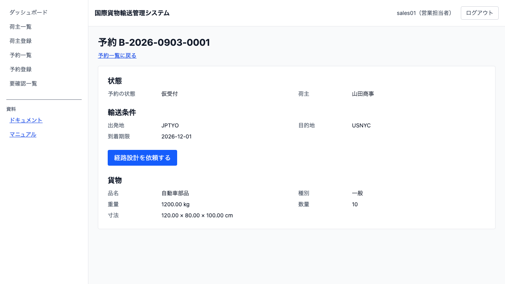
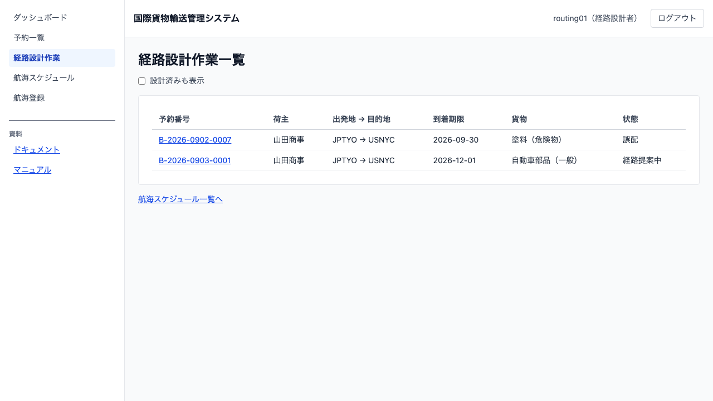

# 08 経路設計に引き渡す

## この章でできること

営業担当者が、仮受付の貨物予約を経路設計者に引き渡します。引き渡した予約は経路設計者の作業一覧に出ます。

## 予約を経路設計に引き渡す（営業担当者）

1. 予約一覧で予約番号を押して詳細を開きます（[05 貨物予約を登録する](05-貨物予約を登録する.md)）
2. `[経路設計を依頼する]` を押します

   

3. 予約の状態が「経路提案中」に変わります。**数秒かかることがあります**

**ボタンが出ないとき**は、その予約がもう引き渡せる段階ではありません。状態を確かめてください。引き渡せるのは「仮受付」の予約です。

## 引き渡された予約を見る（経路設計者）

1. ダッシュボードで `[経路設計作業一覧を開く]` を押します。または左のメニューから `[経路設計作業]` を選びます

   

一覧には予約番号・荷主・出発地と目的地・到着期限・貨物・状態が出ます。

**並び順は誤配が先、そのあと到着期限が近い順です。** 誤配は現在地からの設計をやり直す必要があり、放っておくほど選べる航海が減るためです。

**設計済みの予約は既定では出ません。** `[設計済みも表示]` にチェックを入れると出ます。

貨物の欄には種別（一般・危険物・冷凍・冷蔵）が出ます。危険物と冷凍・冷蔵は運べる航海が限られるので、着手の順番を決めるときに使ってください。

予約番号を押すと予約の詳細が開きます。`[航海スケジュール一覧へ]` から使える航海を確認できます（[07 航海スケジュールを登録する](07-航海スケジュールを登録する.md)）。

## うまくいかないとき

### ダッシュボードに「引き渡し待ちの予約が ○ 件あります」と出る

営業担当者がまだ引き渡していない予約の件数です。押すと予約一覧が開きます。

### 「状態 ○○ の予約は経路設計へ引き渡せません」と出る

その予約はもう引き渡せる段階を過ぎています。予約の状態を確かめてください。

### 引き渡したのに作業一覧に出ない

反映まで数秒かかります。一覧は自動で取り直すので、そのままお待ちください。

## 関連する章

- [05 貨物予約を登録する](05-貨物予約を登録する.md)
- [07 航海スケジュールを登録する](07-航海スケジュールを登録する.md)
