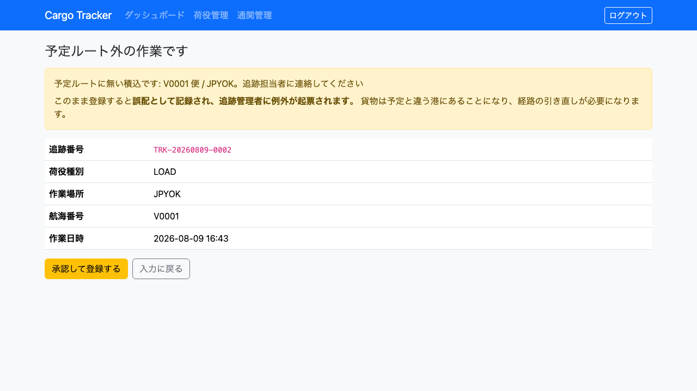
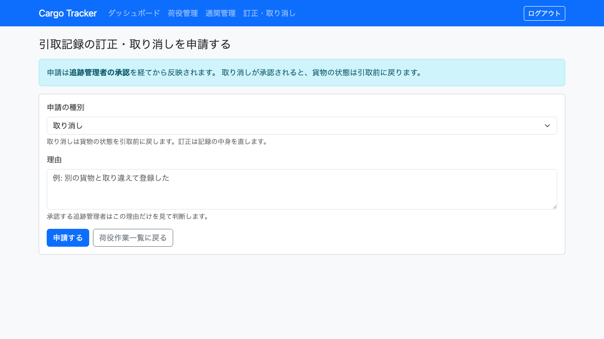
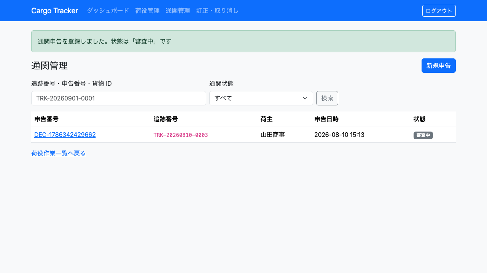
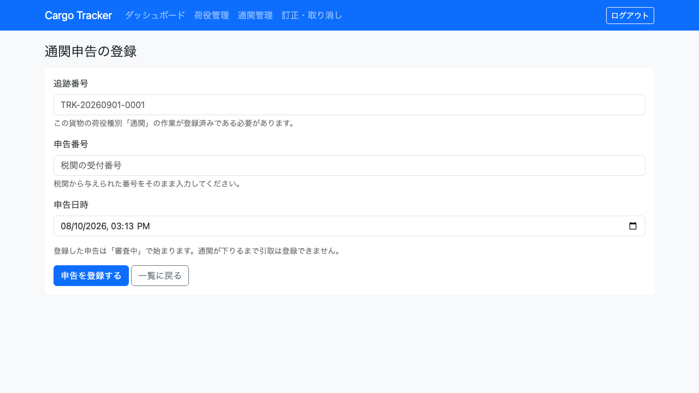
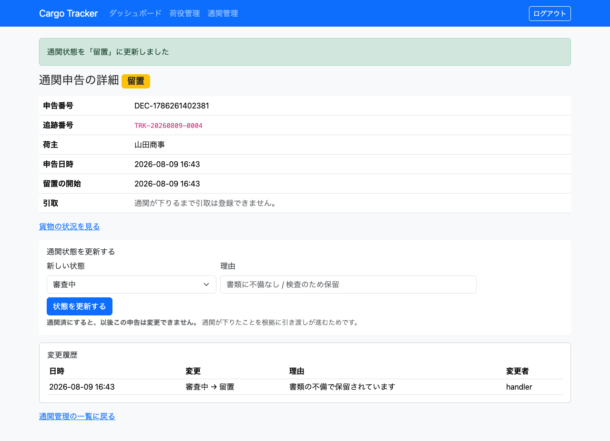

# 08. 荷役管理

港で行った**荷役作業を記録する**画面です。荷役担当者が利用します。

記録した作業は、そのまま貨物の輸送状態になります。**記録しないかぎり、荷主から見た貨物はいつまでも前の状態のままです。** 作業のたびに記録してください。

## 画面の開き方

- メニュー「荷役管理」（URL: `/handling`）
- ダッシュボードの「荷役管理」カードの「開く」

| 画面 | 役割 | 節 |
| :--- | :--- | :--- |
| 荷役作業一覧 | 記録済みの作業を確認する | [8.1](#81-記録した作業を確認する) |
| 荷役作業登録 | 作業を記録する | [8.2](#82-荷役作業を記録する) |
| 予定ルート外の作業の確認 | 誤配になる作業を承認してから記録する | [8.3](#83-予定ルート外の作業を承認して記録する) |
| 引取記録の訂正・取り消し | 誤登録の訂正・取り消しを申請する | [8.4](#84-引取記録の訂正取り消しを申請する) |
| 通関申告一覧 | 通関の状況を確認する | [8.5](#85-通関の状況を確認する) |
| 通関申告登録 | 税関への申告を記録する | [8.6](#86-通関申告を登録する) |
| 通関申告詳細 | 通関状態を更新し、履歴を確認する | [8.7](#87-通関状態を更新する) |

## 8.1 記録した作業を確認する

### この画面でできること

- 直近の荷役作業を、作業日時の新しい順に確認します。

### 画面の開き方

- メニュー「荷役管理」（URL: `/handling`）

### 画面の説明

| # | 項目 | 説明 |
| :--- | :--- | :--- |
| ① | 作業日時 | 作業を行った日時です |
| ② | 種別 | 受領・積込・荷降し・通関のいずれかです |
| ③ | 場所 | 作業を行った港のコードです |
| ④ | 航海番号 | 積込・荷降しの対象の便です |
| ⑤ | 予約 ID | 貨物の予約番号（先頭 8 文字）です |
| ⑥ | 受取人 / メモ | 引取の場合は実際に受け取った方の氏名、担当者メモがあればその内容です。どちらも無ければ `-` です |
| ⑦ | 担当者 | 記録した担当者です |
| ⑧ | 「新規登録」 | 作業の記録画面を開きます |

### 操作手順

1. メニュー「荷役管理」をクリックします。
2. 直近の作業を確認します。
3. 新しく記録するときは「新規登録」をクリックします（[8.2](#82-荷役作業を記録する)）。

### 注意・補足

- **並び順は作業日時の新しい順です。** 記録した作業がいちばん上に出ます。自分が今記録した荷物を探し直さずに済むようにするためです。
- 一覧が空のときは「荷役作業の記録はまだありません」と表示され、「最初の作業を登録する」から登録画面を開けます。
- **表示されるのは直近 50 件です。** それより前の作業は一覧に出ませんが、記録は残っています。

## 8.2 荷役作業を記録する

### この画面でできること

- 追跡番号で貨物を特定し、作業の種別・日時・場所を記録します。

### 画面の開き方

- 荷役作業一覧の「新規登録」（URL: `/handling/new`）

### 画面の説明

| # | 項目 | 説明 |
| :--- | :--- | :--- |
| ① | 追跡番号 | **必須です。** 貨物に貼られた番号（例: `TRK-20260401-0001`）を入力します。**画面を開くとこの欄に入力位置が入っています** |
| ② | 荷役種別 | **必須です。** 受領・積込・荷降し・通関・引取から選びます |
| ③ | 作業日時 | **必須です。** 画面を開いた時点の日時が入っています。違う場合は直してください |
| ④ | 作業場所（港コード） | **必須です。** 5 文字の港コード（例: `JPOSA`）を入力します |
| ⑤ | 航海番号 | **積込・荷降しでは必須です。** どの便に対する作業かを入力します |
| ⑥ | 引取確認コード | **引取では必須です。** 荷受人から提示された引取確認コード（`CLM-` に続く 8 文字。数字と英大文字）を入力します。**システムが予約時に採番したコードと照合します。**一致しないと登録できません |
| ⑦ | 荷受人氏名 | **引取では必須です。** 実際に受け取った方の氏名を入力します |
| ⑧ | 担当者メモ | 代理受領の理由など、「なぜそうしたか」を残します（任意） |
| ⑨ | 担当者 | 未入力の場合はログイン中の利用者が記録されます |
| ⑩ | 「登録する」 | 作業を記録します |
| ⑪ | 「キャンセル」 | 記録せずに一覧へ戻ります |

### 操作手順

1. 荷役作業一覧で「新規登録」をクリックします。
2. 貨物の追跡番号を入力します。
3. 行った作業の種別を選びます。
4. 作業日時と場所を入力します。
5. 積込・荷降しの場合は航海番号を入力します。
6. **引取の場合**は「確認コード」と「荷受人氏名」を入力します。
7. 予定と違う作業や代理受領のときは「担当者メモ」に理由を記入します。
8. 「登録する」をクリックします。
9. 「積込 を登録しました（JPOSA）」と表示されます。

### 注意・補足

- **エラーは 2 か所に出ます。** 追跡番号の書式が違う場合（「追跡番号の形式が正しくありません。TRK-20260901-0001 のような形式で入力してください」）は**項目のすぐ下**に、貨物が見つからない場合や航海番号が足りない場合は**フォームの上**に赤枠で出ます。
- **追跡番号が見つからない場合は登録できません。** 「追跡番号 TRK-… の貨物が見つかりません」と表示されます。番号の写し間違いを確認し、それでも見つからない場合は追跡管理者に問い合わせてください（追跡番号がまだ発行されていない可能性があります）。
- **積込・荷降しで航海番号を入れないと登録できません。** 「積込 には航海番号が必要です」と表示されます。 どの便に対する作業かが分からない記録は、あとから輸送状況を追うときに使えないためです。
- **予定と違う場所での作業も記録できます。** 拒否すると、実際に起きた作業がどこにも残りません。ただし扱いは 2 通りに分かれます。
  - **積込・荷降しが予定ルートから外れる場合は、登録の前に確認画面が出ます。** 記録すると誤配になるためです（[8.3](#83-予定ルート外の作業を承認して記録する)）。
  - 「予約の出発地（JPOSA）と違う場所での受領です: JPYOK」— **受領・引取の場所の違いは警告に留まり、そのまま記録されます。** 輸送そのものは予定どおり進むためです。
- **登録した直後は、追跡にまだ反映されていないことがあります。** 記録そのものは確実に残っており、追跡への反映はそのすぐ後に行われます。**荷役の記録が追跡の都合で失敗することはありません。** 追跡側でしばらく前の状態が見える場合は、少し待ってから開き直してください。
- **最初の積込を記録すると、予約のステータスが「輸送中」になります。** 2 回目以降の積込（積み替え）ではステータスは変わりません。反映はやはり少し遅れることがあります。
- **通関を記録しても輸送状態は変わりません。** 貨物の位置が変わらないためです。記録は残ります。**通関の作業を記録すると、その貨物の通関申告を登録できるようになります**（[8.6](#86-通関申告を登録する)）。
- **他の担当者と同時に同じ貨物を登録すると、登録できないことがあります。** 「他の操作が先に行われました。最新の内容を確認してください」と表示されたら、一覧で状態を確かめてから登録し直してください。**このとき作業は記録されていません。**
- **引取について**
  - **確認コードと荷受人氏名が両方そろわないと登録できません。** 「引取 には荷受人確認が必要です」と表示されます。荷役の記録は原則として「予定と違っても残す」ものですが、**引取だけは例外です。** 引き渡しの証明が無いまま「引き渡し済み」として記録が残ると、「渡した」「受け取っていない」の争いになったときに会社が不利になります。
  - **予約の荷受人と違う方が受け取っても登録できます。** 代理の方が受け取ることは実務では珍しくありません。**実際に受け取った方の氏名をそのまま入力してください。** 予約の荷受人の氏名で代用しないでください。違う場合は「予約の荷受人（○○）と違う方が受け取っています」と警告が表示されるので、**担当者メモに理由を記入してください。**
  - **通関が下りていないと引取は登録できません。** 「通関が完了していないため引取を登録できません。現在の通関状態は「審査中」です」と表示されます。**これは警告ではなく拒否です。** 通関前の引き渡しは業務として行えません。通関の状況は[通関管理](#85-通関の状況を確認する)で確認してください。
  - **引取確認コードは予約の確定時に採番され、システムが照合します。** 一致しないと引取は登録できません（「引取確認コードが一致しません」と表示されます）。コードは営業担当者が荷主へ伝えます。**追跡番号とは別の値です** — 追跡番号を入力しても引き取れません。
  - **一致しなかったことは記録に残ります。** 何度も試された形跡を後から確認できるようにするためです。
  - **記録した受取人と担当者メモは、荷役作業一覧の「受取人 / メモ」欄で確認できます。** 「受け取っていない」という問い合わせがあったときは、ここで誰に渡したかを確認してください。
  - **誤って登録した場合は、訂正・取り消しを申請できます**（[8.4](#84-引取記録の訂正取り消しを申請する)）。追跡管理者の承認を経て反映されます。
  - **引取を記録すると、予約のステータスが「配送完了」になります。** 反映は少し遅れることがあります。
  - 同じ貨物に引取を 2 回記録しても、記録は 2 件とも残り、ステータスは「配送完了」のままです。
- **追跡番号はスキャナで読み取れます。** 画面を開くと入力位置が追跡番号の欄に入っているため、そのまま読み取らせてください。読み取れないときは、同じ欄にそのまま手で入力できます。前後の空白や大文字・小文字の違いは自動で整えられます。
- 作業日時は**日本時間**で入力します。**画面を開いた時点の日時があらかじめ入っています。**
- **追跡番号の発行日より前の日時は登録できません。** 「作業日時が追跡番号の発行日（2026-09-03）より前です」と表示されます。年や月の打ち間違いがないか確認してください。発行日当日は登録できます。
- **未来の日時は登録できます。** 積込の予定を先に記録する運用があるためです。

---

## 8.3 予定ルート外の作業を承認して記録する

### この画面でできること

- 予定ルートに無い積込・荷降しを送ったときに、**記録する前に**内容を確認します。
- 承認すると記録され、貨物が「誤配」になります。

### 画面の開き方

- 荷役作業登録で、**予定ルートに無い積込・荷降し**を「登録する」と自動的に開きます。

### 画面の説明

| # | 項目 | 説明 |
| :--- | :--- | :--- |
| ① | 警告 | 何が予定と違うのか（便・港）と、承認したら何が起きるのかを示します |
| ② | 入力内容 | 送った追跡番号・種別・場所・航海番号・作業日時をそのまま表示します |
| ③ | 「承認して登録する」 | **誤配として記録します。** 経路状態が「誤配」になり、追跡担当者に例外が起票されます |
| ④ | 「入力に戻る」 | 記録せずに入力画面へ戻ります。**入力した内容は保たれます** |

### 操作手順

1. 荷役作業登録で作業を入力し、「登録する」をクリックします。
2. 予定ルートから外れている場合、この確認画面が開きます。
3. 警告の内容（どの便・どの港が予定と違うのか）を読みます。
4. **港コードや航海番号の入力誤りであれば**「入力に戻る」で直します。
5. **実際にその場所で作業した場合**は「承認して登録する」をクリックします。
6. 「積込 を登録しました（JPYOK）」と表示され、一覧に戻ります。

### 注意・補足

- **記録する前に確認します。** 記録したあとで「予定と違いました」と言われても、荷役の記録は取り消せません（取り消しは今後の提供で対応します）。
- **確認画面が出るのは積込・荷降しだけです。** 受領・引取の場所違いは輸送そのものに影響しないため、そのまま記録されて警告だけが出ます。**すべての作業で確認を挟むと、確認そのものが読み飛ばされます。**
- **承認すると、追跡担当者に「誤配」の例外が自動で起票されます。** 別途連絡する必要はありませんが、**急ぐ場合は電話などで先に伝えてください**（システムは連絡そのものは行いません）。
- **貨物は予定と違う港にあります。** 経路設計者が現在地から経路を引き直すまで、その先の輸送は進みません。

---

## 8.4 引取記録の訂正・取り消しを申請する

### この画面でできること

誤って登録した引取記録の**訂正・取り消しを申請**します。引取は輸送の終点です。**誤登録をそのままにすると、貨物が届いていないのに「配送完了」として扱われます。**

**申請しただけでは記録は変わりません。** 追跡管理者が承認して初めて、貨物の状態が引取前に戻ります。

### 画面の開き方

「荷役管理」→ 一覧の引取の行にある `[申請する]`

### 画面の説明

| # | 項目 | 説明 |
| :--- | :--- | :--- |
| ① | 申請の種別 | **取り消し**（貨物の状態を引取前に戻す）または**訂正**（記録の中身を直す）を選びます |
| ② | 作業日時（訂正後） | **訂正のときだけ**入力します。空欄なら変わりません |
| ③ | メモ（訂正後） | **訂正のときだけ**入力します。空欄なら変わりません |
| ④ | 理由 | **必須です。** 承認する追跡管理者は、この理由だけを見て判断します |

### 操作手順

1. 「荷役管理」を開きます。
1. 訂正・取り消ししたい**引取**の行で `[申請する]` を押します。
1. 種別を選びます。**訂正を選ぶと、直す内容の入力欄が出ます。**
1. 訂正の場合は、直す項目だけを入力します（空欄の項目は変わりません）。
1. 理由を入力します。
1. `[申請する]` を押します。
1. 「訂正・取り消し」の画面で、承認されたかどうかを確認できます。

### 注意・補足

- **申請できるのは引取の記録だけです。** 取り消しで戻る状態を持つのは引取だからです。
- **すでに取り消した記録には申請できません。** 一覧に「取り消し済み」と表示されます。
- **精算済みの予約には申請できません。** 精算は請求と入金を伴い、取り消しは返金の業務になります。経理へご連絡ください。
- **理由を空にすると申請できません。** 後から見たときに「なぜ配送完了が取り消されたのか」が誰にも分からなくなるためです。
- **訂正は直す内容を入力しないと申請できません。** 承認しても何も起きない申請が承認待ちに並ぶと、承認する側は「何を承認したのか」が分からなくなります。
- **訂正でも未来の作業日時は入力できません。** 荷役は起きた事実の記録だからです。
- **元の記録は消えません。** 誰がいつ登録し、誰がいつ取り消したかが残ります。

---

## 8.5 通関の状況を確認する

### この画面でできること

- 登録済みの通関申告を一覧で確認します。
- 追跡番号・申告番号・貨物 ID で探し、通関状態で絞り込みます。

### 画面の開き方

- メニュー「通関管理」（URL: `/handling/customs`）
- ダッシュボードの「通関で留置中」カードの「開く」
- 荷役作業一覧の「通関申告」

### 画面の説明

| # | 項目 | 説明 |
| :--- | :--- | :--- |
| ① | 検索欄 | 追跡番号・申告番号・貨物 ID の一部で探せます |
| ② | 通関状態 | 審査中・通関済・留置・不可で絞り込みます |
| ③ | 一覧 | **留置が先に並びます。** 申告の新しい順です |
| ④ | 状態バッジ | 審査中（灰）・通関済（緑）・留置（黄）・不可（赤） |
| ⑤ | 「留置が長引いています」 | **留置のまま 3 日を超えた申告に出ます。** 行全体が黄色になります |
| ⑥ | 「新規申告」 | 通関申告の登録へ進みます（荷役作業員のみ） |

### 操作手順

1. メニューから「通関管理」を開きます。
2. 探したい貨物の追跡番号を検索欄に入力して「検索」をクリックします。
3. 状態で絞り込む場合は「通関状態」から選びます。
4. 申告番号のリンクをクリックすると詳細が開きます。

### 注意・補足

- **留置は放置するとコストが発生します。** 貨物が税関に止められている間、保管料がかかります。**「留置が長引いています」が出たら、税関への確認をお願いします。**
- **追跡担当者もこの画面を開けます。** 通関は引き渡しを止める唯一の仕組みであり、貨物の状況を追う立場でも状態を知る必要があるためです。
- **営業担当者・荷主は開けません。** 通関は社内の業務です。

---

## 8.6 通関申告を登録する

### この画面でできること

- 税関へ提出した申告を記録します。登録した申告は「審査中」で始まります。

### 画面の開き方

- 通関申告一覧の「新規申告」（URL: `/handling/customs/new`）

### 画面の説明

| # | 項目 | 説明 |
| :--- | :--- | :--- |
| ① | 追跡番号 | **必須です。** 貨物の追跡番号を入力します |
| ② | 申告番号 | **必須です。** 税関から与えられた受付番号をそのまま入力します（50 文字以内） |
| ③ | 申告日時 | **必須です。** 画面を開いた時点の日時が入っています |
| ④ | 「申告を登録する」 | 申告を記録します。状態は「審査中」になります |

### 操作手順

1. **先に荷役種別「通関」の作業を登録します**（[8.2](#82-荷役作業を記録する)）。
2. 通関申告一覧で「新規申告」をクリックします。
3. 追跡番号・申告番号・申告日時を入力します。
4. 「申告を登録する」をクリックします。
5. 「通関申告を登録しました。状態は「審査中」です」と表示されます。

### 注意・補足

- **先に通関の荷役が要ります。** 「この貨物にはまだ通関の荷役が登録されていません。先に荷役種別「通関」で作業を登録してください」と表示されたら、[8.2](#82-荷役作業を記録する) で通関の作業を記録してください。**申告は「どの通関作業でどの貨物を通したか」の記録です。**
- **1 つの貨物に申告は 1 件だけです。** 「この貨物にはすでに通関申告が登録されています」と表示されます。2 件あると、どちらが引き取りの可否を決めるのか分からなくなるためです。
- **申告番号の形式は縛っていません。** 税関から与えられた番号をそのまま入力してください。

---

## 8.7 通関状態を更新する

### この画面でできること

- 通関状態を「通関済」「留置」「不可」「審査中」に更新します。
- これまでの変更履歴（日時・変更・理由・変更者）を確認します。

### 画面の開き方

- 通関申告一覧で申告番号をクリック（URL: `/handling/customs/{申告 ID}`）

### 画面の説明

| # | 項目 | 説明 |
| :--- | :--- | :--- |
| ① | 状態バッジ | 現在の通関状態 |
| ② | 留置の警告 | 留置のまま 3 日を超えると出ます |
| ③ | 申告の内容 | 申告番号・追跡番号・荷主・申告日時・通関完了日時・留置の開始 |
| ④ | 「引取」欄 | **引取を登録できるかどうか**を言葉で示します |
| ⑤ | 「貨物の状況を見る」 | この貨物の追跡へ移動します |
| ⑥ | 新しい状態 | 更新先を選びます（いまと同じ状態は選べません） |
| ⑦ | 理由 | **必須です。** なぜそう判断したのかを記入します |
| ⑧ | 「状態を更新する」 | 状態を更新し、履歴に 1 行積みます |
| ⑨ | 変更履歴 | 日時・変更（前→後）・理由・変更者 |

### 操作手順

1. 通関申告一覧で申告番号をクリックします。
2. 「新しい状態」から更新先を選びます。
3. 「理由」に判断の根拠を記入します。
4. 「状態を更新する」をクリックします。
5. 「通関状態を「通関済」に更新しました」と表示されます。

### 注意・補足

- **理由は必ず入力してください。** 「理由は必須です」と表示されます。**通関状態は貨物を止めたり通したりします。なぜそう判断したのかが残らないと、後から誰も検証できません。**
- **「通関済」にすると、以後この申告は変更できません。** 「通関済の申告は変更できません」と表示されます。通関が下りたことを根拠に引き渡しが進むため、後から取り消せると**引き渡し済みの貨物が「通関していない」状態になりえます。** 誤って登録した場合はシステム管理担当窓口へご連絡ください。
- **「留置」にすると、追跡担当者に「税関保留」の例外が自動で起票されます。** 追跡側の例外管理から状況を追えます。
- **「通関済」にすると、荷主と荷受人に通関完了の記録が残ります。** 荷受人の連絡先が未登録の場合は荷主にだけ残ります。**メールは自動では送られません**（[00. はじめに](00-はじめに.md)の方針）。
- **留置を解く先は「通関済」とは限りません。** 書類を出し直して「審査中」に戻ることがあります。**その場合はまだ通関していません。**
- **留置の日数は、留置に入るたびに数え直します。** 審査中に戻してから再び留置になった場合、最初の留置日からではなく新しい留置日から数えます。知りたいのは「いま何日止まっているか」だからです。
- **同じ状態への更新はできません。** 「この申告はすでに審査中です」と表示されます。変わっていないものが履歴に積まれると、「何回留置されたのか」が読めなくなるためです。
