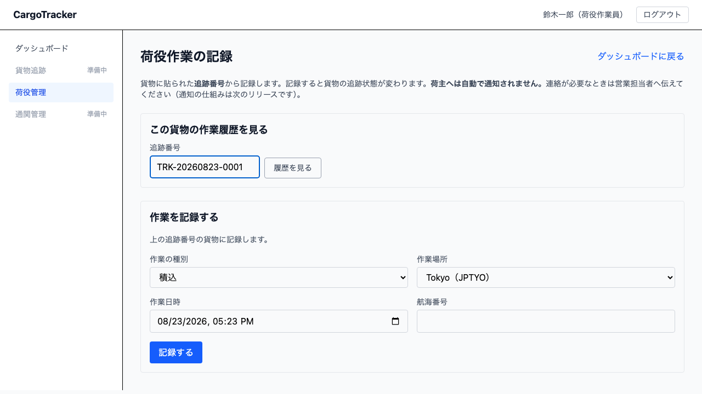
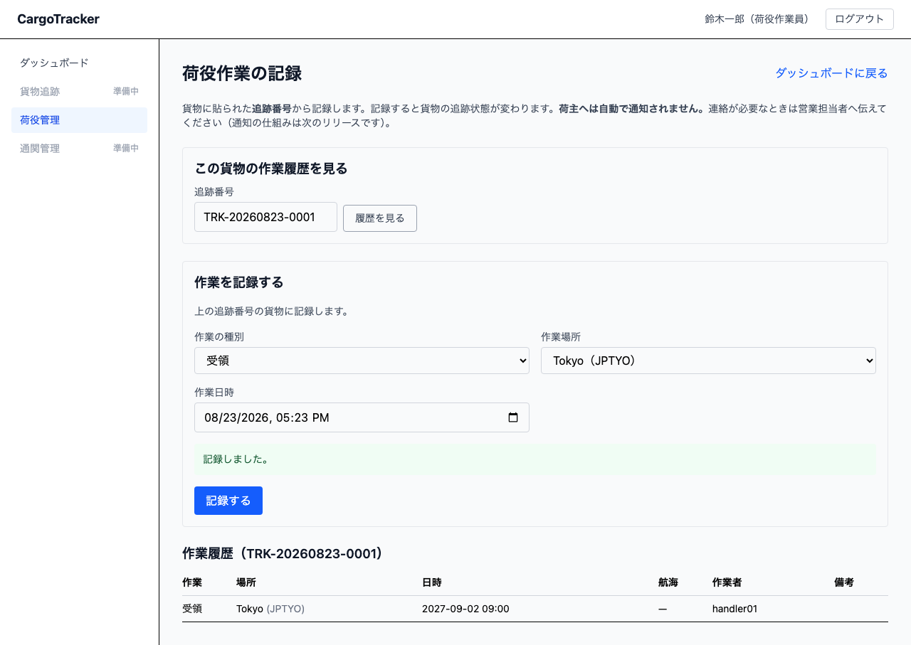

# 08 荷役管理

港で実際に行った作業を記録する画面です。**荷役作業員**が使います。
**追跡管理者**は、追跡番号を入れて**作業履歴を見ること**ができます（記録はできません）。

本章は [01 業務フロー](01-業務フロー.md#steps) の「荷役作業を記録する」にあたります。

## 画面の開き方

メニューの **[荷役管理]** を押します。URL は `/handling` です。
荷役ダッシュボードの **[荷役作業を記録する]** からも開けます。

## 記録の起点は追跡番号です

この画面は **貨物に貼られた追跡番号** から始めます。予約番号は要りません。

> **予約番号を探さないでください。** 荷役作業員が手元で読めるのは追跡番号だけであり、
> 予約番号は営業担当者と経路設計者が使うものです。

## 8.1 荷役作業を記録する {#register}

### この画面でできること

受領・積込・荷降し・引取の 4 種類を記録します。記録すると、**貨物の追跡状態が変わります**。

### 画面の説明

| 項目 | 説明 |
| :--- | :--- |
| 追跡番号 | 貨物に貼られた番号（`TRK-20260823-0001` の形）。**画面の上にある欄を使います**（履歴と同じ欄です） |
| 作業の種別 | 受領・積込・荷降し・引取から選びます |
| 作業場所 | 港の一覧から選びます。**打ち込みではありません** |
| 作業日時 | 作業が終わった日時（日本時間）。**はじめから「いま」が入っています** |
| 航海番号 | **積込・荷降しのときだけ出ます**。どの船に載せたかの記録です |
| 荷受人の確認 | **引取のときだけ出ます**。誰から受け取りの確認を得たかを書きます |

> **作業場所を打ち込めないのは、綴りの揺れを防ぐためです。** 「Tokyo」と「TOKYO」が
> 混ざると、予定どおりの作業かどうかを機械が判断できなくなります。

> **作業者はログインした利用者 ID が記録されます。** 入力欄はありません。
> 他人の名前で記録できないようにするためです。

### 種別の選び方

| 種別 | いつ記録するか | 航海番号 | 荷受人の確認 |
| :--- | :--- | :--- | :--- |
| 受領 | 出発港で貨物を預かったとき | 要りません | 要りません |
| 積込 | 船に積んだとき | **必要です** | 要りません |
| 荷降し | 船から降ろしたとき | **必要です** | 要りません |
| 引取 | 荷受人へ引き渡したとき | 要りません | **必要です** |

> **積込・荷降しに航海番号が要るのは、どの船に載せたかが分からないと貨物を追えないためです。**

### 操作手順

1. 追跡番号を入力します
2. 作業の種別を選びます
3. 作業場所を選びます
4. 作業日時を入力します
5. 種別に応じて出た欄（航海番号・荷受人の確認）を埋めます
6. [記録する] を押します
7. 「記録しました」と出て、下に **この貨物の作業履歴** が表示されます

> **記録したあとも、追跡番号・作業の種別・作業場所は残ります。** 同じ貨物に続けて記録する
> ことが多いためです。**別の貨物に移るときは、追跡番号と種別を必ず確かめてください**
> ——とくに「引取」のまま次の貨物を記録すると、貨物が引き渡し済みになります。
>
> **作業日時だけは「いま」に戻ります。** 前の作業の時刻のまま次を記録する事故を防ぐためです。

## 8.2 予定と違う場所で作業したとき {#off-route}

予定の経路に無い港で記録すると、**警告が出ます。ただし記録は残ります**。

> **経路がまだ決まっていない貨物**への積込・荷降しも「予定外」になります。照らし合わせる
> 予定が無いためです。経路が決まる前に船へ積んだことを記録に残すための扱いです。

> **警告が出ても、記録は取り消されていません。** 現場ではすでに作業が終わっており、
> 記録を拒むと「実際に何が起きたか」がどこにも残らなくなるためです。

履歴には **予定外** と表示されます。**追跡管理者へ連絡してください**（経路の見直しが要るかを
判断します）。この警告は画面を閉じると消えますが、**記録には残ります**。

## 8.3 引取を記録するとき {#claim}

引取には **荷受人の確認** が必要です。空欄では記録できません。

> **通関の確認は、まだ仕組みでは行われません。**
> 引き渡してよいかは、**通関の書類をご自身で確かめてから** 記録してください。
> 仕組みでの確認（通関申告の管理）は次のリリース以降です。

引取を記録すると、貨物の状態が **引取済** になります。

## 8.4 この貨物に何が起きたかを見る {#history}

画面の上にある **[履歴を見る]** で、追跡番号を入れるだけで作業履歴を見られます。
記録に成功したときも、その貨物の履歴が下に表示されます。**古い順** に並びます。

> **記録しなくても見られます。** 追跡管理者はこちらだけを使います。
> 荷役作業員も、記録する前に「もう受領は済んでいるか」を確かめられます。

| 列 | 説明 |
| :--- | :--- |
| 作業 | 受領・積込・荷降し・引取 |
| 場所 | 港の名前（括弧内は UN/LOCODE） |
| 日時 | 作業が終わった日時（日本時間） |
| 航海 | 航海番号。受領・引取では「—」 |
| 作業者 | 記録した利用者 ID |
| 備考 | 予定外だった作業と、荷受人の確認 |

## この画面で出るメッセージ

| メッセージ | いつ出るか | どうすればよいか |
| :--- | :--- | :--- |
| 指定された追跡番号の貨物が見つかりません。番号を確かめてください | 追跡番号が誤っている | 貨物のラベルと見比べてください |
| 航海番号は必須です | 積込・荷降しで航海番号が空 | どの船に載せた（降ろした）かを入力してください |
| 荷受人の確認は必須です | 引取で確認が空 | 誰から確認を得たかを入力してください |
| 作業日時は ISO 8601（2026-08-23T09:00:00Z）の形式で指定してください | 日時が読めない形 | 日時の欄をカレンダーから選び直してください |
| 貨物を確認できませんでした。しばらくしてからもう一度お試しください | 予約のシステムに一時的に繋がらない | **番号は間違っていません。** しばらく待って、もう一度押してください |
| 作業場所が見つかりません: 〈コード〉 | 作業場所を選んでいない | 一覧から港を選んでください |
| 荷役の種別を選んでください | 種別が空 | 一覧から種別を選んでください |
| 作業日時を入力してください | 作業日時が空 | 日時の欄をカレンダーから選び直してください |
| この操作を行う権限がありません | 荷役作業員以外が記録しようとした | 荷役作業員に依頼してください |

> **「見つかりません」と「確認できませんでした」は別のことです。** 前者は番号を、
> 後者は時間を置くことを試してください。番号を打ち直しても直りません。

## まだできないこと

- **荷役の記録は荷主へ伝わりません。** 記録しても荷主にはメールなどは届きません。
  連絡が必要なときは営業担当者へ伝えてください。
  （[4.6 荷主へ経路を通知し、予約を確定する](04-貨物予約.md#notify-and-confirm) にある
  「荷主へ通知」は**経路を伝えた記録**で、荷役とは別の話です。そちらもメールは送りません）
- **通関の確認は仕組みでは行われません**（8.3 のとおり）
- **記録の訂正はできません。** 誤った記録をしたときは**追跡管理者**へ連絡してください

## 関連する章

- [01 業務フロー](01-業務フロー.md) — 荷役が業務のどこにあたるか
- [06 経路設計](06-経路設計.md#issue-tracking) — 追跡番号がどこで発行されるか
