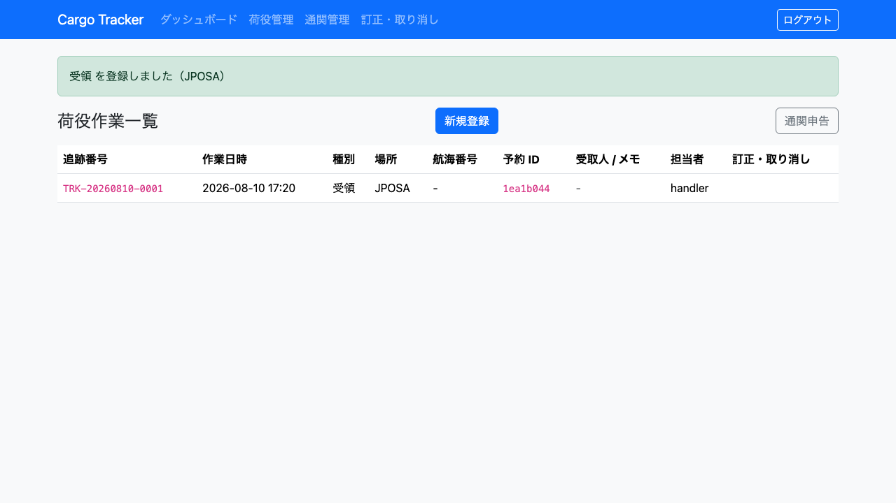
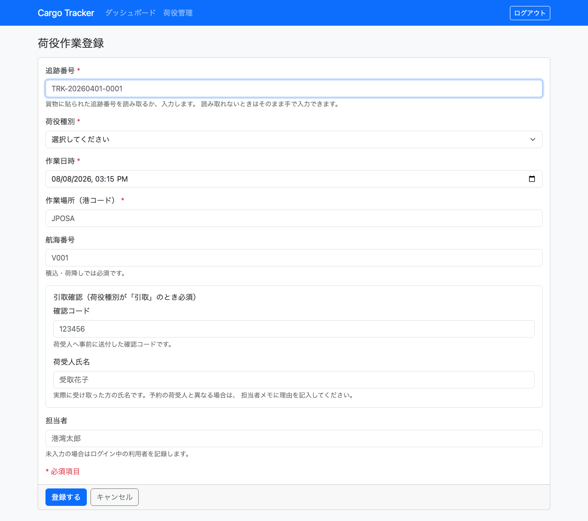

# 08. 荷役管理

港で行った**荷役作業を記録する**画面です。荷役担当者が利用します。

記録した作業は、そのまま貨物の輸送状態になります。**記録しないかぎり、荷主から見た貨物はいつまでも前の状態のままです。** 作業のたびに記録してください。

## 画面の開き方

- メニュー「荷役管理」（URL: `/handling`）
- ダッシュボードの「荷役管理」カードの「開く」

| 画面 | 役割 | 節 |
| :--- | :--- | :--- |
| 荷役作業一覧 | 記録済みの作業を確認する | [8.1](#81-記録した作業を確認する) |
| 荷役作業登録 | 作業を記録する | [8.2](#82-荷役作業を記録する) |

## 8.1 記録した作業を確認する

### この画面でできること

- 直近の荷役作業を、作業日時の新しい順に確認します。

### 画面の開き方

- メニュー「荷役管理」（URL: `/handling`）

### 画面の説明

| # | 項目 | 説明 |
| :--- | :--- | :--- |
| ① | 作業日時 | 作業を行った日時です |
| ② | 種別 | 受領・積込・荷降し・通関のいずれかです |
| ③ | 場所 | 作業を行った港のコードです |
| ④ | 航海番号 | 積込・荷降しの対象の便です |
| ⑤ | 予約 ID | 貨物の予約番号（先頭 8 文字）です |
| ⑥ | 受取人 / メモ | 引取の場合は実際に受け取った方の氏名、担当者メモがあればその内容です。どちらも無ければ `-` です |
| ⑦ | 担当者 | 記録した担当者です |
| ⑧ | 「新規登録」 | 作業の記録画面を開きます |

### 操作手順

1. メニュー「荷役管理」をクリックします。
2. 直近の作業を確認します。
3. 新しく記録するときは「新規登録」をクリックします（[8.2](#82-荷役作業を記録する)）。

### 注意・補足

- **並び順は作業日時の新しい順です。** 記録した作業がいちばん上に出ます。自分が今記録した荷物を探し直さずに済むようにするためです。
- 一覧が空のときは「荷役作業の記録はまだありません」と表示され、「最初の作業を登録する」から登録画面を開けます。
- **表示されるのは直近 50 件です。** それより前の作業は一覧に出ませんが、記録は残っています。

## 8.2 荷役作業を記録する

### この画面でできること

- 追跡番号で貨物を特定し、作業の種別・日時・場所を記録します。

### 画面の開き方

- 荷役作業一覧の「新規登録」（URL: `/handling/new`）

### 画面の説明

| # | 項目 | 説明 |
| :--- | :--- | :--- |
| ① | 追跡番号 | **必須です。** 貨物に貼られた番号（例: `TRK-20260401-0001`）を入力します。**画面を開くとこの欄に入力位置が入っています** |
| ② | 荷役種別 | **必須です。** 受領・積込・荷降し・通関・引取から選びます |
| ③ | 作業日時 | **必須です。** 画面を開いた時点の日時が入っています。違う場合は直してください |
| ④ | 作業場所（港コード） | **必須です。** 5 文字の港コード（例: `JPOSA`）を入力します |
| ⑤ | 航海番号 | **積込・荷降しでは必須です。** どの便に対する作業かを入力します |
| ⑥ | 確認コード | **引取では必須です。** 荷受人から提示された確認コードを入力します。**システムでの照合は行いません**（引き渡しの記録として残します） |
| ⑦ | 荷受人氏名 | **引取では必須です。** 実際に受け取った方の氏名を入力します |
| ⑧ | 担当者メモ | 代理受領の理由など、「なぜそうしたか」を残します（任意） |
| ⑨ | 担当者 | 未入力の場合はログイン中の利用者が記録されます |
| ⑩ | 「登録する」 | 作業を記録します |
| ⑪ | 「キャンセル」 | 記録せずに一覧へ戻ります |

### 操作手順

1. 荷役作業一覧で「新規登録」をクリックします。
2. 貨物の追跡番号を入力します。
3. 行った作業の種別を選びます。
4. 作業日時と場所を入力します。
5. 積込・荷降しの場合は航海番号を入力します。
6. **引取の場合**は「確認コード」と「荷受人氏名」を入力します。
7. 予定と違う作業や代理受領のときは「担当者メモ」に理由を記入します。
8. 「登録する」をクリックします。
9. 「積込 を登録しました（JPOSA）」と表示されます。

### 注意・補足

- **エラーは 2 か所に出ます。** 追跡番号の書式が違う場合（「追跡番号の形式が正しくありません。TRK-20260901-0001 のような形式で入力してください」）は**項目のすぐ下**に、貨物が見つからない場合や航海番号が足りない場合は**フォームの上**に赤枠で出ます。
- **追跡番号が見つからない場合は登録できません。** 「追跡番号 TRK-… の貨物が見つかりません」と表示されます。番号の写し間違いを確認し、それでも見つからない場合は追跡管理者に問い合わせてください（追跡番号がまだ発行されていない可能性があります）。
- **積込・荷降しで航海番号を入れないと登録できません。** 「積込 には航海番号が必要です」と表示されます。 どの便に対する作業かが分からない記録は、あとから輸送状況を追うときに使えないためです。
- **予定と違う場所での作業も記録できます。** 拒否すると、実際に起きた作業がどこにも残りません。ただし警告が表示されます。
  - 「予定ルートに無い積込です: V0001 便 / JPYOK。追跡担当者に連絡してください」— **予定と違う便・港に積み込まれています。** 誤配として記録され、貨物の経路状態が「誤配」になります。**この警告はこの 1 回しか表示されません。** 必ず追跡担当者へ連絡してください。
  - 「予約の出発地（JPOSA）と違う場所での受領です: JPYOK」— 受領・引取の場所の違いは警告に留まります。輸送そのものは予定どおり進みます。
- **登録した直後は、追跡にまだ反映されていないことがあります。** 記録そのものは確実に残っており、追跡への反映はそのすぐ後に行われます。**荷役の記録が追跡の都合で失敗することはありません。** 追跡側でしばらく前の状態が見える場合は、少し待ってから開き直してください。
- **最初の積込を記録すると、予約のステータスが「輸送中」になります。** 2 回目以降の積込（積み替え）ではステータスは変わりません。反映はやはり少し遅れることがあります。
- **通関を記録しても輸送状態は変わりません。** 貨物の位置が変わらないためです。記録は残ります。
- **他の担当者と同時に同じ貨物を登録すると、登録できないことがあります。** 「他の操作が先に行われました。最新の内容を確認してください」と表示されたら、一覧で状態を確かめてから登録し直してください。**このとき作業は記録されていません。**
- **引取について**
  - **確認コードと荷受人氏名が両方そろわないと登録できません。** 「引取 には荷受人確認が必要です」と表示されます。荷役の記録は原則として「予定と違っても残す」ものですが、**引取だけは例外です。** 引き渡しの証明が無いまま「引き渡し済み」として記録が残ると、「渡した」「受け取っていない」の争いになったときに会社が不利になります。
  - **予約の荷受人と違う方が受け取っても登録できます。** 代理の方が受け取ることは実務では珍しくありません。**実際に受け取った方の氏名をそのまま入力してください。** 予約の荷受人の氏名で代用しないでください。違う場合は「予約の荷受人（○○）と違う方が受け取っています」と警告が表示されるので、**担当者メモに理由を記入してください。**
  - **確認コードはシステムでは照合しません。** 荷受人から提示されたコードを、引き渡しの記録としてそのまま残します。コードの発行と照合は今後の提供で対応します。
  - **記録した受取人と担当者メモは、荷役作業一覧の「受取人 / メモ」欄で確認できます。** 「受け取っていない」という問い合わせがあったときは、ここで誰に渡したかを確認してください。
  - **登録後の訂正・取り消しはできません。** 誤って登録した場合は追跡担当者にご連絡ください。
  - **引取を記録すると、予約のステータスが「配送完了」になります。** 反映は少し遅れることがあります。
  - 同じ貨物に引取を 2 回記録しても、記録は 2 件とも残り、ステータスは「配送完了」のままです。
- **追跡番号はスキャナで読み取れます。** 画面を開くと入力位置が追跡番号の欄に入っているため、そのまま読み取らせてください。読み取れないときは、同じ欄にそのまま手で入力できます。前後の空白や大文字・小文字の違いは自動で整えられます。
- 作業日時は**日本時間**で入力します。**画面を開いた時点の日時があらかじめ入っています。**
- **追跡番号の発行日より前の日時は登録できません。** 「作業日時が追跡番号の発行日（2026-09-03）より前です」と表示されます。年や月の打ち間違いがないか確認してください。発行日当日は登録できます。
- **未来の日時は登録できます。** 積込の予定を先に記録する運用があるためです。
