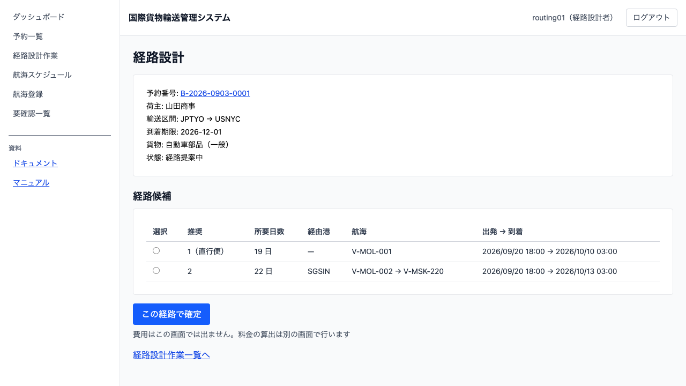

# 09 経路を設計する

## この章でできること

経路設計者が、引き渡された予約の経路候補を見て、運ぶ経路を決めます。決めた経路は予約詳細に旅程として出ます。

## 経路候補を見る

1. 経路設計作業一覧で予約番号を押します（[08 経路設計に引き渡す](08-経路設計に引き渡す.md)）

   

2. 画面の上に予約の内容（荷主・輸送区間・到着期限・貨物・状態）が出ます
3. その下に経路候補が**推奨順**に並びます

候補には所要日数・経由港・航海番号・出発と到着が出ます。

**推奨順は「直行便が先、そのあと所要日数の短い順」です。** 直行便は積み替えが無いぶん事故と遅延の芽が少ないので、多少遅くても先に出しています。

**所要日数には乗り継ぎの待ち時間も入っています。** 港で 2 日待つ経路は、その 2 日も所要に数えます。荷主が待つ時間はそこも同じだからです。

**期限内に着けない候補は出しません。** 出すと選べてしまい、選んだあとに断られます。

**費用はこの画面では出ません。** 料金の算出は別の画面で行います。

## 経路を確定する

1. 運ぶ経路の行の左にある `○` を押して選びます
2. `[この経路で確定]` を押します
3. 予約詳細が開き、「旅程」の表に区間が積む順に出ます

**経路が決まっても、予約の状態は「経路提案中」のままです。** 荷主に通知するまでは提案の段階だからです。

## 条件を変えて探し直す

期限に間に合う経路が出ないときは、**この画面で条件を変えて探し直せます**。

1. 「探す条件」の欄で、次のどれかを変えます
    - **到着期限**：延ばすと、遅い便も候補に入ります
    - **除外する港**：通らせたくない港を `SGSIN, HKHKG` のようにカンマ区切りで入れます
    - **この港より後に出る便だけ**：入れた港を出たあとの便だけを候補にします
2. `[条件を変えて再算出]` を押します
3. 候補が取り直され、変えた条件が欄に残ります

**変えた条件は予約に記録されます。** 誰がいつ期限を延ばしたかが残るので、あとから経緯を追えます。画面を閉じても条件は消えません。

**到着期限はここからしか延ばせません。** 経路設計に入った予約は、予約修正の画面（[05 貨物予約を登録する](05-貨物予約を登録する.md)）では直せないためです。

**条件を変えると、経路設定状態が「設定済」から「設計依頼中」に戻ります。** 決まっていた経路は、その条件で組んだものではなくなるからです。**確定済みの旅程は予約詳細に残ります**ので、何を組み直すのかを確かめられます。

### 出発地・目的地は除外できません

除外する港に予約の出発地か目的地を入れると、`出発地と目的地は除外できません` と出ます。必ず通る港なので、除外すると候補が必ず 0 件になります。

## 条件を変えても組めないときは営業へ差し戻す

条件をどう変えても経路が組めないときは、**営業担当者に条件の見直しを頼めます**。

1. `[営業へ差し戻す]` を押します
2. 「差し戻す理由」に、何が足りないのかを書きます（例: `期限内に着ける便がありません`）
3. `[差し戻しを送る]` を押します

**理由は必須です。** 理由が無いと、営業担当者は荷主と何を協議すればよいのか分かりません。

**差し戻しても、予約は経路設計作業一覧に残ります。** 手番が営業に移っただけで、経路設計が取り消されたわけではありません。差し戻した内容は営業担当者のダッシュボードに理由つきで出ます。

**条件を実際に変えるのは経路設計者です。** 営業担当者は荷主と協議し、決まった内容を経路設計者に伝えます。**営業担当者の画面からは条件を直せません**（予約修正は仮受付の予約にだけ使えます）。協議の結果が決まったら、経路設計者がこの画面の「探す条件」で変えて再算出してください。

**経路が決まっている予約は差し戻せません。** 組めているので見直しは要りません。経路を変えたいときは、先に条件を調整してください。

## うまくいかないとき

以下のメッセージの一部は、後ろに経路設定の状態が付きます（例: `経路設計を依頼していない予約には経路を確定できません（未設定）`）。括弧の中は、予約詳細の「経路設定状態」と同じ呼び名です。

### 「期限内に到着できる経路が見つかりませんでした」と出る

その条件で期限に間に合う経路がありません。到着期限を延ばすか、経由できる港を広げると候補が出ることがあります。営業担当者に条件の調整を相談してください。

### 「上限まで探しました」と出る

候補は出ているが、その先は探していない、という意味です。乗り継ぎの多い経路は出していません。条件を絞ると別の候補が出ることがあります。

### 「乗り継ぎを 4 回以上必要とする経路しかありません」と出る

**候補は出ません。条件を変えても増えません。** 到着期限を延ばしても、経由できる港を広げても直らないので、手配の相談が要ります。

### 「その港を通る航海が登録されていません」と出る

予約の出発地か目的地を通る航海が 1 本も登録されていません。港コードの打ち間違いか、その港への航海がまだ登録されていないかのどちらかです。予約の内容と航海スケジュール一覧（[07 航海スケジュールを登録・更新する](07-航海スケジュールを登録する.md)）を確かめてください。

### 「経路候補を選んでください」と出る

候補の行の左にある `○` を押してから `[この経路で確定]` を押してください。

### 「この予約は経路が確定しています」と出る

その予約はもう経路が決まっています。確定した旅程は予約詳細で読めます。経路を変えるには、経路設計へ差し戻す操作が要ります。

### 「経路設計サービスに問い合わせできませんでした」と出る

**候補が無いのではありません。** 探すこと自体ができていません。しばらくしてからもう一度開いてください。何度も出るときはシステム管理者へ問い合わせてください。

### 「選んだ旅程は予約の経路仕様を満たしません」と出る

選んだ経路が、予約の出発地・目的地・到着期限のどれかを満たしていません。予約の内容が途中で修正された可能性があります。画面を開き直して候補を取り直してください。

### 「経路設計を依頼していない予約には経路を確定できません」と出る

その予約はまだ営業担当者から引き渡されていないか、すでに経路が決まっています。すでに決まっている経路を変えるには、条件を調整するか、営業担当者に経路設計へ戻してもらう操作が要ります。

### 「出発地と目的地は除外できません」と出る

除外する港に、その予約の出発地か目的地を入れています。必ず通る港なので除外できません。

### 「到着期限は今日以降にしてください」と出る

過ぎた日付を到着期限に入れています。どの候補も期限切れになるので受け付けません。

### 「この予約は営業へ差し戻せません」と出る

経路が決まっている予約は差し戻せません。組めているので見直しは要りません。経路を変えたいときは、先に条件を調整してください。

### 「差し戻す理由は必須です」と出る

理由を書いてから `[差し戻しを送る]` を押してください。理由が無いと、営業担当者は荷主と何を協議すればよいのか分かりません。

## 関連する章

- [05 貨物予約を登録する](05-貨物予約を登録する.md)
- [07 航海スケジュールを登録・更新する](07-航海スケジュールを登録する.md)
- [08 経路設計に引き渡す](08-経路設計に引き渡す.md)
- [10 荷主に経路を通知する](10-荷主に経路を通知する.md)
