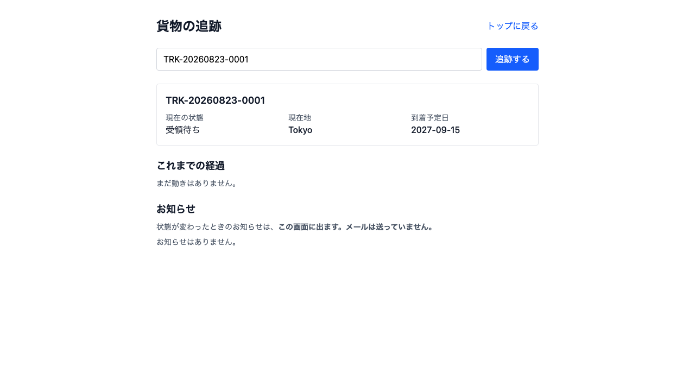
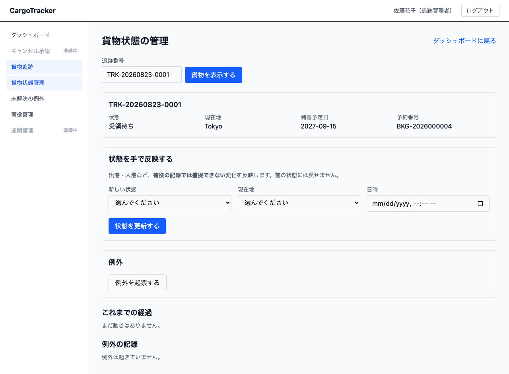
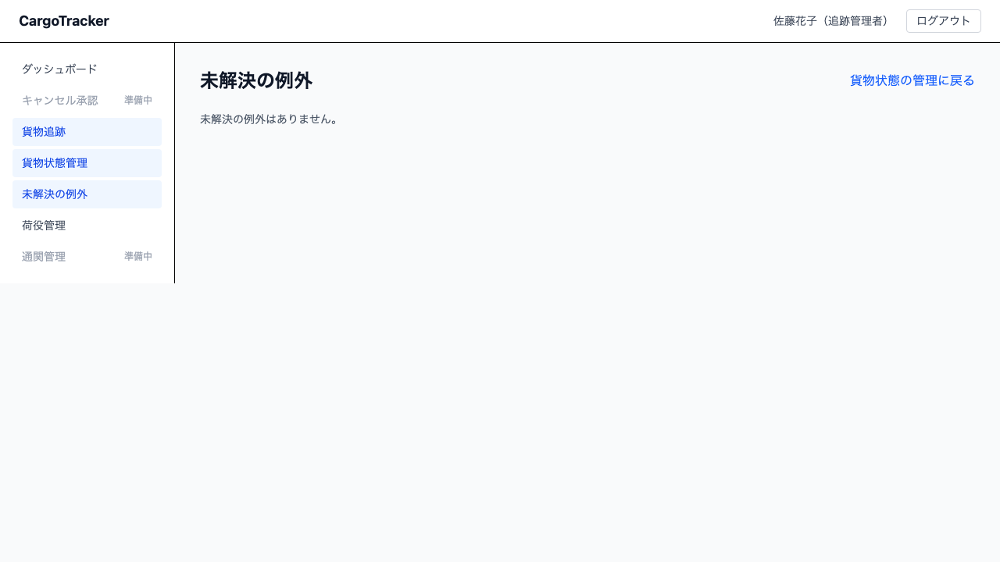

# 09 貨物追跡

貨物がいまどこにあるかを見る画面です。読者が 2 とおりいます。

- **荷主・荷受人** — 追跡番号だけで照会します。**ログインは要りません**
- **追跡管理者** — 荷役では捕捉できない状態変化を手で反映し、遅延・破損・紛失を例外として起票します

本章は [01 業務フロー](01-業務フロー.md#steps) の「貨物の状態を更新する」「貨物の状況を確認する」にあたります。

## 9.1 追跡番号で貨物を照会する（ログイン不要） {#lookup}

### 画面の開き方

トップページ（`/`）の **[貨物を追跡する]** に追跡番号を入れて **[追跡する]** を押します。
ログイン画面の **[追跡照会はこちら]** からも開けます。URL は `/tracking` です。

業務担当者は、メニューの **[貨物追跡]** からも開けます。

### 画面の説明

| 項目 | 説明 |
| :--- | :--- |
| 現在の状態 | 受領待ち・受領済み・積込済み・輸送中・荷降し済み・引取待ち・引取済み・**例外発生**のいずれか |
| 現在地 | いま貨物がある港の名前 |
| 到着予定日 | 到着の見込みです。**経路が決まっていないときは「未定」**と出ます |
| これまでの経過 | 日時・状態・場所を、起きた順に並べます |
| お知らせ | 状態が変わったときのお知らせです |

> **到着予定日が「未定」のときは、まだ経路が決まっていません。**
> 日付が入っていないだけで、貨物が止まっているわけではありません。
>
> **「例外発生」と出ているときは、遅延・破損・紛失のいずれかが起きています。**
> 何が起きたかは、この画面には出しません（9.1.5）。ご依頼元の営業担当へお問い合わせください。

### 操作手順 {#lookup-steps}

1. トップページを開きます
2. **追跡番号**（`TRK-` で始まる番号）を入れます
3. **[追跡する]** を押します
4. 状態・現在地・到着予定日・経過が表示されます

> **追跡番号は営業担当者からお伝えします。** 予約番号（`BKG-` で始まる番号）では照会できません。

### 見つからないとき {#not-found}

**「追跡番号が見つかりません」** と出た場合は、番号をお確かめください。同じ画面で
打ち直せます。番号が正しいのに出ない場合は、ご依頼元の営業担当へお問い合わせください。

### お知らせについて {#notices}

**状態が変わったときのお知らせは、この画面に出ます。メールは送っていません。**

メールでのお知らせは、まだ仕組みとして用意されていません。お手元にメールが届かないのは
不具合ではありません。**貨物の状況は、この画面でご確認ください。**

### 表示されない情報 {#not-shown}

この画面は**ログインなしで開けます**。追跡番号を知っている方であれば誰でも見られるため、
次の情報は表示しません。

- 予約番号・荷主名・荷受人名
- 作業した担当者の名前
- 航海番号
- 例外の詳しい内容

お荷物に問題が起きているときは「**お荷物に問題が起きています**」とだけ表示します。
詳しくはご依頼元の営業担当へお問い合わせください。

## 9.2 貨物の状態を手で反映する {#manual-update}

**追跡管理者**が使います。メニューの **[貨物状態管理]**、または追跡管理ダッシュボードの
**[貨物の状態を管理する]** から開きます。URL は `/tracking/manage` です。

### この画面でできること

**荷役の記録では捕捉できない変化**を反映します。出港・入港がこれにあたります——船が出た
ことは港の作業ではないため、荷役作業員の記録には現れません。

### 操作手順 {#manual-update-steps}

1. **追跡番号**を入れて **[貨物を表示する]** を押します
2. **新しい状態**を選びます
3. **現在地**を選びます
4. **日時**を入れます
5. **[状態を更新する]** を押します

> **前の状態には戻せません。** 選べるのは、いまより先へ進む状態だけです。
>
> 荷主が見ているのは 1 本の状態であり、**どこから動かしたかは荷主には見えません**。
> 手で戻せるようにすると、荷主の画面で「引取済だったはずの貨物が受領待ちに戻る」ことが
> 起こります。
>
> **誤りを直すときは、例外として起票してください**（9.3）。実際に起きたことを消さずに残します。

### よくある入力の誤り {#common-mistakes}

| 出るメッセージ | 何が起きているか | どうするか |
| :--- | :--- | :--- |
| 状態が不正です | 選べない状態を送っています。画面を開き直すと選択肢が作り直されます | 画面を再読み込みします |
| 地点マスタにない場所です | 一覧に無い港を指定しています | 一覧から選び直します。港そのものが無いときは管理者へ連絡します |
| 追跡番号が見つかりません | 番号の打ち間違いか、予約番号（`BKG-`）を入れています | 追跡番号は `TRK-` で始まります |
| 例外を起票できません | すでに未解決の例外があります | 先にその例外を解決します（9.3） |
| 別の担当者がこの例外をすでに解決しています | 一覧を開いたままのあいだに、他の担当者が解決しました | 一覧を開き直します |
| 遅延を解決するときは、新しい到着予定日を入れてください | 遅延の解決に到着予定日が入っていません | いつ着く見込みかを入れます（入れないと、遅れる前の古い予定日が荷主に見え続けます） |

## 9.3 例外を起票する・解決する {#exceptions}

### 起票できる例外

| 種別 | いつ使うか | 扱い |
| :--- | :--- | :--- |
| 遅延 | 天候・港湾の混雑などで到着が遅れるとき | 通常 |
| 破損 | 外装や中身に破損が見つかったとき | 通常 |
| 紛失 | 貨物の所在が確認できないとき | **緊急** |

> **誤配と税関保留は、この画面からは起票できません。** どちらもシステムが自動で
> 検知するものだからです。
>
> **ただし、その自動の検知はまだ動いていません。** 税関保留は通関管理（US29）、
> 誤配は経路の再設計（US28）と一緒に入ります。それまでのあいだ、予定外の港での
> 作業に気づいたら、**遅延として起票して発生状況に「予定外の港で荷降し」と
> 書いてください**。運用でしのぐ形であることを、ここに明記しておきます。

### 起票の手順 {#raise-steps}

1. 追跡番号を入れて **[貨物を表示する]** を押します
2. **[例外を起票する]** を押します
3. **例外の種別**を選び、**発生状況**を書きます
4. **[起票する]** を押します

起票すると、貨物の状態が **例外発生** になります。**紛失のときだけ「緊急」**が付きます。

> **緊急は荷主の画面にも届きます。** ただし出るのは
> 「ご依頼元へのご連絡をおすすめします」という**案内**であり、種別（紛失）は出しません。
> 荷主には「何が起きたか」ではなく「次に何をするか」を伝えます。

> **例外があるあいだ、状態を手で更新する枠は画面から消えます。** 操作を忘れているのでは
> ありません。例外中に状態を動かすと、解決したときに戻る先が変わってしまうためです。
> 先に例外を解決すると、更新の枠が戻ります。
>
> **1 つの貨物に、未解決の例外は 1 件までです。** すでに例外があるときは、先に解決して
> ください。2 件目を起票すると、解決したときに戻る状態が分からなくなります。

### 解決の手順 {#resolve-steps}

1. 追跡番号を入れて **[貨物を表示する]** を押します
2. **[解決する]** を押します
3. **対応内容**を書きます
4. 遅延の場合は **新しい到着予定日** を入れます
5. **[解決を記録する]** を押します

**解決すると、例外が起きる前の状態に戻ります。** 遅延の前が「輸送中」だったなら、
「輸送中」に戻ります。受領待ちまで巻き戻ることはありません。

## 9.4 未解決の例外を一覧で見る {#open-exceptions}

メニューの **[未解決の例外]**、追跡管理ダッシュボードの **[未解決の例外を見る]**、または
貨物状態管理の画面上部に出る **[一覧を見る]** から開きます。
URL は `/tracking/manage/exceptions` です。

**追跡管理者・荷役作業員のほか、営業担当者も読めます。** 荷主は追跡照会の画面で
「ご依頼元の営業担当へ」と案内されるため、営業が何も知らないままでは案内が
行き止まりになるからです。ただし**営業は起票も解決もできません**。

**緊急な例外が先に、次に発生の古い順**で並びます。上から順に見れば、最も長く
放置されているものから手を付けられます。

未解決の例外がある貨物が並びます。**追跡番号を押すと、その貨物の管理画面へ移ります**
——番号を書き写す必要はありません（営業担当者が押したときは、公開の追跡照会が開きます。
管理画面は営業には開いていません）。

> **未解決の例外は、放っておくと荷主からの問い合わせになって返ってきます。**
> 1 日 1 回はこの一覧を確認してください。
