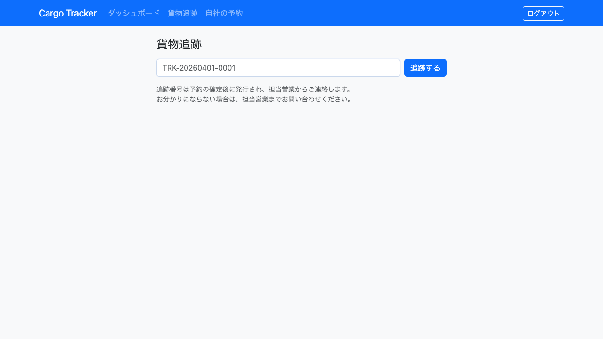
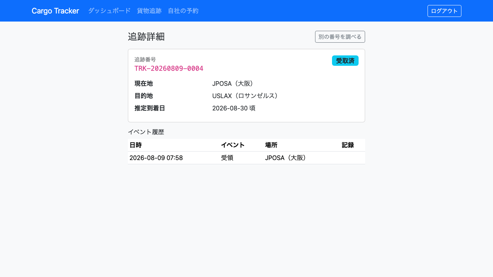
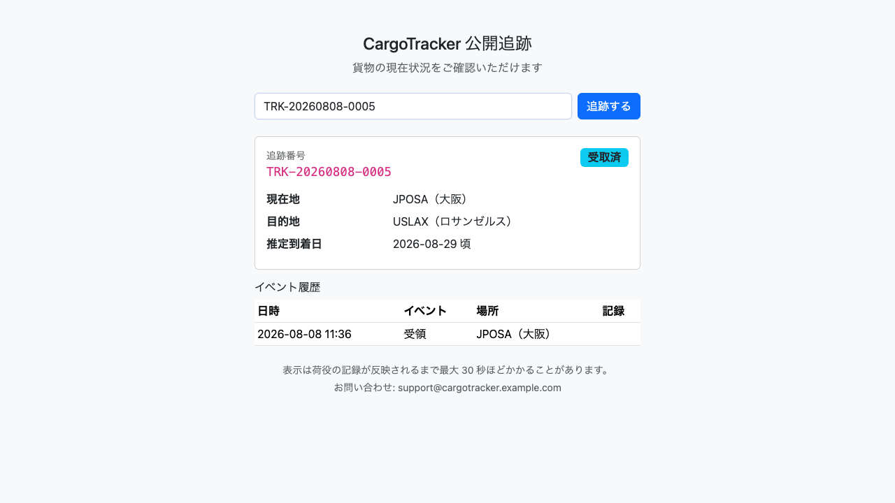

# 09. 貨物追跡

**追跡番号から貨物の現在状況を照会する**画面です。荷主・荷受人・追跡担当者が利用します。

追跡番号さえあれば、**ログインせずに照会できる画面**も用意しています。荷主が取引先へ URL をそのまま転送できるようにするためです。

| 画面 | 誰が使うか | 節 |
| :--- | :--- | :--- |
| 貨物追跡（要ログイン） | 荷主・荷受人・追跡担当者 | [9.1](#91-追跡番号から状況を照会する) |
| 公開追跡（ログイン不要） | 取引先など、アカウントを持たない方 | [9.2](#92-ログインせずに照会する) |

> **どちらの画面も表示する内容は同じです。** 荷主名・住所・連絡先といった個人情報は、
> どちらにも表示されません。公開追跡の URL が第三者へ転送されても、
> 取引関係が読み取られないようにするためです。

## 9.1 追跡番号から状況を照会する

### この画面でできること

- 追跡番号を入力して、貨物の現在の状態・現在地・推定到着日を確認します。
- これまでの荷役（受領・積込・荷降し・引取）の履歴を新しい順に確認します。

### 画面の開き方

- メニュー「貨物追跡」（URL: `/tracking`）
- ダッシュボードの「貨物追跡」カードの「開く」

### 画面の説明

| # | 項目 | 説明 |
| :--- | :--- | :--- |
| ① | 追跡番号 | `TRK-20260401-0001` の形式で入力します。**小文字で入力しても照会できます** |
| ② | 「追跡する」 | 入力した番号で照会します |

照会に成功すると追跡詳細が表示されます。

| # | 項目 | 説明 |
| :--- | :--- | :--- |
| ① | 追跡番号 | 照会した番号です |
| ② | ステータス | 貨物の現在の状態です（未受取・受取済・積み込み済・搭載中・荷降ろし済・引取待ち・引取完了など） |
| ③ | 現在地 | 最後に荷役が記録された港コードです。**受領前は「受領前のため未確定」と表示されます** |
| ④ | 目的地 | 予約の目的地の港コードです |
| ⑤ | 推定到着日 | 確定した経路から算出した到着予定日です。**経路が未確定の場合は「未確定」と表示されます** |
| ⑥ | 通関 | 国をまたぐ輸送でのみ表示されます。通関の状態と、**引き取れるかどうか**が読めます。手続きが始まっていない場合は「手続き前」と表示されます |
| ⑥ | イベント履歴 | 荷役の記録を新しい順に並べたものです |
| ⑦ | 「別の番号を調べる」 | 入力画面に戻ります |

### 操作手順

1. メニュー「貨物追跡」をクリックします。
2. 追跡番号を入力します。
3. 「追跡する」をクリックします。
4. 追跡詳細が表示されます。

### 注意・補足

- **追跡番号が分からないときは、営業担当者にお問い合わせください。** 営業担当者は貨物予約一覧の「追跡番号」欄から、番号の一部だけでも予約を探せます。
- **通関の欄は国内輸送では表示されません。** 通関が要らないためです。
- **「引き取れません」と出ている間は港へ向かわないでください。** 通関が下りるまで引き渡しはできません。状態が変わったらご連絡します。
- **推定到着日は遅延を織り込んでいません。** 確定した経路のとおりに進んだ場合の日付です。遅延が発生した場合は別途ご連絡します。
- **荷役の記録が反映されるまで、最大 30 秒ほどかかることがあります。** 現場で作業が登録された直後は、まだ履歴に現れていないことがあります。
- 該当する貨物が見つからない場合は「該当する貨物が見つかりません」と表示されます。**番号の誤りと、存在しない番号を区別して表示することはしません。**

## 9.2 ログインせずに照会する

### この画面でできること

- アカウントを持たない方が、追跡番号だけで貨物の状況を確認します。
- 表示された URL をそのまま取引先へ転送できます。

### 画面の開き方

- **ログイン画面の「追跡番号をお持ちの方はこちら（ログイン不要）」**
- 荷主から共有された URL（`/public/tracking/TRK-20260401-0001` の形式）を直接開く
- URL: `/public/tracking`

> **アカウントをお持ちでない方へ。** 荷主から追跡番号だけを伝えられた場合は、
> ログイン画面の下部にあるリンクからこの画面へ進んでください。
> ログイン画面で止まる必要はありません。

### 画面の説明

表示される内容は [9.1](#91-追跡番号から状況を照会する) の追跡詳細と同じです。

### 操作手順

1. ログイン画面の「追跡番号をお持ちの方はこちら（ログイン不要）」をクリックします（または共有された URL を直接開きます）。
2. 追跡番号を入力します。
3. 「追跡する」をクリックします。

### 注意・補足

- **ログインは不要です。** ログイン画面へ移動することはありません。
- **表示された URL はそのまま共有できます。** ブラウザのアドレス欄に追跡番号が含まれており、その URL を開けば同じ結果が表示されます。
- **業務メニューは表示されません。** この画面から予約や荷役の操作に進むことはできません。
- 短時間に何度も照会すると「アクセスが集中しています」と表示されることがあります。表示された秒数だけ待ってから、もう一度お試しください。
