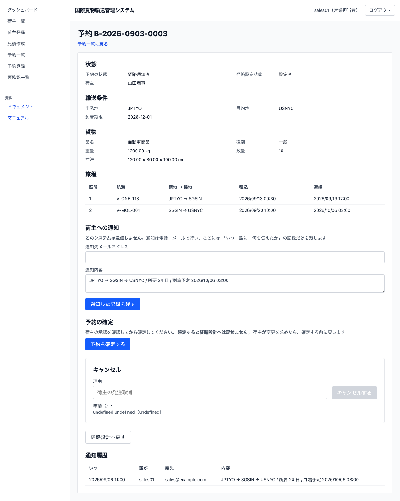

# 10 荷主に経路を通知する

## この章でできること

営業担当者が、経路設計者の決めた経路を荷主に伝え、伝えた記録を残します。荷主が変更を求めたときは、経路設計へ戻せます。

**このシステムは荷主にメールを送りません。** 通知は電話・メールなど今までどおりの方法で行い、**このシステムには「いつ・誰に・何を伝えたか」の記録だけを残します**。記録があると、荷主から「聞いていない」と言われたときに何を伝えたのかを確かめられます。

## 通知する内容を確かめる

1. 予約一覧で、経路が決まった予約の予約番号を押します
2. 予約詳細に「荷主への通知」が出ます

   

3. 「通知内容」に、荷主へ伝える内容が出ます

**通知内容は旅程から自動で作られ、書き換えられません。** 通る港の並び・所要日数・到着予定日時が入ります。書き換えられると、実際の旅程と違うことを伝えられてしまうためです。

**料金の見込みは入りません。** 料金の算出はまだこのシステムにありません。0 円と出すと「費用がかからない」と読めてしまうので、欄そのものを置いていません。料金は今までどおり別に案内してください。

**「荷主への通知」は経路が決まった予約にだけ出ます。** 経路が決まっていない予約に出しても、荷主は何も確認できないためです。

## 通知した記録を残す

1. 「通知先メールアドレス」に、実際に伝えた宛先を入れます
2. `[通知した記録を残す]` を押します
3. 予約の状態が「通知済み」に変わり、下に「通知履歴」が出ます。**反映に数秒かかることがあります**（そのまま待てば出ます）

**押す前に荷主へ伝えてください。** このシステムは送信しません。押すのは「伝えた」ことの記録です。

**同じ予約に何度でも記録できます。** 条件が変わって伝え直したときは、もう一度この操作をします。通知履歴には新しい通知から順に並びます。

## 通知履歴を読む

通知履歴には、いつ・誰が・どの宛先に・何を伝えたかが並びます。

**通知履歴は営業以外も読めます。** 経路設計者も追跡担当者も、荷主に何を伝えたのかを知る必要があるためです。記録を残す操作ができるのは営業担当者だけです。

「誰が」の欄が `—` になっている通知は、記録した利用者が分からないものです。記録そのものは残っています。

## 荷主が変更を求めたら経路設計へ戻す

荷主から「この経路では困る」と言われたときは、経路設計へ戻します。

1. `[経路設計へ戻す]` を押します
2. 「戻す理由」に、荷主が何を求めているのかを書きます（例: `荷主が経由港の変更を希望`）
3. `[戻すことを確定する]` を押します

予約の状態が「経路提案中」に戻り、経路設計作業一覧に再び出ます。**書いた理由は経路設計の画面に「営業から戻されました: 〈理由〉」として出ます。** 経路設計者はそれを読んで組み直します。組み直すと表示は消えます。

**確定していた旅程は残ります。** 消すと、何を組み直すのかが分からなくなるためです。新しい経路が確定すると入れ替わります。

**通知履歴も残ります。** 何を伝えたのかは、戻したあとも確かめられる必要があります。

**通知していない予約は戻せません。** まだ荷主に伝えていないなら、経路設計者が自分で経路を確定し直せます。この操作は「荷主が変更を求めた」ことを表すものです。

## うまくいかないとき

### 「経路が決まっていない予約は荷主へ通知できません」と出る

その予約はまだ経路が決まっていません。経路設計者が経路を確定するまで待ってください（[09 経路を設計する](09-経路を設計する.md)）。

### 「通知の宛先は必須です」「通知内容は必須です」と出る

宛先を入れてから押してください。通知内容は旅程から自動で作られるので、空のときは旅程がまだ読み込まれていません。少し待ってから開き直してください。

### 「状態 〇〇 の予約は経路設計へ戻せません」と出る

まだ荷主へ通知していない予約です。通知してから戻してください。通知前に組み直したいときは、経路設計者に直接相談してください。

### 「戻す理由を入力してください」と出る

理由を書いてから `[戻すことを確定する]` を押してください。理由が無いと、経路設計者は何を直せばよいのか分かりません。（画面を通さず操作したときは `経路設計へ戻す理由は必須です` と出ます。）

## 関連する章

- [05 貨物予約を登録する](05-貨物予約を登録する.md)
- [08 経路設計に引き渡す](08-経路設計に引き渡す.md)
- [09 経路を設計する](09-経路を設計する.md)
