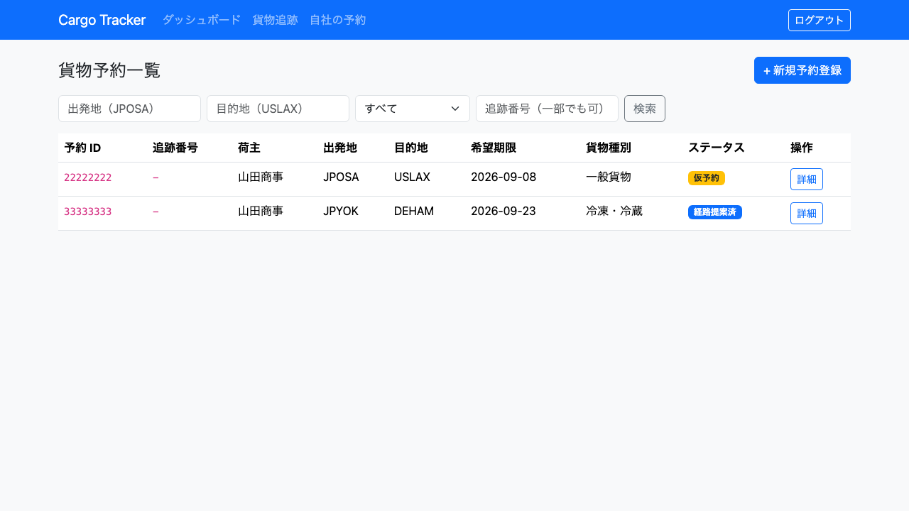

# 10. 荷主セルフサービス

**荷主が自社の予約の状況を自分で確認する**ための章です。荷主アカウント（`ROLE_SHIPPER`）でログインした方が利用します。

これまで、予約の状況を知るには営業担当者に問い合わせる必要がありました。本章の画面を使うと、**自社が依頼した予約だけ**を自分で確認できます。

> **確認できるのは自社の予約だけです。** 他社の予約は一覧に現れず、URL を直接入力しても開けません。

## 10.1 自社の予約を確認する

### この画面でできること

- 自社が依頼した予約の一覧を確認します。
- 出発地・目的地・状態・追跡番号で絞り込みます。

### 画面の開き方

- メニュー「自社の予約」（URL: `/bookings`）
- ダッシュボードの作業カード「自社の予約」

### 画面の説明

営業担当者が見る貨物予約一覧（[4.1](04-貨物予約.md#41-予約を探す)）と同じ画面ですが、**表示されるのは自社の予約だけ**です。

| # | 項目 | 説明 |
| :--- | :--- | :--- |
| ① | 検索条件 | 出発地・目的地・状態・追跡番号で絞り込みます |
| ② | 一覧 | 自社の予約が並びます。行をクリックすると詳細を開きます |

### 操作手順

1. メニュー「自社の予約」またはダッシュボードの作業カードをクリックします。
2. 一覧から確認したい予約の行をクリックします。
3. 予約詳細で、状態・経路・追跡番号・荷役履歴を確認します。

### 注意・補足

- **予約の登録・キャンセルはできません。** 依頼と取り消しは営業担当者を通してください。
- **検索条件に他社の出発地・目的地を入力しても、他社の予約は現れません。** 絞り込みは検索条件より先に効きます。
- **他社の予約は URL を直接入力しても開けません。** 「予約が見つかりません」と表示されます。存在するかどうかも分からないようにするための表示です。
- **予約が 1 件も表示されない場合**は、アカウントと荷主の紐付けが設定されていない可能性があります。「表示できる予約がありません」と出たときは、**担当の営業担当者にアカウントの設定を確認してください**（権限の問題ではありません）。
- 追跡番号が発行済みの貨物は、貨物追跡（[9.1](09-貨物追跡.md#91-追跡番号から状況を照会する)）でも現在地と履歴を確認できます。

## 10.2 貨物の輸送状況を追う

荷主アカウントは貨物追跡も利用できます。手順は [9. 貨物追跡](09-貨物追跡.md) を参照してください。

- 追跡番号は**予約詳細**に表示されます。番号を控えなくても、自社の予約からたどれます。
- 取引先に状況を知らせたい場合は、**公開追跡の URL**（[9.2](09-貨物追跡.md#92-ログインせずに照会する)）をそのまま転送できます。転送先にアカウントは要りません。
