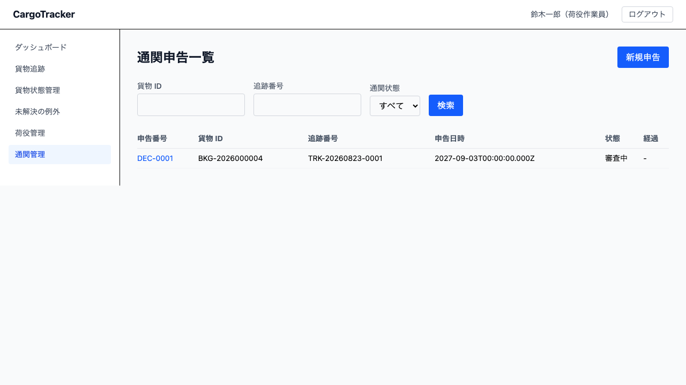
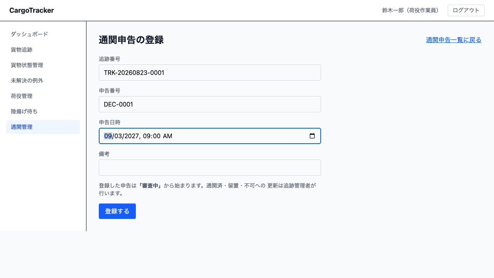
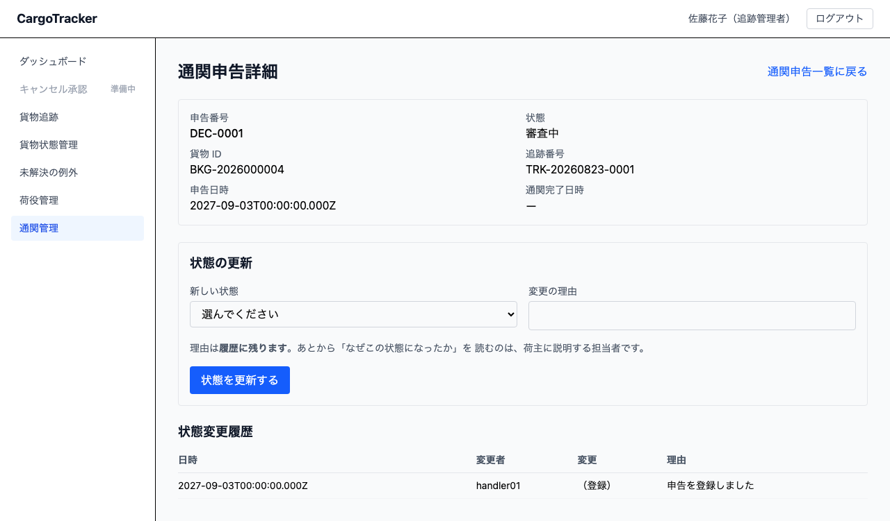

# 10 通関管理

輸入港での税関申告を記録し、その行方を追う画面です。
**荷役作業員**が申告を登録し、**追跡管理者**が状態を更新します。

本章は [01 業務フロー](01-業務フロー.md#steps) の「通関を申告・管理する」にあたります。

> **通関が下りないと、荷受人に引き渡せません。** 引取（CLAIM）の荷役は、通関状態が
> 「通関済」でなければ登録できません（[08 荷役管理](08-荷役管理.md)）。
> どの貨物がどの段階にあるかが分からないと、引き取り作業の計画が立ちません。

## 画面の開き方

メニューの **[通関管理]** を押します。URL は `/customs` です。
荷役ダッシュボードの **[通関を申告する]**、追跡管理ダッシュボードの
**[通関の状態を管理する]** からも開けます。

## 10.1 通関申告を登録する {#register}

**荷役作業員**が使います。一覧の **[新規申告]** から開きます。URL は `/customs/new` です。

### 操作手順 {#register-steps}

1. **追跡番号**（`TRK-` で始まる番号）を入れます
2. **申告番号**を入れます（税関から受け取った番号です）
3. **申告日時**を入れます
4. 必要なら**備考**を書きます
5. **[登録する]** を押します

> **登録した申告は「審査中」から始まります。** 状態は選べません。
> 通関済・留置・不可への更新は追跡管理者が行います。
>
> **1 つの貨物に、決着していない申告は 1 件までです。** 審査中や留置の申告があるあいだは、
> 2 件目を登録できません。2 件あると、引取のときにどちらの申告を見ればよいかが
> 決まらなくなるためです。
>
> **「不可」になった申告は出し直せます。** 一方、**「通関済」のあとには出し直せません**
> ——引き取れる状態を、あとからの申告で覆さないためです。

## 10.2 通関状態を更新する {#update-status}

**追跡管理者**が使います。一覧で**申告番号**を押すと詳細が開きます。
URL は `/customs/:declarationId` です。

### 通関状態 {#statuses}

| 状態 | 意味 | 引取（CLAIM）できるか |
| :--- | :--- | :--- |
| 審査中 | 申告を出し、税関の審査を待っています | できません |
| 通関済 | 通関が下りました | **できます** |
| 留置 | 税関に留め置かれています | できません |
| 不可 | 通関が認められませんでした | できません |

### 操作手順 {#update-steps}

1. 一覧から申告番号を押します
2. **新しい状態**を選びます
3. **変更の理由**を書きます（**必須です**）
4. **[状態を更新する]** を押します

> **理由は履歴に残ります。** あとから「なぜこの状態になったか」を読むのは、
> 荷主に説明する担当者です。「対応した」だけでは、読んだ人に何も伝わりません。
>
> **荷役作業員には、状態を更新する枠が出ません。** 申告の行方を追うために詳細は
> 開けますが、更新は追跡管理者の業務です。
>
> **同じく、追跡管理者には [新規申告] のボタンが出ません。** 申告を出すのは
> 荷役作業員の業務です。

### 状態変更履歴 {#history}

詳細の下部に、**日時・変更者・変更・理由**が新しい順に並びます。
**申告の登録そのものも 1 行目として残ります**——何も無い状態からは始まりません。

## 10.3 留置が長引いている申告に気づく {#overdue}

**留置のまま 3 日を超えた申告**は、一覧で **⚠ 3 日超** と警告が出ます。
一覧の先頭にも件数が出て、そこを押すと**対象だけに絞り込めます**。

> **経過は「留置になってから」の日数です。** 申告を出した日からではありません。
> いったん通関して留め直された申告は、**留め直した日から**数えます。
>
> **3 日ちょうどでは警告が出ません。** 「3 日を超えたら」だからです。
>
> **留置が長引くと保管料が発生します。** 追跡管理者は 1 日 1 回この一覧を確認してください。

## 10.4 申告を探す {#search}

一覧の上部で、**貨物 ID**・**追跡番号**・**通関状態**の 3 つで絞り込めます。
条件を入れて **[検索]** を押します。

## いまはまだできないこと {#not-yet}

- **通関完了の通知は送っていません。** 「通関済」にしても、荷主・荷受人へメールは
  届きません。**画面がそのことを言います**——「通関済」に更新すると、詳細に
  「荷主・荷受人へのご連絡は自動では行われません」と出ます。
  **担当者からお伝えください**（通知の仕組みは次のリリース以降です）
- **税関システムとの電子連携はありません。** 通関状態は担当者が手で入力します
