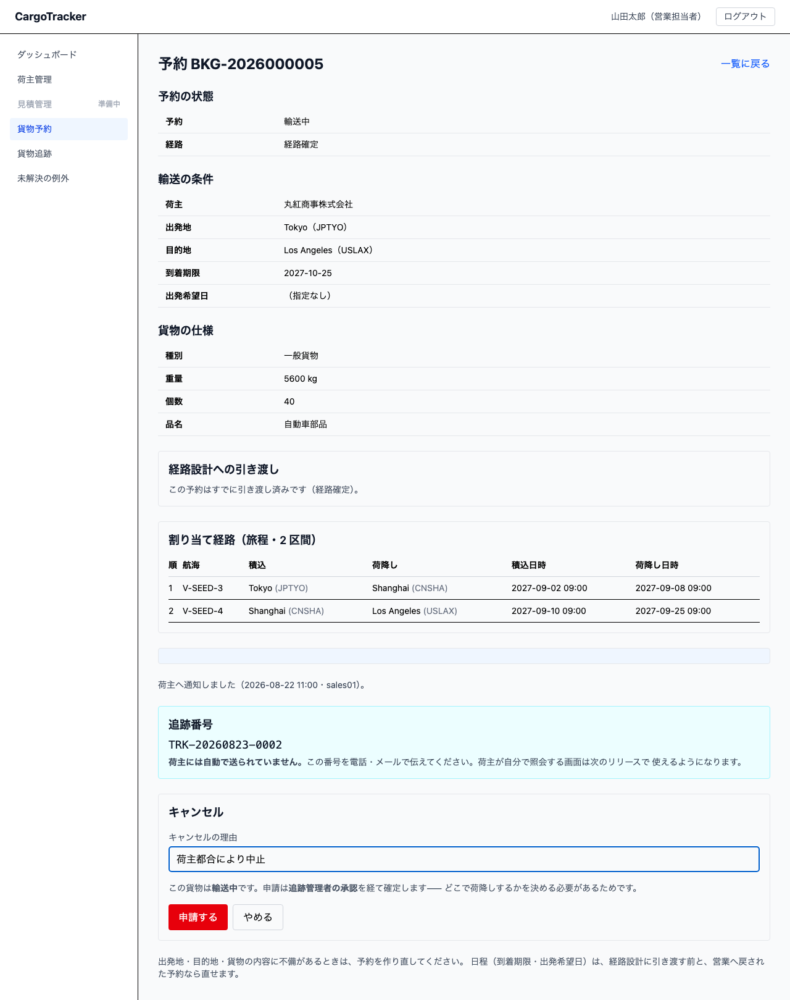
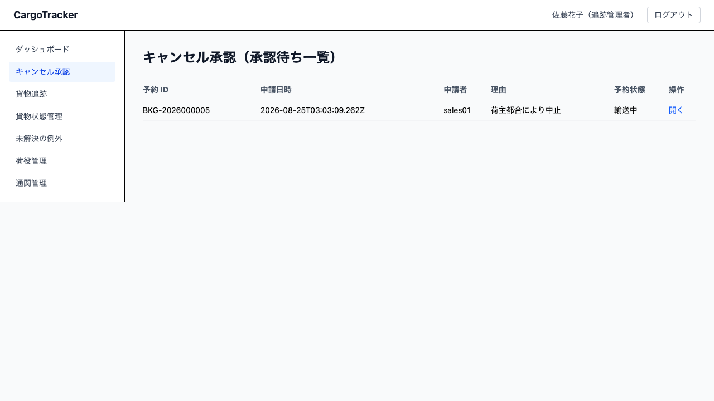

# 11 キャンセル

荷主から「止めてほしい」と言われたときの手順です。
**営業担当者**が申請し、貨物が動いているものは**追跡管理者**が承認します。

本章は [01 業務フロー](01-業務フロー.md#exceptions) の「荷主が予約をキャンセルしたい」に
あたります。

> **輸送開始前と輸送中で扱いが違います。**
> まだ動いていない貨物は、申請した時点でキャンセルが確定します。
> **すでに船に載っている貨物は、どこで降ろすかを決めないとキャンセルできません**
> ——だから追跡管理者の承認を経ます。

## 11.1 キャンセルを申請する {#request}

**営業担当者**が使います。予約詳細（`/booking/:bookingId`）の
**[キャンセルを申請する]** から行います。

### 操作手順 {#request-steps}

1. 予約詳細を開きます
2. **[キャンセルを申請する]** を押します
3. **キャンセルの理由**を書きます（**必須です**）
4. **[申請する]** を押します

理由を書く前に、画面が**この申請がどうなるか**を出します。

| 貨物の状態 | 申請するとどうなるか |
| :--- | :--- |
| 輸送中でない（仮受付・確定済など） | **その場でキャンセルが確定します** |
| 輸送中 | **承認待ち**になります。追跡管理者が陸揚げ地を決めて承認します |

> **理由は履歴に残り、承認する追跡管理者が読みます。** 「荷主都合」だけでは、
> どこで降ろすのが良いかを判断できません。分かっていることを書いてください。
>
> **[キャンセルを申請する] が出ないとき**は、その予約がすでにキャンセル済みか、
> 配送完了しています。

### 申請したあと {#after-request}

予約詳細の「キャンセル」の欄に、**申請の状態・理由・申請者・申請日時**が出ます。
承認・却下されると、**陸揚げ地**・**決定の理由**・**決定者と決定日時**も並びます。

### これまでの申請 {#history}

**一度却下されて再び申請した予約**では、いまの申請の下に **[これまでの申請]** の表が
出ます。**申請日時・申請者・理由・結果・決定者と決定日時・決定の理由**が並びます。

> **前回なぜ断られたかは、次に荷主と話すときに要ります。** 同じ理由でまた申請すると、
> 追跡管理者はまた却下することになります。**断られた理由を読んでから**、条件を変えて
> 申請してください。

## 11.2 輸送中のキャンセルを承認する {#approve}

**追跡管理者**が使います。メニューの **[キャンセル承認]**、または追跡管理ダッシュボードの
**[承認待ちのキャンセルを見る]** から開きます。URL は `/booking/cancellations` です。

承認待ちの申請が、**古い順**に並びます——放っておくほど貨物は目的地へ近づきます。

### 承認の手順 {#approve-steps}

1. 一覧の **[開く]** を押します
2. **陸揚げ地**を選びます（**必須です**）
3. **決定の理由**を書きます
4. **[承認する]** を押します

> **陸揚げ地は候補からしか選べません。** 候補は
> **「現在地の港」**（最後に荷役があった港）と **「次の寄港地」**（旅程の残りの荷降し地）です。
> 船が寄らない港を選べてしまうと、**荷降しできない約束を荷主にする**ことになるためです。
>
> 候補にはそれぞれ**なぜ候補なのか**が添えられます。
>
> **荷降しの作業指示は自動では作られません。**
> 承認すると陸揚げ地が予約詳細に残り、荷役の担当者はそこを見ます。
> **承認した追跡管理者から、荷役の担当者へ連絡してください。**
> （作業の予定を扱う仕組みは、まだありません）

### 却下の手順 {#reject-steps}

1. 一覧の **[開く]** を押します
2. **決定の理由**を書きます（**必須です**）
3. **[却下する]** を押します

> **却下しても、予約は輸送中のままです。** 却下は「キャンセルしない」という決定です。
> 予約まで止めてしまうと、貨物は行き先を失ったまま船に乗り続けることになります。
>
> 理由は申請した営業担当者が読みます。**次にどうするかが分かるように書いてください。**

## いまはまだできないこと {#not-yet}

- **キャンセルの通知は送っていません。** 承認・却下しても、荷主や申請者へメールは
  届きません。**画面がそのことを言います**——決定したあと、承認画面に
  「荷主と申請者へのご連絡は自動では行われません」と出ます。
  **承認した追跡管理者から連絡してください**（承認した場合は、荷役の担当者にも
  陸揚げ地をお伝えください）
- **キャンセル料は算定していません。** 申請時点の予約状態は記録していますが、
  料金の計算は精算の仕組み（US23）が入ってからです
