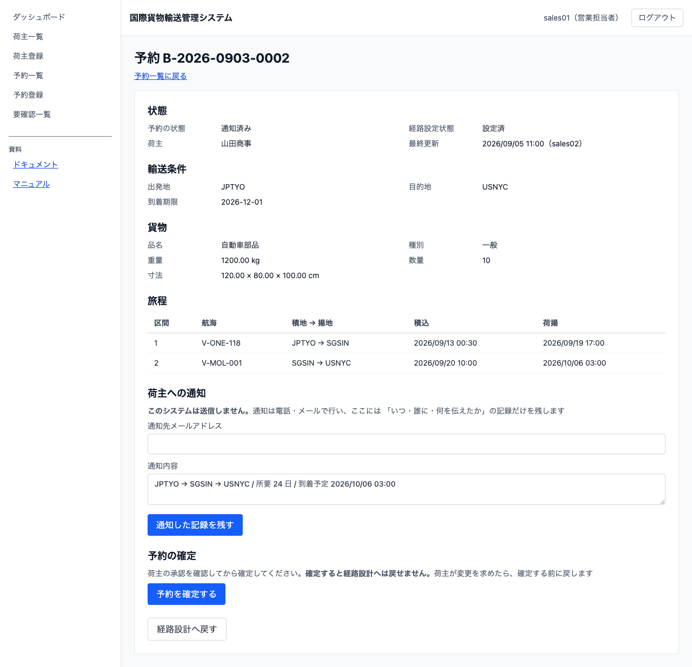
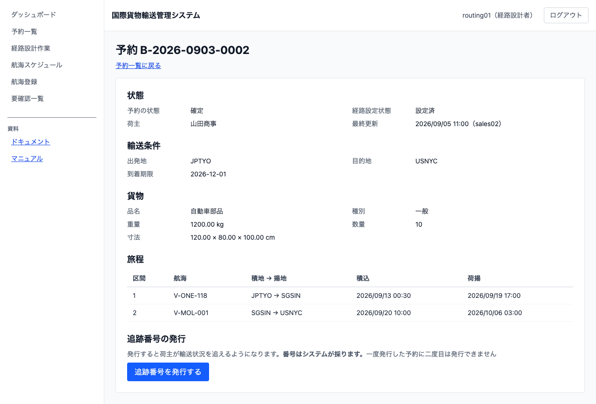

# 11 予約を確定して追跡番号を発行する

## この章でできること

営業担当者が、荷主の承認を確認して予約を正式に確定します。そのあと経路設計者が追跡番号を発行し、荷主が輸送状況を追えるようにします。

**この 2 つは別の人の仕事です。** 確定するのは営業担当者、追跡番号を発行するのは経路設計者です。画面には自分ができる操作だけが出ます。

## 予約を確定する（営業担当者）

1. 予約一覧で、荷主へ通知した予約の予約番号を押します
2. 予約詳細に「予約の確定」が出ます

   

3. 荷主の承認を確認してから `[予約を確定する]` を押します
4. 「予約の状態」が「確定」になります

**確定すると経路設計へは戻せません。** 荷主が経路の変更を求めているときは、確定する前に「経路設計へ戻す」を使ってください（[10 章](10-荷主に経路を通知する.md)）。

**通知していない予約は確定できません。** 「予約の確定」そのものが出ません。承認は「通知した経路への承認」なので、通知していなければ承認するものがありません。まず経路を荷主へ伝えてください。

## 確定を忘れている予約に気づく（営業担当者）

ダッシュボードに「荷主へ通知したまま確定していない予約」が出ます。予約番号を押すとその予約の詳細へ行けます。

**確定しないと次に進みません。** 追跡番号の発行も輸送手配も始まらないので、荷主から催促が来るまで誰も気づかないことがあります。

## 追跡番号を発行する（経路設計者）

1. ダッシュボードの「追跡番号の発行を待っている予約」から、予約番号を押します
2. 予約詳細に「追跡番号の発行」が出ます

   

3. `[追跡番号を発行する]` を押します
4. 「追跡番号」の欄に番号が出ます

**番号はシステムが採ります。** 入力する欄はありません。手で決めると、同じ番号が 2 つ出ることがあります。

**一度発行した予約に二度目は発行できません。** 発行すると操作そのものが消えます。発行から追跡が始まるので、2 度発行すると追跡が 2 つできてしまいます。

**追跡番号は誰でも読めます。** 発行の操作は経路設計者だけですが、番号は営業担当者にも追跡担当者にも見えます。荷主に伝える唯一の手掛かりだからです。

## うまくいかないとき

### 「予約を確定する」が出ない

その予約はまだ荷主へ通知していないか、すでに確定しています。「予約の状態」を確かめてください。「通知済み」のときだけ確定できます。

### 「状態 〇〇 の予約は確定できません（荷主へ通知してから確定してください）」と出る

画面を開いてから状態が変わっています。ほかの担当者が先に操作した可能性があります。画面を開き直してください。

### 「追跡番号を発行する」が出ない

その予約はまだ確定していないか、すでに追跡番号が発行されています。「予約の状態」が「確定」のときだけ発行できます。営業担当者に確定を依頼してください。

### 「状態 〇〇 の予約に追跡番号は発行できません」と出る

画面を開いてから状態が変わっています。すでにほかの経路設計者が発行したか、まだ確定していません。画面を開き直してください。

### 追跡番号が出たのに、しばらくして消えた

**追跡の開始が届かなかったため、発行が取り消されています。** 予約は「確定」に戻っているので、もう一度発行してください。取り消した記録は追跡担当者の要確認一覧に出ています。何度も起きるときはシステム管理者へ問い合わせてください。

## 関連する章

- [05 貨物予約を登録する](05-貨物予約を登録する.md)
- [09 経路を設計する](09-経路を設計する.md)
- [10 荷主に経路を通知する](10-荷主に経路を通知する.md)
