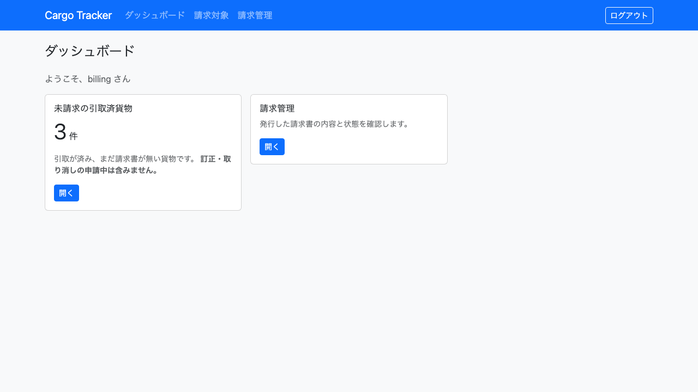
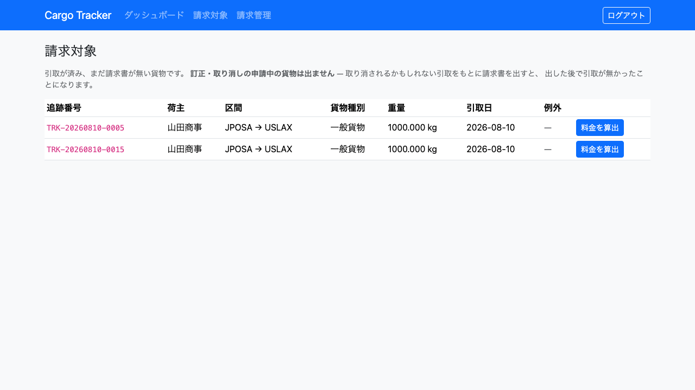
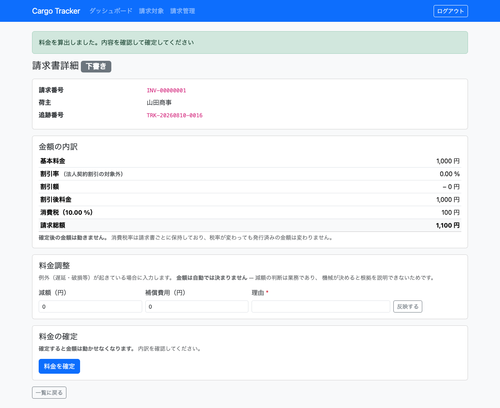
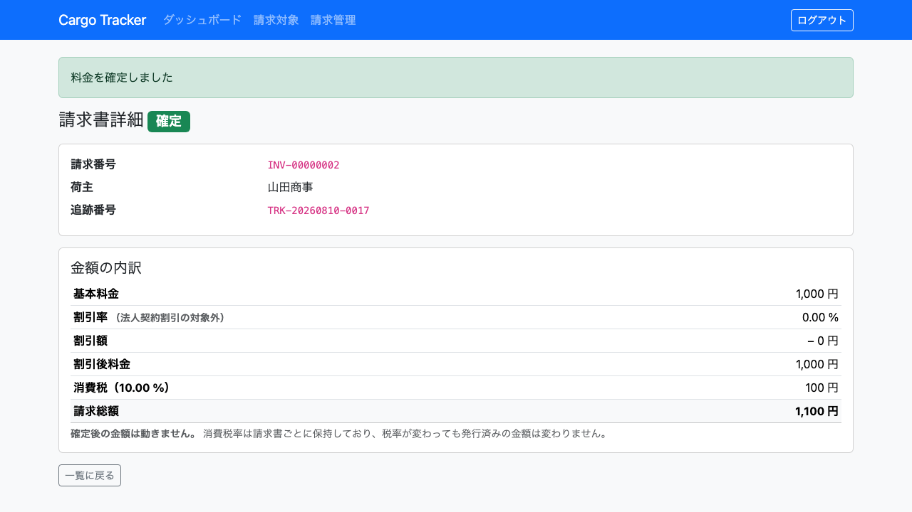
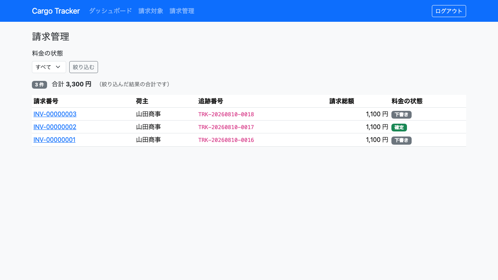

# 11. 請求管理

輸送が終わった貨物の料金を算出し、内容を確認して確定します。**この章の操作ができるのは経理担当者（ROLE_BILLING）だけです。**

## この章で扱う画面

| 画面 | 役割 | 節 |
| :--- | :--- | :--- |
| 請求対象 | 請求書がまだ無い引取済みの貨物を確認する | [11.1](#111-請求対象を確認する) |
| 料金の算出 | 貨物 1 件の料金を算出する | [11.2](#112-料金を算出する) |
| 請求書詳細 | 金額の内訳を確認し、調整・確定する | [11.3](#113-金額を確認して確定する) |
| 請求管理（請求書一覧） | 発行済みの請求書を探す | [11.4](#114-請求書を探す) |

### 画面の開き方

- メニュー「請求対象」（URL: `/billing/pending`）
- メニュー「請求管理」（URL: `/billing/invoices`）
- ダッシュボードの「未請求の引取済貨物」カードの「開く」

ログインすると、**未請求の貨物が何件あるか**がダッシュボードに出ます。

---

## 11.1 請求対象を確認する

### この画面でできること

- **引取が済み、まだ請求書が無い貨物**を一覧で確認します。
- 貨物 1 件ごとに料金の算出を始めます。

### 画面

### 画面の項目

| 項目 | 説明 |
| :--- | :--- |
| 追跡番号 | 対象の貨物です |
| 荷主 | 請求先です。**法人荷主には「法人」のバッジが付きます**（契約割引の対象です） |
| 区間 | 出発地 → 目的地 |
| 貨物種別 | 一般貨物・危険物・冷凍のいずれかです。**料金の係数が変わります** |
| 重量 | 料金の算出に使います |
| 引取日 | **引取が済んだ日です。** 月次は「前月に引取が済んだ分」を締めるため、この日付で当月分かを判断します。古い貨物では「不明」と出ます |
| 例外 | **遅延・破損などが記録されている貨物に「例外あり」と出ます。** 料金調整（減額・補償費用）を検討する目印です |

### 注意・補足

- **訂正・取り消しの申請中の貨物は出ません。** 取り消されるかもしれない引取をもとに請求書を出すと、出した後で引取が無かったことになるためです。申請が決着してから請求してください（[8.4](08-荷役管理.md#84-引取記録の訂正取り消しを申請する)）。
- **すでに請求書がある貨物も出ません。** 二重に請求しないためです。
- 請求対象が無いのは正常です。引取が済んだ貨物がまだ無いか、すべて請求済みです。

---

## 11.2 料金を算出する

### 操作手順

1. 「請求対象」を開きます。
1. 対象の行の `[料金を算出]` を押します。
1. 請求書詳細が開き、「料金を算出しました。内容を確認して確定してください」と表示されます。

算出した直後の画面です。**状態は「下書き」で、料金調整の欄と `[料金を確定]` が出ています。**

### 算出のしくみ

**基本料金 = 距離係数 × 重量（kg） × 貨物種別係数**

| 貨物種別 | 係数 | 理由 |
| :--- | :--- | :--- |
| 一般貨物 | 1.0 | — |
| 危険物 | 1.8 | 取り扱いの手間とリスクが違うためです |
| 冷凍・冷蔵 | 1.5 | 温度を保つ設備が要るためです |

距離係数は**経路の区間数**です。

### 注意・補足

- **経路候補の「費用（概算）」とは別の計算です。** 概算は候補を並べ替えるための目安であり、請求額ではありません（[5.5](05-航路管理.md#55-経路候補を算出して確定する)）。
- **算出しただけでは確定していません。** この時点の状態は「下書き」です。内容を確認してから確定してください（[11.3](#113-金額を確認して確定する)）。
- 引取が済んでいない貨物、訂正の申請中の貨物、すでに請求済みの貨物は算出できません。理由が画面に表示されます。

---

## 11.3 金額を確認して確定する

### この画面でできること

- 金額の内訳と**割引の根拠**を確認します。
- 例外がある貨物では**料金調整**を入力します。
- 内容を確認して**料金を確定**します。

### 金額の内訳

| 項目 | 説明 |
| :--- | :--- |
| 基本料金 | 割引を適用する前の料金です |
| 料金調整（減額・補償費用） | 入力した場合だけ表示されます |
| 割引率 | **法人荷主の契約割引率です。** 個人荷主では 0.00 % と表示され、「法人契約割引の対象外」と添えられます |
| 割引額 | 調整後の料金から引かれる額です |
| 割引後料金 | 消費税を計算する対象です。**割引は料金調整を反映した後の額に掛かります** |
| 消費税 | 割引後料金に税率を掛けた額です |
| 請求総額 | 割引後料金 + 消費税です |

**法人なのに割引率が 0.00 % の場合**は「法人ですが契約割引率が未登録です」と表示されます。契約割引率の登録漏れですので、荷主の登録内容を確認してください。

**割引率・基本料金・割引後料金の 3 つがそろって初めて「割引の根拠」になります。** どれか 1 つでも欠けると、荷主から問われたときに説明できません。

> 内訳は[上の図](#112-料金を算出する)の「金額の内訳」で確認できます。
> **上から順に足し引きすると請求総額に着地します。** 着地しない場合は不具合ですので、ご連絡ください。

### この貨物の例外

**遅延・破損などが記録されている場合、この画面に「この貨物の例外」が表示されます。** 種別・発生日時・状況・対応状況が並びます。

**減額・補償の金額は、ここに出ている事実をもとに決めます。** 例外が 1 件も無い貨物では、この欄そのものが表示されません。

### 料金調整を入力する

例外（遅延・破損等）が起きている場合に使います。

**計算の順序は「基本料金 → 料金調整 → 割引 → 消費税」です。** 減額は割引の前に効きます。

1. 「減額（円）」「補償費用（円）」を入力します。
1. **理由を必ず入力します。**
1. `[反映する]` を押します。

- **金額は自動では決まりません。** 減額の判断は業務であり、機械が決めると根拠を説明できないためです。
- **理由が空だと反映できません。** 後から見て「なぜ減額したのか」が誰にも分からなくなるためです。
- **請求額を超える減額はできません。** 返金は精算の取り消しを伴う別の業務です。

### 料金を確定する

1. 内訳を確認します。
1. `[料金を確定]` を押します。確認のメッセージが出ます。
1. 状態が「確定」になります。

確定すると、料金調整の欄と `[料金を確定]` が消えます。**確定後の画面です。**

### 注意・補足

- **確定すると金額は動かせません。** 料金調整の欄と確定のボタンが表示されなくなります。確定は経理担当者が金額を承認した印であり、後から動かせるなら確定という操作に意味が無いためです。
- **確定を取り消す操作はありません。** 誤った金額で確定してしまった場合は、次の手順で対応してください。
    1. **その請求書はそのまま残します。** 消したり書き換えたりしません。何をいくらで確定したかの記録が、後から作り変えられないことが確定の意味です。
    1. 差額の扱い（追加請求・返金）を経理責任者に確認します。**返金は精算の取り消しを伴う別の業務です。**
    1. 対応の経緯を、請求書番号とあわせて経理の記録に残します。
    1. **請求書をシステムから消す運用は取らないでください。** 削除すると請求対象一覧に同じ貨物が再び現れ、二重請求の入口になります。
- **消費税率は請求書ごとに保持しています。** 税率が変わっても、発行済みの請求書の金額は変わりません。
- **端数は切り捨てます。** 荷主に不利な方向へ丸めないためです。基本料金・割引後料金・消費税額のそれぞれで切り捨てます。
- **他の担当者が先に確定した場合**は「他の担当者が先に更新しました」と表示されます。内容を確認し直してください。

---

## 11.4 請求書を探す

### この画面でできること

- 発行済みの請求書を一覧で確認します。
- 料金の状態（下書き・確定）で絞り込みます。
- **絞り込んだ結果の件数と合計**を一覧の上で確認します。総勘定元帳との突き合わせに使います。

### 注意・補足

- **件数と合計は、いま絞り込んでいる結果のものです。** 「確定」で絞れば確定分だけの合計になります。全件の合計ではありません。
- **請求書を開けるのは経理担当者だけです。** 請求書は金額であり、見える範囲を誤ると他社の取引条件が漏れるためです。荷主・営業担当者には表示されません。
- 請求書がまだ無い貨物は、この一覧には出ません。[請求対象](#111-請求対象を確認する)を確認してください。
- **請求書の発行と入金の確認は今後の提供です。** この章で扱うのは料金の算出と確定までです。

---

## 月次の作業の流れ

| # | 作業 | 時期 |
| :--- | :--- | :--- |
| 1 | 請求対象を確認する | 月初 3 営業日以内 |
| 2 | 1 件ずつ料金を算出し、確認して確定する | 同上 |
| 3 | 請求書を発行する | 今後の提供 |
| 4 | 入金を確認する | 今後の提供 |

**月初 3 営業日以内としているのは、引取から請求までの間隔が開くほど「その貨物で何があったか」を思い出せなくなるためです。** 料金調整は例外の記録を見ながら判断します。
