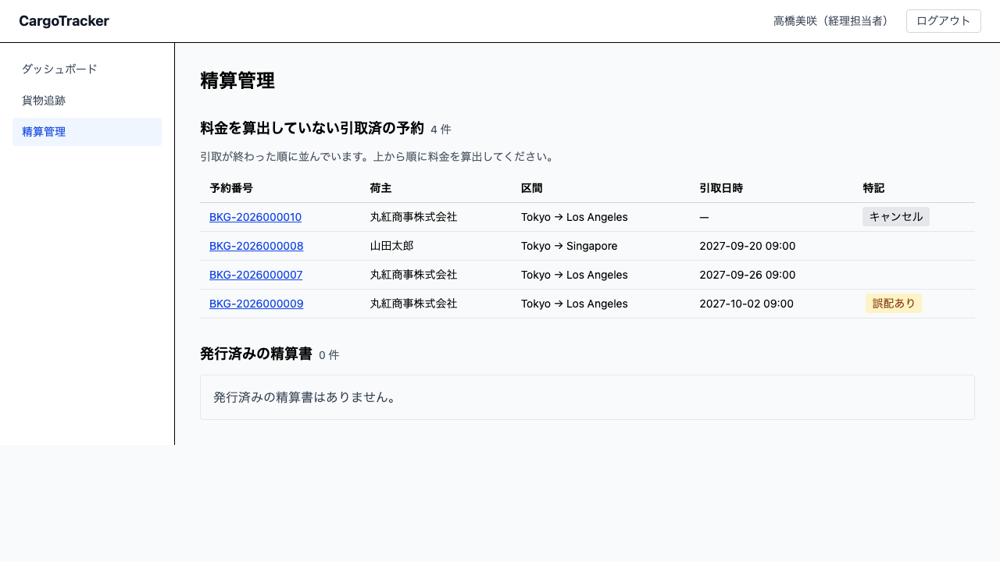
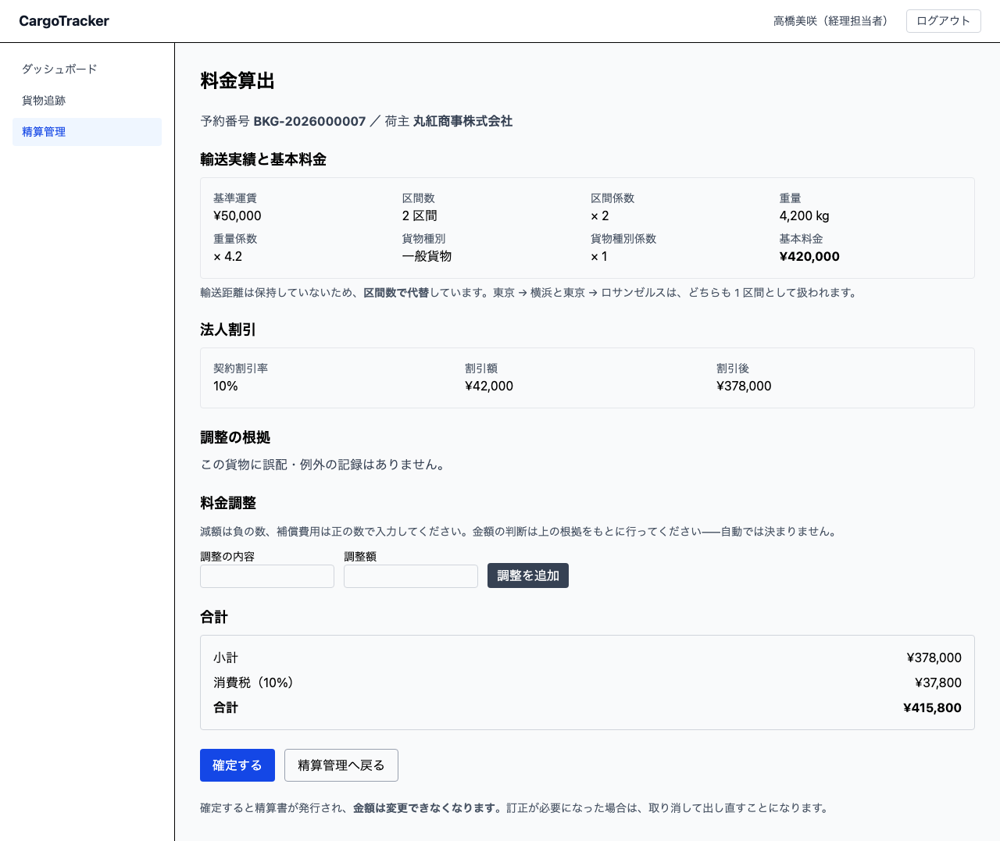
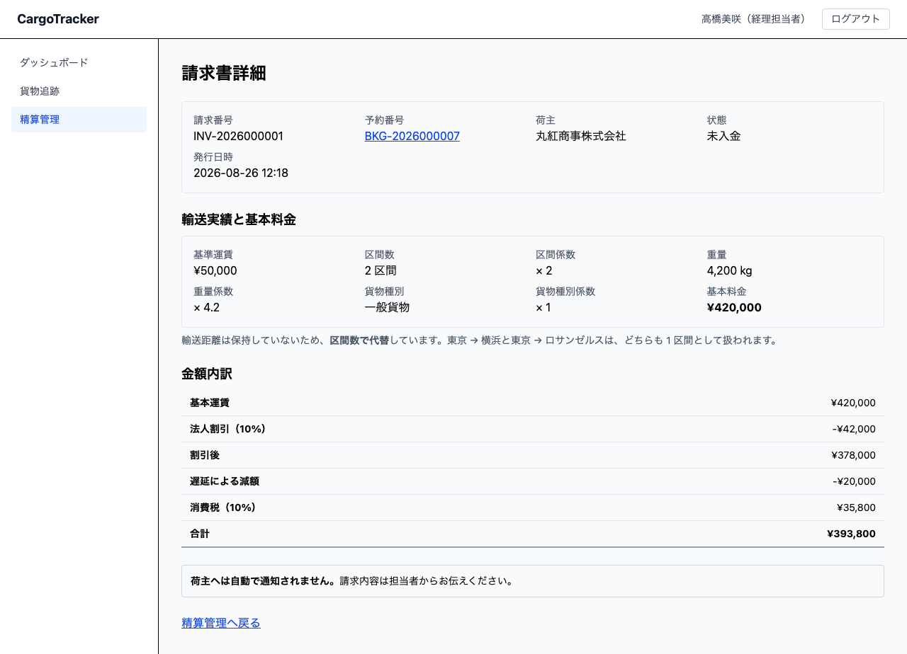

# 12 精算管理

引き取りが終わった貨物に、いくら請求するかを決める画面です。**経理担当者**が使います。

本章は [01 業務フロー](01-業務フロー.md#steps) の「料金を計算して請求書を発行する」に
あたります。

> **請求書を発行すると、金額は変えられません。** 請求書は荷主へ出す約束であり、
> 出したあとに黙って変わると、請求の根拠が消えるためです。訂正が必要になった場合は、
> 取り消して出し直すことになります（その仕組みは次のリリース以降です）。

## 画面の開き方

メニューの **[精算管理]** を押します。URL は `/billing` です。
経理ダッシュボードの **[料金を算出する]** からも開けます。



## 12.1 料金を算出する {#calculate}

### 待っている案件を見つける {#find}

精算管理の画面には、2 つの一覧があります。

| 一覧 | 内容 |
| :--- | :--- |
| 料金を算出していない引取済の予約 | **これからの仕事**です。引取が終わった順に並びます |
| 発行済みの精算書 | **済ませた仕事**です。新しい順に並びます |

> **引取が終わった順に並びます。** いちばん待たせている荷主への請求が上に来ます。
>
> **ログインすると、ダッシュボードに件数が出ます。** 「料金を算出していない引取済の
> 予約が N 件あります」。**この件数と一覧のほかに、気づく手段はありません**
> ——メールでのお知らせは次のリリース以降です。毎朝ここを開いてください。

一覧の **特記** の欄には、料金の判断に関わる印が出ます。

| 印 | 意味 |
| :--- | :--- |
| 誤配あり | 予定していない港で荷役がありました。料金調整の判断が要ります |
| キャンセル | キャンセルされた予約です。キャンセル料が算定されます |

### 料金を出す {#amount}

一覧で**予約番号**を押すと、料金算出の画面が開きます。
URL は `/billing/new/:bookingId` です。



画面の上から順に、次のものが出ます。

#### 輸送実績と基本料金 {#basis}

基本料金は次の式で決まります。

```text
基本料金 = 基準運賃 × 区間係数 × 重量係数 × 貨物種別係数
```

| 項目 | 内容 |
| :--- | :--- |
| 基準運賃 | 1 区間・1,000kg・一般貨物のときの運賃です |
| 区間数・区間係数 | 旅程の区間数です。直行なら 1、積み替えが 1 回なら 2 になります |
| 重量・重量係数 | 重量（kg）÷ 1,000 です。**下限は 0.1** です |
| 貨物種別・貨物種別係数 | 一般貨物 1.0 ／ 危険物 1.8 ／ 冷凍・冷蔵 1.5 |

> **輸送距離は使っていません。** システムは港の緯度経度を持っていないため、
> **区間数で代替**しています。画面にもそのことが出ます——東京 → 横浜と
> 東京 → ロサンゼルスは、どちらも 1 区間として扱われます。
>
> **金額の内訳は、荷主に説明するためのものです。** 「なぜその金額か」を聞かれたときは、
> この欄をそのままお伝えください。

#### 法人割引 {#discount}

荷主が法人で、契約割引率が登録されていれば、**自動で入ります**。
経理担当者が入力するものではありません——手で入れると、契約と違う率が入るためです。

割引率は荷主の登録画面（[03 荷主管理](03-荷主管理.md)）で設定します。

> **個人のお客様には、割引の欄そのものが出ません。** 「0%」ではなく「契約がない」
> ためです。法人でも割引率が登録されていなければ、同じく割引はありません。

#### キャンセル料 {#cancellation-fee}

キャンセルされた予約では、キャンセル料が加算されます。

| キャンセルを申請した時点の状態 | 料率 |
| :--- | :--- |
| 仮受付・経路提案中 | 0%（まだ何も手配していません） |
| 荷主へ通知済 | 5% |
| 確定済・追跡番号発行済 | 10% |
| 輸送中 | 30%（船から降ろす実費がかかります） |

> **料率は「申請した時点」の状態で決まります。** 承認した時点ではありません
> ——輸送中に申請されたものは、承認が翌日でも輸送中の料率になります。
> 画面には申請時点の状態と料率が出ますので、荷主にはそれをお伝えください。

#### 調整の根拠 {#evidence}

誤配や例外（遅延・破損・紛失）があった貨物では、その記録が出ます。

- **誤配** — いつ・どこで予定ルートから外れたか
- **例外** — どの例外が、いつ起きたか

> **金額は自動では決まりません。** どれだけ減額するか、補償費用をいくら乗せるかは、
> 荷主との関係で決まる話であり、規則にできないためです。
> **画面は根拠を出すところまで**で、金額の判断は経理担当者が行います。

#### 料金調整 {#adjustment}

調整を入れるときは、**内容**と**金額**を入れて **[調整を追加]** を押します。

- 減額は**負の数**（例: `-10000`）
- 補償費用は**正の数**（例: `50000`）

> **内容は必ず入れてください。** 空のままでは追加できません。
> 金額だけが残ると、あとから誰も理由を言えなくなるためです。

### 操作手順 {#calculate-steps}

1. 精算管理の一覧で、**予約番号**を押します
2. **輸送実績と基本料金**を確かめます
3. 法人のお客様なら、**契約割引率**が入っていることを確かめます
4. 誤配・例外があれば、**調整の根拠**を読んで金額を判断します
5. 調整が要るなら、**内容**と**金額**を入れて **[調整を追加]** を押します
6. **合計**を確かめます
7. **[確定する]** を押します

> **確定すると、請求書が発行され、金額は変えられなくなります。** 押す前に合計を
> 確かめてください。

## 12.2 請求書を確認する {#invoice}

確定すると、請求書詳細が開きます。URL は `/billing/:invoiceId` です。
精算管理の一覧からも、**請求番号**を押して開けます。



### 金額内訳 {#breakdown}

| 行 | 内容 |
| :--- | :--- |
| 基本運賃 | 区間数・重量・貨物種別から算出した金額です |
| 法人割引（率） | 契約割引率と、その割引額です |
| 割引後 | 基本運賃から割引を引いた金額です |
| キャンセル料（状態・料率） | 申請時点の状態と料率、その金額です |
| （調整の明細） | 入力した調整が、内容つきで並びます |
| 消費税 | 既定の 10% です |
| 合計 | 荷主に請求する金額です |

> **割引「率」も載ります。** 割引額だけでは、あとから率を復元できないためです
> （基本料金と割引額から割り戻すと、端数の分だけずれます）。

### 支払いの状態 {#payment-status}

発行した請求書は **「未入金」** から始まります。

| 状態 | 意味 |
| :--- | :--- |
| 未入金 | 発行した時点の状態です |
| 入金済 | 入金を確認した状態です（**次のリリース以降**） |
| 支払期限超過 | 支払期限を過ぎた状態です（**次のリリース以降**） |
| 返金済 | 返金した状態です（**次のリリース以降**） |

## いまはまだできないこと {#not-yet}

- **請求書の通知は送っていません。** 発行しても、荷主へメールは届きません。
  **画面がそのことを言います**——「荷主へは自動で通知されません」。
  **請求内容は担当者からお伝えください**。黙っていると「請求書が届いていない」
  という問い合わせになります
- **入金の確認はできません。** 支払いの状態は「未入金」のままです。
  入金確認・精算完了の処理は次のリリース（US23）で入ります
- **発行した請求書は取り消せません。** 金額を間違えて確定した場合は、
  現時点では **DB の修正が必要**です。運用担当者にご連絡ください。
  取り消して出し直す仕組みは次のリリース以降です
- **輸送距離は使っていません**（[12.1](#basis)）。区間数で代替しているため、
  短い区間と長い区間が同じ扱いになります。実際の運賃表に合わせる場合は、
  港の座標を登録する仕組みが要ります
- **消費税率は変えられません。** 既定の 10% で計算します。税区分（軽減税率・
  輸出免税）を扱うのは次のリリース以降です
- **見積との突き合わせはできません。** 見積の仕組み（US01）が次のリリースで
  入ってからになります

## 関連する章 {#related}

- [03 荷主管理](03-荷主管理.md) — 法人の契約割引率を登録します
- [08 荷役管理](08-荷役管理.md) — 引取（CLAIM）を記録すると、この画面に現れます
- [11 キャンセル](11-キャンセル.md) — キャンセルされた予約のキャンセル料を算定します
