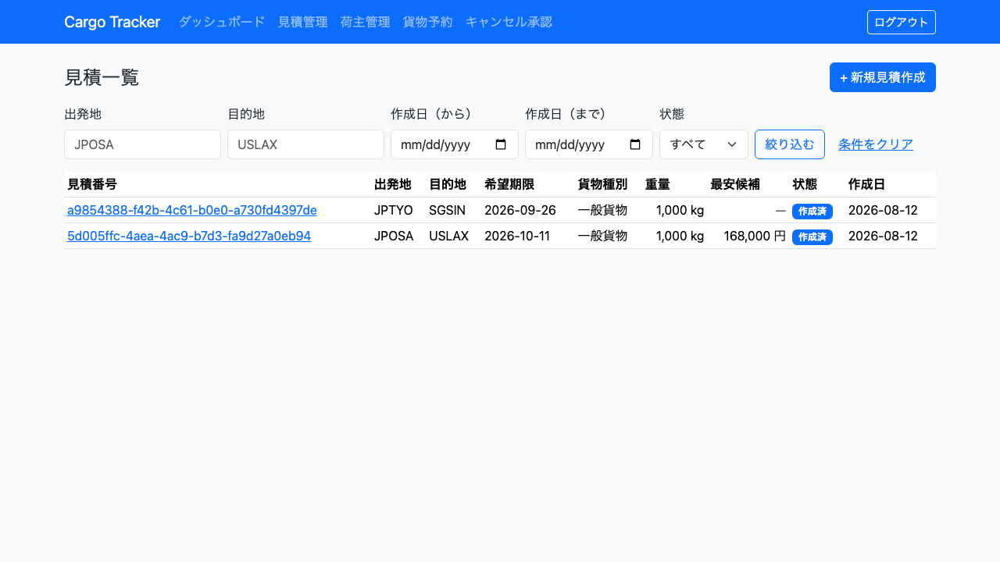
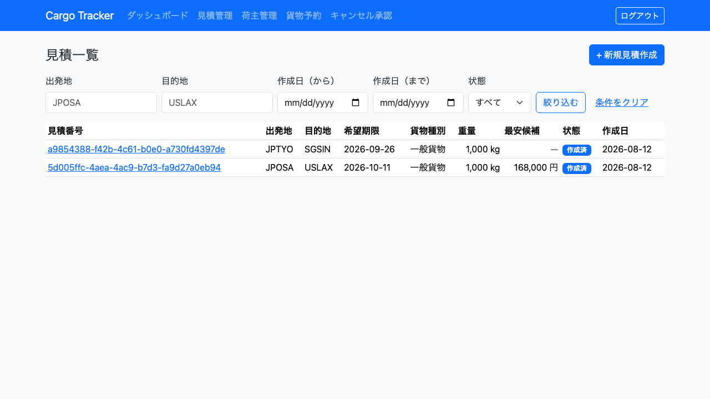
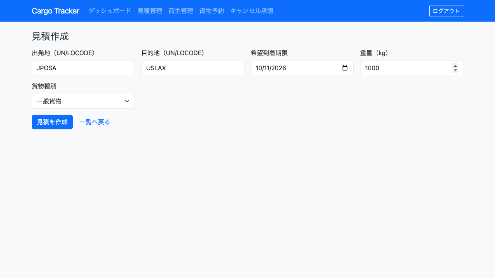
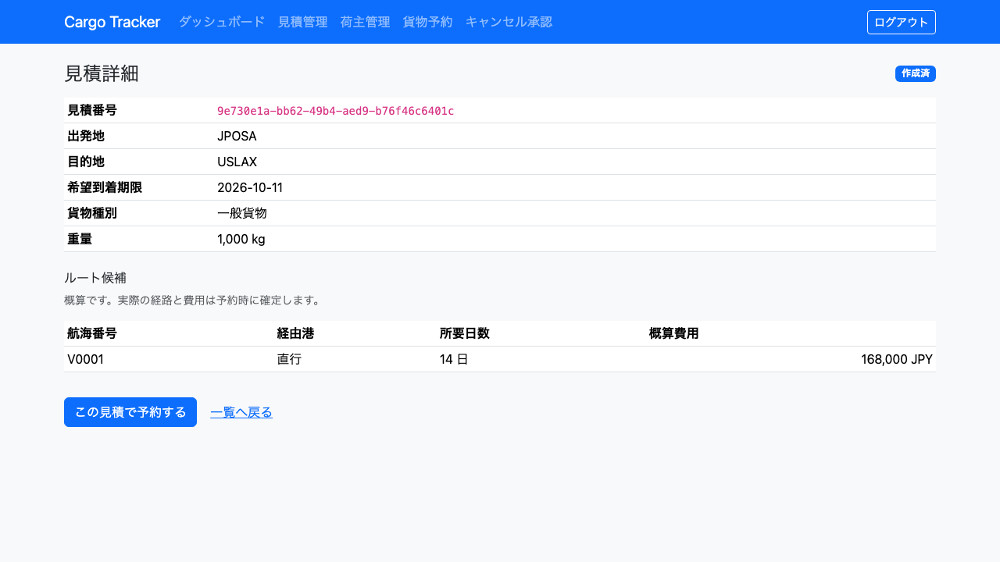
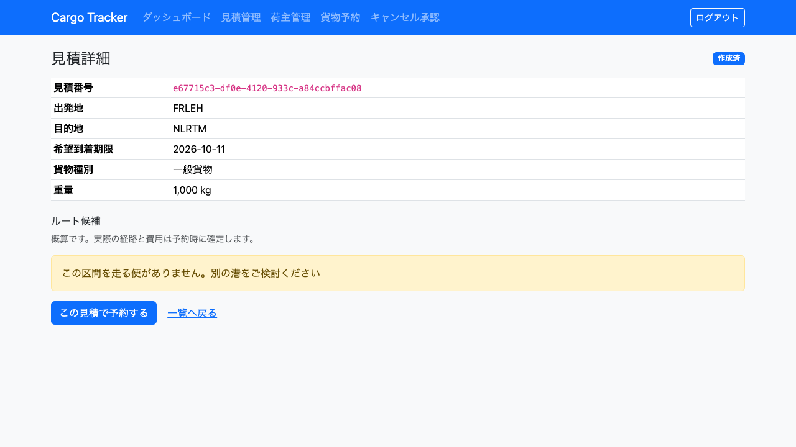

# 12. 見積管理

営業担当者が、荷主の輸送要件から**輸送料金と所要日数の概算**を作ります。作った見積の内容は、そのまま貨物予約の登録へ引き継げます。

**見積は予約の前段です。** 荷主から「大阪からロサンゼルスまで、いくらで何日かかるか」と聞かれたときに、この画面で答えを用意します。

---

## 12.1 見積を一覧で確認する

### この画面でできること

- これまでに作成した見積を一覧で確認します。
- 新しい見積の作成へ進みます。

### 画面の開き方

- メニュー「見積管理」（URL: `/estimates`）。

### 画面の説明

| # | 項目 | 説明 |
| :--- | :--- | :--- |
| ① | 見積番号 | クリックすると詳細を開きます |
| ② | 出発地 / 目的地 | UN/LOCODE で表示します |
| ③ | 希望期限 | 荷主が希望した到着期限です |
| ④ | 貨物種別 | 一般貨物 / 危険物 / 冷凍冷蔵 |
| ⑤ | 重量 | キログラム |
| ⑥ | 最安候補 | ルート候補のうち最も安い概算費用です。**候補が無い見積では「—」**と出ます |
| ⑦ | 状態 | 作成済 / 期限切れ |
| ⑧ | 作成日 | 見積を作成した日です |

### 絞り込み

一覧の上に絞り込みの条件があります。**条件を入れずに「絞り込む」を押すとすべてが出ます。**

| 条件 | 説明 |
| :--- | :--- |
| 出発地 / 目的地 | UN/LOCODE を入力します（小文字でも構いません） |
| 作成日（から / まで） | 見積を作成した日の範囲です。片方だけでも指定できます |
| 状態 | 「有効」または「期限切れ」で絞ります |

**毎朝の確認では「有効」で絞ってください。** 期限切れが混ざったままだと、どれがまだ使えるのか一目で分からなくなります。

### 操作手順

1. メニュー「見積管理」をクリックします。
2. 必要に応じて条件を入れ、「絞り込む」をクリックします。
3. 一覧から見積番号をクリックすると詳細が開きます。

**条件を消したいときは「条件をクリア」をクリックします。**

### 絞り込んだ結果が 0 件のとき

「条件に一致する見積はありません。条件を変えてお試しください」と出ます。**これは見積が 1 件も無いときとは別の表示です** —— 条件を緩めるか、「条件をクリア」で全件に戻してください。

### 見積が 1 件も無いとき

**最初に開いたときは必ずこの状態です。** 「見積がまだありません。輸送条件から概算を作成できます」と、作成への案内が出ます。

### 注意・補足
- **「期限切れ」の見積は、その見積から予約へ進めません。** 希望到着期限を過ぎた見積です（[12.3](#123-見積の内容を確認して予約へ進む)）。

---

## 12.2 見積を作成する

### この画面でできること

- 輸送要件を入力して、ルート候補と概算費用を得ます。

### 画面の開き方

- 見積一覧の `[+ 新規見積作成]`（URL: `/estimates/new`）。

### 画面の説明

| # | 項目 | 必須 | 説明 |
| :--- | :--- | :--- | :--- |
| ① | 出発地（UN/LOCODE） | 必須 | 5 文字の港コード（例: `JPOSA`） |
| ② | 目的地（UN/LOCODE） | 必須 | **出発地と同じにはできません** |
| ③ | 希望到着期限 | 必須 | **当日以降**を指定します |
| ④ | 重量（kg） | 必須 | 正の値 |
| ⑤ | 貨物種別 | 必須 | 一般貨物 / 危険物 / 冷凍冷蔵 |
| ⑥ | 危険物の申告 | 危険物のみ | **貨物種別で「危険物」を選ぶと表示されます。** 危険物クラス・UN 番号・正式輸送品名 |

### 操作手順

1. 見積一覧の `[+ 新規見積作成]` をクリックします。
2. 出発地・目的地・希望到着期限・重量を入力します。
3. 貨物種別を選びます。**危険物を選ぶと、申告の入力欄が表示されます。**
4. `[見積を作成]` をクリックします。作成後は見積詳細が開きます。

### 注意・補足

- **荷主の入力は要りません。** 見積は予約前の照会であり、荷主が確定していない段階でも作成できます。
- **危険物の申告は見積の段階では任意です。** 予約の登録では必須ですが（[4.1](04-貨物予約.md)）、見積は照会であり、荷主から情報が揃う前に概算を出すことがあります。**入力した内容は保存され、予約へ引き継がれます。**
- **出発地と目的地が同じ場合は作成できません。** 同一地点への輸送は業務として成り立たないためです。
- **過去の日付は指定できません。** 過ぎた期限の見積は、作った瞬間に期限切れになるためです。

---

## 12.3 見積の内容を確認して予約へ進む

### この画面でできること

- ルート候補（航海番号・経由港・所要日数・概算費用）を確認します。
- **この見積の内容のまま**、貨物予約の登録へ進みます。

### 画面の開き方

- 見積一覧から見積番号をクリック（URL: `/estimates/{見積番号}`）。

### 画面の説明

| # | 項目 | 説明 |
| :--- | :--- | :--- |
| ① | 見積番号 | 作成時にシステムが自動採番する識別子（UUID）です。**電話口で読み上げる用途には向きません** —— 荷主とのやり取りでは出発地・目的地・作成日で特定してください |
| ② | 見積の条件 | 出発地・目的地・希望到着期限・貨物種別・重量。**危険物の申告を入力した場合はその内容も表示されます** |
| ③ | ルート候補 | 航海番号・経由港（直行はその旨）・所要日数・概算費用 |
| ④ | 「この見積で予約する」 | **見積の内容を入れた状態**で貨物予約の登録を開きます |

### 操作手順

1. ルート候補を確認します。
2. `[この見積で予約する]` をクリックします。
3. 貨物予約の登録画面が開きます。**出発地・目的地・希望期限・貨物種別・重量は入力済み**です。**危険物の申告を入力していれば、それも引き継がれます。** 荷主コードなど残りを入力して登録します（[4.1](04-貨物予約.md)）。

### 注意・補足

- **費用と所要日数は概算です。** 画面にも「概算です。実際の経路と費用は予約時に確定します」と表示されます。**荷主に実額として伝えないでください。**
- **航海番号は実在する便のものです。** システムに登録済みの航海スケジュールから候補を作っています。
- **期限切れの見積からは予約へ進めません。** 「この見積は有効期限を過ぎています」と表示され、`[この見積で予約する]` は出ません。代わりに `[同じ条件で再見積]` が出ます。
- **`[同じ条件で再見積]` を押すと、出発地・目的地・貨物種別・重量が入力済みの作成画面が開きます。** **希望到着期限だけは空です** —— 過ぎた期限をそのまま持ち込むと、作った瞬間にまた期限切れになるためです。新しい期限を入れて作成してください。

---

## 12.4 ルート候補が出なかったとき

### 画面の説明

**候補が 0 件のときは、その理由が表示されます。** 理由によって次にすることが違います。

| 表示 | 意味 | 次にすること |
| :--- | :--- | :--- |
| **この区間を走る便がありません。別の港をご検討ください** | その出発地・目的地を結ぶ航海スケジュールが登録されていません | 近隣の港で作り直す／経路設計者に航海スケジュールの登録を相談する |
| **希望期限に間に合う便がありません。期限の延長をご検討ください** | 便はありますが、希望到着期限までに着きません | 荷主に期限の延長を相談する／別の港を検討する |

### 注意・補足

- **候補が無くても、期限切れでなければ予約には進めます。** ルート情報の無い予約になり、経路は経路設計者が後から割り当てます（[5.1](05-航路管理.md)）。荷主に日数と費用を伝えられていない状態であることに注意してください。
- **この 2 つは別の事態です。** まとめて「候補がありません」と表示していないのは、次に取る行動が違うためです。
- **理由は見積を作成した時点のものです。** あとから航海スケジュールが追加されても、作成済みの見積の表示は変わりません。新しい条件で見積を作り直してください。
