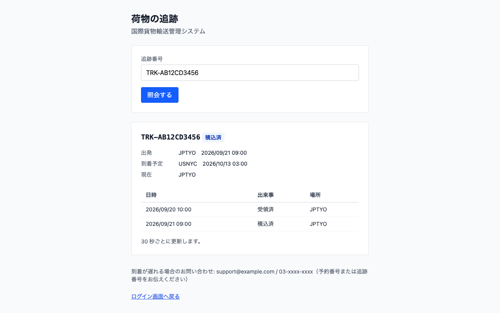
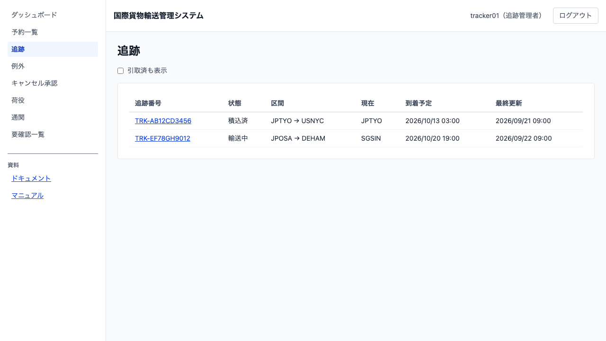
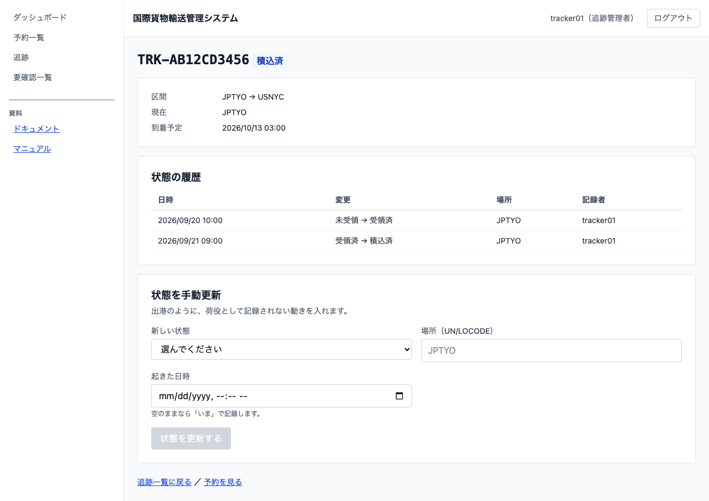

# 12 貨物の輸送状況を追う

## この章でできること

追跡担当者が貨物の状態を確認し、荷役として記録されない動き（出港など）を手で入れます。荷主は自社の貨物を追えます。荷受人は**ログインせずに**追跡番号だけで状況を照会できます。

**3 つの立場で見えるものが違います。** 追跡担当者はすべての貨物を見て状態を更新でき、荷主は自社の貨物だけを見て更新はできず、荷受人は追跡番号を知っている貨物の状況だけを読めます。

## 追跡番号だけで照会する（荷受人・ログイン不要）

1. ログイン画面の「荷物の追跡は[ログインなしで照会できます]」を押します
2. 「荷物の追跡照会」の画面が開きます。「追跡番号」に、予約確定の案内に書かれた番号を入力して `[照会する]` を押します
3. 「荷物の追跡」の画面に移り、状態・出発・到着予定と、これまでの記録が出ます

   

4. 別の荷物を調べるときは、この画面の「追跡番号」に入れ直して `[照会する]` を押します

**大文字小文字とハイフンの有無は気にしなくて構いません。** `trk-ab12cd3456` でも `AB12CD3456` でも同じ番号として扱います。

**画面は 30 秒ごとに自動で更新されます。** 開いたまま待てば、新しい記録が出ます。

**この画面には荷主名・予約番号・金額は出ません。** 追跡番号を知っている人なら誰でも読めるため、荷物の所在に関わることだけを出します。

## 一覧から追う（追跡担当者・荷主）

1. サイドナビの「追跡」を押します
2. 追跡中の貨物が並びます

   

3. 追跡番号を押すと詳細へ行きます

**引取済は既定で出ません。** 「引取済も表示」にチェックを入れると含まれます。引き取られた貨物が混ざると、一覧が「いま追うもの」として読めなくなるためです。

**荷主には自社の貨物だけが出ます。** ほかの荷主の貨物は、追跡番号を知っていても開けません。

## 状態を手で更新する（追跡担当者）

1. 追跡詳細を開きます

   

2. 「状態を手動更新」の「新しい状態」から選びます
3. 「場所（UN/LOCODE）」に、その状態になった場所を入れます（分かる場合のみ。空でも構いません）
4. 「起きた日時」に、その状態になった日時を入れます。**空のままなら「いま」で記録します**
5. `[状態を更新する]` を押します
6. 「状態の履歴」に 1 行増えます

**選べるのは、いまの状態から動ける先だけです。** たとえば「未受領」からいきなり「引取済」にはできません。荷物は受け取って積んで運ばれるので、順序を飛ばした記録は事実と合いません。

**出港のように、荷役として記録されない動きを入れるための操作です。** 受領・積込・荷降し・引取は荷役の記録から入ります（後続の章で扱います）。

**「誤配」「例外発生」はここでは選べません。** 誤配は荷役の記録から、例外は例外の起票から入ります。手で入れられるようにすると、起きていない誤配を記録できてしまうためです。

**夜間に起きたことを翌朝入れられます。** 「起きた日時」を入れると、記録した時刻ではなく起きた時刻で履歴に並びます。荷受人への説明と遅延の判断は、起きた順で読めないと成り立ちません。

**荷主には更新の操作は出ません。** 状態を決めるのは輸送を担当する側で、荷主が書き換えるものではありません。

## うまくいかないとき

### 「追跡番号が見つかりません」と出る

番号を確かめてください。追跡番号は `TRK-` で始まる英数字 10 桁で、予約確定の案内に書かれています。**その番号が実在しないのか、あなたには見えない貨物なのかは区別せずに同じ案内を出します。** 番号を総当たりで試して他人の荷物を探せないようにするためです。見つからないときは出荷元の担当者、または問い合わせ窓口へご連絡ください。

### 「照会が続いています。しばらく待ってから再度お試しください」と出る

短い時間に何度も照会しました。1 分ほど待つとまた使えます。締め出しではありません。

### 「追跡番号の形式が違います」と出る

照会する前の確認で止めています。番号の桁数か文字を確かめてください。誤った形式のまま何度も送ると、上の「しばらく待って」に当たってしまいます。

### 一覧に貨物が出きらない

「N 件のうち M 件を表示しています」と出ているときは、**到着予定が近い順で M 件だけ**を出しています。表示していない貨物も追跡は続いています。絞り込みは次のイテレーションで入ります。

### 「未受領 から 引取済 へは動かせません」と出る

順序を飛ばしています。いまの状態から動ける先だけが選択肢に出るので、画面を開き直してください。ほかの担当者が先に更新した可能性もあります。

### 一覧に自社の貨物が出ない

追跡番号が発行される前かもしれません。予約が確定して追跡番号が発行されると、この一覧に並びます。営業担当者にお問い合わせください。

### 「これ以上状態は動きません（引取済）。」と出る

引き取りが終わっているので、状態は動きません。**失敗ではありません**。

## 関連する章

- [11 予約を確定して追跡番号を発行する](11-予約を確定して追跡番号を発行する.md)
- [02 ログインとログアウト](02-ログインとログアウト.md)
